# x402-gateway — 设计文档

**版本**: 0.3  
**日期**: 2026-05-18  
**链范围**: TRON + BSC  
**战场**: Provider-side reverse proxy(对齐 pay.sh)

文档很长。**真正要写代码,先看 §3.0 的 6 角色时序图,再看 §13 / §17 的范围与排期**;§1.x 是 pay.sh 调研笔记,跳过不影响实现。

---

## 0. 设计决策摘要

| 决策项 | 选择 | 影响 |
|---|---|---|
| **项目范围** | **Gateway + Catalog 双模块** | Gateway 收钱(§2-§8),Catalog 让 API 被发现(§10);两个模块物理分离,可独立部署 |
| Gateway 站位 | **Provider-side only** | 网关站在商家 API 前面拦截 402,而不是站在 Agent 前面代签 |
| 结算模式 | **直付商家,网关不碰钱** | 客户端签的 x402 payload 直接打给 provider 钱包,平台不在资金链路上 |
| **平台手续费政策** | **零抽成(Phase 1 + Phase 2 都不抽)** | 完全对齐 pay.sh;变现走 TRX 网络价值 + USDT 流量飞轮 + SUN.io 主营业务承接溢出(详见 §1.11)。协议层保留 `splits` 字段但**仅用于卖家自愿分账**(affiliate / vendor),不强制给平台 |
| **Catalog 发现机制** | **GitHub PR + CI live probe**(零自动注册) | 1:1 对齐 pay.sh:卖家自托管网关 → 提 PR 到 catalog repo → CI 真发 HTTPS 探测 service_url 验证 402 / 价格诚实 → merge 自动触发 build → 推 CDN;**没有任何运行时注册中心 / heartbeat / push**(详见 §1.8、§10.11) |
| 配置驱动 | **YAML + 热加载** | `provider.yml` 是单一真相源;Admin API 留到必要时再加 |
| 支付协议层 | **完全用 bankofai-x402 SDK** | pay.sh 的 x402/MPP 协议细节不参考,我们的 SDK 已自成体系 |
| 上架双文件 | **provider.yml + listing.md** | 运行时配置和目录发现彻底分离 |
| **价格真相源** | **网关 live 402 challenge,非 listing.md** | 对齐 pay.sh:`listing.md` 不再手填价格,CI `catalog probe` 阶段从网关返回的 402 challenge 重新抽取 pricing / protocol / supported_usd 落 dist(详见 §10.11)。卖家想骗也骗不了 |

---

## 1. pay.sh 技术架构调研

调研对象:`github.com/solana-foundation/pay` 主仓 + `pay.sh/docs`。

**调研范围**:只看 **gateway 架构 + catalog 模块**两块。

- ❌ **不看支付协议层**(pay.sh 的 x402/MPP wire format、challenge/proof 编码、facilitator 接口细节):我们用自己的 `bankofai-x402` SDK,支付层已自成体系,不参考 pay.sh
- ✅ **看 gateway 设计**:YAML 驱动反向代理、endpoint allowlist、中间件流水线、热加载
- ✅ **看 catalog / 售卖模块**(新增重点):PAY.md frontmatter、catalog scaffold/build/probe、MCP server discovery —— 这部分是我们要对标的核心

### 1.1 仓库结构

```
solana-foundation/pay
├── rust/                   ← 主语言,83.9%
│   ├── crates/
│   │   ├── cli/           ← pay 二进制入口
│   │   ├── core/          ← 共享库(server + client + skills)
│   │   ├── types/         ← Pydantic 等价物
│   │   ├── keystore/      ← 本地钱包密钥存储
│   │   ├── mcp/           ← MCP server,暴露给 Claude/Codex 等
│   │   ├── pdb/           ← 协议数据库
│   │   └── integration/   ← 集成测试
│   └── example/           ← TypeScript demo server
├── typescript/            ← TS bindings,13.5%
├── pdb/                   ← 链下规则库
└── skills/pay/            ← MCP skills 定义
```

**关键观察**:Rust 为主,TypeScript 只做客户端/demo。所有 gateway 运行时逻辑在 `core/src/server/`。

### 1.2 核心 crate 职责

**`crates/core/src/server/`** — provider-side gateway 全部逻辑:

| 文件 | 职责 | 我们是否对齐 |
|---|---|---|
| `metering.rs` | 价格引擎:dimensions / units / tiers / variants | ✅ 对齐(简化) |
| `proxy.rs` | 反向代理:strip headers、注入 upstream auth、转发 body | ✅ 完全对齐 |
| `openapi.rs` | 从上游 OpenAPI 自动派生 endpoint allowlist | ⏸ Phase 2 |
| `accounting.rs` | usage 计数,pooled / per_agent 两种模式 | ✅ 对齐(pooled 优先) |
| `telemetry.rs` | 链路追踪,阶段事件 | ✅ 对齐 |
| `payment.rs` | challenge 构造 + proof 校验(协议细节) | ⏸ 不参考,用 bankofai-x402 替代 |
| `session.rs` | MPP session(协议细节) | ⏸ 不参考 |

**`crates/core/src/client/`** — pay CLI 的客户端侧。**与 gateway 设计无关**,Agent 用 bankofai-x402 SDK,不参考。

### 1.3 CLI 命令族

```
账户:    pay setup / whoami / topup / send
HTTP:    pay curl / fetch / wget / http
Agent:   pay claude / codex (MCP 包装)
Server:  pay server scaffold / start / demo  ← provider-side gateway
Catalog: pay catalog scaffold / build / check / probe / verdict
Skills:  pay skills search / install / list / endpoints / provider
```

**双侧产品的真相**:同一个 `pay` 二进制,`server` 是 provider 侧反代,`curl`/`claude` 是 client 侧支付代理。我们只做 server 侧。

### 1.4 provider.yml 完整 schema(从源码反推)

来自 `cli/src/commands/server/payment-debugger.yml`(官方 demo)和 `scaffold.rs` 模板:

```yaml
# ── Identity ──
name: payment-debugger
subdomain: payment-debugger        # gateway host routing
title: "Payment Debugger"
description: "Demo API ..."
category: ai_ml                    # 枚举:ai_ml/data/search/finance/...
version: v1

# ── Routing ──
routing:
  type: respond | proxy            # respond=网关自己返回 mock,proxy=转发上游
  url: https://upstream.example    # proxy 模式必填
  auth:                            # 上游鉴权注入
    method: header | query_param | hmac | oauth2
    key: Authorization
    prefix: "Bearer "
    value_from_env: UPSTREAM_TOKEN # secret 走 env,不写明文

# ── Operator(运营方钱包)──
operator:
  network: localnet | mainnet
  currencies:
    usd: ["USDC", "USDT", "CASH"]
  fee_payer: true                  # gateway 替 client sponsor gas
  recipient: <wallet_address>      # 默认收款人
  signer:                          # fee payer 签名源
    backend: gcp-kms | account | file
    key_name: ...                  # KMS 模式
    pubkey: ...

# ── 命名收款人(用于 splits)──
recipients:
  vendor:
    account: "CNR1b172rotbSG6kCpfR76KB2ios2y7X4p8yEEc7pjLu"
    label: "Vendor"
  affiliate:
    account: "${AFFILIATE_WALLET}"  # env 占位符
    label: "Affiliate"

# ── 端点 ──
endpoints:
  - method: GET
    path: "api/v1/reports/usage"
    resource: "reports"
    description: "Usage report ..."
    metering:
      dimensions:                  # 多维计费(请求数/token/字节)
        - direction: usage         # usage / input / output
          unit: requests           # requests / tokens / characters / seconds / bytes
          scale: 1
          tiers:
            - up_to: 1000          # 阶梯上限,省略=最后一档
              price_usd: 0.10
              splits:              # per-tier 分账
                - recipient: payment_processor
                  percent: 3.5     # OR amount: 85.00
                  memo: "Processing fee"
            - price_usd: 0.02      # 最后一档
      variants:                    # 按参数走不同价路径(如 model=gpt-4)
        - param: model
          value: gemini-2.5-pro
          dimensions: [...]
      splits:                      # 整端点级别分账(覆盖被 per-tier 覆盖)
        - recipient: vendor
          percent: 70

  - method: GET
    path: "health"                 # 不带 metering = 免费,allowlist 用
```

**关键不变量**:

- `endpoints[]` 既是定价表也是 **allowlist**,未声明的 method+path 即便上游存在也不会被代理
- `recipients` 别名必须在顶层声明,`splits` 引用别名,split 总额不能 ≥ 主价
- `price_usd / scale` 精度下限 6 位
- `respond` 模式给 demo,`proxy` 模式给真实 provider

### 1.5 中间件流程(gateway 架构,不涉及支付协议细节)

```
incoming request
  → 1. 按 host 找 ApiSpec(支持 subdomain 多租户)
  → 2. 按 method + path 找 endpoint
  → 3. endpoint 无 metering → 直接 proxy(健康检查等)
  → 4. endpoint 有 metering 但请求无支付凭据 → 走"协议适配层"生成 challenge
  → 5. endpoint 有 metering + 有支付凭据 → 协议适配层验证(调外部 facilitator)
  → 6. 通过 → proxy upstream(STRIP + INJECT)
  → 7. upstream response → 注入 receipt header → 返回
```

**值得借鉴的两个 gateway 模式**:

- **STRIP_HEADERS 模式**:`proxy.rs` 维护一个常量集合,防止支付 header 透传给上游、防止上游鉴权 header 泄露给 client。我们直接照搬(§2.5)。
- **协议适配层抽象**:pay.sh 的 middleware 把 challenge/verify 抽象成接口,具体是 x402 还是 MPP 由 endpoint 配置决定。**我们简化**:只支持 x402,且 challenge/verify 全交给 bankofai-x402 SDK,middleware 只做编排。

### 1.6 Catalog / Skills 子系统(本次调研**核心**)

pay.sh 把 **运行时配置** 和 **目录发现** 拆成两条管道:

```
provider.yml ─► pay server start
                 │
                 ├─ ① 读盘 + pydantic schema 校验(name/routing/operator/endpoints 必填项,字段类型)
                 ├─ ② 展开 ${ENV} 占位符,从环境注入 secrets
                 │       · operator.signer.key_name / pubkey
                 │       · routing.auth.value_from_env(上游 token)
                 │       · recipients.*.account 中的 ${...} 占位
                 ├─ ③ 初始化 fee_payer 签名后端(gcp-kms / account / file),试签一笔 noop 确认 key 可用
                 ├─ ④ 探测 facilitator:GET /supported,把 yaml 里声明的 scheme×network×asset
                 │       逐项 cross-check;不在 supported 集合内 → 启动失败
                 ├─ ⑤ 编译 endpoints[] → 路由表 trie(method+path 去重,/ 通配检测)
                 │       · 每个 metered endpoint 解析 dimensions/variants/tiers/splits,
                 │         splits 别名必须在顶层 recipients 里,split 总额 < 主价
                 │       · 未声明的 method+path = allowlist 之外,后续请求直接 404
                 ├─ ⑥ 装载中间件链(§1.5 的 7 阶段),把 STRIP_HEADERS / INJECT 规则烧进闭包
                 └─ ⑦ bind 端口、起 accept 循环;同时 watchfiles 监视 provider.yml 做热加载
                         │
                         └─► 网关运行(收钱、proxy upstream、注入 receipt)

PAY.md ─► pay catalog build ─► 目录发现(让 agent 找到)
```

**关键不变量**:

- 步骤 ①~⑤ 任一失败 → **进程退出**,不会"先跑起来,请求来了再报 5xx"(对应我们 §3.5 的启动初始化)
- secrets **永远不出现在 provider.yml 文本**里,统一走 env 间接引用;yaml 本身可以入 git
- 热加载只重放 ①~⑥,**不重 bind 端口**;旧连接走完老路由表,新连接走新表(优雅切换)
- 路由表是**预编译的常量**,运行时不再读 yaml —— 单请求路径上不碰文件系统

#### 1.6.1 PAY.md 的结构

每个上架 API 一个 `PAY.md` 文件(放在 `pay-skills/providers/<operator>/<name>/PAY.md`),分两层:

**Frontmatter(机器可读)**:

```yaml
---
name: my-api
title: "My API"
description: "One-sentence service description"
use_case: "Use for fetching real-time weather data when..."
category: data
service_url: https://my-api.example.com    # 网关 URL,不是上游
openapi:
  url: https://my-api.example.com/openapi.json
---
```

**Body(给 agent 看)**:

```markdown
## Spend-aware usage
- Prefer narrow lookups over broad searches.
- Reuse identifiers.
- Cap result limits.

## When to use
...

## When NOT to use
...
```

#### 1.6.2 Catalog CLI 工具链

| 命令 | 用途 |
|---|---|
| `pay catalog scaffold <fqn> <openapi_url>` | 从 OpenAPI 自动生成 PAY.md 骨架 |
| `pay catalog build` | 把所有 PAY.md 编译成 catalog index(JSON) |
| `pay catalog probe` | 探测每个 endpoint 的真实 402 challenge,验证 frontmatter 价格诚实 |
| `pay catalog check` | 静态校验 frontmatter 字段 + body 长度 |
| `pay catalog verdict` | 生成审核报告(Solana / stablecoin compatibility / pricing truthfulness) |

#### 1.6.3 Skills 命令族(agent / user 侧)

| 命令 | 用途 |
|---|---|
| `pay skills search <query>` | 全文 + 字段搜索 catalog index |
| `pay skills list` | 列已安装 skill |
| `pay skills install <provider>` | 把 provider 注册到本地配置 |
| `pay skills endpoints <provider>` | 列该 provider 所有 endpoint + 价格 |
| `pay skills provider <name>` | 看详情 |

#### 1.6.4 Catalog ↔ Gateway ↔ MCP 三者关系

```
              ┌──────────────────────────────┐
              │   Seller 提交 / 上架            │
              │   provider.yml + PAY.md       │
              └──────────────────────────────┘
                    │                  │
                    ▼                  ▼
       ┌─────────────────┐    ┌─────────────────┐
       │  Gateway runtime │    │  Catalog index  │
       │  (collect $)     │    │  (discovery)    │
       └─────────────────┘    └─────────────────┘
                                       │
                            ┌──────────┼──────────┐
                            ▼          ▼          ▼
                       Web UI    `skills search`  MCP server
                       (人浏览)   (CLI 搜)       (agent 找)
```

**关键设计选择**:

1. **Catalog 与 gateway 物理分离**:gateway 进程崩了不影响 discovery,catalog 改了不需要重启 gateway
2. **静态优先**:catalog index 是预编译 JSON,可直接 CDN,无需 DB
3. **probe 是真金白银的**:`catalog probe` 实际向 gateway 发请求看返回的 402 内容是否和 PAY.md 一致 —— 防虚假定价
4. **MCP 是 catalog 的访问通道之一**,不是 catalog 本身

**这一节就是我们的对标蓝本** —— 详细的我方设计在 §9。

### 1.7 MCP 集成(client 侧,与 gateway 无关)

pay.sh 的 MCP server 在 client 侧,让 Claude/Codex 通过 MCP 调付费 API。**我们不在 gateway 项目里做 client-side MCP**;Phase 2 catalog 模块会自带一个 MCP server 把 catalog 暴露给 agent,但这属于 catalog 的发现接口,不是支付集成。

### 1.8 发现机制实证(本次调研重要补充)

> 一个反直觉但关键的事实:**卖家本机 `pay server start` 起来,pay.sh 不会自动看到**。pay.sh **没有**任何形式的自动注册、heartbeat、push、polling。

完整发现链路(以 pay.sh `pay-skills` 仓库的 [validate.yml](https://github.com/solana-foundation/pay-skills/blob/main/.github/workflows/validate.yml) + [build-skills.yml](https://github.com/solana-foundation/pay-skills/blob/main/.github/workflows/build-skills.yml) 为证):

```
[卖家本机]                    [GitHub: pay-skills]                  [GCS + pay.sh]

pay server start              
        │ 监听公网 HTTPS                                              
        │ (卖家自己负责域名/TLS)                                       
        ▼                                                              
┌─────────────────┐                                                    
│ Live Gateway     │                                                    
│ service_url      │                                                    
└─────────────────┘                                                    
        ▲                                                              
        │ ① 把 service_url 写进 PAY.md ──► fork → 加文件 → PR          
        │                                                              
        │ ② PR 触发 validate.yml                                       
        │ ┌─────────────────────────────────────────┐                
        └─┤ docker run pay:latest catalog check ...  │                
          │   ├─ 解析 PAY.md frontmatter             │                
          │   ├─ 拉 OpenAPI                          │                
          │   ├─ 对每个 endpoint **真发 HTTPS**:    │                
          │   │   GET service_url/<path>            │                
          │   │   断言:返回 402 + USDC/USDT challenge│                
          │   └─ 输出 ::error:: / ::warning::        │                
          └─────────────────────────────────────────┘                
                              │ ③ 通过,maintainer merge              
                              ▼                                        
                       build-skills.yml on push to main:               
                              │                                        
                              │ ④ catalog build:每个 endpoint 的       
                              │    pricing / protocol / supported_usd  
                              │    **从 live 402 challenge 抽取**       
                              ▼                                        
                          gs://pay-skills/v1/                          
                            skills.json (cache 60s)                    
                            providers/*.json (cache 300s)              
                              │                                        
                              ▼                                        
                          pay.sh/api/catalog (JSON proxy)              
                              │                                        
                              ▼                                        
                       `pay skills search` 几分钟内能搜到              
```

**三个关键工程事实**:

1. **service_url 必须公网可达**:GitHub Actions runner 走普通公网出口去 probe,所以本机起的 `pay server` **必须先反代到公网域名**才能 PR。`https://` + 域名,不允许 IP。
2. **价格不在 PAY.md 里写**:[CONTRIBUTING.md](https://github.com/solana-foundation/pay-skills/blob/main/CONTRIBUTING.md) 的 frontmatter schema **没有 price 字段**。build 阶段从 live 402 challenge 重新抽。**真相源是网关,PAY.md 只是名片**。
3. **Merge 后还会再 gate 一次**:`build-skills.yml` 在 merge 后再跑一遍 Solana-compat probe,防 reviewer 误点 merge 一个"PR 通过时网关在,merge 时网关挂了"的 listing。

**为什么 pay.sh 选这条路**(逆向推测):
- **反垃圾**:开放自动注册,目录会被骗子 / 钓鱼 / 价格虚标的网关淹掉
- **反向激励诚实定价**:probe 抽价 → 想骗都骗不了
- **零运行时依赖**:pay.sh 自己不需要跑任何注册服务 / 健康检查 / 限流——一个 GCS bucket + GitHub Actions 就是全部基础设施。这是 pay.sh 能用近乎零成本运营的关键

**对我们的启示**:1:1 抄。但**额外补一个"快速通道"**——见 §10.12 冷启动策略。

### 1.9 Catalog CI/CD 流水线(完全自动)

实测 pay-skills 的两个 workflow,从 merge 到 catalog 更新**全自动,0 人工**:

```
PR merge to main
       │ GitHub 触发 push event
       ▼
┌─────────────────────────────────────────────┐
│ build-skills.yml (on: push, branches: main)  │
│  + workflow_dispatch (mode: incremental |     │
│                              rebuild,手动应急)│
│                                              │
│  1. checkout(fetch-depth: 2)                 │
│  2. auth google-cloud(workload identity)     │
│  3. detect changed providers(git diff)       │
│  4. re-gate Solana-compat(再 probe 一遍)    │
│  5. fetch previous dist from GCS              │
│  6. catalog build → dist/                     │  ← 增量,只重 probe 改的
│  7. gcloud storage rsync dist/ → gs://...     │
└─────────────────────────────────────────────┘
       │
       ▼ 几分钟内
   pay.sh/api/catalog + `pay skills search` 看到新版本
```

**两个值得抄的工程聪明设计**(对应 §10.11):

1. **增量构建**:`incremental` 模式只 re-probe 本次 commit 改的 provider,其他 ~70 个从上一版 GCS rsync 过来。**不会因为新加一个 provider 把所有人 probe 一遍**——既省 CI 时间,也避免某个不相关 upstream 临时挂掉导致整次发布失败。
2. **`workflow_dispatch` 留 rebuild 应急通道**:当 `pay` docker image 升级、build 逻辑改了,需要把所有 provider 全 re-probe 刷新数据,maintainer 到 Actions 页面手动选 `rebuild`。平时用不到。

**失败语义**:

| 阶段 | 失败会怎样 |
|---|---|
| PR validate(probe) | PR 被 block,merge 按钮变灰 |
| Merge 触发的 build | **PR 已合进**但 catalog 不更新;maintainer 看 Actions 红色,要么修 provider 要么 revert PR |
| GCS rsync | 直接重跑 workflow(rsync 幂等无副作用) |

### 1.10 Catalog 冷启动实证 + 1.11 商业模型

实测 pay.sh 73 个 live providers 里 **~50 是基金会 + paysponge 代搬运,~20 是自营**(只 8 个独立 operator)。"live marketplace"的繁荣是 2 个核心 operator 撑起来的,不是市场自然涌现。

**对我们的直接影响**:Phase 1 必须自己当代搬运 operator —— §9.8.6 seeding 计划落地 15-25 个 A/B/C 三档 provider,**不指望市场自然来**。

**商业模型上,pay.sh 0 抽成 + 基金会兜底**,我们 1:1 学,但驱动力换成 SUN.io 的 TRON USDT 流量飞轮:USDT 50%+ 流通在 TRON,每笔 x402 = 一笔 TRON tx = USDT 需求 → SUN.io DEX 主营收入。**不抽成**,协议层 `splits` 字段保留但仅给卖家自愿分账用。Featured listing / Hosted gateway 之类直接变现 Phase 3 才评估。

(完整商业模式 / 战略论证见 §0 决策表 + §9.8.6 seeding 计划 + §14 对比表;此处保留观察结论。)

### 1.12 一手源码实证(2026-05-16 复核)

> 之前的 §1.4–§1.6 多数从 docs 和 demo yaml 反推。本节是直接读 `solana-foundation/pay` 主分支源码后的**实证补丁**,把先前模糊或错的地方钉死。所有引用都带文件路径(相对 `rust/crates/`),后续修订有据可查。

#### 1.12.1 `pay server scaffold` 的实际产物

`cli/src/commands/server/scaffold.rs:11-37` —— scaffold 命令只写一个 27 行模板,**没有任何动态字段补全**:

```yaml
name: my-api
subdomain: myapi
title: "My API"
description: "API description"
category: ai_ml
version: v1
forward_url: https://api.example.com   # ← 注意:这是 "forward_url",不是 "routing.url"
accounting: pooled

endpoints:
  - method: GET
    path: "v1/health"
    description: "Health check"

  - method: POST
    path: "v1/generate"
    description: "Generate content"
    metering:
      dimensions:
        - direction: usage
          unit: requests
          scale: 1
          tiers:
            - price_usd: 0.001
```

**修订点**:
- `forward_url` 是顶层字段,**不是** `routing.url`(我们 §2.3 写成 `routing.url` 是从 demo yaml `payment-debugger.yml` 抄来的更结构化版本,源码里两种写法都支持,通过 `RoutingConfig` enum 反序列化)。
- `subdomain` 是**必填**字段,scaffold 直接出。多租户能力是 day-1 烧进 schema 的,不是 Phase 2 才加。
- `accounting: pooled` 是 scaffold 默认值,源码 `core/src/server/metering.rs:166-176` 对应 `AccountingMode::Pooled`(全 provider 共享一个 counter)/ `AccountingMode::PerAgent`(按 wallet pubkey 分桶)。
- 没有任何 `operator` / `payment` 块,因为 scaffold 假设**用户跑 `pay setup` 已经有了默认 keypair**,recipient 和 fee_payer signer 在 `pay server start` 时按"5 级 fallback"自动解析(下面 1.12.3)。

#### 1.12.2 `forward_url` / `routing` 之外:`env:` 块(我们漏掉的字段)

`cli/src/commands/server/start.rs:174-183`:

```rust
for (key, value) in &api.env {
    if value.starts_with("${") && value.ends_with('}') {
        let var_name = &value[2..value.len() - 1];
        if let Ok(v) = std::env::var(var_name) {
            unsafe { std::env::set_var(key, v) };
        }
    } else {
        unsafe { std::env::set_var(key, value) };
    }
}
```

**ApiSpec 里有一个我们之前漏掉的 `env:` map**,在 server 启动时把字典内容写进进程环境。两种写法:

```yaml
env:
  UPSTREAM_TIMEOUT_MS: "5000"              # 字面值,直接 setenv
  ACME_API_TOKEN: "${ACME_API_TOKEN_PROD}" # 转发当前 shell 的同名变量
```

**为什么这个字段重要**:它让 `routing.auth.value_from_env: ACME_API_TOKEN` 这一行在**不修改 systemd unit / docker-compose env block** 的情况下能动态切换 staging vs prod 凭据 —— 改 yaml 就够了。我们 §2.3 schema 必须加上这个块。

#### 1.12.3 fee-payer signer 的 5 级 fallback(`pay server start` 启动期)

`cli/src/commands/server/start.rs:251-293`,实测精确顺序:

| 优先级 | 触发条件 | 行为 |
|---|---|---|
| 1 | `--sandbox` flag 或 network 是 `localnet`/`devnet`(`is_throwaway()`) | 强制走 accounts.yml 里 `gateway` 这个 ephemeral 账户(无密码本地存储),首次自动创建 |
| 2 | YAML 里有 `operator.signer:` 块 | 走 `resolve_signer()`,支持 `gcp-kms`(build feature gated)、`Account`(accounts.yml 命名条目)、`File`(磁盘 JSON keypair) |
| 3 | 当前 shell 有 `--account <name>` 或 `pay setup` 留下的默认 | `keystore::AuthIntent::use_gateway_fee_payer()` 触发系统钥匙串 prompt,带可解释的 reason 字符串 |
| 4 | 啥都没有 | 不设 signer,fee_payer_signer = None |
| 5 | `fee_payer: true` 但上一步是 None | **启动期 hard fail**,不让进程跑起来(`start.rs:329-339`) |

**为什么这个 5 级很重要**:这是 pay.sh 把"本地开发友好"和"生产安全"压在同一份 YAML 里的关键设计 —— 同一个 yaml,sandbox 模式自动 ephemeral,生产模式必须显式 KMS。我们的对应映射(详见 §2.10):

| pay.sh | x402-gateway(TRON+BSC)|
|---|---|
| `--sandbox` + `network: localnet` | `--testnet` + `network: tron:nile` / `eip155:97` → 走本地 raw-secret 钱包,无 prompt |
| `operator.signer.gcp_kms` | `payment.signer.privy` / `gcp_kms`(借用 agent-wallet adapter)|
| `operator.signer.account` | `payment.signer.local_secure: <wallet-id>`(agent-wallet 命名钱包)|
| `operator.signer.file` | `payment.signer.raw_secret_env: TRON_OPERATOR_PRIVKEY`(只用于本地)|

#### 1.12.4 recipient 的 4 级 fallback

`start.rs:305-318`,启动期解析顺序:

1. `operator.recipient` in YAML
2. `--recipient` CLI flag
3. `PAY_PAYMENT_RECIPIENT` env var
4. fee_payer signer 的 pubkey

**我们的映射**:`payment.pay_to` in YAML → `--pay-to` CLI → `X402_GATEWAY_PAY_TO` env → operator wallet 地址。多了一层 CLI flag(对齐 `x402-cli serve`),少了一个 env var 命名约定要敲定。

#### 1.12.5 启动期钱包健康检查(loud-fail UX)

`start.rs:642-672` —— **这个是 pay.sh 最值得抄的 UX 细节**:

启动时调一次 RPC 拿 operator wallet 的 SOL balance,按阈值染色:
- ≥ 0.10 SOL → 绿色
- ≥ 0.05 SOL → 黄色("top up soon")
- < 0.05 SOL → 红色("next tx may fail")
- == 0 SOL → 跨整页的 Warning notice,"the wallet must exist on chain for SPL token transfers to derive an ATA"

之后 `spawn_fee_payer_balance_observer` 每 5 分钟 re-check 一次。**为什么这个值得抄**:Solana 的第一次失败 error 是 *"Attempt to debit an account but found no record of a prior credit"*——纯 Solana runtime 行话,没读过文档的 seller 看不懂。pay.sh 把这种隐式失败提前到启动期,出来个红字告诉你"加钱"。

**TRON / BSC 对应翻译**(详见 §2.10.4):
- TRON:operator 钱包需要 ≥ 6 TRX(首次 USDT approve 的 gas);< 0 TRX 时启动期 loud warning
- BSC:operator 钱包需要 ≥ 0.005 BNB(典型 gas 储备);< 0.001 BNB 时启动期 loud warning
- 两条链上,如果 `payment.scheme: exact_gasfree` 或 `exact_permit` 加 `fee_payer: false`(facilitator 替 buyer 出 gas),operator wallet 余额需求降到 0 —— 启动期就不需要 loud warning,因为根本不用 operator gas

#### 1.12.6 `/__402/*` 管理端点命名空间

`start.rs:786-805` —— 网关挂的固定端点:

| 路径 | 方法 | 用途 |
|---|---|---|
| `/__402/health` | GET | 单字 "ok",liveness 探针 |
| `/__402/endpoints` | GET | 列所有 `endpoints[]` 的 method/path/metered/price_usd —— 给 agent / dashboard introspection |
| `/__402/verify` | POST | 测试用:给定 payment payload,直接调 verify pipeline,跳过 settle —— 用于 debugger 和集成测试 |
| `/__402/rpc` | POST | 浏览器侧 RPC 代理(allowlist `getLatestBlockhash` 等),让 payment-debugger UI 不暴露真实 RPC URL |
| `/openapi.json` | GET | 当启动时传了 `--openapi <path-or-url>`,从上游 OpenAPI 派生过滤后的 spec,自动改写 `servers[].url` → 网关地址(`server/openapi.rs`) |
| (fallback) | ANY | 进 metering / proxy 主流水线;**先 lookup `endpoints[]` allowlist,不在表里直接 404**(`start.rs:854-860`)|

**对我们的启示**(详见 §2.11):
- `__402` 是 pay.sh 起的命名空间前缀,**避免和 seller 上游 endpoint 冲突**。我们应该照搬这个前缀(双下划线 + HTTP status 数字)。
- `/__402/endpoints` 这种 introspection endpoint 是 catalog probe / payment-debugger 的隐式依赖 —— 不做 catalog 的版本也建议保留,日后扩展性强。
- 404-on-unlisted 必须在中间件链入口做(在 metering 之前),否则浏览器 `/favicon.ico` 会触发 OAuth2 token 拉取(`start.rs:852-853` 注释解释了这个具体 bug)。

#### 1.12.7 STRIP_HEADERS 精确清单(对照 §2.5)

`core/src/server/proxy.rs:35-42`:

```rust
const STRIP_HEADERS: &[&str] = &[
    "host",
    "connection",
    "transfer-encoding",
    "authorization",
    "payment-signature",
    "payment-required",
];
```

**响应方向**(`proxy.rs:265`):

```rust
let skip_response_headers = ["content-encoding", "content-length", "transfer-encoding"];
```

**我们 §2.5 的对齐情况**:请求方向 6 个全对;响应方向我们当时漏了 `content-encoding` 和 `content-length`(reqwest 自动解压 gzip 后,这些值已经不对了,必须丢掉)。**§2.5 需要更新**。

#### 1.12.8 上游 auth 注入的 5 种模式(对照 §2.5 注入行)

`proxy.rs:142-225`:

| AuthConfig 变体 | 行为 |
|---|---|
| `Header` | 把 `value_from_env` 取的字符串写到指定 header(可加 `prefix`)|
| `QueryParam` | 写到 URL query string |
| `Hmac` | 按 RFC 3986 标准对 body + canonical-headers 做 HMAC,可注入到 header 或 query param |
| `Oauth2` | 启动期拿 client_id + secret 换 token,缓存到 expire 前;每次注入 `Authorization: Bearer <token>`,失败 502 |
| `AccessToken` | 通用版"prepare/fetch/inject" DSL:预先调一次外部端点拿 token,缓存,再注入到指定位置 |

**对我们的启示**:Phase 1 只需要 `Header` 和 `QueryParam` 两种(覆盖 95% 用例);`Hmac` / `Oauth2` / `AccessToken` 留到 Phase 2,但**schema 字段名要预留一致**(避免日后改 yaml 触发 breaking change)。

#### 1.12.9 Catalog scaffold 的真实行为

`cli/src/commands/catalog/scaffold.rs:44-120` —— `pay catalog scaffold <fqn> <openapi_url>` 的实测语义:

1. 只拉 OpenAPI 文档,不拉网关 yaml、不接触链上 / facilitator
2. 从 `info.title` / `info.description` / `servers[0].url` 派生
3. **强制要求作者手填**:`use_case`、`category` —— 写为 `TODO` placeholder,作者必须改完才能让 `catalog check` 过
4. 输出文件路径固定:`<output-dir>/<fqn>/PAY.md`,不接受任意路径(强制目录结构)
5. 写完后 stdout 打印"Review the TODO fields (use_case, category) before publishing"

**对我们的启示**:
- scaffold 是**最低门槛**入口,不强制作者懂 x402 协议,也不和网关通信
- "TODO + 静态 check 拒绝 TODO"是个聪明的"必填字段"实现:用 lint 而不是 schema required(因为 yaml 不能区分"空字符串"和"未填")
- 我们的 `x402-catalog scaffold` 必须照这个语义做,而不是搞一个"交互式向导"

#### 1.12.10 Catalog check 的三种模式(实测)

`cli/src/commands/catalog/check.rs:111-136`,三种模式按参数自动分派:

| 模式 | 触发 | 用途 |
|---|---|---|
| **single-file** | `<path>` 指向 `.md` 文件 | 本地开发,作者自查 |
| **explicit files** | `<dir>` + `--files <p1> <p2> ...` | **CI 主路径**:外部计算 diff(bash) → 传一组 PAY.md 路径 → check 直接 probe |
| **changed-from** | `<dir>` + `--changed-from <REF>` | 本地 git diff 速查,容器外 git on $PATH 才工作 |
| **full registry** | `<dir>`,无其他参数 | merge gate / 周期性 re-probe(`catalog check . --no-probe` = 静态全量) |

**`--format` 选项**(`check.rs:36-42`):

- `table`(默认):彩色终端表
- `json`:机器可读完整 verdict report
- `github`:发到 stdout 的 `::warning::` / `::error::` workflow command,GitHub Actions 自动渲染成 PR inline 注释

**`--summary-out <path>`**(`check.rs:91-93`):同时把 markdown 表写到磁盘,workflow 把它 append 到 `$GITHUB_STEP_SUMMARY` —— 这样**一次 probe 既出 inline 注释,又出 PR Step Summary 大表**。

**对我们的启示**:这一套 flag 组合是 catalog CI 设计的**核心可复用资产**,详见 §11。

#### 1.12.11 Catalog build 的增量模式(实测)

`cli/src/commands/catalog/build.rs:42-50` 的两个杀手锏 flag:

```rust
#[arg(long, value_delimiter = ',', value_name = "FQN1,FQN2,...")]
pub only: Vec<String>,

#[arg(long, value_name = "DIR")]
pub previous_dist: Option<PathBuf>,
```

**用法**:

```bash
# 本次只重新 build "quicknode/rpc" 和 "paysponge/coingecko",
# 其他 70 多个 provider 从上次 build 的产物里 verbatim 复制
pay catalog build . \
  --only quicknode/rpc,paysponge/coingecko \
  --previous-dist /tmp/prev-dist \
  --base-url https://cdn.example.com/v1
```

**为什么这个是必抄**:
- 当 registry 增长到 100+ providers,full rebuild 要 5-15 分钟(每个 endpoint 实测 ≤ 15s timeout × 5 并发)
- 增量模式只 probe 本次 PR 改动的 provider,**典型 CI 时间从 10 分钟降到 30 秒**
- "no-changed-providers 直接 skip build" 让"只改文档 / CI yaml 的 commit"不触发 publish,避免 flaky upstream 把不相关的 commit 弄红

**实际 CI 怎么连这个**:从 `git diff HEAD~1..HEAD -- 'providers/**'` 反查每个改动文件**最近的 PAY.md 祖先目录**,以那个 PAY.md 的相对路径作为 `--files`(check)或 `--only <fqn>`(build)的输入。算法见 `wf_build.yml:60-71`,我们在 §11 复用。

#### 1.12.12 调研结论汇总(对我们设计的硬性影响)

把上面 11 条扎进设计的具体动作:

| 调研点 | 设计影响 |
|---|---|
| 1.12.1 `forward_url` 顶层字段 | §2.3 保留嵌套 `routing.url`(更结构化),但 schema validator 也接受顶层 `forward_url` 别名 |
| 1.12.2 `env:` 块 | §2.3 加 `env:` map 字段;启动期按 `${VAR}` 规则展开 |
| 1.12.3 5 级 signer fallback | §2.10 新增"启动期 signer 解析"小节,1:1 映射到 agent-wallet adapter |
| 1.12.4 4 级 recipient fallback | §2.10 启动期 recipient 解析顺序固定下来 |
| 1.12.5 0-balance loud warning | §2.10.4 新增"启动期钱包健康检查"(TRX / BNB 阈值) |
| 1.12.6 `/__402/*` 管理端点 | §2.11 新增"管理端点"小节(health/endpoints/verify) |
| 1.12.7 STRIP_HEADERS | §2.5 响应方向补 `content-encoding` / `content-length` |
| 1.12.8 5 种 auth | §2.3 schema 字段名预留 5 种,Phase 1 只实现 Header / QueryParam |
| 1.12.9 scaffold 行为 | §10 catalog scaffold 必须接受 `<fqn> <openapi_url>`,不交互式 |
| 1.12.10 check 三模式 + 三 format | §11 CI workflow 直接 mirror `--files` / `--format github` / `--summary-out` |
| 1.12.11 build `--only` + `--previous-dist` | §11 CI workflow 实现"增量 build + copy-through prev-dist" |

---

## 2. 我们的 Gateway 设计

### 2.1 一句话定位

> 基于 bankofai-x402 SDK 的 **YAML 驱动反向代理**,把已有 HTTP API 包装成 x402 收费端点。商家不改一行业务代码就能上架,TRON + BSC,直付钱包,网关不托管资金。

### 2.2 整体架构

```
              ┌──────────────────────────────────────────────────────────┐
              │                    x402-gateway                            │
              │                                                            │
              │     provider.yml ──────► YAML Loader ──► Hot Reload       │
              │                                │                          │
              │                                ▼                          │
   Client     │  ┌──────────────────────────────────────────────┐       │
  (有 x402    │  │           Middleware Pipeline                  │       │   Upstream
   SDK)──────┼──┤                                                │───────┼──► Provider API
              │  │  [1] Route Match  (subdomain + method + path) │       │   (plain HTTP)
              │  │       ▼                                        │       │
              │  │  [2] Metering Lookup                           │       │
              │  │       ▼ (no metering → forward)               │       │
              │  │  [3] Auth Check                                │       │
              │  │       ├─ missing → 402 + PAYMENT-REQUIRED    │       │
              │  │       └─ present → Facilitator verify         │       │
              │  │            ├─ invalid → 402 + reason          │       │
              │  │            └─ valid → record                  │       │
              │  │       ▼                                        │       │
              │  │  [4] Proxy: strip + inject auth + forward     │       │
              │  │       ▼                                        │       │
              │  │  [5] Response: add PAYMENT-RESPONSE header    │       │
              │  └──────────────────────────────────────────────┘       │
              │                                │                          │
              │                                ▼                          │
              │     ┌──────────────┐  ┌──────────────────┐              │
              │     │ In-memory    │  │ OTel Exporter    │              │
              │     │ Counter      │  │ (tracing →       │              │
              │     │ (HashMap,    │  │  collector)      │              │
              │     │  重启丢)     │  │                  │              │
              │     └──────────────┘  └──────────────────┘              │
              │                                                          │
              │     无任何本地数据库(对齐 pay.sh,见 §2.9)             │
              └──────────────────────────────────────────────────────────┘
                                              │
                                              ▼
                                       Facilitator
                                  (bankofai-x402 或自建)
                                              │
                                              ▼
                                   TRON / BSC(replay 防护在这里)
```

### 2.3 provider.yml schema(我们的版本)

改编自 pay.sh,适配 TRON/BSC + x402 schemes。**红字标注**是我们和 pay.sh 不同的地方。

```yaml
# ── Identity ──
name: acme-weather
subdomain: acme-weather                    # 多租户共享网关时用;单租户可省
title: "Acme Weather API"
description: "Real-time weather for 200+ cities"
category: data
version: v1

# ── Env 注入(可选,启动期写进程环境)──
# 让 routing.auth.value_from_env 在不改 systemd / docker-compose 的前提下能切凭据。
# 字面值直接 setenv;${VAR} 形式从当前 shell 透传。
env:
  ACME_API_TOKEN: "${ACME_API_TOKEN_PROD}"
  UPSTREAM_TIMEOUT_MS: "5000"

# ── Routing ──
routing:
  type: proxy                              # 我们不要 respond 模式(mock 用例少)
  url: https://internal.acme.example       # 上游真实地址,等价 pay.sh 顶层 forward_url
  auth:
    method: header                         # Phase 1: header | query_param
    key: Authorization                     # Phase 2 再加: hmac | oauth2 | access_token
    prefix: "Bearer "
    value_from_env: ACME_API_TOKEN

# ── Payment(我们的字段,替代 pay.sh 的 operator)──
payment:
  network: tron:mainnet                    # CAIP-style
  scheme: exact_permit                     # exact | exact_permit | exact_gasfree
  asset: USDT                              # 注册表里的 symbol
  pay_to: TProviderWalletBase58            # 直付商家(已确认)
  facilitator_url: https://facilitator.bankofai.io
  validity_window_seconds: 300

# ── 命名收款人(splits 用,可选)──
recipients:
  vendor:
    account: TVendor...
    label: "Vendor"
  platform:
    account: TPlatformFee...
    label: "Platform fee"

# ── Endpoints ──
endpoints:
  - method: GET
    path: /v1/current
    description: "Current weather for a city"
    metering:
      dimensions:
        - unit: requests
          tiers:
            - price: "0.002 USDT"          # 我们用 token 计价,不走 USD
      # splits 可选,Phase 1 不实现
      splits:
        - recipient: platform
          percent: 5

  - method: GET
    path: /health                          # 无 metering = 免费
```

**字段对照表**:

| pay.sh 字段 | 我们的字段 | 改动原因 |
|---|---|---|
| `operator.network: localnet/mainnet` | `payment.network: tron:mainnet \| eip155:56` | x402 用 CAIP 标识 |
| `operator.currencies.usd` | `payment.asset: USDT` | 单币计价,不做 USD 折算 |
| `operator.recipient` | `payment.pay_to` | 与 SDK 字段对齐 |
| `tier.price_usd: 0.01` | `tier.price: "0.002 USDT"` | x402 协议字符串格式 |
| `subdomain` | (Phase 2 多租户时再加) | MVP 单租户 |
| `routing.type: respond` | 不支持 | 镀金特性 |

### 2.4 中间件流水线(7 阶段)

完整时序图见 §3.1,这里只列阶段职责和分支条件 —— 帮助快速回忆"网关在做什么"。

| 阶段 | 输入 | 职责 | 出口 |
|---|---|---|---|
| **[1] Route** | host + method + path | 找到匹配的 spec + endpoint | 未匹配 → 404;匹配 → 进 [2] |
| **[2] Metering** | endpoint 配置 | 判断是否需付费 | 免费 → 跳到 [6];付费 → 进 [3] |
| **[3] Auth check** | PAYMENT-SIGNATURE header | 是否带凭据 | 无 → 生成 challenge 返回 402;有 → 进 [4] |
| **[4] Verify** | payload + endpoint 要求 | replay 去重 → 防篡改 → 调 facilitator verify | 任一失败 → 402(具体 code);通过 → 进 [5] |
| **[5] Settle** | verified payload | 调 facilitator settle,等链上回执 | 失败 → 502 settle_failed;成功 → 写 replay + ledger,进 [6] |
| **[6] Proxy** | 原始请求 | strip 客户端 header,注入上游 auth,转发上游 | 上游 200 → 进 [7];上游失败 → 502 upstream_error(已扣款) |
| **[7] Respond** | 上游响应 + settlement 信息 | strip 危险响应头,注入 PAYMENT-RESPONSE,返回 client | 200 + receipt |

**几个不可调换的次序**(否则破坏安全不变量,见 §5.3):

- replay 去重必须在 verify 之前
- replay 写入必须在 settle 成功之后
- strip 客户端 header 必须在注入上游 auth 之前

### 2.5 Header strip / inject 规则

**为什么需要**:支付协议头是 client ↔ gateway 之间的私事,上游不该看到;上游的鉴权 token 是 gateway ↔ 上游之间的私事,client 不该看到。

#### 请求方向(client → upstream)

| Header | 处理 | 原因 |
|---|---|---|
| `Host` | 移除 | httpx 会按目标自动设置 |
| `Connection` | 移除 | hop-by-hop,不跨代理 |
| `Transfer-Encoding` | 移除 | hop-by-hop |
| `Authorization` | **移除** | 上游 auth 由网关从 env 注入,**绝不透传** client 的 |
| `PAYMENT-SIGNATURE` | 移除 | x402 内部头,上游不该看 |
| `PAYMENT-REQUIRED` | 移除 | 同上 |
| (上游 auth 头,由 routing.auth 定义) | **注入** | 从 `value_from_env` 取值,按 method+key+prefix 拼接 |
| 其他业务头(`Content-Type`、`User-Agent`、自定义 X-* 等) | 透传 | 由 client 控制语义 |

#### 响应方向(upstream → client)

| Header | 处理 | 原因 |
|---|---|---|
| `Connection` / `Transfer-Encoding` | 移除 | hop-by-hop |
| `Content-Encoding` | **移除** | HTTP 客户端自动解压 gzip 后该值已失效(对照 pay.sh `proxy.rs:265`)|
| `Content-Length` | **移除** | 解压后字节数变了,让框架按真实 body 重算 |
| `Authorization` / `Proxy-Authorization` | **移除** | 防上游漏 secret |
| `Set-Cookie` | Phase 1 透传,Phase 2 评估 | 上游可能用 cookie 做会话 |
| `PAYMENT-RESPONSE` | **注入** | 网关在 settle 后构造,带 tx_hash + receipt |
| 其他业务头 | 透传 | 上游业务语义 |

**核心不变量**:任何包含 secret 或私有协议头的字段,**绝不在两个方向上同时出现**。

### 2.6 直付结算路径(关键决策落地)

x402 协议本身就是 **buyer signs → facilitator submits → seller wallet receives**。网关在这条链路上做的只是:

1. **不持有任何资金**:没有平台钱包,没有 ledger balance,没有 payout。
2. **不收手续费**(Phase 1):平台费走 Phase 2 的链上 split 或链下账单。
3. **只做 verify + settle 编排**:调 facilitator 的 `verify` / `settle`,确认成功再放行 upstream。
4. **平台 fee 路径(Phase 2)**:借鉴 pay.sh 的 `splits` —— payment payload 里多个 recipient,facilitator 一笔 tx 拆账。需要 bankofai-x402 facilitator 支持 multi-recipient settlement(目前不支持,要新增 spec)。

### 2.7 热加载

`provider.yml` 改动时:

1. `watchfiles` 监听 yaml 文件
2. 新配置先 **dry-validate**(pydantic + 业务规则:`pay_to` 地址格式、`asset` 在 registry 等)
3. 校验通过 → 原子替换 in-memory spec
4. 校验失败 → 保留旧 spec,日志报错

**不重启进程,不断已有连接**。详细时序图见 §3.4。

### 2.8 API 接入机制(声明式,非硬编码)

> 这一节专门回答一个常被问到的问题:**用户的 API 怎么接到网关上?是不是要改网关代码?**

#### 2.8.1 一句话回答

**不是硬编码,是声明式配置 + 热加载**。

一个新 API 接入网关 = **写一对文本文件,提交进 git**。网关在运行时自动发现这对文件,**热加载即生效**。整个过程**不改一行网关代码,不重启网关进程**。

那对文件是:

| 文件 | 给谁看 | 告诉系统什么 |
|---|---|---|
| `provider.yml` | Gateway 运行时 | 怎么路由、怎么计费、收款给谁、上游是谁 |
| `listing.md` | Catalog 发现层 | 这个 API 是干嘛的、给 agent 看的使用指引 |

#### 2.8.2 三种 API 接入模型的对比

业内做"网关 / 平台"通常有三种接入方式,各有取舍:

| 模型 | 加一个 API 的代价 | 优点 | 缺点 | 代表 |
|---|---|---|---|---|
| **硬编码**(在网关代码里写 handler) | 改代码 + 编译 + 部署 + 重启 = 数小时,影响所有在飞请求 | 性能极致;类型完全静态 | 不可扩展,1000 个 API 就是 1000 次部署 | 内部 RPC 网关、早期 Spring 项目 |
| **数据库驱动**(管理 API 写 DB,网关读 DB) | 调 admin API,秒级生效 | 实时 CRUD、有 UI | 多组件(DB + 备份 + 缓存 + admin auth)、可审计性差(谁改的、为什么) | AWS API Gateway、Kong |
| **配置驱动 + 热加载**(文件即声明,网关 watch) | 写文本文件 + 提交 git,**分钟级** | 单一真相源、git diff 可审计、运维门槛极低 | 大规模动态(>10k provider)时可能要补缓存层 | **pay.sh、我们** |

**Phase 1 我们选第 3 种,完全对齐 pay.sh**。

#### 2.8.3 配置驱动的物理机制

整个数据流就一个方向,**没有 admin API、没有 DB**:

```
       Seller / 运维
            │
            │ git push / Portal 同步
            ▼
   ┌──────────────────────────────────────┐
   │       /etc/x402-gateway/specs/         │
   │                                        │
   │   ├── acme-weather/                    │
   │   │     ├── provider.yml               │
   │   │     └── listing.md                 │
   │   ├── bob-translate/                   │
   │   │     ├── provider.yml               │
   │   │     └── listing.md                 │
   │   └── ...                              │
   └──────────────────┬───────────────────┘
                      │
                      │ 文件改动事件
                      ▼
             ┌────────────────┐
             │   watchfiles   │  (跨平台文件监听)
             └────────┬───────┘
                      │
                      ▼
            ┌──────────────────┐
            │   Config Loader  │  (pydantic + 业务校验)
            └────────┬─────────┘
                      │
        ┌─────────────┼─────────────┐
        ▼                           ▼
   校验失败:                   校验通过:
   保留旧 spec,日志告警       RWLock.write 替换内存中的 spec
                                    │
                                    ▼
                          ┌──────────────────┐
                          │  In-memory Spec  │  (网关运行时读这个)
                          │  Map[name] →     │
                          │       Spec       │
                          └──────────────────┘
                                    │
                                    ▼
                              请求路由用
```

**全程没有 DB、没有 admin API、没有重启进程**。

#### 2.8.4 一个新 API 从零到上线的完整路径

直接对应 §9 上架流程,这里只看"文件 → 服务"这条链路:

```
Day 0 ─────  Seller 写 provider.yml + listing.md
              ↓
Day 0+1h ──  git PR  +  CI 自动跑 §9.3 五段校验
              ↓
Day 1 ─────  Reviewer 人工审核 + 钱包所有权挑战
              ↓
Day 1 ─────  审核通过 → 平台 ops 把文件复制到 prod fs
              ↓
≤ 1 秒 ────  watchfiles 检测到新文件
              ↓
≤ 100 ms ──  Loader 解析 + pydantic 校验 + 业务规则校验
              ↓
≤ 10 ms ───  RWLock 替换 in-memory spec
              ↓
立即生效 ──  下一个 HTTP 请求就能命中这个新 spec
              ↓
≤ 5 分钟 ──  Catalog builder 跑 listing.md → catalog/index.json → CDN
              ↓
立即生效 ──  Agent 搜索能找到这个 API
```

**重点**:从文件落地到 URL 可用,**总耗时 < 1 秒**。catalog 索引更新慢一点(分钟级),但 gateway 本身瞬时生效。

#### 2.8.5 一个网关进程承载多少 API

| 模式 | 适用 Phase | 文件组织 | 路由策略 |
|---|---|---|---|
| **单 spec 单进程** | Phase 1(MVP) | 网关进程指向**单个** `provider.yml` | URL 直接 = endpoint.path |
| **多 spec 单进程** | Phase 2 | 一个目录下**多份** provider.yml,每份一个子目录 | path 前缀(`/<name>/<path>`)或 subdomain |
| **多进程独立部署** | Phase 3 | 每个 spec 独立容器 | K8s ingress + 域名 |

Phase 1 单 spec 单进程的好处:**故障域最小**,一个 yaml 坏不影响别人。代价是横向扩展时每个 API 要单独部署一份网关 —— 但 Phase 1 不在乎。

#### 2.8.6 影响粒度 + 与硬编码对比(合并 §2.8.6-2.8.9)

**改 yaml 不同字段的影响粒度**:

| 改什么 | 在飞请求 | 新请求 | 二次操作 |
|---|---|---|---|
| 加 endpoint / 改价格 / 删 endpoint | 持旧 challenge 完成 | 立即用新配置 | 无 |
| 改 `pay_to` 钱包 | 持旧 challenge 完成 | 用新钱包 | **触发 warning,人工 review** |
| Yaml 语法错 | 不影响 | 用旧 spec 继续 | 日志告警 |
| 改 `name` | **拒绝**(等于新上架) | — | 走完整上架流程 |

**与硬编码 / Admin API 的取舍**:
- 加 100 个 API:**硬编码**= 100 次部署;**我们**= 100 份 yaml 一次提交
- 临时调价 / 切上游:硬编码改代码 + 部署;**我们**= 改 yaml 一行
- 回滚:硬编码 git revert + 部署;**我们**= git revert specs 仓库
- 不上 admin API 的原因:**git 即审计源**(谁改了什么 / 为什么,git blame 永远能答),无 admin = 无 admin auth 故障域

Phase 2 默认仍不做 admin API;真要做也是 admin → git(平台 bot),保留 git 作为单一真相源。

### 2.9 存储架构:无本地 DB,对齐 pay.sh

> 反直觉但关键:**pay.sh gateway 没有数据库**;`rust/Cargo.toml` 不引 SQLite / Postgres / Redis / sled / RocksDB / LMDB。唯一带 "db" 名字的 crate 叫 `pdb` = Payment Debugger,是 UI 不是 DB。

**pay.sh 的所有状态分布**(实测 `core/src/server/accounting.rs` + `keystore/src/store.rs`):

| 状态 | 存储介质 | 重启丢? |
|---|---|---|
| 路由 / 计费配置(provider.yml)| 文件系统 | 不丢 |
| Catalog 数据(listing.md)+ 产物(dist/*.json)| 文件系统 | 不丢 |
| 使用量计数器(volume tiers 用)| 进程内存 HashMap + Mutex | **丢**(可接受;丢 = 用户白赚几次)|
| 钱包私钥 | OS keystore | 不丢(OS 管)|
| 支付事件 / receipt | **不本地存**,只 emit OTel | 取决外部 collector |
| Replay 防护 | **完全在链上**(Solana nonce 一次性)| — |

**为什么不需要 DB**:支付外置给链 + 配置外置给文件系统 + 协议是 capability-based(签名 = 权限,无"用户"概念),关系数据库基本没作用。Replay 靠链上 nonce 一次性消费,本地"防双花"完全多余 —— 第二次提交链上 revert,facilitator 替我们做了去重。

**我们的设计** = 1:1 照搬:

```
/etc/x402-gateway/specs/<name>/provider.yml   ← 配置
环境变量 / Vault                              ← 上游 token(secret)
区块链(TRON / BSC)                          ← 支付事实 + replay
进程内存 HashMap                              ← 计数器(重启丢,Phase 1 不在乎)
OTel exporter                                ← 事件 / 审计(外部 collector 持久化)

无 SQLite。无 Postgres。无 Redis。
```

**对齐到我们的 TRON/BSC 栈**:Solana 的"blockhash + nonce 一次性"对应 TRON/BSC 的 **ERC-3009 authorization + `exact_permit` nonce** 一次性消费 —— facilitator 二次提交链上必 revert。同语义,换链。

**之前文档里"假设要 DB"的地方都已修正**:§2.2 架构图、§3.6 并发模型、§8.2 横向扩展、§11 技术选型、§13 MVP 范围 —— 全部移除 SQLite / Postgres 假设。下面 §2.10+ / §3+ 章节默认无本地 DB。

### 2.10 启动 CLI(`x402-gateway` 二进制)

> 本节落地 §0 的"YAML + 热加载"决策为一个可启动的命令行。对标 pay.sh 的 `pay server start <spec.yml>`,语义 1:1 但适配 TRON/BSC + bankofai-x402 SDK。

#### 2.10.1 一句话:`x402-gateway start provider.yml`

```bash
x402-gateway scaffold > provider.yml      # ← 写一份 30 行模板,等价 `pay server scaffold`
$EDITOR provider.yml                       # 改 pay_to / network / asset / endpoints
x402-gateway start provider.yml            # ← 等价 `pay server start`
```

启动起来后,banner 列出 endpoints + 价格 + operator 钱包余额,bind 端口开始收 402 请求。**没有任何"先要数据库迁移 / 先要 admin 创建租户"的步骤**。完全对齐 pay.sh 1.12.1 的 minimum-ceremony 体感。

#### 2.10.2 二进制安装路径

| 渠道 | 命令 |
|---|---|
| **pip(主)** | `pip install --pre bankofai-x402-gateway` → `x402-gateway` 进 PATH |
| **Docker(CI / 生产 推荐)** | `docker run --rm -v $PWD:/cfg ghcr.io/bofai/x402-gateway:latest start /cfg/provider.yml` |
| **from source** | `pip install -e x402-gateway/`(monorepo 内开发) |

**Docker 优先**理由:对照 pay-skills CI `wf_validate.yml:30-35`,真生产用户跑 `docker run --rm -u $(id -u):$(id -g) -v $PWD:/repo $PAY_IMAGE catalog check .`,**不需要主机安装 Rust 或 Python**。我们的 Docker 镜像同样要做到这点,详见 §11 CI 设计。

#### 2.10.3 启动顺序(8 阶段,任一失败立即退出)

对标 `pay.sh start.rs:126-911` 实测顺序,适配我们的栈:

```
x402-gateway start provider.yml
  │
  ├─[1] read yaml(shellexpand ~ → 绝对路径 → utf-8 read)
  ├─[2] schema validate(pydantic):name / payment.* / endpoints[] 必填,asset 在 registry,pay_to 地址格式
  ├─[3] apply env block(api.env map:字面值 / ${VAR} 透传 →  os.environ)
  ├─[4] resolve signer:5 级 fallback(testnet flag / payment.signer / 当前 agent-wallet / 无)
  │       │ 若 fee_payer: true 且没拿到 signer → 启动失败(2.10.5 详解)
  │
  ├─[5] resolve recipient:4 级 fallback(payment.pay_to / --pay-to / X402_GATEWAY_PAY_TO env / signer pubkey)
  │
  ├─[6] facilitator handshake:GET /supported,把 (scheme, network, asset) 三元组 cross-check
  │       │ 不在 supported → 启动失败,打印"facilitator 不支持这个组合,可选: ..."
  │
  ├─[7] wallet health check(2.10.4):跑一次 RPC 拿 native gas balance + USDT allowance
  │       │ 0 余额 → 红字 Warning notice(不阻塞启动,因为 gasfree 模式真的不需要 gas)
  │       │ allowance 不足 → 黄字 提示(exact_permit 首次需要 approve)
  │
  └─[8] build axum-equivalent (FastAPI) router:
          /__402/health
          /__402/endpoints
          /__402/verify(测试用)
          /pay(seller 业务 route——alias of endpoints[].path)
          fallback ANY → 进 metering / proxy 主流水线;不在 allowlist 直接 404
        bind port,start accept loop,同时 spawn watchfiles 协程做热加载(§2.7)
```

**关键不变量**:**阶段 [1]–[6] 任一失败 → 进程 exit code 非 0**,不让"先跑起来,请求来了才暴露配置错"。阶段 [7] 是 warning 不是 fail,因为 `exact_gasfree` 模式 operator 不出 gas。

#### 2.10.4 启动期钱包健康检查(TRON / BSC 阈值表)

| 网络 | scheme | 需要 operator 出 gas? | 启动期阈值 | 行为 |
|---|---|---|---|---|
| `tron:mainnet` | `exact` | 是(每笔)| ≥ 50 TRX(典型)/ ≥ 6 TRX(首次 approve)| < 6 TRX 启动期红字 |
| `tron:mainnet` | `exact_permit` | 仅首次 approve | ≥ 6 TRX | < 6 TRX 启动期黄字提示"first-use approve will fail" |
| `tron:mainnet` | `exact_gasfree` | 否(facilitator 代付)| 0 | 永不警告 |
| `eip155:56` (BSC) | `exact` | 是 | ≥ 0.01 BNB | < 0.005 BNB 启动期红字 |
| `eip155:56` (BSC) | `exact_permit` | 仅首次 approve | ≥ 0.005 BNB | < 0.001 BNB 启动期黄字 |
| `tron:nile` / `eip155:97` | 任意 | 测试网,自助 faucet | 0 | 黄字附 faucet 链接 |

**实现**:启动期发一次 `eth_getBalance` / `wallet/getaccount` RPC,后续 spawn 协程每 5 分钟 re-check 一次(对齐 pay.sh `start.rs:914-926` 的 `FEE_PAYER_BALANCE_OBSERVE_INTERVAL = 300s`)。Re-check 失败不阻塞主流量,只发 telemetry event。

#### 2.10.5 fee_payer signer 解析(5 级 fallback)

精确对齐 §1.12.3 的 pay.sh 实现,翻译到我们的栈:

| 优先级 | 触发 | x402-gateway 行为 | 实现细节 |
|---|---|---|---|
| 1 | `--testnet` flag 或 `network` 是 `tron:nile` / `eip155:97` | 走 agent-wallet 的本地 ephemeral `gateway-<network-slug>` 钱包,首次自动创建,无密码 | 复用 `bankofai-agent-wallet start raw_secret --ephemeral` 路径 |
| 2 | `payment.signer.privy: {app_id, wallet_id}` | 走 Privy 托管签名 | 调 `bankofai.x402.adapters.privy` |
| 3 | `payment.signer.local_secure: <wallet-id>` | agent-wallet 命名钱包,系统钥匙串解锁 | `agent-wallet sign --wallet-id` |
| 4 | `payment.signer.raw_secret_env: <ENV_NAME>` | 从环境取 hex 私钥(**仅本地 dev**)| 启动期校验 32 字节 |
| 5 | 都没有 + `fee_payer: false` | signer = None,正常启动(scheme 必须是 gasfree 或 client-pays-gas)| —— |
| **退出** | 都没有 + `fee_payer: true` | 启动失败,exit 1 | 告诉用户去配 signer 或改 `fee_payer: false` |

**为什么不照搬 GCP KMS**:pay.sh 上 `gcp_kms` 是 build-feature gated 的二进制特性。我们的 Python 栈用 Privy / local_secure 已经覆盖了同等的安全等级,没必要再引一个 GCP 依赖。

#### 2.10.6 启动期 banner 设计(借鉴 pay.sh)

实测 pay.sh banner(`start.rs:566-757`)很关键:**第一次跑的人靠这屏 stdout 判断"我配对了吗"**。我们 1:1 复刻 5 块信息:

```
   ┌─ x402-gateway 0.1.0 ────────────────────────────────────────┐
   │ network    tron:mainnet ↗                                    │
   │ scheme     exact_permit via USDT                             │
   │ pay_to     TMgYX...JW ↗  (12.4 TRX)                          │  ← 余额染色
   │ facilitator https://facilitator.bankofai.io                  │
   │                                                              │
   │ 5 endpoints (4 metered, 1 free)                              │
   │ ─────────────────────────────────────────                    │
   │ GET     /health                                 free         │
   │ GET     /v1/current                          0.002 USDT      │
   │ POST    /v1/forecast                         0.005 USDT      │
   │ POST    /v1/historical/bulk                  0.5   USDT      │
   │ ─────────────────────────────────────────                    │
   │ ✓ listening on http://127.0.0.1:4020 ↗                       │
   └──────────────────────────────────────────────────────────────┘
```

每行带 OSC 8 超链接(终端可点),网络/地址跳到 tronscan / bscscan,endpoint 跳到 `http://127.0.0.1:4020/<path>`(seller 可以立即在浏览器看 402 challenge JSON)。

### 2.11 内置管理端点(`/__402/*` 命名空间)

> 这是 pay.sh 1.12.6 的实测细节落地。**用双下划线 + HTTP status 数字做前缀**,确保和 seller 任何业务 path 都不冲突。

| 路径 | 方法 | 谁用 | Phase |
|---|---|---|---|
| `/__402/health` | GET | k8s liveness / docker healthcheck / catalog probe 前置检测 | 1 |
| `/__402/endpoints` | GET | 网关自我介绍(列 endpoints + 价格 + metered 标志)—— agent / dashboard / catalog 工具用 | 1 |
| `/__402/verify` | POST | 给定一个 PAYMENT-SIGNATURE,跑 verify pipeline 但**不调 settle**;返回"signature 合法吗 / 还差什么" | 1 |
| `/__402/config` | GET | 当前生效的 provider.yml(已脱敏:env 值替换成 `***`)| 2 |
| `/__402/metrics` | GET | Prometheus 文本(对接 §7.4)| 1 |
| `/__402/reload` | POST | 强制重读 provider.yml(平时由 watchfiles 自动触发)| 2 |

**安全约束**:

- 默认全部 unauthenticated(因为不暴露 secret;`/__402/config` 已脱敏)
- 生产建议:容器只 expose 业务端口,`/__402/*` 通过 internal-only 网络访问
- `/__402/verify` 不会真扣钱,但**会消耗 facilitator 配额**——加 rate limit(Phase 1 简单 IP 限频,Phase 2 IP+wallet)

**回答一个常见问题**:为什么不用 `/healthz`、`/metrics`?——因为 seller 自己的业务可能就有 `/healthz`(他们的上游 API 可能用了这个 path),`/__402/health` 完全消除歧义,**这是 1.12.6 的 favicon 教训反推得到的设计**。

### 2.12 Quick-start 极简流程(seller 视角)

> 这是我们对外文档要落到的"3 分钟启动"故事。把 §2.10 / §2.11 当成实现细节,这一节是 README 直接抄过去的。

```bash
# 1. 装(选 pip 或 docker)
pip install --pre bankofai-x402-gateway

# 2. 写配置(从模板起步,改三处:pay_to / 上游 url / endpoints)
x402-gateway scaffold > provider.yml
$EDITOR provider.yml
#   ← 把 payment.pay_to 改成你的 TRON / BSC 地址
#   ← 把 routing.url 改成你的上游 API 地址
#   ← 在 endpoints[] 列你要收费的 path 和价格

# 3. 启动(本地测试用 testnet,生产换 mainnet)
x402-gateway start provider.yml --testnet
#   ← banner 出现,4 个 endpoint 上架,1 个 free
#   ← 访问 http://127.0.0.1:4020/v1/current 看到 402 challenge JSON
#   ← curl 会返回 402 直到你带正确的 PAYMENT-SIGNATURE

# 4. 端到端验证(用 x402-cli 走一遍 happy path)
x402-cli pay http://127.0.0.1:4020/v1/current --network tron:nile --token USDT
#   ← cli 自动 sign + retry,拿到上游真实响应

# 5. 上生产(同一份 yaml,改两行就行)
sed -i 's/tron:nile/tron:mainnet/' provider.yml
x402-gateway start provider.yml             # ← 不带 --testnet,走 mainnet
```

**对应 §0 的决策落地**:
- "YAML + 热加载" → 步骤 2-3
- "Provider-side only" → 整个流程没有任何 client-side 配置
- "直付商家,网关不碰钱" → 步骤 5 启动后,所有付款直接进 `payment.pay_to` 钱包,网关进程**从未持有过任何 USDT**

---

## 3. 关键流程时序图

把分散在 §2 的各个流程用时序图统一捋一遍。actors 定义:

| 简写 | 角色 | 位置 |
|---|---|---|
| **C** | Client / Agent(集成 bankofai-x402 SDK) | 外部 |
| **G** | Gateway(本项目) | 网关进程内 |
| **F** | Facilitator(verify + settle) | 独立服务 |
| **U** | Upstream(商家原始 API) | 商家 |
| **B** | Blockchain(TRON / BSC,replay 防护在这里) | 链上,由 F 代理 |
| **OTel** | OTel exporter(事件流出去) | 外部 collector |

(对齐 pay.sh,网关进程内**没有本地 DB**;原先设计里的 Replay Store / Usage Ledger 已删除,见 §2.9。)

### 3.0 端到端总览

把 §2 / §3 / §4 / §10 里散落的流程压成一张 6 角色时序图,后面 §3.1-§3.6 都是这张图上某条 arrow 的展开。

#### 3.0.1 6 角色全景时序图

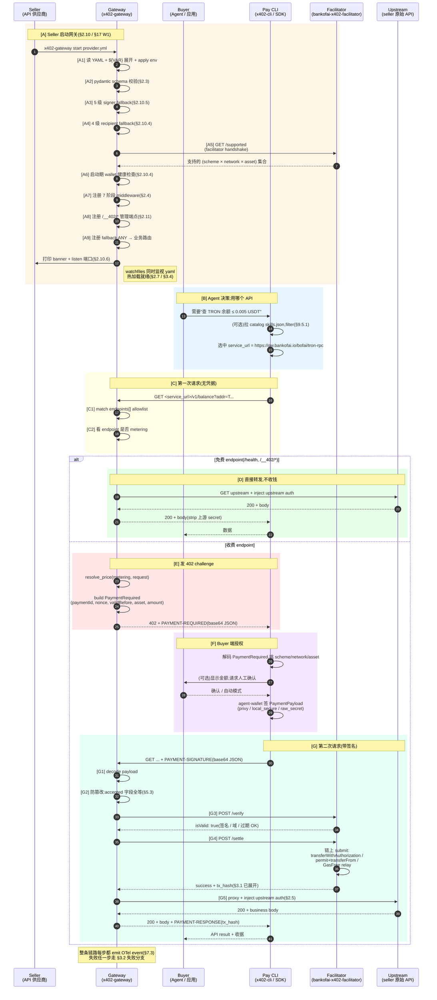

#### 3.0.2 角色职责矩阵

| 角色 | 在本项目里是谁 | 主要责任 | 不负责什么 |
|---|---|---|---|
| **Seller** | API 供应商(SUN.io / 第三方 / bofai 代搬运) | 写 `provider.yml` + `listing.md` + 跑 `x402-gateway start` | 不写客户端、不接 facilitator |
| **Server** = Gateway | `bankofai-x402-gateway` 进程(本项目)| 路由 + 7 阶段 middleware + 402 challenge + verify/settle 编排 + upstream proxy | 不签名(只 verify)、不持币(直付 seller)、不算价格预言机 |
| **Buyer** | 终端 agent / SaaS / 浏览器扩展 | 决定调哪个 API,出钱 | 不直接调 facilitator,通过 Pay CLI |
| **Pay** = x402-cli / SDK | `bankofai-x402-cli` 或客户端 SDK | 解码 challenge、调 agent-wallet 签名、重试请求 | 不知道 upstream 实现 |
| **MPP / Facilitator** | `bankofai-x402-facilitator`(独立服务)| `/verify` 校验签名 + `/settle` 链上提交 + `/supported` 公告能力 | 不知道 catalog、不知道 upstream;它只是个"链上 gas 代理" |
| **API** | seller 的真实 HTTP 服务 | 业务逻辑 | 不知道 x402 协议存在,网关替它收钱 |

注意三件事:Buyer 和 Pay 是两个独立 actor —— Buyer(人 / agent)决定调哪个 API,Pay(x402-cli / SDK)负责协议细节和签名。Server 永远不和 Buyer 直接对话,所有 HTTP 都经过 Pay。Server 也永远不接触钱包私钥,这是"网关不托管资金"的物理保证。

#### 3.0.3 步骤注释(对应代码位置)

把图里 24 个步骤逐一指到 §2-§12 哪节有详细讲、§12.1 哪个文件实现、§17 第几周交付。

| 步骤 | 干什么 | 详细章节 | 代码位置 | W 周 |
|---|---|---|---|---|
| **A 启动期(seller 跑一次 `x402-gateway start`)**|  |  |  |  |
| A1 | 读 YAML + ${VAR} 展开 + env 注入 | §1.12.2 / §2.10.3 | `config/loader.py` | W1 |
| A2 | pydantic schema + 业务校验(asset 在 registry,pay_to 地址格式)| §2.3 | `config/schema.py` + `config/validator.py` | W1 |
| A3 | 5 级 fee-payer signer fallback | §2.10.5 | `signers/resolver.py` | W1 |
| A4 | 4 级 recipient fallback | §2.10.4 | `server/startup.py` | W1 |
| A5 | Facilitator `/supported` handshake,cross-check 不匹配则启动失败 | §2.10.3 step 6 | `facilitator/client.py` | W1 |
| A6 | 钱包余额健康检查(TRX / BNB 三色阈值)+ 5 分钟周期复检 | §2.10.4 | `server/wallet_health.py` | W1 |
| A7 | 注册 7 阶段 middleware(route / metering / payment / proxy) | §2.4 | `middleware/pipeline.py` | W1 |
| A8 | 注册 6 个 `/__402/*` 管理端点 | §2.11 | `server/admin.py` | W1 |
| A9 | 注册 fallback handler:不在 `endpoints[]` allowlist 直接 404 | §1.12.6 | `server/main.py` | W1 |
| **B Buyer 决策(可选用 catalog)** |  |  |  |  |
| B(可选)| Agent 拉 `skills.json` filter 找 API | §9.5.1 / §3.0.1 [B] | (客户端,不在本仓库)| W3 catalog 上线后 |
| **C 第一次请求(无 PAYMENT-SIGNATURE)** |  |  |  |  |
| C1 | match `endpoints[]` allowlist(method + path)| §2.4 阶段[1] | `middleware/route.py` | W1 |
| C2 | 判断该 endpoint 是否带 `metering` 块 | §2.4 阶段[2] | `middleware/metering.py` | W1 |
| **D 免费分支** |  |  |  |  |
| D | 直接进 proxy 阶段[6][7],strip + inject + forward | §2.5 + §4.1 | `middleware/proxy.py` | W1 |
| **E 402 challenge** |  |  |  |  |
| E | `resolve_price` + `build_payment_required` + 返回 402 头 | §2.4 阶段[3] | `middleware/payment.py` | W1 |
| **F Buyer 端授权(在 Pay CLI / SDK 内)** |  |  |  |  |
| F | 解码 PaymentRequired,挑 scheme,调 agent-wallet 签名 | (不在本仓库)| `bankofai-x402-cli/client_cmd.py` | (SDK 侧已存在)|
| **G 第二次请求(带 PAYMENT-SIGNATURE)** |  |  |  |  |
| G1 | base64 解码 PAYMENT-SIGNATURE → PaymentPayload | §2.4 阶段[3] | `middleware/payment.py` | W1 |
| G2 | accepted 字段全等防篡改 | §5.3 | `middleware/payment.py` | W1 |
| G3 | facilitator `/verify`(检查签名、域、过期)| §2.4 阶段[4] | `facilitator/client.py` | W1 |
| G4 | facilitator `/settle`(链上提交)| §2.4 阶段[5] | `facilitator/client.py` | W1 |
| G5 | upstream proxy + STRIP_HEADERS + inject auth(5 种模式)| §2.5 + §1.12.8 | `middleware/proxy.py` + `utils/headers.py` | W1(Header / QueryParam)|

**横切关注点**(每步都有,图里用 Note 表示):

| 关注点 | 章节 | 触发点 |
|---|---|---|
| OTel event | §7.3 | 每步 emit `gateway.*` event |
| Prometheus metric | §7.4 | 每个 HTTP 响应 +1 计数 |
| 热加载 | §2.7 / §3.4 | watchfiles 看到 provider.yml 改 → dry-validate → 原子替换 |
| 错误处理 | §5 | 任一步失败按 §3.2 / §3.3 分类 |

#### 3.0.4 与 pay.sh 的协议头差异

用户给的原始时序图借鉴 pay.sh,标的是 `WWW-Authenticate` / `Authorization`。**我们用的是 x402 协议标头**,不要混淆:

| 用途 | pay.sh(HTTP 标准头复用)| 我们(x402 协议自定义头)|
|---|---|---|
| 服务端发 challenge | `WWW-Authenticate: x402 <base64>` | `PAYMENT-REQUIRED: <base64>` |
| 客户端发签名 | `Authorization: x402 <base64>` | `PAYMENT-SIGNATURE: <base64>` |
| 服务端回 receipt | `Authentication-Info` | `PAYMENT-RESPONSE: <base64>` |

**为什么我们选自定义头**:`Authorization` 头**是上游 auth 自己用的**(§2.5 STRIP 列表),复用同一个名字会和上游业务 auth 路径冲突;用专有头可以无歧义 strip / inject。Pay.sh 在 Solana 上没这个问题,因为 Solana 上的 RPC 大多走 query param 而非 Authorization。

#### 3.0.5 Phase 1 实现范围 vs 留到 Phase 2

Phase 1 W1-W2 必须跑通的主路径:

```
A1-A9(启动)→ C1/C2(路由 + 计费判定)
              ├─ D(免费透传)      —— §4 发货
              └─ E(402 challenge) → G1-G5(verify / settle / proxy) —— §3.1 详图
```

留到 Phase 2 的(schema 已经预留,但代码先不写):

- A5 多 facilitator handshake(目前单 URL 由 facilitator 自己 multi-network)
- B(catalog 整条通路)—— W3 才有
- F 里的"显示金额请求人工确认"(x402-cli Phase 1 自动签)
- G4 之前的本地 replay 查询(对齐 pay.sh,无本地 store,让链上 revert 兜底)
- G4 链上提交时的 splits 多 recipient
- E 的 variants(per-model 定价)
- G5 的 Hmac / Oauth2 / AccessToken 三种上游 auth 模式

#### 3.0.6 错误处理分支细化

24 步里每一步都能失败。按"失败码、是否扣款、客户端怎么办、OTel 是否计 `*.failed`、§3.2 是否已展开"分类列出来,实现时拿这张表对照。

##### 3.0.6.1 启动期失败(A1-A9):一旦失败立即退出,不要"先跑起来再坏"

| 步 | 失败原因 | 错误类别 | 退出码 | seller 看到 |
|---|---|---|---|---|
| A1 | YAML 文件不存在 / 不可读 | `config.file_not_found` | 1 | `Failed to read <path>: <errno>` |
| A1 | YAML 语法错(冒号 / 缩进 / 引号) | `config.yaml_parse_error` | 1 | 行号 + 错误位置 |
| A1 | `${VAR}` 引用环境变量未设 | `config.env_missing` | 1 | 列出所有缺失的 VAR 名,**一次性全列**(不要"修一个再报下一个")|
| A2 | pydantic schema 不通过(类型 / 长度 / enum)| `config.schema_error` | 1 | 标准 pydantic 错误格式 + 字段路径 |
| A2 | `payment.asset` 不在 token registry | `config.asset_not_in_registry` | 1 | 建议候选(USDT / USDC / USDD)|
| A2 | `payment.pay_to` 地址格式错(TRON Base58 / EVM checksum)| `config.invalid_address` | 1 | 标 network 提示该用哪种格式 |
| A2 | `endpoints[].path` 重复 / `method+path` 冲突 | `config.endpoint_collision` | 1 | 列出冲突 endpoint 对 |
| A3 | `fee_payer: true` 但 5 级 signer fallback 全空 | `signer.not_configured` | 1 | 列出 5 种配置方式(§2.10.5)|
| A3 | `payment.signer.privy.app_id` Privy 凭据无效 | `signer.privy_auth_failed` | 1 | "试一下 `agent-wallet whoami`" |
| A3 | `raw_secret_env: X` 但 X 不是 32-byte hex | `signer.invalid_raw_secret` | 1 | "你的 secret 是 N 字节,期望 32" |
| A4 | recipient 4 级 fallback 全空 | `recipient.not_configured` | 1 | 4 种填法逐一列 |
| A5 | facilitator URL DNS / TLS 失败 | `facilitator.unreachable` | 1 | 重试 + URL 检查提示 |
| A5 | facilitator `/supported` 返回不含 (scheme × network × asset) | `facilitator.unsupported_combo` | 1 | 列出 facilitator 实际支持的组合 |
| A6 | RPC URL 无响应 | `rpc.unreachable` | 0 + WARN | **不退出**,黄字警告"健康检查暂时跳过",启动继续 |
| A6 | operator wallet 0 余额(mainnet, scheme 需要 gas)| `wallet.zero_balance` | 0 + WARN | 红字 banner,不阻塞启动(让 seller 自己决定补钱)|
| A7-A9 | 框架初始化 / 端口占用 / 文件权限 | `bind.port_in_use` 等 | 1 | stdlib 标准错误信息 |

启动期错误统一用 `click.UsageError` / `click.FileError` 抛,**不要 raise stack trace**——seller 应该看到一句话错误加一句话修复建议就够。

##### 3.0.6.2 请求期失败(C / D / E / G)

§3.2 已经画了 5 个核心分支(A 链上 replay、B 防篡改、C verify 失败、D settle 失败、E upstream 失败,文档里旧写"四类"是笔误)。下面这张表补足 §3.2 没覆盖的边缘情况:

| 步 | 失败 | HTTP | 是否扣款 | 客户端动作 | OTel | §3.2 覆盖? |
|---|---|---|---|---|---|---|
| 进入前 | TLS handshake 失败 | (TCP 层)| 否 | 检查证书 | — | ✗ |
| 进入前 | HTTP 请求 malformed | 400 | 否 | 修客户端 | `gateway.request.malformed` | ✗ |
| C1 | 路径不在 endpoints[] allowlist | **404** | 否 | 不重试,可能 typo | `route.not_found` | ✗ |
| C1 | method 不在 allowlist(path 在)| **405** | 否 | 不重试 | `route.method_not_allowed` | ✗ |
| C2 | (无失败,只是分类)| — | — | — | — | — |
| D(免费分支)| upstream 5xx / timeout | **502** / **504** | 否 | 找 seller | `upstream.failed` | ✗(免费 endpoint 还没扣款)|
| D | upstream connect refused / DNS | **502** | 否 | 找 seller | `upstream.failed` | ✗ |
| E | resolve_price 抛异常(variants 解析失败)| **500** | 否 | 报 bug | `metering.failed` | ✗ |
| E | facilitator `/supported` 启动后失联(challenge 仍可本地生成)| **402** + challenge | 否 | 正常重试 | (无)| ✗ |
| F | (客户端侧,不在我们 surface)| — | — | — | — | — |
| G1 | PAYMENT-SIGNATURE base64 解码失败 | **400** | 否 | 修 SDK | `payment.decode_failed` | ✗ |
| G1 | PAYMENT-SIGNATURE JSON schema 错 | **400** | 否 | 修 SDK | `payment.schema_failed` | ✗ |
| G1 | PAYMENT-SIGNATURE 字节数超 8KB | **413** | 否 | 报 bug | `payment.too_large` | ✗ |
| G2 | accepted 字段全等失败(§5.3 防篡改)| **402 tampered** | 否 | 排查 SDK / 中间人 | `payment.tampered` | ✓ 分支 B |
| G3 | facilitator `/verify` HTTP 失败 | **503** | 否 | 等待 / 切 facilitator | `facilitator.verify_unreachable` | ✗ |
| G3 | facilitator `/verify` `{isValid: false, reason: ...}` | **402 + reason** | 否 | 重新签 | `payment.verify_failed` | ✓ 分支 C |
| G3 | challenge 过期(`validBefore < now`)| **402 expired** | 否 | 重新拿 challenge | `payment.expired` | ✓ 分支 C |
| G4 | facilitator `/settle` HTTP 失败 | **503** | **不确定** | 风险!可能链上已发但 facilitator 失联 | `facilitator.settle_unreachable` | ✗ |
| G4 | facilitator 返回 `{success: false, reason: "auth used"}`(链上 replay)| **502 settle_failed** | 否(链上 revert)| 不应发生,排查 SDK | `payment.replay_blocked` | ✓ 分支 A |
| G4 | facilitator 返回 `{success: false, reason: "insufficient balance"}` | **502 settle_failed** | 否 | 充值后重签 | `payment.settle_failed` | ✓ 分支 D |
| G4 | facilitator 返回 `{success: false, reason: "tx revert"}`(其他链上失败)| **502 settle_failed** | 否 | 看 reason 排查 | `payment.settle_failed` | ✓ 分支 D |
| G5 | upstream connect timeout / refused | **502** | **是** ⚠️ | 找 seller 退款,**已扣款** | `upstream.failed` (`billed=true`)| ✓ 分支 E |
| G5 | upstream 5xx | **502** | **是** ⚠️ | 同上 | 同上 | ✓ 分支 E |
| G5 | upstream 4xx(seller 业务错)| **passthrough**(透传 4xx)| **是** | 看 upstream body | `upstream.4xx_passthrough` | ✗(透传不报 502)|
| G5 | upstream timeout(超过 `validity_window_seconds`)| **504** | **是** ⚠️ | 同 G5 timeout | `upstream.timeout` | ✓ 分支 E |
| 响应阶段 | 网关 inject `PAYMENT-RESPONSE` header 失败(理论不可能)| **500** | **是** | 报 bug | `response.inject_failed` | ✗ |

##### 3.0.6.3 G4 facilitator 失联(最危险)

settle 阶段最棘手——facilitator 已经收到我们 POST 但中途连接断了,我们不知道链上 tx 提了没。处理规则:

| 子场景 | 处理 | 为什么 |
|---|---|---|
| `/settle` POST timeout | 返 503,不重试 | tx 可能已提了但 facilitator 回复丢了;重试 = 双花;客户端用相同 PaymentPayload retry 时 facilitator 端按 nonce 幂等去重 |
| `/settle` 返 5xx 但 body 含 `tx_hash` | 返 200 + PAYMENT-RESPONSE,信任 tx_hash | facilitator 表态"链上已提",尊重 |
| `/settle` 返 5xx 无 tx_hash | 返 503 | facilitator 没说清,网关也不知道;客户端 retry 走 facilitator 幂等 |

规则就一条:**只要 settle 阶段进了 facilitator,后面按"可能已扣款"处理**;PAYMENT-RESPONSE 一旦发出就不撤回。

##### 3.0.6.4 客户端动作建议(给 x402-cli / SDK 实现参考)

| HTTP | client retry? | 怎么 retry |
|---|---|---|
| 400 / 413 | 否 | SDK bug,fail fast |
| 402 + new challenge | 是 | 用新 challenge 重签 |
| 402 tampered | 否 | 排查中间人 / SDK 篡改路径 |
| 402 expired | 是 | 拿新 challenge(自动)|
| 402 + verify_failed | 是(自动改签)| 看 reason 决定怎么改 |
| 404 / 405 | 否 | URL / method 不对 |
| 502 settle_failed(无 billed)| 是 | 换 token / 等链上确认后重试 |
| 502 upstream_error(billed=true)| **否** ⚠️ | **不自动 retry**(钱已花,retry 会再花一次);提示用户找 seller |
| 503 facilitator_unreachable | 是 | 指数退避 |
| 504 upstream_timeout(billed=true)| 否 | 同 502 billed |

##### 3.0.6.5 错误码与 §5 / §6 / §7 章节的交叉索引

| 关注点 | 在哪 |
|---|---|
| 错误码统一格式(envelope)| §4.1(注:H2 是 §5,小节编号 legacy)|
| PAYMENT-RESPONSE 字段清单 | §4.3 |
| 安全侧威胁(T1-T12 + C1-C11)| §6 |
| 错误对应的 OTel event | §7.3 事件目录 |
| 错误对应的 Prometheus metric | §7.4 |

##### 3.0.6.6 测试矩阵覆盖(Phase 1 验收)

每个错误码至少一条集成测试,放在 `tests/integration/server/` 下:

| 测试 | 覆盖的错误 |
|---|---|
| `test_startup_bad_yaml.py` | A1 / A2(YAML / schema)|
| `test_startup_no_signer.py` | A3 |
| `test_startup_facilitator_handshake_fail.py` | A5 |
| `test_route_404.py` | C1 |
| `test_route_405.py` | C1 (method)|
| `test_free_upstream_5xx.py` | D upstream |
| `test_paid_tampered.py` | G2(分支 B)|
| `test_paid_verify_failed.py` | G3(分支 C)|
| `test_paid_settle_replay.py` | G4(分支 A)|
| `test_paid_settle_insufficient.py` | G4(分支 D)|
| `test_paid_settle_facilitator_timeout.py` | G4 危险语义 |
| `test_paid_upstream_5xx_billed.py` | G5(分支 E)|
| `test_paid_upstream_4xx_passthrough.py` | G5 4xx 透传 |
| `test_hot_reload_bad_yaml_keeps_old.py` | §3.4 dry-validate 失败 |

**覆盖原则**:每个 "Phase 1 列出的错误码" 至少 1 条 happy + 1 条 unhappy;失败时**断言 HTTP code + body 字段名 + 是否产生 PAYMENT-RESPONSE**(不只 status code,还要看是否 `billed`)。

### 3.1 完整付费请求(首次 → 重试 → 成功)

x402 协议本就是两轮:第一轮拿 challenge,第二轮带签名重试。网关在第二轮里串起 verify → settle → 转发。

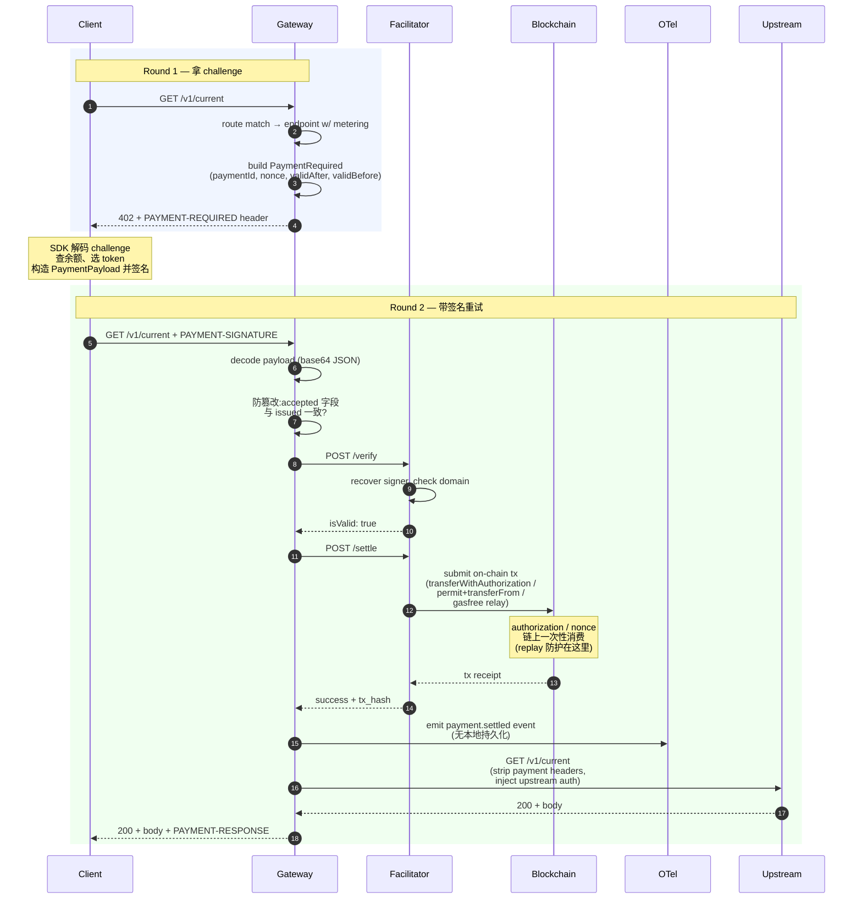

### 3.2 失败分支(四类)

每条分支的 HTTP 码、是否计 replay、是否扣款都不同。

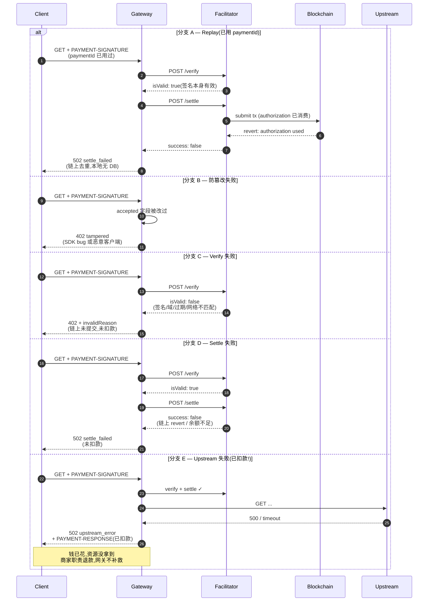

### 3.3 HTTP 状态码 / 副作用矩阵

每个失败分支的处理规则汇总:

| 阶段 | HTTP | 链上扣款 | 客户端处理 |
|---|---|---|---|
| 路由不匹配 | 404 | 否 | 不重试 |
| 无支付凭据 | 402 + challenge | 否 | SDK 重试带签名 |
| Replay(authorization 已消费) | 502 settle_failed | 否 | 不应发生,排查 SDK |
| 防篡改失败 | 402 tampered | 否 | 排查 SDK / 中间人 |
| Verify 失败 | 402 + reason | 否 | 重新签 |
| Settle 失败 | 502 settle_failed | 否 | 可换 token 重试 |
| Upstream 失败 | 502 upstream_error | **是** | 找商家退款 |
| 成功 | 200 + receipt | 是 | 正常 |

**关键不变量**(对齐 pay.sh,网关无本地 DB):

- **Replay 防护完全在链上** —— authorization / nonce 一次性消费,第二次提交链上 revert
- **网关不区分 "未用过的 paymentId" 和 "已用过的 paymentId"** —— 都走 verify+settle 流程,链上自然分辨
- **扣款判定看链上 tx receipt**,不看任何本地状态

### 3.4 配置热加载

文件改动 → 校验 → 原子替换,**不影响在飞请求**。

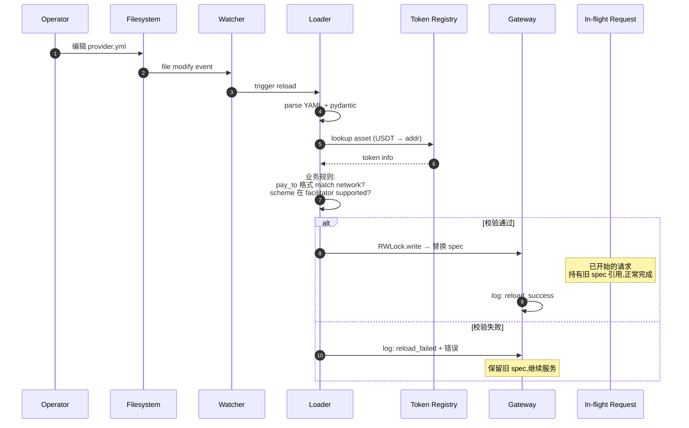

### 3.5 启动初始化

进程冷启时一次性把所有 lazy 校验做完,不要等首个请求才报错。

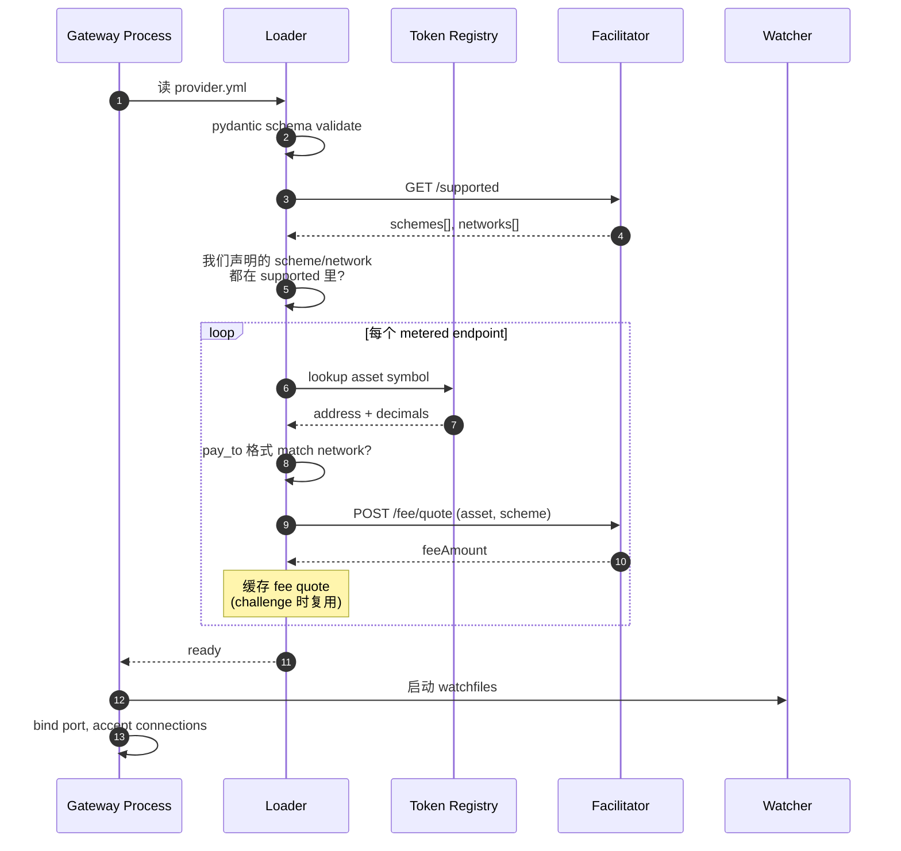

**校验失败 = 启动失败**。不留"先跑起来,出错再说"的口子。

### 3.6 并发 / Replay —— 完全依赖链上

**对齐 pay.sh**:网关**没有本地 replay store**,replay 防护完全由链上的 authorization / nonce 一次性消费提供。

#### 同时提交同一签名的情况

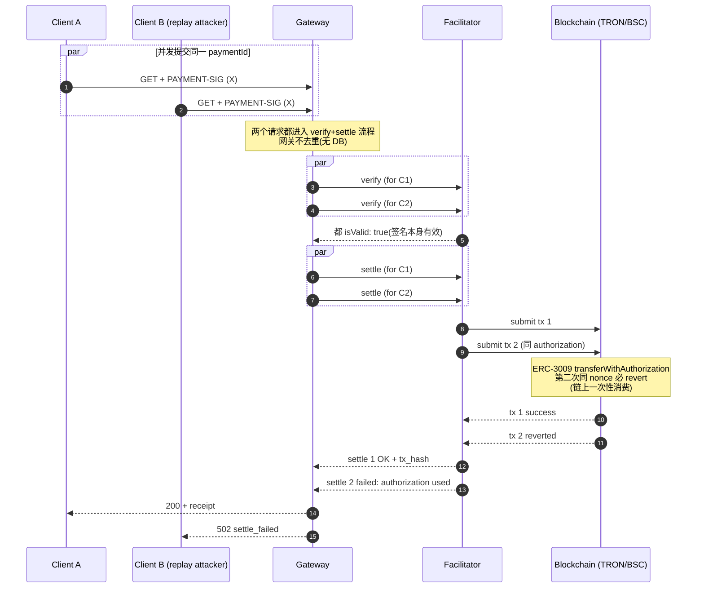

#### 为什么不本地去重

| 方案 | pay.sh 做了吗 | 我们 |
|---|---|---|
| 本地 SQLite UNIQUE 索引 | ✗ | ✗(原设计有,已删) |
| 本地内存 set | ✗ | ✗ |
| **依赖链上 nonce 一次性** | ✓ | ✓ |
| **依赖 facilitator settle 失败上报** | ✓ | ✓ |

**关键**:ERC-3009 `transferWithAuthorization` 和 `exact_permit` 的 nonce 都是**链上一次性消费**,第二次提交必 revert。这是协议级保证,不需要网关再做一遍。

#### 代价

- 攻击者并发同一签名 → 网关多调一次 facilitator(浪费 facilitator quota)
- 链上多一次失败的 tx 提交(浪费 facilitator gas)

**这两个代价 pay.sh 接受了**,理由:实际场景下 replay 攻击几乎不存在(buyer 自己签的 buyer 自己重放没意义;第三方拿不到签名)。Phase 2 量大了再考虑加 L7 限流防止 facilitator quota 浪费。

---

## 4. 内容交付机制(发货流程)

x402 协议管"怎么收钱",发货流程管"钱到手后内容怎么到买家手上"。**这一章核心是讲清楚 pay.sh 是怎么做发货的,以及由此推导的卖家-平台关系**。

x402 的支付时序已在 §3 充分覆盖,本章**不再画支付链路图**,只聚焦支付完成后的内容传递。

### 4.1 pay.sh 的发货模型(调研重点)

#### 4.1.1 一句话总结

> 在 pay.sh 里,**"发货"不是一个独立模块,而是反向代理的一次穿透转发**。验签通过 → 改头 → 转发上游 → 拿回原始响应 → 改头 → 还给买家。整个过程网关只是过路,不参与内容生成、不缓存、不再生。

这是 pay.sh 设计上最重要的一个取舍:**网关是收银台,不是仓库**。

#### 4.1.2 pay.sh 实际的发货行为(从 `core/src/server/proxy.rs` 反推)

完整 7 步:

| 步骤 | 网关做什么 | 输入 | 输出 |
|---|---|---|---|
| 1. 命中已验签请求 | 凭 verify+settle 通过的事实进入 proxy 流程 | client 原始请求 | — |
| 2. 选 upstream URL | 从 `routing.url` + `endpoint.path` 拼接目标 | provider.yml.routing | upstream URL |
| 3. **Strip 请求头** | 删除 hop-by-hop + client 的 `Authorization` + payment 协议头 | client headers | "净身"的 headers |
| 4. **注入 upstream auth** | 按 `routing.auth.method` 把 env 里的 token 拼进去 | env secret | headers + 上游凭证 |
| 5. 透传 body | 原样转发请求体(不解析、不修改) | client body | upstream body |
| 6. 等上游响应 | 阻塞等(MVP 无 streaming) | — | upstream response |
| 7. Strip + 注入 receipt 后返回 | 删危险响应头 + 加 `Payment-Receipt` | upstream response | client 看到的响应 |

**关键观察**:

- 上游业务 API **完全不需要改一行代码**就能上架
- 上游 API **看不到** payment 相关信息(被 strip)
- 上游 API **不知道** buyer 是谁(只知道是网关转发来的)
- 上游 API **凭单一 token** 信任网关(token 就是握手凭证)
- 网关**不缓存**响应,每次付费都打到上游

#### 4.1.3 pay.sh 的 4 个 actors 与数据所有权

```
                                         什么可见            什么不可见
  ┌─────────────────┐
  │  Buyer / Agent  │ ✓ 网关 URL          ✗ 上游真实 URL
  │                 │ ✓ challenge 价格    ✗ 上游 token
  │                 │ ✓ 最终业务响应      ✗ 商家内部系统
  │                 │ ✓ tx_hash 回执
  └─────────────────┘
          │
          │ HTTPS (公共)
          ▼
  ┌─────────────────┐
  │  Gateway (平台)  │ ✓ 路由配置          ✗ 业务数据(只过路)
  │                 │ ✓ 价格 / endpoint   ✗ 上游内部状态
  │                 │ ✓ 上游 auth token   ✗ buyer 钱包私钥
  │                 │ ✓ 每笔 payment 元数据
  │                 │   (amount/tx_hash)
  └─────────────────┘
          │
          │ HTTPS + 注入 token(私有信道)
          ▼
  ┌─────────────────┐
  │  Seller Upstream │ ✓ 自己的 token 是否正确  ✗ buyer 是谁
  │                 │ ✓ 请求体 + 业务参数      ✗ 实际收到多少钱
  │                 │ ✓ 自己的数据库 / 模型    ✗ 网关其他配置
  └─────────────────┘
          │
          │ (无直接通信)
          ▼
  ┌─────────────────┐
  │   Blockchain    │ ✓ payment 事实 (amount, tx) ✗ 内容(不上链)
  │                 │ ✓ seller pay_to 地址        ✗ buyer 是谁(只有钱包地址)
  └─────────────────┘
```

**数据所有权**:

- **内容数据**(API 响应)**永远只在 seller 手上**;网关只是过路,不存储
- **支付数据**(amount / tx_hash)在链上 + 网关 ledger
- **身份数据**(buyer 是谁、seller 是谁)对方互相**不直接看到**;网关知道 seller(provider.yml),但只知道 buyer 的钱包地址不知道身份

#### 4.1.4 pay.sh 支持的 5 种上游 auth 注入模式

`pay.sh` 的 `routing.auth` 字段是个 enum,支持 5 种握手方式:

| auth.method | 注入方式 | 适合场景 | 我们 Phase 1 是否支持 |
|---|---|---|---|
| **`header`** | `key: Authorization`, `prefix: "Bearer "` + token 拼接到指定 header | 最常见,90% 的 SaaS API | ✅ |
| **`query_param`** | `key: api_key` + token 拼到 query string | 老式 API、不允许自定义 header 的 webhook | ✅ |
| **`hmac`** | 用共享 secret 对 method+path+timestamp+body 算 HMAC,放在 header | AWS-style 签名、需防 token 泄露场景 | ⏸ Phase 2 |
| **`oauth2`** | 网关先和 OAuth 端点换 access_token(短期),用 token 再访问上游 | 第三方授权(企业账号代理) | ⏸ Phase 3 |
| **`access_token`** | 静态 access_token,自动刷新(refresh_token 在 env) | 长期访问 + 自动续期 | ⏸ Phase 3 |

**值得注意**:pay.sh 在 enum 上预留这些扩展,但 `proxy.rs` 里 OAuth2 / access_token 分支也是实现完整的。这意味着 pay.sh 的卖家**可以是没有自有 token 系统的轻量级 API 提供者**,网关帮他们处理 OAuth 周转。

我们 Phase 1 不做这个 —— 商家自己有 token 才能上架,够用了。

#### 4.1.5 pay.sh 没做的事(也就是它的边界)

| 事项 | pay.sh 不做 | 为什么 |
|---|---|---|
| 内容缓存 | ✗ | 网关无业务知识,无法判断哪些响应可缓存;每次都回源 |
| 内容生成 | ✗ | 业务在 seller,网关不可见 |
| 异步任务 | ✗ | 默认同步请求-响应;长任务由 seller 自己用 202 + polling 实现 |
| 流式响应(SSE / chunked) | ✗(待考证) | 现有 proxy.rs 看起来是 buffer 后返回 |
| 内容审计 / DLP | ✗ | 网关不看 body 内容 |
| 限速 | ✗ | 交给上游或 L7 代理 |
| 退款 | ✗ | 链上交易已结算,退款由 seller 自处理 |

### 4.2 我们的发货模型(对齐 pay.sh + TRON/BSC 适配)

**对齐**:

- 反向代理 = 发货机制本身
- 上游 auth 注入是信任握手
- 网关只过路,不缓存、不再生
- 内容数据所有权完全在 seller
- 卖家不改代码就能上架

**简化**:

- Phase 1 只支持 `header` + `query_param` 两种 auth 注入(覆盖 90% 场景)
- 不做 OAuth2 / HMAC / access_token 自动续期(Phase 3 评估)
- 不做异步任务编排(seller 自己用 202 + polling)
- 不支持流式响应(buffer 模式)

### 4.3 卖家-平台关系总图

#### 4.3.1 信任握手(token 是关键)

```
                    [ 上架阶段 ]                          [ 运行时 ]

   Seller                                        Buyer
     │                                            │
     │ 1. 在自己上游 API 生成一个                  │
     │    "网关专用 token"                         │
     │    (任意 secret,seller 控制 lifecycle)     │
     │                                            │
     │ 2. 通过 Vault / SOPS 把 token              │
     │    单独投递给平台运维                       │ 5. 用 x402 SDK 发请求
     │    (不进 git,不进 yaml)                    │    (无需关心上游 auth)
     │         │                                  │         │
     │         ▼                                  │         ▼
     │   ┌─────────────┐                          │   ┌─────────────┐
     │   │  Platform   │                          │   │  Gateway    │
     │   │  Secret     │  ─── env 注入 ──►        │◄──┤  (运行时)   │
     │   │  Vault      │                          │   └─────────────┘
     │   └─────────────┘                          │         │
     │         │                                  │         │ 6. 注入 token 转发
     │ 3. 平台审核 + 上架                          │         ▼
     │    provider.yml.routing.auth.value_from_env│   ┌─────────────┐
     │    指向这个 env 名                          └──►│   Seller    │
     │                                                │   Upstream  │
     │ 4. seller 端检查:Request 来自网关 IP +        │             │
     │    带正确 token = 信任,提供服务               │   (检查 token)
     │                                                └─────────────┘
```

**关键**:网关持有 token 不等于 seller 失去控制 —— **seller 可随时轮换 token**(改 env),网关下次请求自然用新值。token 是 seller-平台之间的握手凭证,seller 是握手主体。

#### 4.3.2 责任划分矩阵

| 维度 | 平台职责 | 卖家职责 |
|---|---|---|
| **路由** | 接收请求、匹配 endpoint、转发到 routing.url | 提供稳定的 upstream URL |
| **支付** | 拦截 402、调 facilitator verify+settle | (无,卖家不接触支付) |
| **鉴权** | 注入 upstream token | 提供 token、verify token 真实性 |
| **内容生成** | 不参与 | 完全负责(模型、数据、算法) |
| **响应正确性** | 不审核 | 完全负责 |
| **SLA** | 网关侧 SLA(transit availability) | 上游业务 SLA |
| **限速** | 不做(交给 L7) | 自行限速 |
| **退款** | **不参与**(链上已结算) | 自行处理(联系邮箱、状态页) |
| **争议解决** | 不仲裁 | 自行处理 |
| **数据合规** | 不接触业务数据 | GDPR / PII / 合规完全自负 |
| **故障通知** | 推 metrics + 失败告警给 seller | 自行修复上游 |
| **下架 / 暂停** | 拥有最终决定权(违规可强制下架) | 可自助 `enabled: false` |

**核心边界**:平台是**收银台 + 传送带**,seller 是**工厂**。工厂出的货有问题,工厂自己负责。

### 4.4 发货阶段的失败语义(扩展 §3.2 分支 E)

§3.2 提到过"upstream_error 已扣款"。本节展开 5 类发货失败:

| 上游表现 | 网关返回 | 已扣款? | 谁负责 | 客户端建议 |
|---|---|---|---|---|
| 上游 5xx | 502 `upstream_error` + receipt | **是** | Seller | 重试 / 找商家 |
| 上游超时 | 504 `upstream_timeout` + receipt | **是** | Seller | 同上 |
| 上游 4xx(业务错误) | **透传 4xx** + receipt | **是** | (业务正常错误,如参数错误)| client 自查 |
| 上游 200 但 body 是 error | **透传 200 + body** | **是** | (业务约定) | 客户端解析判断 |
| 上游 200 内容恶意 | 透传 | **是** | Seller(违规)+ 平台(强制下架) | 举报 |

**关键不变量**:**任何已 verify+settle 的请求,网关都返回 PAYMENT-RESPONSE header**,即使上游失败。这样客户端永远能知道"钱花了没"。

### 4.5 发货阶段聚焦时序图

只画**支付通过后**的发货段。不重复 §3.1 的 x402 验签部分。

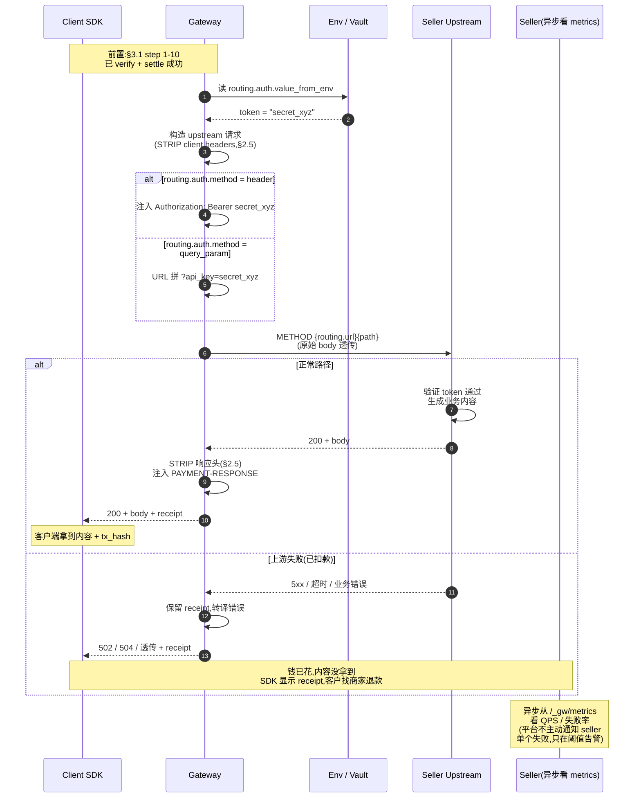

**这张图想强调的几个事实**:

1. **token 永远只在网关进程内**:从 vault 取出 → 立即注入 → 不进日志、不进 ledger
2. **方向是单向的**:client 请求 → 网关注入 → 上游响应。上游**不知道也不应知道** client 是谁
3. **失败也带 receipt**:让 client 永远能证明"我付了钱"
4. **Seller 不在请求路径里**:seller 只在异步通道(metrics)看汇总数据,看不到单个请求

### 4.6 边缘场景与未来扩展

| 场景 | Phase 1 行为 | 未来方向 |
|---|---|---|
| **慢上游(>30s)** | 504 + receipt,gateway 配置 `upstream_timeout_seconds` 默认 30 | Phase 2 加按 endpoint 配置超时 |
| **大 response body** | 默认上限 10 MB,超过截断 + 报错 | Phase 2 加 streaming 后无上限 |
| **流式响应(SSE)** | 不支持(buffer 后返回) | Phase 2 透传 chunked + SSE |
| **异步任务** | 卖家自己用同步 API 返回 `202 + job_id`,客户端每次 polling 都付一次费 | Phase 3 评估"一次付费多次回拉"模式 |
| **WebSocket** | 不支持 | 协议层与 x402 单次 challenge 模型不匹配,长期不做 |
| **多步事务**(先 reserve 再 commit) | 不内置 | 卖家自处理,把 reserve / commit 都做成各自付费的 endpoint |
| **客户端断连** | 已 verify+settle 的请求继续完成发货(响应丢弃),保证记账一致 | 同 |

### 4.7 卖家接入"发货"需要做的事

很短的清单:

1. **提供一个 upstream URL**(`routing.url`),HTTPS,稳定
2. **提供一个 token**(任意 secret,你能控制 lifecycle),走 Vault 投递给平台
3. **上游接受这个 token**(验证逻辑由 seller 写,如 middleware 检查 Authorization header)
4. **可选:IP 允许列表** —— 上游只接受网关 egress IP 段的请求(更安全)
5. **可选:mTLS** —— Phase 2 评估
6. **业务错误自己处理** —— 4xx 透传,client 自查

**不需要做的事**:

- ❌ 改 API 代码(网关不要求你支持任何 payment 协议)
- ❌ 接入 x402 SDK(支付完全在 buyer 侧)
- ❌ 在你的 API 里检查支付(网关已经验完了)
- ❌ 维护买家身份(网关不传 buyer 信息;如需匿名计数,可用网关 metrics)

### 4.8 与 pay.sh 的对照(发货机制专项)

| 维度 | pay.sh | 我们(Phase 1) |
|---|---|---|
| 发货 = 反向代理 | ✓ | ✓ |
| 网关持有 upstream token | ✓ | ✓ |
| Token 走 env / Vault | ✓ | ✓ |
| 不缓存响应 | ✓ | ✓ |
| 不参与内容生成 | ✓ | ✓ |
| Auth 模式 header | ✓ | ✓ |
| Auth 模式 query_param | ✓ | ✓ |
| Auth 模式 HMAC | ✓ | ⏸ Phase 2 |
| Auth 模式 OAuth2 | ✓ | ⏸ Phase 3 |
| Auth 模式 access_token 自动续期 | ✓ | ⏸ Phase 3 |
| 流式响应透传 | (待考证) | ⏸ Phase 2 |
| `routing.type: respond`(mock 模式) | ✓ | ✗ 不做 |
| 退款责任在 seller | ✓ | ✓ |
| 平台数据不可见 | ✓ | ✓ |

---

## 5. 错误响应规范

§3.3 状态码矩阵的 wire format 落地。所有错误响应都是 JSON,共享统一结构,SDK 端按 `code` 字段做处理。

### 4.1 错误响应统一格式

```json
{
  "error": {
    "code": "<machine-readable code>",
    "message": "<human-readable>",
    "request_id": "req_01HXY...",
    "details": { ... }
  }
}
```

- `code`:稳定的标识符,SDK 用它做分发;不会因为文案改动而变
- `message`:运维 / 排查用,不保证稳定
- `request_id`:用于关联日志和 trace
- `details`:可选,按 code 类型有不同 schema(见下)

### 4.2 错误码定义表

| HTTP | code | 何时返回 | details schema | 客户端建议 |
|---|---|---|---|---|
| 402 | `payment_required` | 端点带 metering 但请求无 PAYMENT-SIGNATURE | — | 解 PAYMENT-REQUIRED header,签名重试 |
| 402 | `challenge_expired` | `validBefore` 已过 | `{validBefore}` | 用新 challenge 重签 |
| 402 | `payment_tampered` | `accepted` 字段与 issued 不匹配 | `{mismatched_fields: []}` | 排查 SDK / 中间人 |
| 402 | `verify_failed` | facilitator 返回 isValid=false | `{reason: string}` | 按 reason 处理 |
| 402 | `network_mismatch` | payload.network ≠ 服务配置 | `{expected, got}` | 换网络重签 |
| 402 | `scheme_unsupported` | 服务不接受该 scheme | `{accepted_schemes: []}` | 换 scheme |
| 404 | `route_not_found` | method+path 不在 endpoints[] | — | 不重试 |
| 409 | `replay_detected` | paymentId 已记账 | `{tx_hash: string}` | SDK 必须生成新 paymentId |
| 422 | `invalid_payment_header` | base64 / JSON 解码失败 | `{parser_error}` | 排查编码 |
| 502 | `settle_failed` | facilitator settle 返回失败 | `{reason, tx_hash?}` | 可重试(未扣款) |
| 502 | `upstream_error` | 上游 5xx / 超时 | `{upstream_status, retry_after?}` | **已扣款**,找商家 |
| 503 | `facilitator_unavailable` | facilitator 连不上 | `{retry_after}` | 退避重试 |
| 504 | `upstream_timeout` | 上游 timeout | `{timeout_ms}` | 客户端决定 |

### 4.3 PAYMENT-RESPONSE header 格式

成功响应(200)和 upstream_error(502)都带这个头,内容是 base64(JSON):

```json
{
  "payment_id": "0xf28d82b7...",
  "tx_hash": "0xabcdef...",
  "network": "tron:nile",
  "scheme": "exact_permit",
  "amount": "100",
  "asset": "0xeca9bc828a...",
  "settled_at": "2026-05-14T03:21:09Z"
}
```

**关键**:upstream 失败时也返回这个头,客户端能知道"钱已扣"。这是 §3.2 分支 E 的兑现。

### 4.4 PAYMENT-REQUIRED 兼容字段

我们的 challenge 复用 SDK 的 `PaymentRequired` 类型(见 [x402/python/x402/src/bankofai/x402/types.py:158](../x402/python/x402/src/bankofai/x402/types.py)),不发明新格式。

---

## 6. 安全模型

支付网关是高价值攻击目标。这一章明确**我们防御什么、不防御什么**。

### 5.1 信任边界

```
┌──────────────────────────────────────────────────────────────────────┐
│                          Gateway 进程内                                │
│  TRUSTED:                                                              │
│    - provider.yml(运维操作落盘)                                     │
│    - env vars(secret 注入)                                          │
│    - SDK 代码 + 我们自己的代码                                        │
└──────────────────────────────────────────────────────────────────────┘
        ↑                          ↑                         ↑
   UNTRUSTED                  UNTRUSTED                 SEMI-TRUSTED
   Client 请求                Upstream 响应             Facilitator
   (HTTP body, headers,       (HTTP body, headers,      (HTTP API,
    PAYMENT-SIGNATURE)         上游可能被攻破)          有 TLS 但要校验
                                                         返回结构)
```

**核心原则**:网关进程内信任,跨进程一律不信任。

### 5.2 威胁清单

| 编号 | 攻击场景 | 我们的防御 | 残余风险 |
|---|---|---|---|
| T1 | 客户端篡改 accepted 字段付低价拿高价资源 | §3.1 第 6 步防篡改检查;`accepted` 必须与 issued 字段全等 | 无 |
| T2 | 同一签名 replay 多次 | §3.6 两阶段写 + paymentId UNIQUE 索引 | 进程内防御;多实例需共享 store |
| T3 | 中间人改 PAYMENT-SIGNATURE | TLS;签名本身在 EIP-712 域内,改了 verify 必失败 | 无(假设 TLS 没破) |
| T4 | 客户端伪造 PAYMENT-RESPONSE 让上游误判已付 | 上游永远收不到这个 header(STRIP 列表),只看网关注入的 auth | 上游若信任 client 任意 header → 上游 bug,不是网关问题 |
| T5 | 上游响应里塞 prompt injection 给 agent | **不在网关层处理**(违反职责);SDK / agent 层负责 | 文档化:provider 响应一律不可信 |
| T6 | upstream auth token 通过响应泄露 | STRIP_RESPONSE_HEADERS 包含 `authorization` / `proxy-authorization` | 上游主动把 token 写进 body → 网关无法管 |
| T7 | yaml 热加载毒配置(写入恶意 upstream) | dry-validate 校验所有字段;失败时保留旧配置(§3.4) | 运维有写文件权限的人本身就可信 |
| T8 | DoS:大量未签名请求消耗 facilitator quota | 402 challenge 廉价(本地生成);verify 调用前先 replay check + 防篡改 | 量太大仍需 L4/L7 限流(运维侧) |
| T9 | DoS:大量带签名但 verify 失败的请求 | rate limit per source IP / per payment_id 前缀 (Phase 2) | Phase 1 留口,需配合 nginx/CDN |
| T10 | Facilitator 被攻破返回伪造 settle 成功 | **不防御**:facilitator 是协议级信任根 | 选 facilitator 等于选信任源 |
| T11 | 启动时 facilitator `/supported` 被篡改导致接受不支持 scheme | TLS + 启动配置 facilitator URL(不接受动态发现) | 同 T10 |
| T12 | 多租户场景下 spec A 的 endpoint 影响 spec B | Phase 1 单租户,Phase 2 加 subdomain 隔离 | Phase 2 时再细化 |

### 5.3 关键不变量(代码审查检查清单)

实现时必须满足,改动这些路径要走 security-reviewer:

- **Replay 检查在 verify 之前**:否则窗口期可双花(§3.6)
- **Replay 写入在 settle 成功之后**:否则失败也消耗 paymentId,正常用户体验崩
- **STRIP_REQUEST_HEADERS 在 inject auth 之前**:否则 client 的 `Authorization` 可能透传给上游
- **`accepted` 字段全等校验**:逐字段比对,不只比 hash,避免 hash 算法分歧
- **paymentId 唯一性约束在 DB 层**:不能只在应用层判断(并发条件下不可靠)
- **secret 永远不落日志**:`value_from_env` 解析后的 token 值不可进 trace event

### 5.4 不做的事

- ❌ 自建 facilitator(直接信赖 bankofai-x402)
- ❌ 钱包托管(网关不持有任何签名密钥)
- ❌ 客户端身份认证(API key、JWT 等 —— x402 协议就是 capability-based,会签就能用)
- ❌ 防 prompt injection(provider 响应 untrust 是 agent / SDK 责任)
- ❌ L7 限流(交给 nginx / CDN / Cloudflare)

### 5.5 Catalog 侧威胁(独立威胁面)

> Gateway 的威胁面在请求路径上。Catalog 是**目录数据 + CI**,威胁面完全不同 —— prompt injection、供应链、CDN 篡改、价格漂移都是新维度。这一节专门把它们梳理出来,§10 / §10.bis 的实现要逐项 cover。

| 编号 | 攻击场景 | 我们的防御 | 残余风险 |
|---|---|---|---|
| C1 | listing.md `body` 塞 prompt injection,污染读到这段的 agent | `catalog check` 静态扫描 `body` 段,拒收含已知 jailbreak 模板的提交;人工 review;`dist/providers/<fqn>.json` 把 body 单独分段,客户端可选择性不喂给 LLM | LLM 端是否吞 body 是 agent 自身责任,我们只做来源标识 |
| C2 | listing.md `service_url` 写成钓鱼网关(域名相似),骗 agent 把 payment 打给攻击者 | (a) PR review 时人工核对域名;(b) `catalog probe` 实测 402 challenge,看 `pay_to` 是不是该 operator 名下钱包;(c) Phase 2 加 wallet 所有权证明(seller 签一条 `i-own-<fqn>` 消息)| TLD 抢注 + look-alike 字符攻击 → 走 Phase 2 wallet-binding |
| C3 | seller 上架时诚实,事后改网关价格 10 倍 | §9.8.5 nightly re-probe 检测漂移,> 100% 自动加 warn,持续漂移自动下架 | 24h 内的恶意计价对 agent 可见;靠 §9.5 cache-control 60s 缩短窗口 |
| C4 | seller 上架时声明 USDT,事后切到 fake stablecoin / scam token | `catalog probe` 严格 cross-check `asset_address` 来自 bankofai-x402 token registry(白名单),不在白名单的 `asset` 直接 `wrong_currency` 不入 catalog | 白名单维护本身 → 走 SDK release 流程 |
| C5 | catalog scaffold 拉外部 OpenAPI 文档,文档里含 `$ref` 指向恶意内部地址(SSRF)| scaffold 时只解析 `info.{title,description}` / `servers[0].url` 三个字段,忽略所有其他;`build` 阶段解析 OpenAPI 用沙箱 + URL 黑名单(`localhost` / 私网段)| 0day SSRF 风险,docker 容器内多一层隔离 |
| C6 | seller 在 OpenAPI 里塞超大文档(GB 级)耗光 CI runner 内存 | catalog scaffold / probe 拉 OpenAPI 时 `Content-Length` 上限 5 MB,response body 流式读 + truncate | 5 MB 内攻击者仍可放 zip bomb → 后续加解压检查 |
| C7 | seller 改 CI 自己用的 image(`X402_CATALOG_IMAGE` env)指向恶意 image | workflow yaml 是受保护 file,`CODEOWNERS` 要求 maintainer 审,普通 seller PR 不能改 `.github/workflows/` | 强制 review 即可,不需要技术防御 |
| C8 | 通过 PR 上传超大 sidecar(`samples/` 目录)膨胀仓库 | branch protection 加 `paths-ignore` + git LFS 默认拒绝;`catalog check` 拒绝 listing 目录 > 1 MB | 单 PR 内多个小文件累计仍可绕过 → maintainer review |
| C9 | R2 bucket 被攻破改 dist | Cloudflare R2 OIDC + 只让 CI workload identity 写,disable bucket public write;dist objects 加 ETag/checksum hash 写入 GitHub release notes,客户端可对比 | 完全防御要客户端校验 hash,Phase 2 |
| C10 | 上架后 seller 故意把上游 API key 配置失效,网关 502 但 agent 已签名扣款 | §3.2 分支 E:**已结算**但 upstream 失败,agent 看到 `billed: true` + 502;agent 端需要处理"付钱但拿不到货"的 retry 策略 | 这是 pay.sh 同样的行为;靠 §4.4 发货失败语义 + 钱包级 reputation(Phase 3)|
| C11 | catalog repo 上一个恶意 PR merge 进 main(被 admin 强 merge / GitHub 账号被攻破) | §10.bis.4 main 上的 `build-skills.yml` 第 4 步 **re-gate**:对所有 changed providers 重跑 probe + verdict,失败直接 fail workflow,dist 不更新 | admin 同时绕过 build workflow → 不能防御,靠 audit log |

**关键不变量补丁**(§5.3 的 catalog 版本):

- **`probe` 必须在 facilitator-verified `asset` 白名单内**:不在白名单的 token 一律 `wrong_currency`,不入 catalog
- **CI `re-gate` 不能用 PR 阶段的 probe 结果**:必须独立重跑,因为 PR 阶段和 merge 阶段之间 seller 可能改了网关
- **`dist` 写盘前必过 verdict**:`verdict.block == true` 的 provider 不写入 `dist/providers/`(对照 pay.sh `catalog build` 行为)

### 5.6 Catalog 不做的事

- ❌ 阻止 seller 在 body 写不准确的"性能 SLA"(那是声明不是技术真相;靠用户举报 Phase 3)
- ❌ 对 listing 内嵌的 URL 做安全扫描(reviewer 工作)
- ❌ 防 seller 用 wash trade 刷 catalog metrics(Phase 3 reputation)
- ❌ 对 service_url 做证书 pinning(TLS 标准链已经够用)
- ❌ 任何形式的"已审核 / verified" 徽章(对齐 pay.sh 的零治理标榜,避免被律师质疑承诺了什么)

---

## 7. 可观测性

调试 402 链路需要看到 7 阶段的每一步发生了什么。这一章定义 trace event schema,使其可对接 OTel / Sentry / 自建 ELK。

### 6.1 事件分类

按生命周期分三类:

| 类别 | 事件名 | 频次 | 用途 |
|---|---|---|---|
| **请求级** | `request.received` → `response.sent` | 每个请求一组 | 端到端延迟 |
| **阶段级** | `route.matched`, `payment.verified`, `proxy.forwarded` 等 | 每阶段一条 | 阶段耗时定位 |
| **业务级** | `payment.settled`, `replay.blocked`, `upstream.failed` | 关键节点 | 业务监控 |

### 6.2 事件 schema

所有事件共享 envelope,payload 按事件类型不同:

```json
{
  "event": "payment.verified",
  "request_id": "req_01HXY...",
  "trace_id": "<W3C traceparent>",
  "timestamp": "2026-05-14T03:21:09.123Z",
  "spec_name": "acme-weather",
  "endpoint": "GET /v1/current",
  "duration_ms": 87,
  "payload": {
    "payment_id": "0xf28d82b7...",
    "scheme": "exact_permit",
    "network": "tron:nile",
    "amount": "100",
    "asset_symbol": "USDT"
  }
}
```

### 6.3 事件目录

对应 §3 时序图的关键节点:

| 事件 | 何时发出 | 关键字段 |
|---|---|---|
| `request.received` | 进入 middleware | method, path, host |
| `route.matched` | §3.1 step 2 | endpoint_path, is_metered |
| `route.not_found` | path 不在 allowlist | requested_path |
| `challenge.issued` | §3.1 step 4 | payment_id, validity_seconds |
| `payment.received` | client 带签名重试 | payment_id |
| `payment.tampered` | §3.2 分支 B | mismatched_fields |
| `replay.blocked` | §3.2 分支 A / §3.6 | payment_id, prior_tx_hash |
| `payment.verified` | facilitator verify 成功 | verify_duration_ms |
| `payment.verify_failed` | §3.2 分支 C | reason |
| `payment.settled` | facilitator settle 成功 | tx_hash, settle_duration_ms |
| `payment.settle_failed` | §3.2 分支 D | reason |
| `upstream.forwarded` | §3.1 step 11 | upstream_url, upstream_method |
| `upstream.responded` | upstream 返回 | upstream_status, upstream_duration_ms |
| `upstream.failed` | §3.2 分支 E | upstream_status, **billed: true** |
| `response.sent` | 最终返回 client | status_code, total_duration_ms |
| `config.reloaded` | §3.4 | success: bool, error?: string |

### 6.4 Metrics(Prometheus 命名)

| Metric | 类型 | Labels | 用途 |
|---|---|---|---|
| `gateway_requests_total` | counter | `endpoint`, `status_code` | QPS / 错误率 |
| `gateway_request_duration_seconds` | histogram | `endpoint`, `outcome` | P50/P95/P99 |
| `gateway_402_issued_total` | counter | `endpoint`, `reason` | 询价频次 |
| `gateway_payments_settled_total` | counter | `network`, `scheme`, `asset` | 业务量 |
| `gateway_payment_amount_total` | counter | `network`, `asset` | GMV(以最小单位累加) |
| `gateway_settle_failures_total` | counter | `network`, `scheme`, `reason` | 告警阈值候选 |
| `gateway_replay_blocked_total` | counter | `endpoint` | 异常监控 |
| `gateway_upstream_failures_total` | counter | `endpoint`, `upstream_status` | 商家侧故障 |
| `gateway_facilitator_call_duration_seconds` | histogram | `operation` (verify/settle/quote) | facilitator 健康 |
| `gateway_config_reload_total` | counter | `success` (bool) | 配置稳定性 |

### 6.5 日志级别约定

- **ERROR**:导致请求失败的、非预期的(facilitator 不可达、配置加载失败、DB 写失败)
- **WARN**:可恢复但值得关注的(replay 命中、tampered、validity 即将到期)
- **INFO**:正常生命周期(启动 / 关闭 / 热加载成功)
- **DEBUG**:每个 trace event(请求级别,生产环境采样)

**绝不进日志的字段**:`value_from_env` 解析后的明文 token、`PAYMENT-SIGNATURE` 完整内容(可记 paymentId 但不记 signature bytes)。

### 6.6 Catalog 侧事件(build / probe / publish)

> Gateway 的可观测对象是"请求 / 支付 / 上游";Catalog 的可观测对象是"构建 / 探测 / 发布"。两边走同一份 OTel exporter,但事件名前缀分开 (`catalog.*`),metrics 命名空间也分开 (`catalog_*`)。

**事件清单**(对照 §10 / §10.bis 的关键节点):

| 事件 | 何时发出 | 关键字段 |
|---|---|---|
| `catalog.check.started` | `catalog check` 入口 | mode (single/files/changed-from/full), file_count |
| `catalog.static.passed` | static validate 通过 | file_count, warning_count |
| `catalog.static.failed` | static validate 失败 | error_code, file_path, line |
| `catalog.probe.started` | `catalog probe` 入口 | provider_count, endpoint_count |
| `catalog.probe.endpoint` | 单 endpoint 探测完成 | fqn, method, path, probe_status, duration_ms |
| `catalog.probe.summary` | `catalog probe` 全量结束 | ok_count, free_count, error_count, total_duration_ms |
| `catalog.verdict.blocked` | provider verdict.block=true | fqn, reason, ok_count, non_compat_count |
| `catalog.build.started` | `catalog build` 入口 | mode (full/incremental), only_fqns, has_previous_dist |
| `catalog.build.skipped_unchanged` | 增量模式下某 fqn 从 prev-dist 拷贝 | fqn, source: "previous_dist" |
| `catalog.build.published` | dist/ 写盘完成 | provider_count, total_endpoint_count, dist_size_bytes |
| `catalog.publish.r2_synced` | wrangler rsync 完成 | objects_uploaded, total_bytes |
| `catalog.reprobe.drifted` | nightly re-probe 检测价格漂移 | fqn, endpoint_path, old_amount, new_amount, drift_pct |

**Metrics**(Prometheus 命名):

| Metric | 类型 | Labels | 用途 |
|---|---|---|---|
| `catalog_check_runs_total` | counter | `mode`, `outcome` (pass/fail) | CI 健康 |
| `catalog_probe_endpoints_total` | counter | `probe_status` | 7 态分布 |
| `catalog_probe_duration_seconds` | histogram | `fqn` | seller 网关响应延迟 |
| `catalog_verdict_blocked_total` | counter | `reason` | 拒绝原因分布 |
| `catalog_build_duration_seconds` | histogram | `mode` (full/incremental) | 增量是否有效 |
| `catalog_dist_size_bytes` | gauge | — | dist 体积监控 |
| `catalog_providers_total` | gauge | `category` | 18 分类各多少个 |
| `catalog_reprobe_drift_total` | counter | `severity` (low/mid/high) | 漂移频次 |

**日志级别约定**(catalog 子集):

- **ERROR**:`catalog check` 退出非 0(static 失败 / verdict block)、R2 publish 失败、OpenAPI 拉取超时
- **WARN**:probe 单个 endpoint `error` 但 provider 整体仍通过、价格漂移触发告警、incremental 模式 prev-dist 缺失退化为 full rebuild
- **INFO**:`catalog build` 开始 / 结束、每个 fqn 处理 summary、R2 publish object count
- **DEBUG**:逐 endpoint 的 probe 请求 / 响应详情(默认关,`--verbose` 打开)

**绝不进日志的字段**:`provider.yml` 里 `routing.auth.value_from_env` 解析后的明文(catalog 工具不应该看到 secret,但防御性 redact 仍要做)。

---

## 8. 部署架构

### 7.1 单实例运行模型

最小部署:一个 gateway 进程 + 一个 facilitator。

```
                 ┌──────────────┐
                 │   Nginx /    │   ← TLS 终结 + L7 限流
                 │   Cloudflare │
                 └──────┬───────┘
                        │
                 ┌──────▼───────┐
                 │  x402-gateway │   ← single process, async
                 │   (Python)    │   ← 无本地 DB(对齐 pay.sh §2.9)
                 └──┬───────────┬┘
                    │           │
        ┌───────────▼┐         ┌▼──────────┐
        │ Filesystem │         │ Facilitator│
        │ (yaml /    │         │ (HTTPS)    │
        │  catalog)  │         └────────────┘
        └────────────┘                │
                                      ▼
                              TRON / BSC(链上 = replay 防护源)
```

**为什么单进程够用**:每个请求最长路径是 verify + settle(链上 tx),受限于链速,单进程几百 QPS 完全够商家用。需要横向扩展才上多实例。

### 7.2 横向扩展(对齐 pay.sh,几乎无状态)

因为网关**没有本地 DB**(§2.9),横向扩展非常简单:

| 状态 | 拆法 |
|---|---|
| **provider.yml + listing.md** | 共享文件系统挂载 或 git pull,所有实例监听同一份 |
| **Catalog index.json** | CDN 缓存,实例只读 |
| **Replay 防护** | **不在网关层**,在链上(无需共享) |
| **使用量计数器**(内存) | 各实例独立,**计数会"分散"在多实例间**(可接受,Phase 1 不按阶梯定价) |
| **Facilitator client** | 各实例独立连接池 |
| **OTel exporter** | 各实例独立,事件汇到外部 collector |

**关键差异 vs 传统网关**:没有"运行时状态需要跨实例同步"的问题。实例之间只共享配置文件,运行时彼此独立。

如果未来真的需要跨实例同步计数器(Phase 2 阶梯定价),用 Redis 加一层 SET NX。**Phase 1 不做**。

### 7.3 配置 / Secret 管理

| 对象 | 来源 | 渠道 |
|---|---|---|
| `provider.yml` / `listing.md` | 运维 / git | 文件系统(挂载或 sidecar 同步) |
| `value_from_env` 引用的 token | 运维 | 容器 env(K8s Secret / Docker Compose `env_file`) |
| Facilitator URL | provider.yml 明文 | 不算 secret |

**约定**:secret 永远走 env,**永远不进 provider.yml**。yaml 文件本身可以入 git。

### 7.4 健康检查 endpoint

网关自己暴露(不通过 routing.endpoints[] 配置):

```
GET /_gw/health      → 200 if process alive
GET /_gw/ready       → 200 if config loaded + facilitator reachable
GET /_gw/version     → {version, spec_hash, loaded_at}
GET /_gw/metrics     → Prometheus exposition format
```

`/_gw/*` 是保留前缀,与 provider.yml 的 endpoints[] **不能冲突**(loader 在校验时拒绝以 `/_gw/` 开头的 endpoint)。

### 7.5 优雅重启

- SIGTERM:停止接受新连接,等待在飞请求完成(配置项 `shutdown_timeout_seconds`,默认 30)
- 超时强杀:抛 503,客户端可重试(尚未扣款的请求安全;已扣款但未返回的进入"上游失败"分支)
- 热加载比重启优先 —— 配置改动用 §3.4 路径,不重启

### 7.6 docker-compose 范例(概念,不写代码)

```yaml
services:
  gateway:
    image: x402-gateway:0.0.1
    ports: ["8080:8080"]
    volumes:
      - ./provider.yml:/etc/x402-gateway/provider.yml:ro
      - gateway-data:/var/lib/x402-gateway
    env_file: .env
    environment:
      X402_GATEWAY_CONFIG: /etc/x402-gateway/provider.yml
      X402_GATEWAY_DB_PATH: /var/lib/x402-gateway/state.db
    healthcheck:
      test: ["CMD", "curl", "-f", "http://localhost:8080/_gw/ready"]
      interval: 10s
volumes:
  gateway-data:
```

---

## 9. 商家上架与用户调用全流程

§3 讲的是单次请求的毫秒级时序。这一章讲的是**端到端的上架链路**:从商家提交申请到第一个用户完成付费调用,中间所有人工 / 自动环节。

### 8.1 流程总览

```
┌────────────────────────────────────────────────────────────────────────┐
│                         上架与服务全链路                                  │
├────────────────────────────────────────────────────────────────────────┤
│                                                                          │
│   [1] 申请        Seller 提交 provider.yml + listing.md + 钱包 + 联系  │
│      ↓                                                                   │
│   [2] 自动校验    五段串联(provider.yml 三段 + listing.md 两段)     │
│                     A 静态 → B 上游 → C Sandbox 联调                    │
│                                   → D Listing 静态 → E Catalog Probe    │
│      ↓                                                                   │
│   [3] 人工审核    上游可信度、定价合理性、钱包所有权证明、文案合规     │
│      ↓                                                                   │
│   [4] 上生产      Production Gateway 热加载 + DNS 路由                  │
│      ↓                                                                   │
│   [5] Catalog 入库 listing.md → catalog build → index.json 发布        │
│      ↓                                                                   │
│   [6] 用户调用    Agent 搜索 / MCP 发现 → 402 → 签名 → 200             │
│                                                                          │
└────────────────────────────────────────────────────────────────────────┘
```

每个阶段独立时序图见 8.2 - 8.7。新增的 catalog 入库阶段(5)在 §8.6 之前插入。

### 8.2 阶段一:Seller 提交申请

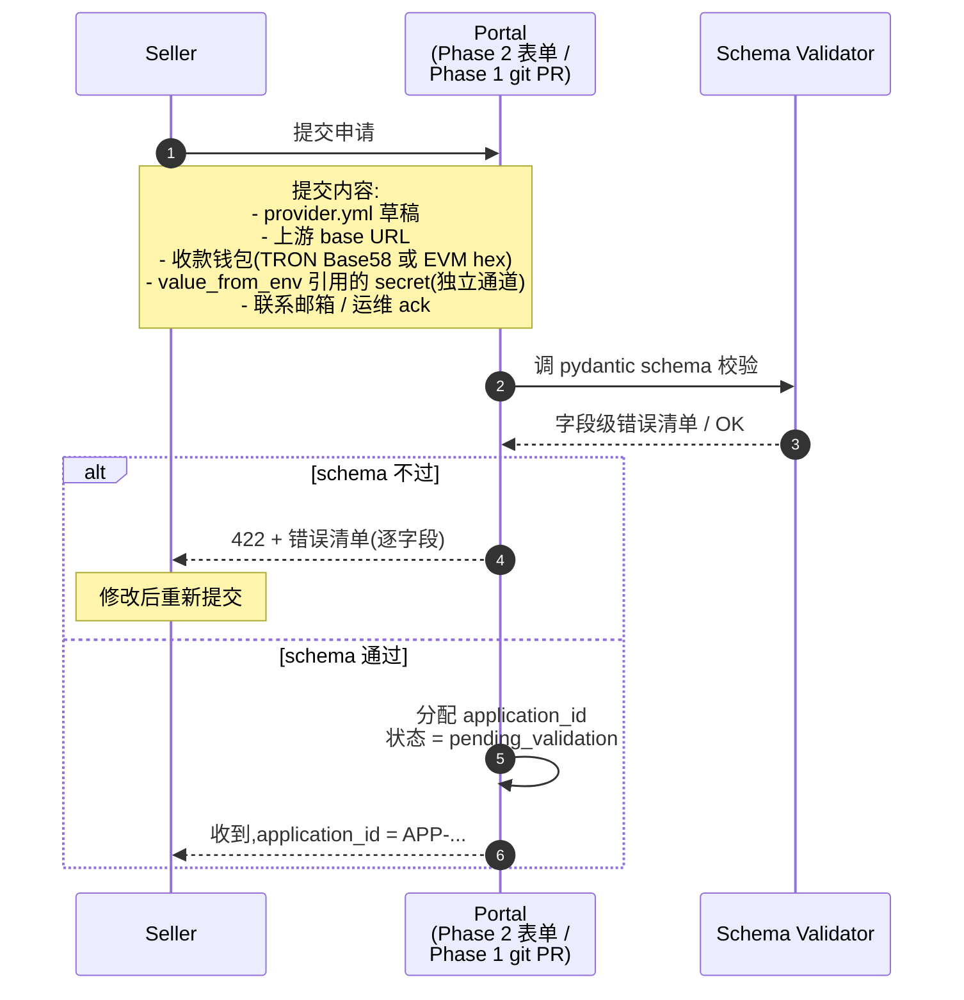

### 8.3 阶段二:自动 CI 校验(五层)

把校验拆成五段,**前四段任一失败立即终止**;第五段(catalog probe)依赖前面 sandbox 跑通才能执行。

校验段命名:**A 静态** → **B 上游** → **C Sandbox 联调** → **D Listing 静态** → **E Catalog Probe**

A-C 关于 `provider.yml`(gateway 配置),D-E 关于 `listing.md`(catalog 入口)。

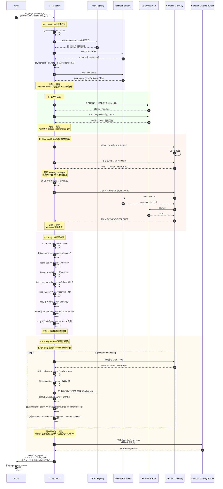

#### 8.3.1 五段校验对照表

| 段 | 输入 | 关键校验项 | 失败处理 |
|---|---|---|---|
| **A** provider.yml 静态 | provider.yml + token registry + facilitator /supported | schema 完整、字段交叉一致 | 拒,逐字段报错 |
| **B** 上游可达性 | provider.yml.routing + env secret | base URL 可达、token 鉴权通 | 拒,提示是 URL 错还是 token 错 |
| **C** Sandbox 联调 | provider.yml + testnet 钱包 | 完整 402 → 签名 → settle → forward 链路 | 拒,提示具体卡在哪一步 |
| **D** listing.md 静态 | listing.md + provider.yml | frontmatter 字段、双文件一致性、body 内容规范 | 拒,逐项报错 |
| **E** Catalog Probe | gateway 实际 402 + listing 声明 | **价格诚实**、asset/network 一致 | 拒,显示声明 vs 实际差异 |

#### 8.3.2 关键设计

- **C 复用给 E**:Sandbox 联调时记录的 `issued_challenge` 在 E 段直接复用,避免对网关多发请求
- **D 段安全扫描**:listing body 是给 agent 看的 markdown,平台扫描禁词(如 `ignore previous instructions`、`<script>`、敏感链接)
- **E 段失败比 ABC 都关键**:ABCD 通过但 E 失败 = seller 想骗钱,**触发安全 reviewer 上调**(不只是退回让 seller 改)
- **Probe 结果存档**:每个 application 的 probe 报告永久保留,作为合规审计材料

#### 8.3.3 与 Phase 1 实际工具的对应

| 段 | 实际命令(Phase 1) |
|---|---|
| A | `x402-gateway validate provider.yml` |
| B | (CI 脚本,curl 加 env) |
| C | `x402-gateway sandbox-deploy` + `x402-gateway smoke-test` |
| D | `x402-catalog check listing.md` |
| E | `x402-catalog probe listing.md --gateway https://sandbox-gw...` |

CI 流水线就是把这五条命令串起来,加上失败汇总成 validation_report。

**关键设计**:Sandbox 联调(C)用 **CI 持有的钱包真金白银**在 testnet 上跑通完整 §3.1 happy path —— 不是 mock,是真的测试网交易。这能 catch 掉 mock 测试漏掉的 facilitator/RPC 配置问题。Probe(E)再用同样的链路验证价格诚实,**两次价格信号源**(声明 vs 实测)对得上才放行。

### 8.4 阶段三:人工审核 + 钱包所有权证明

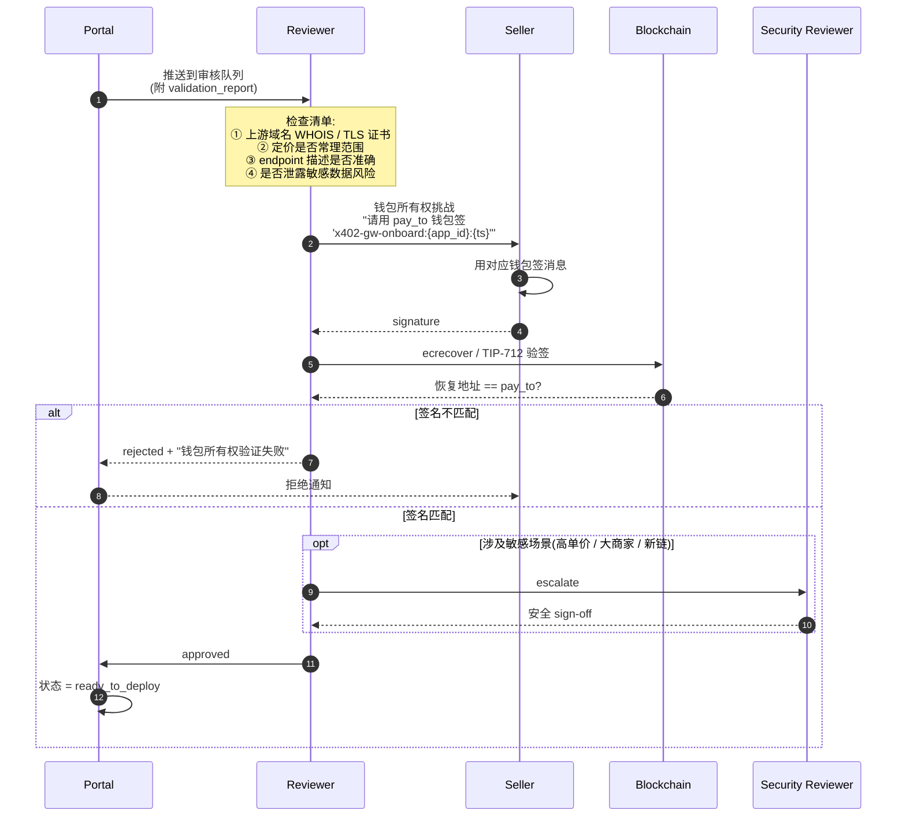

**为什么签消息要带 timestamp**:防止旧签名 replay。挑战字符串包含 `{ts}`,Portal 记录后只在 24h 内有效。

### 8.5 阶段四:上生产 + 流量路由

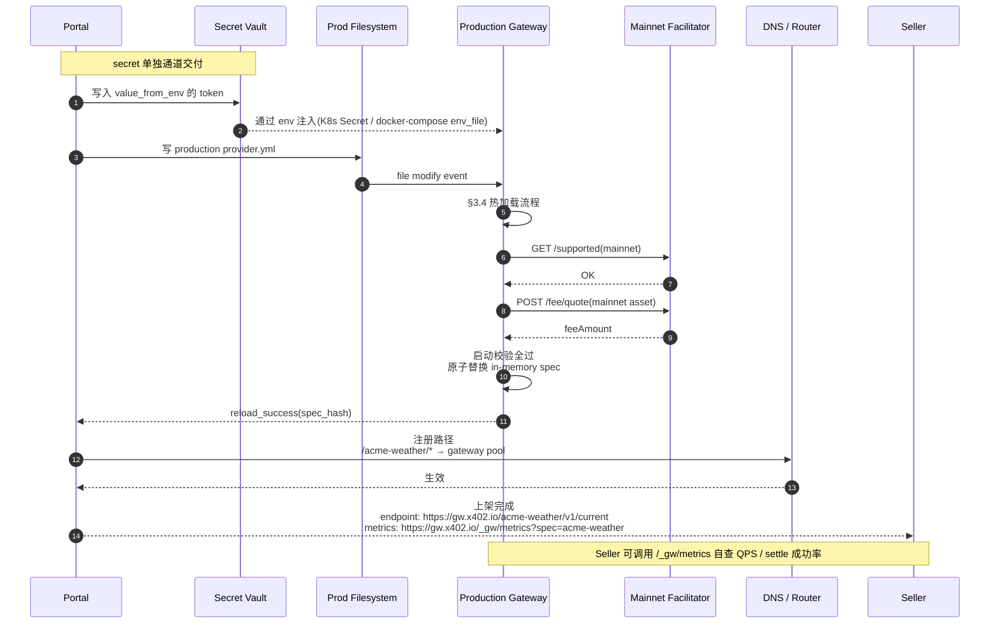

### 8.6 阶段五:Catalog 入库 + 发现接口发布

Gateway 上生产后,listing.md 同步入 catalog。这是 user 能搜到这个 API 的前提。

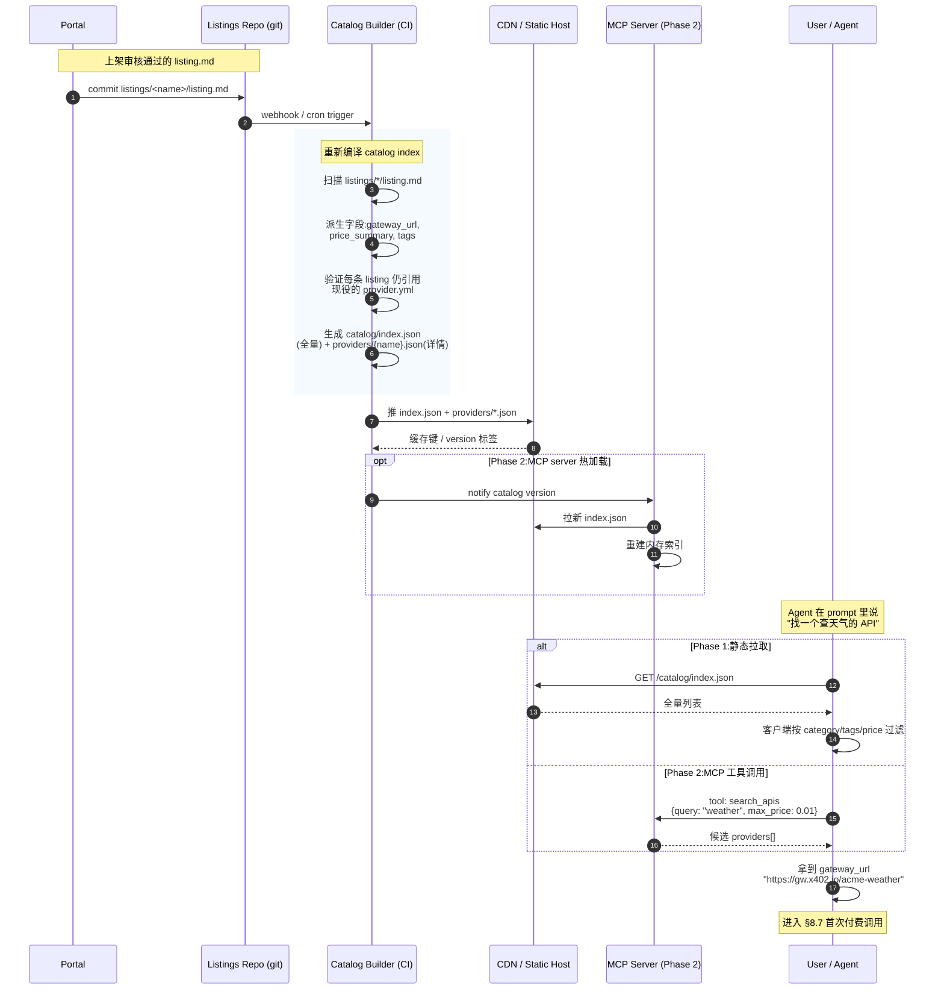

**关键设计点**:

- Catalog build 是**幂等的**,可随时重跑;每次产物用 git commit hash 标记
- 派生字段(gateway_url / price_summary)在 build 阶段计算,seller 不需要重复填
- **catalog 与 gateway 解耦的好处**:gateway 改 provider.yml 必须同步检查 listing 是否还指向有效配置(`provider.yml.name` 不变就 OK)
- **CDN 缓存策略**:`index.json` TTL 短(5 min);`providers/{name}.json` TTL 长(1 h),稳定后才会变

### 8.7 阶段六:User 首次完整付费调用

把 §3.1 的请求级时序放到上架后真实业务场景里。

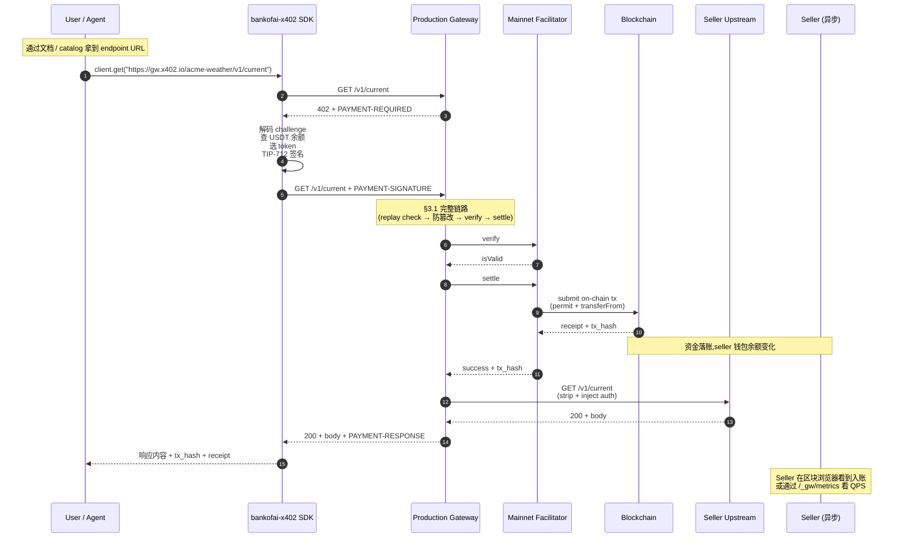

### 8.8 Phase 1 vs Phase 2 流程对照

| 阶段 | Phase 1(MVP) | Phase 2(自助) |
|---|---|---|
| 申请提交 | git PR 到 `specs/` 仓库 | 自助 Portal 表单 |
| A 段:provider.yml 静态校验 | CI 自动(GitHub Actions) | 同 |
| B 段:上游可达性 | 人工 / 半自动 | CI 自动 |
| C 段:Sandbox 联调 | 人工跑 e2e | CI 自动 |
| **D 段:listing.md 静态校验** | CI 自动 | 同 |
| **E 段:catalog probe(价格诚实)** | CI 自动 | 同 |
| 安全审核 | 人工 | 人工(不会自动) |
| 钱包所有权挑战 | 人工要求 | Portal 内自动流程 |
| 上生产 deploy | 运维 `kubectl apply` | Portal 一键 |
| DNS 路由 | 运维手动 | 自动 |
| **Catalog 入库 + index 发布** | CI 自动(`x402-catalog build` + 推 CDN) | 同 + 实时 MCP 推送 |
| 商家自查 | 看 metrics endpoint | Portal dashboard |

### 8.9 关键设计点

**钱包所有权挑战的安全性**:
- 挑战串包含 `application_id` 防跨申请 replay
- 包含 `timestamp` 防长期签名复用(24h 失效)
- 包含网关固定 prefix `"x402-gw-onboard:"` 防把签名拿去别处用
- 服务端记录已用 signature,防同一申请内重复提交

**Sandbox 联调用真钱**:
- 用 testnet(tron:nile / eip155:97)
- CI 钱包额度由平台预先充值,monitoring 防滥用
- 联调成功的 tx_hash 进入 application 记录,后续审计可查

**Catalog probe 是上架前最后一道闸**:
- 复用 C 段的 sandbox gateway,不需要再起额外服务
- 比对项:`challenge.amount` / `asset addr` / `network` 三个维度全等
- 不诚实直接拒绝并**升级到安全 reviewer**,不只是退回让 seller 改
- 上架后还会有周期性 re-probe(Phase 2),价格漂移自动下架

**Secret 不进 yaml**:
- provider.yml 入 git(可 diff 审计)
- secret 走独立通道:K8s Secret / SOPS / Vault
- `value_from_env: ACME_API_TOKEN` 在 yaml 里只是引用,运维侧另行注入

**可撤销 / 可重新上架**:
- 每个 spec 有 `enabled: bool` 字段(默认 true),停服只需置 false 不删除
- ledger / replay 记录永久保留(合规 + 调试)
- 同一 application_id 可多版本提交,Portal 保留全部历史

**自服务上线 SLA(Phase 2 目标)**:
- 阶段一 → 二:< 5 min(自动)
- 阶段二 → 三:< 2 h(人工审核 SLA)
- 阶段三 → 四:< 5 min(自动 + DNS 传播)
- 端到端:**单工作日上线**

### 8.10 卖家提交字段详解

把上架时卖家提交的所有内容、每个字段的来源 / 落点 / 用途列清楚。分三类:

- **A 类:进 provider.yml**(走 git / Portal,可 diff 审计)
- **B 类:走独立通道**(secret,不进 yaml,走 Vault / env)
- **C 类:Portal 元数据**(联系方式、所有权证明,审核用)

#### 8.9.1 提交清单速查

| # | 提交项 | 类别 | 必填 | 谁提供 | 形态 |
|---|---|---|---|---|---|
| 1 | 服务标识 `name` | A | 是 | 卖家命名 | 小写字母+数字+连字符 |
| 2 | 展示标题 `title` | A | 是 | 卖家 | 一句话 |
| 3 | 服务说明 `description` | A | 是 | 卖家 | 一段话,给 agent 看 |
| 4 | 分类 `category` | A | 是 | 卖家枚举选 | 枚举值 |
| 5 | 版本 `version` | A | 是 | 卖家 | 如 `v1` |
| 6 | 上游 URL `routing.url` | A | 是 | 卖家 | https:// 开头 |
| 7 | 上游鉴权方式 `routing.auth.method` + `key` + `prefix` | A | 视情况 | 卖家 | header / query |
| 8 | 上游鉴权 token | **B** | 视情况 | 卖家 | 走 env / Vault |
| 9 | 支付网络 `payment.network` | A | 是 | 卖家选 | `tron:mainnet` / `eip155:56` 等 |
| 10 | 支付 scheme | A | 是 | 卖家选 | `exact` / `exact_permit` / `exact_gasfree` |
| 11 | 收款资产 `payment.asset` | A | 是 | 卖家选 | `USDT` 等 |
| 12 | 收款钱包 `payment.pay_to` | A | 是 | 卖家 | 链上地址 |
| 13 | Facilitator URL | A | 是 | 平台默认 / 卖家覆盖 | https:// |
| 14 | 有效期 `validity_window_seconds` | A | 否 | 默认 300 | 30-3600 |
| 15 | 端点列表 `endpoints[]` | A | 是 | 卖家 | 数组 |
| 16 | 钱包所有权签名 | **C** | 是 | 卖家用 pay_to 钱包签 | 一次性挑战 |
| 17 | 联系邮箱 | C | 是 | 卖家 | 故障通知用 |
| 18 | 商家身份证明(B2B 可选) | C | 否 | 卖家 | 工商 / 个人证件 |

#### 8.9.2 A 类字段:进 provider.yml — 逐项详解

每段格式:**字段** → 卖家从哪拿 → 落在哪 → 谁用 → 校验 → 改动影响。

---

**`name`** — 服务标识符

- **来源**:卖家自命名,如 `acme-weather`
- **校验**:`^[a-z0-9][a-z0-9_-]*$`,长度 ≤ 64,平台内唯一
- **用在**:
  - **URL 路径前缀**:`https://gw.x402.io/acme-weather/*`(§8.5)
  - **Prometheus labels**:`{spec="acme-weather"}`(§6.4)
  - **trace event**:`spec_name` 字段(§6.2)
  - **application_id 关联键**
- **改动影响**:**不能改**(改了相当于换 spec,所有 URL 失效)。需要改时走"新上架 + 旧停服"。

---

**`title`** / **`description`**

- **来源**:卖家自写,description 建议 64-255 字符
- **用在**:
  - Phase 2 catalog 列表展示
  - Portal 审核页面
  - 故障通报邮件
- **不用在**:网关运行时(纯展示)
- **改动影响**:可随时改,热加载即生效

---

**`category`**

- **来源**:卖家从枚举选(`ai_ml` / `data` / `finance` / `search` / `maps` / `messaging` / `storage` / `translation` / `other`)
- **用在**:Phase 2 catalog 过滤分类
- **校验**:在白名单内
- **改动影响**:仅影响 catalog 显示

---

**`version`**

- **来源**:卖家自定,通常 `v1`
- **用在**:Portal 历史版本追踪;**不进 URL 路径**(URL 路径由 endpoint.path 决定)
- **改动影响**:仅文档展示

---

**`routing.url`** — 上游 base URL

- **来源**:卖家提供其真实 API 的 base URL,如 `https://internal.acme.example`
- **校验**:`http(s)://` 开头;Phase 2 强制 `https://`
- **用在**:
  - 网关转发请求时拼接 `{routing.url}{endpoint.path}`(§3.1 step 11)
  - 上架阶段二的可达性探测(§8.3)
  - trace event `upstream_url`
- **改动影响**:热加载生效;改 URL 不影响 endpoint 路由,只影响转发目标

---

**`routing.auth.method` / `key` / `prefix`**

- **来源**:卖家根据自己 API 的鉴权方式选
  - `method: header`,`key: Authorization`,`prefix: "Bearer "` 是最常见组合
  - `method: query_param`,`key: api_key` 也支持
- **用在**:
  - 网关在转发前,从 env 读 token,按 method+key+prefix 注入请求(§3.1 step 11)
- **校验**:`value_from_env` 必须是非空环境变量名(强制走 env,**不接受明文**)
- **改动影响**:改 method/key 立即生效;**改 value_from_env 必须确保新 env 已注入**,否则上游 401

---

**`payment.network`** — 支付网络

- **来源**:卖家选,根据其钱包所在链
- **校验**:正则 `tron:(mainnet|nile|shasta)` 或 `eip155:\d+`
- **用在**:
  - **校验 pay_to 格式**(TRON Base58 vs EVM hex)
  - **生成 PaymentRequired.accepts[].network**(§3.1 step 4)
  - **facilitator verify/settle 路由**(facilitator 按 network 选 mechanism)
  - **trace / metrics labels**
- **改动影响**:**重大变更**,等同换链。pay_to / asset 都要重新校验。建议走新上架。

---

**`payment.scheme`** — 支付方案

- **来源**:卖家选,看其代币和场景
  - `exact`:代币支持 ERC-3009(`transferWithAuthorization`)
  - `exact_permit`:代币支持 EIP-2612 `permit`(TRON USDT、BSC USDT 都是这种)
  - `exact_gasfree`:TRON 专属,客户没 TRX 时用
- **校验**:启动时拿 facilitator `/supported` 交叉验证,确认其支持该 scheme + network 组合
- **用在**:
  - PaymentRequired.accepts[].scheme
  - facilitator verify/settle 选 mechanism
  - SDK 客户端按 scheme 走不同签名路径
- **改动影响**:scheme 改动会让所有持旧 challenge 的 client 失败;建议在低峰期换

---

**`payment.asset`** — 收款资产符号

- **来源**:卖家选,如 `USDT` / `USDC` / `USDD`
- **校验**:
  - 必须能在 token registry(`bankofai.x402.tokens`)按 `(network, symbol)` 查到
  - 查询结果含 `address`(token 合约地址)和 `decimals`
- **用在**:
  - **价格折算**:`tiers[].price` 中的 amount 按 decimals 换成 smallest unit(§3.1 step 4)
  - **PaymentRequired.accepts[].asset**:wire 上传的是 address 不是 symbol
  - **fee/quote 调用**:网关启动时 cache 每个 asset 的 facilitator fee
- **改动影响**:换 asset 等于换计价单位,所有 endpoint 价格符号必须同步改

---

**`payment.pay_to`** — 收款钱包地址

- **来源**:**卖家持有私钥的钱包地址**(网关不持有私钥)
- **校验**:
  - 格式与 network 匹配(TRON Base58 / EVM hex)
  - **§8.4 钱包所有权挑战**:卖家必须用此钱包签 `"x402-gw-onboard:{app_id}:{ts}"`,网关 ecrecover 验证
- **用在**:
  - **PaymentRequired.accepts[].payTo**(challenge 直接告诉 client 钱进哪)
  - **链上 transferFrom 的 to 地址**(settle 时由 facilitator 提交)
  - **Phase 2 splits 的主收款人**
- **改动影响**:**敏感变更**。改 pay_to 需重新跑钱包所有权挑战。建议改成新 application。

---

**`payment.facilitator_url`**

- **来源**:平台默认值(`https://facilitator.bankofai.io`),卖家通常不改
- **校验**:可达性探测(GET `/supported` 返回 200)
- **用在**:
  - 网关启动时拉 `/supported`、`/fee/quote`(§3.5)
  - 每次请求调 `/verify`、`/settle`(§3.1)
- **改动影响**:换 facilitator 等于换信任根(§5.2 T10/T11),需重新做 §3.5 启动校验

---

**`payment.validity_window_seconds`**

- **来源**:卖家选,默认 300(5 分钟)
- **校验**:30 ≤ x ≤ 3600
- **用在**:生成 PaymentRequired 时 `validBefore = now + window`(§3.1 step 4)
- **改动影响**:
  - 窗口太短 → client 来不及签名/网络抖动就过期
  - 窗口太长 → 攻击窗口扩大;**注意**:GasFree scheme 还有自己的 [50, 600] 硬限,会被 clamp(参见 [solutions.md #2](../x402/docs/solutions.md))

---

**`endpoints[].method` + `path`** — 端点声明

- **来源**:卖家根据其 API 路径列出
- **校验**:
  - method 是 GET/POST/PUT/PATCH/DELETE 之一
  - path 以 `/` 开头
  - `(method, path)` 在 spec 内唯一
  - 不能以 `/_gw/` 开头(§7.4 保留前缀)
- **用在**:
  - **路由匹配**:网关按 `(method, path)` 精确匹配(§3.1 step 1)
  - **Allowlist**:未声明的 method+path 即使上游存在也返回 404(§3.2 `route_not_found`)
  - **trace event** `endpoint` 字段
- **改动影响**:加 endpoint 安全;删 endpoint 会让该路径瞬间不可访问(在飞请求不影响,新请求 404)

---

**`endpoints[].description`**

- **来源**:卖家写,给 agent 看
- **用在**:Phase 2 catalog;**网关运行时不用**
- **改动影响**:无运行时影响

---

**`endpoints[].metering`**(可选,缺省 = 免费)

- **来源**:卖家定价
- **用在**:
  - 决定该端点是否需要支付(§3.1 step 2)
  - 构造 challenge 时按 tiers 取价(Phase 1 用第一档)
- **改动影响**:动态生效;在飞请求已用旧价 challenge,新请求用新价

---

**`endpoints[].metering.dimensions[].unit`**

- **来源**:Phase 1 锁死 `requests`(每请求计价)
- **Phase 2 扩展**:`tokens` / `bytes` / `seconds`(需要上游响应配合上报用量)

---

**`endpoints[].metering.dimensions[].tiers[].price`**

- **来源**:卖家写,格式 `"<amount> <SYMBOL>"`,如 `"0.002 USDT"`
- **校验**:
  - 正则匹配
  - amount > 0
  - **SYMBOL 必须等于 `payment.asset`**(Phase 1 不支持单 spec 多币种)
- **用在**:
  - **challenge.amount**(按 decimals 转 smallest unit)
  - 卖家 metrics(GMV 累加)
  - Portal 审核时看价格合理性
- **改动影响**:动态生效

---

**`endpoints[].metering.dimensions[].tiers[].up_to`**

- **来源**:阶梯定价场景才用;最后一档省略表示开放档
- **校验**:严格递增,只允许最后一档为开放
- **用在**:**Phase 2** 计算量超阶梯换价(Phase 1 永远用第一档)
- **改动影响**:Phase 1 无影响;Phase 2 改阶梯会影响累计用量统计

---

#### 8.9.3 B 类:走独立通道的 Secret

**`value_from_env` 引用的实际 token 值**

- **来源**:卖家通过**安全通道**(SOPS 加密 / Vault / 直接给运维)交付
- **绝不进**:provider.yml、git、portal 表单明文字段、日志
- **运维如何注入**:
  - Docker Compose:`.env` 文件 + `env_file:` 指令
  - K8s:`kind: Secret` + `valueFrom.secretKeyRef`
- **改动**:仅运维操作,网关进程 reload 或重启时读新值

---

#### 8.9.4 C 类:Portal 元数据(不进 yaml,审核用)

| 项 | 用途 | 谁用 |
|---|---|---|
| **联系邮箱** | 上架失败 / 故障 / 安全事件通知 | 平台 ops |
| **钱包所有权签名** | §8.4 验证 pay_to 真为卖家持有 | Portal 一次性校验 |
| **业务说明 / 工商资料** | B2B 高单价场景可选,法律合规 | 法务 / 安全 reviewer |
| **退款 / 争议联系方式** | x402 协议无退款,故障时商家自处理 | 客户找商家时用 |

#### 8.9.5 字段去向"一图流"

哪个字段进 wire format,哪个仅本地:

```
                   ┌─────────────────────────────────────────────────┐
                   │              provider.yml                          │
                   └─────────────────────────────────────────────────┘
                                          │
                ┌─────────────────────────┼─────────────────────────┐
                │                         │                         │
                ▼                         ▼                         ▼
       ┌─────────────────┐      ┌─────────────────┐      ┌─────────────────┐
       │  网关本地状态     │      │  PaymentRequired │      │  Upstream       │
       │  (不出进程)      │      │  challenge wire  │      │  request        │
       ├─────────────────┤      ├─────────────────┤      ├─────────────────┤
       │ name            │      │ scheme          │      │ routing.url     │
       │ title           │      │ network         │      │ + endpoint.path │
       │ description     │      │ asset (addr)    │      │ + injected auth │
       │ category        │      │ amount (smallest│      │   (from env)    │
       │ version         │      │   unit)         │      │                 │
       │ routing.*       │      │ payTo           │      │                 │
       │ payment.fac_url │      │ paymentId       │      │                 │
       │ validity_window │      │ nonce           │      │                 │
       │ endpoints[*]    │      │ validAfter      │      │                 │
       │   .description  │      │ validBefore     │      │                 │
       │   .metering(规则) │      │ extra.fee       │      │                 │
       └─────────────────┘      └─────────────────┘      └─────────────────┘
                │                         │                         │
                ▼                         ▼                         ▼
        日志 / metrics              发给 client               发给 seller API
        (description, title         (client SDK 解码,         (seller 永远看不到
         不出现在 wire 上)          签名时用)                 payment 相关字段,
                                                              已被 STRIP)
```

#### 8.9.6 卖家提交前自检清单

- [ ] `name` 全平台唯一,小写
- [ ] `routing.url` 浏览器能打开(或运维代你测)
- [ ] 上游 token 已通过安全通道交付,知道 env 变量名
- [ ] `payment.pay_to` 钱包**私钥在你手上**(等下要签消息)
- [ ] `payment.asset` 真的在 token registry 里(平台会列支持清单)
- [ ] 每个 metered endpoint 价格 ≥ facilitator fee(否则净收入为负)
- [ ] endpoints 列全了(漏了的会 404,不会自动通)
- [ ] 联系邮箱可达

---

## 10. Catalog / API 售卖模块设计

> 这是本项目除 gateway 之外的**第二个核心目标**:把 API 做成可被发现、可被 agent 自助调用的"商品"。对标 pay.sh 的 `pay catalog` + `pay skills` 两个子系统(§1.6)。

### 9.1 定位与目标

**Gateway 让 API 能被收钱,Catalog 让 API 能被找到**。

| 角色 | 没有 catalog 时 | 有 catalog 后 |
|---|---|---|
| Seller | 上架后只能自己发 URL 招客 | 自动挂上目录,曝光给所有 agent |
| Buyer / Agent | 必须知道确切 URL 才能调 | 用关键词搜索发现合适的 API |
| 平台 | 只是收钱通道 | 形成两侧网络效应,粘性增强 |

**核心目标**:复刻 pay.sh 的两侧市场体验,基于我们 TRON+BSC 的 x402 协议栈,做成中文 / 多语言的 API marketplace。

**非目标**:
- ❌ 不做支付撮合(每笔交易仍是 buyer ↔ seller 直付,catalog 只导流)
- ❌ 不做 API 质量评分(Phase 3 才考虑;评分需要长期数据)
- ❌ 不做托管 / 仓储(catalog 只索引元数据,不缓存 API 响应)

### 9.2 数据模型:listing.md(对标 PAY.md)

每个上架 API 一个 `listing.md`,frontmatter + body 双层结构。这是 catalog 的**真相源**。

> **命名约定**:文件名永远是 `listing.md`(不是 `<name>.md`)—— FQN 来自所在目录路径,不来自文件名。详见 §9.2.2 FQN 约定。pay.sh 同时兼容 `<name>.md` legacy 写法,我们 day-1 只支持 `listing.md`,避免歧义。

#### 9.2.1 完整 frontmatter schema

下面是 pydantic 视角的 schema,带字段类型、必填标记、长度约束和 catalog check 实际校验项:

```yaml
---
# ─────────────────────────────────────────────────────────────
# 1. 标识(必须与 provider.yml 一致,catalog 不重复定义)
# ─────────────────────────────────────────────────────────────
name: acme-weather              # str, required, ^[a-z0-9][a-z0-9-]{1,40}[a-z0-9]$
title: "Acme Weather API"       # str, required, 5-80 字符
description: "..."              # str, required, 32-255 字符,一句话
category: data                  # enum, required, 见 §9.2.3 白名单
version: v1                     # str, optional, 默认 v1

# ─────────────────────────────────────────────────────────────
# 2. 卖家展示信息(catalog 专用,provider.yml 不含)
# ─────────────────────────────────────────────────────────────
operator:
  display_name: "Acme Inc."     # str, required, 2-80,可中文
  homepage: https://acme.example         # https URL, required
  support_email: ops@acme.example        # email, required
  status_page: https://status.acme.example  # https URL, optional
  blog_or_changelog: https://acme.example/blog  # https URL, optional

# ─────────────────────────────────────────────────────────────
# 3. Discovery 文案(给 agent 看的指引)
# ─────────────────────────────────────────────────────────────
use_case: "Use for ..."         # str, required, 32-512,推荐 "Use for..." / "Use when..." 开头
when_to_use: |                  # str (multi-line markdown), optional, ≤ 1000
  - User asks about ...
when_not_to_use: |              # str (multi-line markdown), optional, ≤ 1000
  - Climate research or ...

# ─────────────────────────────────────────────────────────────
# 4. 入口与 endpoint 索引
# ─────────────────────────────────────────────────────────────
service_url: https://gw.bankofai.io/acme-weather   # str, required, https
                                # 网关 URL,agent / probe 实际打这里
                                # 同 provider.yml.public_url(详见 §9.3 派生规则)
openapi:                        # 可选,二选一(详见 §9.4.7 OpenAPI 解析)
  url: https://acme.example/openapi.json    # 远程 OpenAPI
  # 或:
  # path: ./openapi.json        # 本地 sidecar(相对 listing.md 目录)

# ─────────────────────────────────────────────────────────────
# 5. 价格摘要(catalog build 自动派生,seller 不写,probe 阶段重写)
# ─────────────────────────────────────────────────────────────
# price_summary:                # 不要手填!build 会从 live 402 challenge 抽取覆盖
#   asset: USDT
#   network: tron:mainnet
#   range: "0.002 - 0.5 USDT per request"

# ─────────────────────────────────────────────────────────────
# 6. 搜索 / 排序 hints
# ─────────────────────────────────────────────────────────────
tags: [weather, geolocation, real-time]    # list[str], optional, 每个 2-30 字符,≤ 8 个
languages: [en, zh]              # ISO 639-1 codes, optional, 标注 catalog body 提供的语种
---

## Spend-aware usage(给 agent 的省钱建议,§9.4.2 静态检查必有)

- 优先用具体城市名查询,避免广域搜索。
- 多次相同位置的查询应缓存。
- 单次响应 cap 在 100 cities 内。

## Confirmation required cases(高单价场景,可选 section)

- `POST /v1/historical/bulk`(0.5 USDT):agent 应先和用户确认再调用。

## Request examples

\```http
GET /v1/current?city=Shanghai
\```

## Response examples

\```json
{ "temp_c": 18, "humidity": 65, "updated_at": "..." }
\```

## Support & contact

- Status page: https://status.acme.example
- Email: ops@acme.example
```

**关键的不变量**:

1. **`service_url` 是 catalog 的 single source of probe**:catalog probe 会真的去 GET 这个 URL + 每个 endpoint path,看返回的 402 challenge —— 必须是网关地址(对外 HTTPS),**不是上游真实 API 地址**。
2. **`price_summary` 不让 seller 手填**:catalog build 阶段从 live 402 challenge 抽出 pricing / protocol / accepted currency,覆盖任何 frontmatter 里写的值。Seller 想造假也造不进 index。
3. **`endpoints[]` 不在 listing.md 出现**:endpoint 全集要么来自 `openapi.url`(catalog 抓远端 / 读本地解析),要么来自 catalog build 阶段对 service_url 的实测探测。Listing.md 自身不重复列 endpoint —— 避免 listing 和 provider.yml 漂移。
4. **`name` 必须 == provider.yml.name**:catalog check 阶段强制比对,否则拒绝。

#### 9.2.2 FQN 约定与目录结构

借鉴 pay.sh `cli/src/commands/catalog/mod.rs:36-90`,**listing 文件的"全限定名"完全来自磁盘路径**,不来自 frontmatter `name:` 字段。这让一个组织能在 catalog repo 下管理多版本 / 多产品线而不冲突。

合法路径(任一即可):

| 路径 | FQN | operator | name | 适用场景 |
|---|---|---|---|---|
| `providers/<name>/listing.md` | `<name>` | `<name>` | `<name>` | 单产品组织(operator == product)|
| `providers/<op>/<name>/listing.md` | `<op>/<name>` | `<op>` | `<name>` | **典型**:一个组织多产品 |
| `providers/<op>/<origin>/<name>/listing.md` | `<op>/<origin>/<name>` | `<op>` | `<name>` | 三段:Phase 2 的 affiliate / aggregator 用 |

**实例**:

```
x402-skills/
└── providers/
    ├── sunio/
    │   ├── perp-swap/
    │   │   ├── listing.md          # FQN = "sunio/perp-swap"
    │   │   └── openapi.json        # 可选 sidecar
    │   ├── spot-swap/
    │   │   └── listing.md          # FQN = "sunio/spot-swap"
    │   └── v2/
    │       └── perp-swap/
    │           └── listing.md      # FQN = "sunio/v2/perp-swap"(三段)
    ├── crushrewards/
    │   └── listing.md              # FQN = "crushrewards"
    └── bofai/
        └── (代搬运的 alibaba/google 系列, §9.11 seeding)
```

**FQN 派生算法**(catalog 内部):

```python
def derive_fqn(path: Path, repo_root: Path) -> tuple[str, str, str]:
    """
    Returns (fqn, operator, name).
    例:providers/sunio/v2/perp-swap/listing.md
       → ("sunio/v2/perp-swap", "sunio", "perp-swap")
    """
    rel = path.relative_to(repo_root / "providers")
    segments = list(rel.parent.parts)        # ["sunio", "v2", "perp-swap"]
    if not segments:
        raise ValueError("listing.md 必须在 providers/<name>/ 目录下")
    fqn = "/".join(segments)
    operator = segments[0]
    name = segments[-1]
    return fqn, operator, name
```

**为什么 FQN 来自路径,不来自 frontmatter `name:`**:
- Git diff 直接告诉我们"哪个 FQN 改了"(看 `providers/**` 下的目录变化),不需要再读文件 frontmatter
- 一个 PR 想 rename 一个 provider,只需 `git mv providers/sunio/swap providers/sunio/dex-swap` —— frontmatter `name:` 由 catalog check 强制和 leaf 段一致
- 避免"同名 listing 落在不同 operator 目录"的歧义

**Catalog check 强制约束**:
- `frontmatter.name` 必须 == FQN 的 leaf 段(`name` 字段 == 目录最后一段)
- 一个 PR 不能同时改两个 FQN(简化 reviewer 工作量,可配置)
- `providers/<name>/listing.md`(legacy 单段)Phase 1 允许,Phase 2 强制改 `providers/<op>/<name>/`

#### 9.2.3 Category 白名单(18 项)

直接照搬 pay.sh `cli/src/commands/catalog/scaffold.rs:240` 的枚举,Phase 1 不增不减:

| Category | 典型 API |
|---|---|
| `ai_ml` | LLM 推理、embedding、向量检索、生图、TTS、ASR |
| `cloud` | 云对象存储、CDN、容器、serverless 调用 |
| `compute` | 通用算力、批处理、GPU/CPU 租用 |
| `data` | 数据库 / 分析 / BI / web scraping / 金融行情 |
| `devtools` | CI 工具、代码搜索、SAST、依赖解析 |
| `finance` | 链上数据、支付、税务、汇率、合规 |
| `identity` | 身份验证、KYC、OAuth、phone verification |
| `maps` | 地图、地理编码、路径规划、POI 检索 |
| `media` | 视频转码、图像处理、字幕、媒资 |
| `messaging` | 短信、邮件、推送、IM bridge |
| `other` | 其他(reviewer 收到 PR 必要求改成更具体的)|
| `productivity` | 文档协作、日程、笔记、OCR |
| `search` | 网页搜索、垂类搜索、向量检索 |
| `security` | 威胁情报、漏扫、WAF、bot detection |
| `shopping` | 商品检索、价格比较、库存、订单 |
| `storage` | KV / blob 存储、CDN 边缘 KV、IPFS pin |
| `translation` | 文本翻译、本地化、glossary |

**为什么 18 项不能动**:
- 太多 → 长尾 category 没人逛,seller 也分不清该选哪个
- 太少 → 把 18 个搜索意图压到 5 个 bucket,UX 退化为"翻 100 个 listing 找一个"
- Phase 3 加 sub-category(`ai_ml/embedding` / `ai_ml/asr` 这种二级)可以,但不动顶层

#### 9.2.4 listing.md body 必填章节

`catalog check` 静态扫描时,**必有的二级标题**:

| Section | 必填 | 用途 |
|---|---|---|
| `## Spend-aware usage` | 是 | 教 agent 怎么少花钱(对应 pay.sh PAY.md 同名 section)|
| `## Request examples` | 是 | ≥ 1 个可复制粘贴的示例(http / curl / SDK 任一)|
| `## Response examples` | 是 | ≥ 1 个返回 sample,帮助 agent 解析 |
| `## Confirmation required cases` | 可选 | 单笔 ≥ 0.1 USDT 的端点应列出 |
| `## Rate limits & reliability` | 可选 | 上游 SLA、网关侧限速 |
| `## Support & contact` | 是 | 至少一个邮箱 / status page |

**Catalog check 失败例子**:

```
✗ providers/sunio/perp-swap/listing.md
  - 缺少必填 section: "## Request examples"
  - frontmatter.description 长度 18 < 32
  - frontmatter.tags 含非法字符: "高频交易/perp"(slash)
```

### 9.3 listing.md 字段与 provider.yml 的关系

三类字段:

| 字段 | 仅 provider.yml | 仅 listing.md | 两边都有(必须一致) |
|---|---|---|---|
| `name` | | | ✓ |
| `title` | | | ✓ |
| `description` | | | ✓ |
| `category` | | | ✓ |
| `version` | | | ✓ |
| `routing.url` | ✓(上游,client 不该看) | | |
| `routing.auth.*` | ✓ | | |
| `payment.facilitator_url` | ✓ | | |
| `payment.network` / `scheme` / `asset` / `pay_to` | ✓(原始) | | |
| `endpoints[].method` / `path` / `description` | ✓(原始) | | |
| `endpoints[].metering.*` | ✓(原始) | | |
| `operator.*`(展示名、邮箱、status_page) | | ✓ | |
| `use_case` / `when_to_use` / `when_not_to_use` | | ✓ | |
| `gateway_url`(网关 URL) | | ✓(自动派生) | |
| `openapi_url` | | ✓ | |
| `price_summary`(展示用价格区间) | | ✓(自动派生) | |
| Spend-aware usage / examples(body) | | ✓ | |

**派生规则**:
- `gateway_url = "https://gw.x402.io/" + provider.yml.name`
- `price_summary.asset = provider.yml.payment.asset`
- `price_summary.range = min/max(provider.yml.endpoints[*].metering.tiers[*].price)`

派生字段不需要 seller 重复填,`catalog build` 自动生成。

### 9.4 工具链(对标 pay.sh `pay catalog` 命令族)

```
x402-catalog scaffold <fqn> <openapi_url>             # 拉 OpenAPI,生成带 TODO 的 listing.md 骨架
x402-catalog check <path|.>                           # 静态 + probe + verdict,只读不写盘
x402-catalog build <path>                             # check + 写 dist/skills.json + dist/providers/<fqn>.json
x402-catalog probe <path>                             # 仅 probe(check / build 的内部步骤,可单独跑)
x402-catalog verdict <path>                           # 仅 verdict(check / build 的内部步骤,可单独跑)
```

**重要的整体设计选择**(对齐 pay.sh `cli/src/commands/catalog/mod.rs:11-23` 实测):

- **`check` 是主入口**,绝大部分场景(本地自查 / PR CI)都跑它;它内部串起 static validate → probe → verdict 三步
- **`build` 是 `check` + 写盘**,只在 main 分支 publish 时跑(详见 §10.bis)
- **`probe` / `verdict` 单独存在**只是为了 debugging,日常不直接调用

#### 9.4.1 `scaffold`:从 OpenAPI 生成 listing.md 骨架

**签名**:`x402-catalog scaffold <fqn> <openapi_url> [--output-dir DIR] [--force]`

对齐 pay.sh `cli/src/commands/catalog/scaffold.rs:44-120` 精确语义:

1. **拉 OpenAPI 文档**(JSON 或 YAML,timeout 30s)
2. 从 `info.title` 派生 `frontmatter.title`(若空则用 FQN leaf)
3. 从 `info.description` 派生 `frontmatter.description`(取第一句,truncate 到 ≤ 255 字符)
4. 从 `servers[0].url` 派生 `frontmatter.service_url`;若是相对路径或缺失,从 openapi_url 反推(strip `/openapi.json` 后缀,fallback 到 host)
5. **强制 TODO placeholder**(seller 必须改才能过 check):
   - `use_case: TODO  # describe when an agent should pick <fqn> over alternatives`
   - `category: TODO  # one of: ai_ml, cloud, ..., translation`
6. 输出固定为 `<output-dir>/<fqn>/listing.md`(目录不存在自动 mkdir)
7. 不写时不接触链上 / 不调网关 / 不写其他文件 —— **纯只读 + 单文件写**

**为什么 scaffold 不交互式**:对齐 pay.sh —— 交互式向导用 5 分钟,文本编辑器改 5 个 TODO 用 30 秒。Seller 通常已经知道自己 API 是什么,引导式问答反而拖慢节奏。

#### 9.4.2 `check`:核心校验流水线

**签名**(对齐 pay.sh `cli/src/commands/catalog/check.rs:43-109`):

```
x402-catalog check <path>
  [--no-probe]                  # 跳过 live probe,只跑 static
  [--probe-timeout SECS]        # 单 endpoint 探测超时,默认 10
  [--probe-concurrency N]       # 并发探测数,默认 5
  [--currencies USDT,USDC]      # 接受的稳定币 allowlist
  [--strict]                    # verdict 阶段:非 TRON/BSC 端点视为 error(默认 warn)
  [--format table|json|github]  # 输出格式
  [--verbose|-v]                # 打印每个 endpoint 的明细
  [--summary-out PATH]          # 同时写 GitHub-flavored markdown 到磁盘
  [--files PATH...]             # CI 模式:显式列要 check 的 listing.md
  [--changed-from REF]          # 本地模式:用 git diff <REF>..HEAD 推算改动
```

**四种模式**(按 `<path>` 类型和 flag 自动分派):

| 模式 | 触发 | 用途 |
|---|---|---|
| **single-file** | `<path>` 指向 `.md` 文件 | 本地 seller 自查 |
| **explicit files** | `<dir>` + `--files <p1> <p2>` | **CI 主路径**:容器外 git diff 后传一组路径 |
| **changed-from** | `<dir>` + `--changed-from main` | 本地 git diff 速查;需 host 上有 git |
| **full registry** | `<dir>`,无其他参数 | 全量 sanity(配 `--no-probe` 当 lint 用)|

**三段流水线**:

```
1. static validate
   ├─ parse frontmatter (yaml)
   ├─ pydantic 类型 / 长度 / enum 校验
   ├─ FQN 派生 + 检查 frontmatter.name == leaf
   ├─ body 必填 section 检测(§9.2.4)
   └─ 内部解析 openapi: 块(若有,解出 endpoint list)

2. live probe(可被 --no-probe 关掉)
   ├─ 对每个 endpoint 真发 HTTPS → service_url + path
   ├─ 收 HTTP status / headers / body
   ├─ 分类成 ProbeStatus 之一(§9.4.6)
   └─ 抽取真实 pricing / asset / network

3. verdict
   ├─ 统计:每个 provider 有多少 endpoint 在 TRON/BSC × USDT/USDC
   ├─ 输出 EndpointVerdict:Ok / NotChainCompat / Error / Free
   └─ 当一个 provider 0 个 chain-compat 端点 → block: true(merge 拒绝)
```

**输出格式 `--format` 三选**(对齐 pay.sh `verdict.rs:316-378`):

- **`table`**(默认):彩色终端表,每个 provider 一段,每个 endpoint 一行
- **`json`**:整份 `ValidationReport` 结构化输出,机器读
- **`github`**:发到 stdout 的 GitHub Actions workflow command —— `::warning file=...,title=...::msg` / `::error file=...::msg` / `::notice title=...::summary`,PR 内联红黄注释自动渲染

**`--summary-out` 用法**:

```bash
trap '[ -s verdict.md ] && cat verdict.md >> "$GITHUB_STEP_SUMMARY"' EXIT
x402-catalog check . --files $CHANGED --format github --summary-out verdict.md
```

一次 probe 同时产出 (a) stdout 的 inline 注释和 (b) PR Step Summary 的大表 —— 不需要 re-probe 两次。

**Static check 失败的精确清单**:

| 检查 | 错误码 | 失败例 |
|---|---|---|
| YAML parse | `frontmatter_parse_error` | 缩进错 / 引号不闭合 |
| 必填字段缺失 | `field_missing` | 没 `category` |
| 字段类型错 | `field_type` | `tags: "weather"`(应为 list)|
| 长度越界 | `field_length` | `description` 21 字 < 32 |
| 枚举非法 | `field_enum` | `category: blockchain`(不在 18 项)|
| FQN 不一致 | `fqn_mismatch` | 目录 `sunio/perp-swap/` 但 frontmatter.name=`spot` |
| Body 缺 section | `body_section_missing` | 没 `## Spend-aware usage` |
| TODO 残留 | `unresolved_todo` | `category: TODO` |
| service_url 非 HTTPS | `non_https_url` | `http://...` |

#### 9.4.3 `probe`:实测价格 / 协议 / 链 一致性

> **正常用户不直接跑这个命令**;`check` / `build` 自动调用。单独存在是为了 debugging。

**对每个 endpoint 的探测协议**(对齐 pay.sh `core/src/skills/probe.rs`):

```
1. 构造 HTTP request
   - method 从 endpoint 来,path 从 service_url + endpoint.path 拼
   - body:若 POST/PUT/PATCH,用 OpenAPI 派生的 example body(§9.4.7)
   - 不带任何 PAYMENT-SIGNATURE 头(目的就是触发 402)
   - timeout = probe_timeout(默认 10s,可调到 15s)

2. 分类响应到 ProbeStatus(§9.4.6)
   - 2xx → Free(免费端点,catalog 仍收录,verdict 不计入 chain-compat)
   - 402 + 合法 PAYMENT-REQUIRED 头 → Ok(抽出 pricing / network / asset)
   - 402 但 challenge 解不出 → UnknownProtocol
   - 402 但 network 不在 [tron:*, eip155:*] → WrongChain
   - 402 但 asset 不在 --currencies allowlist → WrongCurrency
   - 其他 (4xx 非 402 / 5xx / timeout / DNS) → NotPaywalled or Error

3. 抽取真相字段写进 ProbeReport
   - protocols: ["x402"]
   - currency: "USDT"
   - network: "tron:mainnet"
   - asset_address: "T..."
   - amount: "2000"  (raw smallest unit)
   - amount_display: "0.002 USDT"
```

**为什么"live probe + 把它当 source of truth"是关键**:
- 防 seller 在 listing.md 写假价格(声明 0.001 USDT,实际网关返 0.5 USDT)—— 我们**不让 seller 写**,build 阶段直接从 live challenge 抽
- 防 seller 改了 provider.yml 但没改 listing.md —— 因为我们根本不存 listing 上的价格,无需对账
- 一次 probe 跑完拿到 (pricing × network × asset × supported_currencies) 一致的快照,catalog 入库的是这个快照

**并发与超时**:`--probe-concurrency 5` 是默认值,既不会把对方网关并发打爆,又能让 100-endpoint 的 provider 在 ~2-3 分钟跑完 probe。`--probe-timeout 15` 是经验值(单笔 RPC 慢的供应商最长见到 8-10s)。

#### 9.4.4 `build`:编译 catalog dist/

**签名**:

```
x402-catalog build <path>
  [--base-url URL]                 # CDN base,默认 https://catalog.bankofai.io/v1
  [--output DIR]                   # 默认 <path>/dist
  [--no-probe]                     # 跳 live probe(罕用,只有 catalog 离线快照)
  [--probe-timeout SECS]
  [--probe-concurrency N]
  [--only FQN1,FQN2,...]           # 增量模式:只重 build 指定的 FQN
  [--previous-dist DIR]            # 增量模式:其他 FQN 从这里 verbatim 复制
```

**产物**:

```
dist/
├── skills.json                    # 总 index,一份
└── providers/
    ├── sunio/perp-swap.json      # FQN 转 path,deep listing
    ├── sunio/spot-swap.json
    └── crushrewards.json
```

`dist/skills.json` 大致 shape(详细见 §9.4.6):

```json
{
  "schema_version": "2",
  "generated_at": "2026-05-16T08:30:00Z",
  "provider_count": 23,
  "providers": [
    {
      "fqn": "sunio/perp-swap",
      "title": "Sun.io Perp Swap",
      "category": "finance",
      "description": "...",
      "use_case": "Use for ...",
      "service_url": "https://gw.bankofai.io/sunio/perp-swap",
      "detail_url": "https://catalog.bankofai.io/v1/providers/sunio/perp-swap.json",
      "tags": ["dex", "tron", "perpetual"],
      "price_summary": { ... },     # 见 §9.4.6
      "endpoint_count": 4,
      "metered_endpoint_count": 3,
      "languages": ["en", "zh"]
    },
    ...
  ]
}
```

`dist/providers/<fqn>.json` 包含 listing.md 的完整渲染:frontmatter 全集 + body 各 section 解析后的 markdown + 每个 endpoint 的 probe 真相(method / path / pricing / probe_status)。

**`--only` + `--previous-dist` 增量模式**(对齐 pay.sh `cli/src/commands/catalog/build.rs:42-50`):

```bash
# CI 实际命令:只重做改动的 provider,其他从上次 build 复制
x402-catalog build . \
  --only sunio/perp-swap,crushrewards \
  --previous-dist /tmp/prev-dist \
  --base-url https://catalog.bankofai.io/v1
```

- `--only` 内列出的 FQN:走全套 static + probe + render → 写 dist
- 其他 FQN:**从 `--previous-dist/providers/<fqn>.json` 直接拷贝**,只更新 skills.json 索引里的 `generated_at`
- 没 `--previous-dist` 或 `--only` 不传:full rebuild

**为什么这个增量模式必须有**:catalog 增长到 100+ providers 时,full rebuild = 100 × 5 endpoints × probe = 500 次 HTTPS 探测;15s timeout × 5 并发 = 25 分钟。增量模式典型 1 个 PR 改 1 个 provider,**3-5 秒搞定**,且能避免一个不相关 provider 临时挂掉把整次发布弄红。

#### 9.4.5 `verdict`:TRON/BSC compatibility 判定

> 独立命令存在的意义:reviewer 想看"这个 PR 加的 5 个 provider 有 3 个不接 USDT,我应该怎么 review"。

**签名**:`x402-catalog verdict <probe-report-json>`(读 `probe` 子命令产出的 JSON,生成 verdict 表)

**判定逻辑**(对应 pay.sh `cli/src/commands/catalog/verdict.rs:88-176`):

```python
def verdict_for_endpoint(probe: EndpointProbeResult) -> EndpointVerdict:
    s = probe.probe_status
    if s == "Ok":
        if probe.network.startswith(("tron:", "eip155:")) and \
           probe.currency in {"USDT", "USDC"}:
            return EndpointVerdict.Ok
        elif probe.network in {"solana:mainnet", "ethereum:mainnet"}:
            return EndpointVerdict.NotChainCompat   # 链不对(常见:Solana / 以太主网)
        else:
            return EndpointVerdict.NotChainCompat
    elif s == "WrongCurrency":
        return EndpointVerdict.NotChainCompat        # 链对了但币不在 allowlist
    elif s == "WrongChain":
        return EndpointVerdict.NotChainCompat
    elif s == "Free":
        return EndpointVerdict.Free                  # 不参与 verdict
    else:
        return EndpointVerdict.Error                 # probe 失败,warn 不 block

def verdict_for_provider(probe_endpoints, strict) -> ProviderVerdict:
    ok = sum(1 for e in probe_endpoints if e.verdict == "Ok")
    non_compat = sum(1 for e in probe_endpoints if e.verdict == "NotChainCompat")
    if ok == 0 and non_compat > 0:
        return ProviderVerdict(block=True, reason="0 chain-compat endpoints")
    return ProviderVerdict(block=False)
```

**`--strict` 与默认 (non-strict) 的差异**:

| 场景 | strict | non-strict(默认)|
|---|---|---|
| 1 个 endpoint NotChainCompat,其他 Ok | error,PR block | warn,可 merge(reviewer 决定)|
| 全 provider 0 个 Ok 的 chain-compat endpoint | error,PR block | error,PR block(永远阻塞)|
| probe Error(超时 / DNS)| error | warn |

**Phase 1 默认走 non-strict**:允许一个 provider 在 Phase 2 自己加 SVM endpoint(catalog 显示但 verdict 不挑剔),只要至少有一个 TRON/BSC + USDT/USDC 端点。

**输出**(`--format github` 时):

```
::warning file=providers/foo/bar/listing.md,title=foo/bar: non-Solana-chain endpoint::POST /v1/inference — currency SOL not in [USDT, USDC]
::error file=providers/baz/listing.md,title=baz: no chain-compat endpoints::baz: 0 of 3 classifiable endpoints accept TRON/BSC stablecoins. At least one TRON/BSC-compatible endpoint is required.
::notice title=x402-catalog validation::1 provider(s) blocked, 2 non-chain-compat endpoint(s)
```

PR 上对应文件位置自动出现红黄注释。

#### 9.4.6 Probe 数据模型(`dist/providers/<fqn>.json` 完整 shape)

这是 catalog 的**输出契约**。Agent / 客户端 / 第三方 frontend 都读这个 JSON,不读 listing.md 源文件。

```json
{
  "fqn": "sunio/perp-swap",
  "name": "perp-swap",
  "operator": "sunio",
  "title": "Sun.io Perp Swap",
  "description": "On-chain perpetual swap markets on TRON.",
  "category": "finance",
  "use_case": "Use for fetching perpetual market data on TRON DEX.",
  "when_to_use": "- ...",
  "when_not_to_use": "- ...",
  "tags": ["dex", "tron", "perpetual"],
  "languages": ["en", "zh"],

  "operator_info": {
    "display_name": "Sun.io",
    "homepage": "https://sun.io",
    "support_email": "ops@sun.io",
    "status_page": "https://status.sun.io",
    "blog_or_changelog": null
  },

  "service_url": "https://gw.bankofai.io/sunio/perp-swap",

  "endpoints": [
    {
      "method": "GET",
      "path": "/v1/markets",
      "description": "List all perpetual markets",
      "metered": true,
      "probe_status": "ok",
      "probe_duration_ms": 142,
      "paid": {
        "protocols": ["x402"],
        "network": "tron:mainnet",
        "asset_address": "TR7NHqjeKQxGTCi8q8ZY4pL8otSzgjLj6t",
        "currency": "USDT",
        "amount_raw": "2000",
        "amount_display": "0.002 USDT",
        "amount_usd_approx": 0.002,
        "scheme": "exact_permit",
        "facilitator_url": "https://facilitator.bankofai.io",
        "pay_to": "TMgYX7m37cyyTSgVbtCoDUAQcFZ9RoYxJW"
      }
    },
    {
      "method": "GET",
      "path": "/health",
      "description": "Liveness check",
      "metered": false,
      "probe_status": "free",
      "probe_duration_ms": 38,
      "paid": null
    },
    {
      "method": "POST",
      "path": "/v1/order",
      "description": "Place an order",
      "metered": true,
      "probe_status": "wrong_currency",
      "probe_duration_ms": 211,
      "probe_error": "currency 'TRX' not in [USDT, USDC]",
      "paid": null
    }
  ],

  "price_summary": {
    "asset": "USDT",
    "network": "tron:mainnet",
    "amount_range_display": "0.002 - 0.5 USDT per request",
    "amount_range_usd_approx": [0.002, 0.5],
    "metered_endpoint_count": 3,
    "free_endpoint_count": 1
  },

  "verdict": {
    "block": false,
    "ok_count": 2,
    "not_chain_compat_count": 1,
    "error_count": 0,
    "free_count": 1,
    "reason": null
  },

  "body": {
    "spend_aware_usage": "- Prefer narrow ...",
    "confirmation_required_cases": "- POST /v1/order ...",
    "request_examples": "...",
    "response_examples": "...",
    "support_and_contact": "..."
  },

  "probe_run": {
    "started_at": "2026-05-16T08:30:12Z",
    "duration_ms": 821,
    "probe_timeout_secs": 15,
    "from_previous_dist": false
  }
}
```

**字段语义约束**(catalog build 保证):

| 字段 | 类型 / 来源 | 说明 |
|---|---|---|
| `fqn` / `name` / `operator` | str | FQN 来自路径(§9.2.2),`name` == FQN leaf |
| `service_url` | str | listing.md 写,**probe 必须能 reach** —— 不能是 localhost / 私网 |
| `endpoints[].probe_status` | enum | `ok` / `free` / `wrong_chain` / `wrong_currency` / `unknown_protocol` / `not_paywalled` / `error` |
| `endpoints[].paid` | obj or null | 仅 `probe_status == "ok"` 时非空 |
| `endpoints[].paid.amount_raw` | str | smallest-unit,**字符串**(避免 JS 大整数精度) |
| `endpoints[].paid.amount_usd_approx` | float | catalog build 时按当前 USDT≈$1 / USDC≈$1 估算,**仅展示** |
| `verdict.block` | bool | true 时 PR / build gate 拒绝 |
| `verdict.reason` | str or null | block=true 时写"0 chain-compat endpoints"等可读原因 |
| `probe_run.from_previous_dist` | bool | 增量模式下若该 provider 是从 prev-dist 复制,这里为 true |

**ProbeStatus 七态枚举对照表**:

| Status | HTTP 实测 | 入 catalog? | 计入 verdict? |
|---|---|---|---|
| `ok` | 402 + 合法 PAYMENT-REQUIRED + 链币 allowlist | ✅ | ✅(Ok)|
| `free` | 2xx 直接返回 | ✅ | 不计 |
| `wrong_chain` | 402 + 合法 challenge,但 network 不是 tron/eip155 | ✅ 但 endpoint 标 warn | ✅(NotChainCompat)|
| `wrong_currency` | 402 + 合法 challenge,但 asset 不在 allowlist | ✅ 但 endpoint 标 warn | ✅(NotChainCompat)|
| `unknown_protocol` | 402 但 PAYMENT-REQUIRED 头解码失败 / 缺失 | ✅ 但 endpoint 标 fail | ✅(Error)|
| `not_paywalled` | 返回 4xx 非 402 或 2xx 但 listing 声明 metered | ⚠️ | ✅(Error)|
| `error` | timeout / DNS / 网络断 / TLS 失败 | ⚠️ | ✅(Error) |

**关键设计**:**warn 也入 catalog**,只是 endpoint 行标黄;不是"任何 warn 就拒绝整个 provider"。这让一个 provider 边过渡边迁移(例如先上 Solana,再加 TRON)期间仍能曝光。

**`dist/skills.json` 索引 shape**(详见 §9.4.4)只保留搜索 / 排序需要的字段;`dist/providers/<fqn>.json` 是 deep payload。

#### 9.4.7 OpenAPI-driven endpoint resolution

listing.md 不要求 seller 手列 `endpoints[]`。当 frontmatter 含 `openapi:` 块,**catalog build 从 OpenAPI 文档派生 endpoint 全集**(对齐 pay.sh `core/src/skills/openapi.rs`)。

**两种写法**:

```yaml
# 远程 OpenAPI(catalog build 时拉取)
openapi:
  url: https://acme.example/openapi.json

# 本地 sidecar(相对 listing.md 目录)
openapi:
  path: ./openapi.json
```

**解析步骤**:

1. 拉 / 读 OpenAPI 文档(JSON or YAML)
2. 走每个 `paths` 下的 method + path,生成 `endpoints[]`
3. 对 POST/PUT/PATCH 操作,从 `requestBody.content.application/json.example` 或 `requestBody.content.application/json.schema` 自动派生最小可用 body example
4. **若 listing.md 同时写了 inline `endpoints:`** —— inline 优先,OpenAPI 仅补全文 / body example,不覆盖 inline pricing
5. **`metered` flag 默认 true**:OpenAPI 不知道哪些是免费,probe 阶段实测 → 2xx 自动降级为 `free`

**`pruned_components` 优化**(对照 pay.sh `start.rs:159`):大型 OpenAPI 文档(BigQuery 47 endpoints → 实际 listing 用 2 个)会把 schemas/responses prune 掉,**只保留 listing 用到的那部分**。catalog 不存原始 OpenAPI,只存 prune 后的子集 —— 让 `dist/providers/<fqn>.json` 一般 < 50 KB。

**为什么这个特性必抄**:LLM SDK / Cloud API 这类高频上架场景,seller 的 OpenAPI 文档动辄几百个 endpoint;手列只会出错。OpenAPI-driven resolution 让"接入一个新 LLM 厂商"从"手敲 50 行 yaml"压到"贴一个 url"。

### 9.5 发现接口(三条访问通道)

Catalog 不直接服务 agent,而是通过三条通道暴露。**Phase 1 只做静态 JSON**;后两条 Phase 2。

#### 9.5.1 静态 JSON(Phase 1 必做)

**URL 结构**(host = `https://catalog.bankofai.io`,前缀 = `/v1`):

| Method | Path | 用途 | Cache-Control |
|---|---|---|---|
| `GET` | `/v1/skills.json` | 全量索引,搜索 / 排序入口 | `public, max-age=60` |
| `GET` | `/v1/providers/<fqn>.json` | 单 provider 完整详情 + endpoint 列表 + body | `public, max-age=300` |
| `GET` | `/v1/skills.json.etag` | (可选)上次 build 的 etag,客户端本地缓存检查用 | `public, max-age=60` |

**Cache-control 设计意图**(对齐 pay-skills 实测):

- **`skills.json` 60s**:新上架的 provider 最多 1 分钟可见(对 seller 是良好体验),但仍能避开 push 风暴 / SSE-style 反复刷
- **detail `<fqn>.json` 300s**:同一 provider 在 5 分钟内被 agent 多次拉取直接打 CDN,不击穿 origin
- **不打 immutable**:即便 `<fqn>.json` 增量 build 跳过,seller 改了 listing.md.body 也要让 cache 5 分钟内自然过期

**CDN / Origin 拓扑**:

```
Cloudflare R2 (origin storage)
  ↑ wrangler r2 bucket sync (CI write,§10.bis.4)
  │
  └─ 通过 R2 public bucket 直接暴露,无 origin server
  
HTTPS clients
  ↓ GET https://catalog.bankofai.io/v1/skills.json
Cloudflare edge cache (按 cache-control 缓存)
  ↓ MISS
Cloudflare R2 bucket (us-east, eu-west auto)
```

**为什么用 R2 + 静态文件,不用 origin server**:
- 出站零费(Cloudflare R2 不收 egress fee)
- 没有 origin 进程要运维(没 OOM、没 panic、没 scale-out 配置)
- 强对齐 §10.bis 的"CI publish = wrangler sync",catalog repo 之外**没有** runtime 状态需要维护

**Agent 拉取流程示例**(Python):

```python
import httpx, time

# 1. 拉 index(60s cache,典型几 KB - 几十 KB)
r = httpx.get("https://catalog.bankofai.io/v1/skills.json")
index = r.json()

# 2. 本地 filter(catalog 没有 server-side search,客户端自助)
candidates = [
    p for p in index["providers"]
    if p["category"] == "data"
    and "weather" in (p["title"].lower() + " " + p["description"].lower())
]

# 3. 想要更详细,拉 detail(300s cache)
for p in candidates[:5]:
    detail = httpx.get(p["detail_url"]).json()
    # detail["endpoints"][*].paid.amount_display 等

# 4. agent 决策 → 用 x402-cli pay 或 SDK 调 service_url
```

**为什么 Phase 1 不做服务端搜索**:
- catalog 量级 100-500 providers,index.json 全量也就几十 KB
- 客户端 in-memory filter 比 server-side 搜索响应快(无网络往返)
- 没 server 就没"搜索 API 被滥用 / DDoS / 价格变动延迟"的问题
- Phase 2 真的需要再上 Meilisearch / Typesense,catalog dist 当 source 不变

**索引字段必须 SEO-friendly**:`skills.json[].title / description / use_case / tags` 都进 index —— agent 端可对这些字段做 client-side 模糊匹配。

#### 9.5.2 REST API(Phase 2)

只有当 catalog 规模 > 500 providers 或 agent 端要 server-side ranking 时再上:

```
GET /v2/search?q=weather&category=data&network=tron:mainnet&max_price_usdt=0.01
  → 全文搜索 + 字段过滤 + 价格上限

GET /v2/providers/{fqn}
  → 单 provider 完整信息(等价 v1 detail,加上动态字段如 24h SLA)

GET /v2/providers/{fqn}/endpoints
  → 单独 endpoints 列表(轻量响应,只为 UI 用)
```

**关键约束**:REST API **必须以 v1 静态 JSON 为底**(后端就是去读 R2 上的 dist 文件),不引入新的真相源。

#### 9.5.3 MCP server(Phase 2,给 agent 用)

把 catalog 暴露为 MCP tool,**只做发现,不做支付**:

```
mcp.tools:
  - name: search_apis
    description: Search the x402 API marketplace on TRON / BSC
    inputSchema:
      query: string
      category?: enum(ai_ml, data, ..., translation)
      network?: enum(tron:mainnet, eip155:56)
      max_price_usdt?: number

  - name: get_api
    description: Get full details of a specific provider by FQN
    inputSchema:
      fqn: string                     # e.g. "sunio/perp-swap"

  - name: list_endpoints
    description: List paid endpoints of a provider with their prices
    inputSchema:
      fqn: string
```

**Agent 流程**:prompt 里说"找一个查天气的 API",MCP server 拉 `skills.json` 内 in-memory filter,返回 top-N → agent 拿到 `service_url` 后用 bankofai-x402 SDK / x402-cli 调用 → 网关返 402 → agent 自动签名重试 → 拿响应。

**关键**:MCP server **只暴露 catalog**,不参与支付。支付仍由 agent 端的 x402 SDK 处理(对齐 §1.7)。

### 9.6 与 Gateway 的物理关系

```
┌──────────────────────────────────────────────────────────┐
│                Gateway 集群(收钱)                          │
│                                                            │
│   provider.yml ──► gateway-1, gateway-2, ...               │
│                                                            │
└──────────────────────────────────────────────────────────┘
                              │
                              │ Gateway metrics 反哺
                              │ (QPS, settle 成功率)
                              ▼
┌──────────────────────────────────────────────────────────┐
│                Catalog 服务(找货)                           │
│                                                            │
│   listing.md  ──► catalog build  ──► index.json           │
│                                          │                 │
│                          ┌───────────────┼───────────────┐ │
│                          ▼               ▼               ▼ │
│                   静态 CDN       REST API        MCP server│
└──────────────────────────────────────────────────────────┘
```

**核心设计选择**:

1. **Gateway 和 Catalog 物理分离**:gateway 宕机 catalog 仍可被搜索;catalog 重启不影响在飞支付
2. **Catalog 进程**只读 listing.md + 可选拉 gateway metrics(只读),**不持有 secret**
3. **Catalog index 是静态产物**:每次有 listing 改动跑一次 `build` → 推 CDN;不需要在线 DB

### 9.7 上架流程衔接(扩展 §8)

§8 的上架流程从 5 阶段扩展到 6 阶段,加入 catalog 入库:

```
[1] 申请         provider.yml + listing.md 双文件
[2] 自动校验      schema + 上游 + sandbox 联调 + listing check + listing probe
[3] 人工审核      技术合规 + 文案合规(listing body)
[4] 上生产        provider.yml → gateway 热加载
[5] Catalog 入库  listing.md → catalog build → index.json 发布
[6] 用户调用      搜索 / MCP 发现 → 调用 → 付费
```

新增的校验项(融入 §8.3 阶段二):

- listing.md frontmatter 完整(pydantic schema 通过,§9.2.1)
- listing.md.name == provider.yml.name == FQN leaf(三向一致性,§9.2.2)
- listing.md.service_url 解析必须可达,且 https
- `catalog check` 通过(static + probe + verdict,§9.4.2)
- `verdict.block == false`:至少 1 个 endpoint 在 TRON / BSC × USDT/USDC(§9.4.5)
- listing body 必有 `## Spend-aware usage` / `## Request examples` / `## Response examples` 三段(§9.2.4)
- listing body 无未解决的 TODO placeholder
- listing body 安全扫描(防 prompt injection / 链接钓鱼)
- 至少一个 example 在 sandbox 真的能跑通(§10.bis re-gate 保证)

### 9.8 字段诚实性的强制

Seller 可能写虚假信息(低估价格、夸大能力)。我们用 **probe + audit + 用户反馈**三重防御:

| 防御 | 频次 | 触发 |
|---|---|---|
| 上架时 probe | 一次 | `catalog probe` 阶段,价格不诚实 → 拒绝上架 |
| 周期性 re-probe | 每日 | CI 定时跑 probe,价格漂移 → 自动下架 + 通知 seller |
| 用户举报 | 按需 | 平台 portal 提供举报通道,人工核查 |
| Gateway metrics 对照 | 实时 | settle 成功率低、upstream error 高 → catalog 标记"unstable" |

#### 9.8.5 周期性 re-probe(Phase 2)

> 上架时 probe 保证"卖家上架那一刻是诚实的",但**没人能阻止 seller 第二天把网关价格改 10 倍**。Phase 2 上 nightly re-probe 解决这点。

**实现**:第三条 GitHub Actions workflow `reprobe-nightly.yml`,`schedule: cron 0 3 * * *`(每天凌晨 3 UTC),复用 §10.bis.4 的 `build-skills.yml` 路径但传 `--mode rebuild`(全量 re-probe)。

**漂移判定**(catalog build 写 dist 时):
- 拉旧 dist (`prev-dist/providers/<fqn>.json`)
- 跑新 probe 拿当前真相
- 对比 `paid.amount_raw` / `paid.currency` / `paid.network`:
  - **价格变动 < 10%** → 静默更新
  - **价格变动 10% – 100%** → catalog 在 `<fqn>.json` 写 `pricing_changed_at` + 给 maintainer 发邮件
  - **价格变动 > 100%** → catalog 加 `verdict.warn = "pricing_volatile"` flag,UI 显示警告 icon;再次 re-probe 漂移 → 标 `block: true` 自动下架

**为什么不做实时漂移检测**:catalog probe 不应该高频打 seller 网关(同 IP 看着像 DoS)。日级别足够 —— 对 agent 用户的实际损失就是"我以为 0.002 USDT,实际网关 0.5 USDT",这种 1 天延迟容错。

**通知通道**:Phase 2 走 `support_email`,Phase 3 加 webhook(seller 可在 portal 配置)。

#### 9.8.6 冷启动 seeding 计划

> §1.10 实证 pay.sh 73 个 provider 里 ~50 个是基金会 + paysponge "代搬运" —— **市场不是市场自然涌现的,是有人前期人工堆出来的**。我们必须照做。

**目标**:Phase 1 上线时 catalog 已有 **15-25 个 provider**,看起来像个能用的市场,而不是"刚开张的空货架"。

**三档来源**(从易到难):

| 档位 | 来源 | 数量 | 谁来填 |
|---|---|---|---|
| **A — 我方自营** | bankofai-x402 / SUN.io 内部已有 API | 5-8 | 我们自己上 |
| **B — 代搬运公共 API** | TRON / BSC 生态里现成的免费 / freemium API,我们做 x402 wrapper | 8-12 | bofai 团队按周节奏上 |
| **C — 主动邀请** | SUN.io 合作伙伴(TRON DAO / Justlend / BitTorrent / SunSwap)的 API 团队 | 2-5 | BD 推 + 我们帮接 |

**A 档候选清单(我方自营,Phase 1 必上)**:

| FQN | 类别 | 上游 | 说明 |
|---|---|---|---|
| `bofai/x402-tools` | devtools | bankofai-x402-tools | x402 协议工具:encode / decode / verify, 0.001 USDT/call |
| `bofai/exchange-rate` | finance | binance public API | TRX / BNB / USDT 实时汇率, 0.001 USDT |
| `sunio/perp-markets` | finance | sun.io v2 perp | 永续合约市场行情, 0.002 USDT |
| `sunio/spot-quote` | finance | sun.io spot DEX | spot 报价 + slippage 估算, 0.001 USDT |
| `bofai/tron-rpc` | data | TRON full node(我们的)| TRON JSON-RPC 转 x402, 0.005 USDT/call |
| `bofai/bsc-rpc` | data | BSC full node | BSC JSON-RPC 转 x402, 0.005 USDT/call |
| `bofai/usdt-flow` | data | 自建 indexer | USDT 转账流向查询(可视化好做新闻)|

**B 档候选清单(代搬运,Phase 1 部分上)**:

| FQN | 类别 | 上游 | 说明 |
|---|---|---|---|
| `bofai/tronscan/account` | data | TronScan API | 账户余额 / TX 历史 |
| `bofai/tronscan/contract` | data | TronScan API | 合约元数据 |
| `bofai/bscscan/account` | data | BscScan API | 账户余额 / TX |
| `bofai/coingecko/price` | finance | CoinGecko free | 价格 / 历史 K 线 |
| `bofai/coingecko/marketcap` | finance | CoinGecko | 项目 marketcap |
| `bofai/openai/embedding` | ai_ml | OpenAI embeddings | text-embedding-3-small wrap,按 token 转 USDT 计价 |
| `bofai/anthropic/messages` | ai_ml | Claude messages API | 同 |
| `bofai/google/translate` | translation | Google Translate | 文本翻译 |
| `bofai/google/maps/geocode` | maps | Google Geocoding | 地址 ↔ 坐标 |
| `bofai/exa/search` | search | Exa / Brave web search | 网页搜索 |

**为什么"代搬运"OK**:
- pay.sh 50 个代搬运不掩饰,reviewer 看 git blame 一目了然 → 没有伦理问题
- 代搬运的 provider 经济模型清晰:bofai 团队作为 operator 出 gas / 出上游 API 配额,买家通过 x402 直付给 bofai 钱包,bofai 自行用收入 cover 上游 API 成本(对照 SUN.io 整体战略:把 TRON 上 USDT GMV 推上去,主营 DEX 受益)
- 同时形成"agent 接入 catalog 即可用"的体验闭环,**不要求 seller 先建账户 / 先充值上游 API**

**C 档候选清单(主动邀请,Phase 1 - 2 过渡)**:

| 合作方 | API 类别 | 接洽难度 |
|---|---|---|
| Justlend | finance(借贷利率 / 健康度)| 低,SUN.io 内部协调 |
| SunSwap | finance(LP / swap 报价)| 低,SUN.io 内部 |
| BitTorrent Speed | data(链状态 / token 元数据)| 中,TRON DAO 关系 |
| TRON DAO Reserve | finance(储备金透明度 API)| 中,品牌势能高 |
| USDD Stability | finance(锚定监控)| 中,加分项 |

**冷启动节奏**(每周一个版本节点):

| 周 | 目标 | 输出 |
|---|---|---|
| W1 | gateway + catalog 双 CLI 起步 + A 档 1-2 个 | 仓库初始化,x402-skills repo 创立 |
| W2 | A 档 5 个全上 | catalog 第一次有内容 |
| W3 | B 档 5 个 | 总数 10-12 |
| W4 | B 档 5 个 + C 档 1 个 | 总数 16-18,达成 Phase 1 上线门槛 |
| W5+ | 月度 ≥ 5 个新 provider | 进入维护节奏 |

**对外口径**(避免被指代搬运凑数):catalog 显示 **`operator: bofai`** 是诚实的;**不冒充上游品牌**,而是写"BofAI x402 wrapper of `Google Geocoding`"。Seller 后来想自己接,直接 PR 一个 `google/geocoding/listing.md`,把 catalog 里 bofai 的 wrapper deprecate 标 `superseded_by: google/geocoding` 即可。

### 9.9 Phase 拆分

| 能力 | Phase 1 | Phase 2 | Phase 3 |
|---|---|---|---|
| listing.md schema + 18 category 白名单(§9.2.1 / §9.2.3)| ✅ | | |
| FQN + 目录约定(§9.2.2)| ✅ | | |
| `catalog scaffold` from OpenAPI(§9.4.1)| ✅ | | |
| `catalog check` 三模式 + 三格式(§9.4.2)| ✅ | | |
| `catalog probe` 价格诚实校验 + 7 态 ProbeStatus(§9.4.3 / §9.4.6)| ✅ | | |
| `catalog build` 增量 `--only` + `--previous-dist`(§9.4.4)| ✅ | | |
| `catalog verdict` TRON/BSC compat 判定(§9.4.5)| ✅ | | |
| OpenAPI-driven endpoint 派生(§9.4.7)| ✅ | | |
| 静态 JSON dist + R2 CDN(§9.5.1)| ✅ | | |
| 冷启动 seeding 15-25 个 provider(§9.8.6)| ✅ | | |
| 上架流程衔接(§8 双文件提交)| ✅ | | |
| 周期性 re-probe + 漂移检测 + 自动下架(§9.8.5)| | ✅ | |
| REST API(server-side 搜索 / 过滤 / ranking)| | ✅ | |
| MCP server(发现接口,§9.5.3)| | ✅ | |
| 三段 FQN affiliate / aggregator | | ✅ | |
| Web UI(catalog frontend)| | ✅ | |
| 评分 / 推荐 | | | ✅ |
| 用户举报 / 仲裁 | | | ✅ |
| 多语言 body(zh / en 并列)| | | ✅ |

**Phase 1 收口**:足够让 catalog 可用 —— seller 提 PR、CI 自动 probe、merge 后 R2 自动发布、agent 拉 `skills.json` 找 API、走网关付费。Web UI 等用户体验放到 Phase 2。

### 9.10 与 pay.sh 的对齐与差异

| 维度 | pay.sh | 我们 |
|---|---|---|
| Listing 文件 | PAY.md | listing.md(语义对齐,文件名不一样)|
| FQN 约定 | 路径派生,1-3 段 | 同 |
| Scaffold CLI | `pay catalog scaffold <fqn> <openapi_url>` | `x402-catalog scaffold <fqn> <openapi_url>` |
| Check 三模式 | single / files / changed-from / full | 同 |
| 输出 format | table / json / github | 同 |
| Probe 7 态 | ok / free / wrong_chain / wrong_currency / unknown_protocol / not_paywalled / error | 同(语义对齐,wrong_chain 触发条件改为非 TRON/BSC)|
| Verdict gate | Solana-compat | **TRON/BSC-compat** |
| 允许 currency | USDC, USDT | USDT, USDC(顺序倒过来)|
| Dist 增量 | `--only` + `--previous-dist` | 同 |
| Dist 发布 | GCS + GAR Docker image | R2 + GHCR Docker image |
| MCP server | client 侧二合一(支付+发现)| **只做发现**,支付分离 |
| 治理 | 平台审核 | 同(Phase 1)+ 用户举报(Phase 3)|
| 评分 | 无 | 长期规划 |
| 冷启动策略 | 基金会 + 大 operator 代搬运 ~70% | **bofai 代搬运 ~70%**(§9.8.6)|
| 商业模型 | 0 抽成,生态战略(SOL 网络价值)| 0 抽成,SUN.io USDT 流量飞轮(§1.11)|

---

## 10.bis. Catalog CI 同步流水线(对标 pay-skills workflows)

> 本节是新加的——之前 §10.4 / §10.11 只在概念层提"CI live probe",没给出可落地的 workflow shape。这里 1:1 复刻 pay-skills 的两个 yaml(`validate.yml` PR-gate + `build-skills.yml` main-publish),适配我们的 docker 镜像名和发布通道。

### 10.bis.1 仓库布局假设

```
x402-skills/                    ← 独立 GitHub repo,catalog 源仓库
├── providers/                  ← seller 提 PR 加目录
│   ├── sunio/                  ← <operator>
│   │   ├── perp-swap/          ← <name>(可以多级 <operator>/<origin>/<name>)
│   │   │   ├── listing.md      ← frontmatter + body
│   │   │   ├── openapi.json    ← 可选 sidecar
│   │   │   └── samples/        ← 可选请求示例
│   │   └── spot-swap/
│   │       └── listing.md
│   └── crushrewards/
│       └── listing.md
├── dist/                       ← .gitignore,CI 写,wrangler 发 R2
└── .github/workflows/
    ├── validate.yml            ← PR-gate
    └── build-skills.yml        ← main-publish
```

**FQN 规则**(详见 §9.2.2,本节只复述映射):

| 路径 | FQN | operator | name |
|---|---|---|---|
| `providers/sunio/perp-swap/listing.md` | `sunio/perp-swap` | sunio | perp-swap |
| `providers/sunio/v2/perp-swap/listing.md` | `sunio/v2/perp-swap` | sunio | perp-swap |
| `providers/crushrewards/listing.md` | `crushrewards` | crushrewards | crushrewards |

### 10.bis.2 CI 触发模型(两段式)

```
┌─ 卖家 ──────────────────────────────────────────────────────────┐
│  1. 卖家在自己服务器跑 x402-gateway start provider.yml          │
│  2. 卖家 git clone x402-skills + 写 providers/<fqn>/PAY.md      │
│  3. open PR ────────────────────────┐                          │
└──────────────────────────────────────│──────────────────────────┘
                                       ▼
┌─ GitHub Actions ─────────────────────────────────────────────────┐
│  validate.yml  (on: pull_request)                                │
│    A. 静态全量 check(回归保护,--no-probe)                       │
│    B. 解析 PR diff,反查 PAY.md 祖先(bash,容器外)               │
│    C. docker run x402-catalog check . \                          │
│         --files <list>                                           │
│         --currencies USDT,USDC \                                 │
│         --probe-timeout 15 --probe-concurrency 5 \               │
│         --format github       ← inline ::warning:: / ::error::   │
│         --summary-out verdict.md                                 │
│    D. cat verdict.md >> $GITHUB_STEP_SUMMARY                     │
│                                                                  │
│    失败 → PR merge 按钮变灰                                       │
│    成功 → 人工 review + merge                                     │
└──────────────────────────────────────────────────────────────────┘
                                       │
                                       ▼ merge to main 触发 push
┌─ GitHub Actions ─────────────────────────────────────────────────┐
│  build-skills.yml  (on: push branches:[main] + workflow_dispatch)│
│    A. 检测本次 commit 改的 PAY.md(同 bash 算法)                  │
│    B. 重跑一次 catalog check(防御:bypassed PR)                  │
│    C. 拉上次 dist(R2 / GCS rsync)→ prev-dist/                   │
│    D. 算 --only FQN list(从 changed files 派生)                  │
│    E. docker run x402-catalog build . \                          │
│         --base-url https://catalog.bankofai.io/v1 \              │
│         --probe-timeout 15 --probe-concurrency 5 \               │
│         --only <fqns> --previous-dist /repo/prev-dist            │
│    F. publish dist/ → R2 (cache-control: public, max-age=300)    │
│       publish dist/skills.json → R2 (cache-control: max-age=60)  │
│                                                                  │
│    workflow_dispatch.mode=rebuild → 跳过 D,全量 re-probe         │
└──────────────────────────────────────────────────────────────────┘
```

**两段式的关键属性**:

1. **PR 阶段不写盘**:`catalog check` 永远只读,失败也不污染 R2
2. **main 阶段重 probe gate**:即便 PR validate 被 bypass(admin merge / force push),build 这一步会再 probe 一次
3. **增量发布默认开**:只 re-probe 改动的 provider,其他 verbatim copy from prev-dist —— 把"100 个 provider 全 probe 一遍要 10 分钟"压到秒级
4. **rebuild 应急通道**:image 升级 / build 逻辑变动时,maintainer 到 Actions UI 选 `rebuild` 走全量

### 10.bis.3 `validate.yml` 完整 YAML(可直接落仓)

```yaml
name: Validate providers

on:
  pull_request:
    branches: [main]

env:
  X402_CATALOG_IMAGE: ghcr.io/bofai/x402-gateway:latest   # ← 容器里同时含 gateway + catalog 工具

jobs:
  probe-and-verdict:
    name: Probe + USDT/USDC verdict
    runs-on: ubuntu-latest
    permissions:
      contents: read
      pull-requests: write

    steps:
      - uses: actions/checkout@v5
        with:
          fetch-depth: 0   # 整个 git history,后面要 diff

      # 静态全量回归检查:即便 PR 没改这个 provider,如果 schema validator
      # 在 main 上升级了,这一步会暴露出"老 PAY.md 不再合法"。
      - name: Static check (entire registry)
        run: |
          docker run --rm \
            -u "$(id -u):$(id -g)" \
            -v "$PWD:/repo" -w /repo \
            $X402_CATALOG_IMAGE \
            catalog check . --no-probe

      # 解析本次 PR diff 涉及哪些 provider。任何 providers/** 下的文件
      # 都向上溯源到最近的 PAY.md 祖先。如此一来,改 openapi.json 也能
      # 触发对应 PAY.md 的 re-probe。
      - name: Resolve changed providers
        id: changed
        run: |
          ALL=$(git diff --name-only --diff-filter=ACMR \
                origin/${{ github.base_ref }}...HEAD -- 'providers/**')
          PAY_FILES=""
          for f in $ALL; do
            dir="$f"
            while [ -n "$dir" ] && [ "$dir" != "providers" ] && \
                  [ "$dir" != "." ] && [ ! -f "$dir/PAY.md" ]; do
              dir=$(dirname "$dir")
            done
            if [ -f "$dir/PAY.md" ]; then
              PAY_FILES="$PAY_FILES $dir/PAY.md"
            fi
          done
          UNIQ=$(echo $PAY_FILES | tr ' ' '\n' | sort -u | \
                 tr '\n' ' ' | sed 's/[[:space:]]*$//')
          echo "files=$UNIQ" >> "$GITHUB_OUTPUT"
          if [ -z "$UNIQ" ]; then
            echo "skip=true" >> "$GITHUB_OUTPUT"
          else
            echo "skip=false" >> "$GITHUB_OUTPUT"
            echo "Changed providers in this PR:"
            for f in $UNIQ; do echo "  $f"; done
          fi

      # 主战场:对改动的 provider 真发 HTTPS,验证 service_url 返回 402
      # 且 currency 在 USDT/USDC 列表内。--format github 会让 stdout 的
      # ::warning::/::error:: 自动渲染成 PR inline 注释。
      # trap 保证就算 catalog check 退出非 0,verdict.md 也被 append 到
      # PR Step Summary,reviewer 在 PR 顶部能看到大表。
      - name: Probe + verdict (changed providers)
        if: steps.changed.outputs.skip == 'false'
        run: |
          trap '[ -s verdict.md ] && cat verdict.md >> "$GITHUB_STEP_SUMMARY" || true' EXIT
          docker run --rm \
            -u "$(id -u):$(id -g)" \
            -v "$PWD:/repo" -w /repo \
            $X402_CATALOG_IMAGE \
            catalog check . \
              --files ${{ steps.changed.outputs.files }} \
              --currencies USDT,USDC \
              --probe-timeout 15 \
              --probe-concurrency 5 \
              --format github \
              --summary-out verdict.md
```

**实测要点**:

- `--currencies USDT,USDC` 是 x402-gateway 专属:pay.sh 默认 `USDC,USDT`,我们顺序倒过来(TRON 上 USDT 更多)。
- `--probe-timeout 15` 给 seller 服务器 15 秒应答时间;**链上 TPS 慢的供应商容易超时**——可调到 30。
- `--probe-concurrency 5` 防止把对方网关并发打爆;Phase 1 保守。
- 把 `git` diff 放在 docker **外**(纯 bash),容器只跑 catalog 工具——保持 image slim。

### 10.bis.4 `build-skills.yml` 完整 YAML

```yaml
name: Build & Publish x402 skills index

on:
  push:
    branches: [main]
  workflow_dispatch:
    inputs:
      mode:
        description: "incremental(只重做 PR 改的)/ rebuild(全量 re-probe)"
        type: choice
        options: [incremental, rebuild]
        default: incremental

env:
  X402_CATALOG_IMAGE: ghcr.io/bofai/x402-gateway:latest
  CDN_BUCKET: x402-skills            # Cloudflare R2 bucket
  CDN_PREFIX: v1                      # 版本前缀,future 升级 schema 时 v2

jobs:
  build:
    runs-on: ubuntu-latest
    permissions:
      contents: read
      id-token: write   # OIDC → R2 / GCS auth

    steps:
      - uses: actions/checkout@v5
        with:
          fetch-depth: 2   # 至少一个父 commit,才能 HEAD~1...HEAD diff

      - name: Configure R2 credentials (OIDC)
        uses: cloudflare/wrangler-action@v3
        with:
          accountId: ${{ secrets.CF_ACCOUNT_ID }}
          apiToken: ${{ secrets.CF_R2_TOKEN }}

      - name: Resolve mode
        id: mode
        run: |
          MODE="${{ github.event.inputs.mode }}"
          [ -z "$MODE" ] && MODE="incremental"
          echo "mode=$MODE" >> "$GITHUB_OUTPUT"

      - name: Detect providers changed in this commit
        id: changed
        run: |
          ALL=$(git diff --name-only --diff-filter=ACMR HEAD~1...HEAD -- 'providers/**')
          PAY_FILES=""
          for f in $ALL; do
            dir="$f"
            while [ -n "$dir" ] && [ "$dir" != "providers" ] && \
                  [ "$dir" != "." ] && [ ! -f "$dir/PAY.md" ]; do
              dir=$(dirname "$dir")
            done
            [ -f "$dir/PAY.md" ] && PAY_FILES="$PAY_FILES $dir/PAY.md"
          done
          UNIQ=$(echo $PAY_FILES | tr ' ' '\n' | sort -u | \
                 tr '\n' ' ' | sed 's/[[:space:]]*$//')
          echo "files=$UNIQ" >> "$GITHUB_OUTPUT"
          if [ -z "$UNIQ" ]; then
            echo "skip=true" >> "$GITHUB_OUTPUT"
          else
            echo "skip=false" >> "$GITHUB_OUTPUT"
          fi

      # 防御性 re-gate:本次 merge 内 PR 即使被 bypass,这里再 probe 一遍。
      - name: Re-gate verdict (changed providers)
        if: steps.changed.outputs.skip == 'false'
        run: |
          docker run --rm \
            -u "$(id -u):$(id -g)" \
            -v "$PWD:/repo" -w /repo \
            $X402_CATALOG_IMAGE \
            catalog check . \
              --files ${{ steps.changed.outputs.files }} \
              --currencies USDT,USDC \
              --probe-timeout 15 --probe-concurrency 5 \
              --format github

      - name: Fetch previous dist (incremental only)
        id: prev
        if: steps.mode.outputs.mode == 'incremental'
        continue-on-error: true
        run: |
          mkdir -p prev-dist
          npx wrangler r2 object get --remote $CDN_BUCKET/$CDN_PREFIX/skills.json \
            --file prev-dist/skills.json 2>/dev/null || true
          npx wrangler r2 bucket sync \
            r2://$CDN_BUCKET/$CDN_PREFIX/ prev-dist/ 2>/dev/null || true
          if [ -f prev-dist/skills.json ]; then
            echo "have_prev=true" >> "$GITHUB_OUTPUT"
          else
            echo "have_prev=false" >> "$GITHUB_OUTPUT"
          fi

      - name: Compute --only FQNs
        id: only
        if: |
          steps.mode.outputs.mode == 'incremental' &&
          steps.prev.outputs.have_prev == 'true' &&
          steps.changed.outputs.skip == 'false'
        run: |
          ONLY=$(echo "${{ steps.changed.outputs.files }}" | tr ' ' '\n' | \
            sed -E 's|^providers/(.+)/PAY\.md$|\1|' | grep -v '^$' | paste -sd, -)
          echo "fqns=$ONLY" >> "$GITHUB_OUTPUT"

      # 真正的构建:probe + 写 dist/
      - name: Build dist/
        if: steps.mode.outputs.mode == 'rebuild' || steps.changed.outputs.skip == 'false'
        run: |
          PARTIAL_ARGS=""
          if [ "${{ steps.mode.outputs.mode }}" = "incremental" ] \
             && [ "${{ steps.prev.outputs.have_prev }}" = "true" ] \
             && [ -n "${{ steps.only.outputs.fqns }}" ]; then
            PARTIAL_ARGS="--only ${{ steps.only.outputs.fqns }} --previous-dist /repo/prev-dist"
          fi
          docker run --rm \
            -u "$(id -u):$(id -g)" \
            -v "$PWD:/repo" -w /repo \
            $X402_CATALOG_IMAGE \
            catalog build . \
              --base-url https://catalog.bankofai.io/$CDN_PREFIX \
              --probe-timeout 15 --probe-concurrency 5 \
              $PARTIAL_ARGS

      - name: Show summary
        if: steps.mode.outputs.mode == 'rebuild' || steps.changed.outputs.skip == 'false'
        run: |
          echo "=== skills.json (head) ==="
          python3 -m json.tool dist/skills.json | head -30
          echo "=== probe_status counts ==="
          python3 -c "
          import json, glob
          counts = {}
          for f in sorted(glob.glob('dist/providers/**/*.json', recursive=True)):
              d = json.load(open(f))
              for e in d.get('endpoints', []):
                  s = e.get('probe_status', 'unknown')
                  counts[s] = counts.get(s, 0) + 1
          for s, c in sorted(counts.items(), key=lambda kv: -kv[1]):
              print(f'  {s:30s} {c}')
          "

      - name: Upload dist/ artifact
        if: steps.mode.outputs.mode == 'rebuild' || steps.changed.outputs.skip == 'false'
        uses: actions/upload-artifact@v4
        with:
          name: skills-dist
          path: dist/
          retention-days: 30

      # Per-provider details: 5 分钟 cache;skills.json index: 60 秒 cache。
      # 60s 是给 catalog 用户合理的"新上架可见性"延迟。
      - name: Publish to R2
        if: steps.mode.outputs.mode == 'rebuild' || steps.changed.outputs.skip == 'false'
        run: |
          npx wrangler r2 bucket sync dist/ r2://$CDN_BUCKET/$CDN_PREFIX/ \
            --remote --cache-control="public, max-age=300"
          npx wrangler r2 object put $CDN_BUCKET/$CDN_PREFIX/skills.json \
            --file dist/skills.json \
            --cache-control="public, max-age=60" \
            --content-type=application/json
```

### 10.bis.5 与 pay-skills 真实 workflow 的差异列表

| 维度 | pay-skills 实测 | x402-skills 设计 | 备注 |
|---|---|---|---|
| Docker registry | `us-central1-docker.pkg.dev/.../pay:latest` (GAR) | `ghcr.io/bofai/x402-gateway:latest` (GHCR) | GHCR 免费 + 和源码同 org |
| 发布存储 | GCS `gs://pay-skills/v1/` | Cloudflare R2 `x402-skills/v1/` | R2 出站零费,适合静态 catalog |
| Auth | Google workload identity provider | Cloudflare OIDC + R2 API token | 两边都是 OIDC,无长期 secret |
| Currency 默认 | `USDC,USDT` | `USDT,USDC` | TRON 上 USDT 量级压倒 |
| Probe timeout | 15s | 15s | 不变 |
| Probe concurrency | 5 | 5 | 不变 |
| Cache-control(详细)| 300s | 300s | 不变 |
| Cache-control(index)| 60s | 60s | 不变 |
| Solana-compat gate | 必填,probe 必须 Solana 链上 USDC/USDT | **必填,probe 必须 TRON/BSC 链上 USDT/USDC** | 拒绝 SOL/ETH-only provider |
| `workflow_dispatch.mode` 选项 | incremental / rebuild | 同 | 同 |
| 总行数 | 207 行(build)+ 88 行(validate)| ~210 + ~90 | 持平 |

### 10.bis.6 失败语义矩阵

| 阶段 | 失败原因 | 用户看到什么 | 自愈方式 |
|---|---|---|---|
| validate.yml: static check | 老 PAY.md 不再符合新 schema | PR 红叉 + Action 注释定位行号 | 改 PAY.md(seller)/ 修 validator 兼容回退(maintainer)|
| validate.yml: probe | seller 网关挂了 / 返回非 402 / 货币不在 allowlist | PR 内联注释 + Step Summary 红框 | seller 重启网关或改价 |
| build-skills.yml: re-gate | 上次 PR 漏检 | merge 已合,但 catalog 不更新 | revert PR / 紧急 admin merge |
| build-skills.yml: prev-dist 拉不到 | 首次 build / R2 短暂故障 | continue-on-error 跳过 prev-dist | 退化为 full rebuild,后续恢复正常 |
| build-skills.yml: probe-build | 某 provider probe 超时 | 该 provider 不入 dist,其他正常发布 | 24h 内 seller 没修复 → Phase 3 自动下架 |
| build-skills.yml: R2 publish | 凭据 / 网络 | dist 没发,workflow 红 | 直接 retry(rsync 幂等)|

### 10.bis.7 本地复现 CI 的命令(开发者 self-check)

CI 完全等价于:

```bash
# 在 x402-skills 仓库根执行,跑和 PR validate 完全一致的流程
docker run --rm -u $(id -u):$(id -g) -v $PWD:/repo -w /repo \
  ghcr.io/bofai/x402-gateway:latest \
  catalog check . --no-probe

CHANGED=$(git diff --name-only main..HEAD -- 'providers/**' | \
          xargs -I{} sh -c 'd={}; while [ -n "$d" ] && [ ! -f "$d/PAY.md" ]; do d=$(dirname "$d"); done; [ -f "$d/PAY.md" ] && echo "$d/PAY.md"' | \
          sort -u | xargs)

docker run --rm -u $(id -u):$(id -g) -v $PWD:/repo -w /repo \
  ghcr.io/bofai/x402-gateway:latest \
  catalog check . --files $CHANGED --currencies USDT,USDC \
  --probe-timeout 15 --probe-concurrency 5
```

**对 seller 的承诺**:本地能跑过,PR 一定能 merge。CI 不引入额外 hidden state(对照 §2.9 的"无数据库"承诺,catalog CI 同样不引入)。

### 10.bis.8 与 §10(catalog 设计)的衔接

- **§10.4 `probe` 子命令** = 本节 validate.yml 步骤 C
- **§10.4 `build` 子命令** = 本节 build-skills.yml 步骤 E
- **§10.5 静态 JSON 发布通道** = 本节步骤 F(R2 + cache-control)
- **§10.8 字段诚实性强制** = 本节"probe 必须返回 402 且 currency 在 allowlist"的实现

---

## 11. 技术选型

> 两个独立交付物:**`x402-gateway`**(网关 + catalog CLI 二合一二进制)和 **`x402-skills`**(catalog 数据 + CI repo)。本节按二者各自的栈分列。

### 11.1 `x402-gateway` 运行时

| 层 | 选择 | 理由 |
|---|---|---|
| 语言 | **Python 3.11+** | 与 bankofai-x402 Python SDK 同语言,facilitator client / mechanism / config registry 全复用 |
| Web 框架 | **FastAPI** | middleware 模型自然;async-first 与 SDK 一致;OpenAPI 自描述 |
| HTTP 代理 | **httpx.AsyncClient** | SDK 已依赖,streaming 支持 chunked / SSE 透传(§4.6 Phase 2 用)|
| YAML 解析 | **pydantic-settings** + **PyYAML** | 强类型 schema 校验,1:1 映射 `provider.yml` |
| Env 展开 | **stdlib `os.environ`** + 自实现 `${VAR}` parser | 对齐 pay.sh `start.rs:174-183`,不引依赖 |
| 热加载 | **watchfiles** | 跨平台,纯 Rust 实现,Mac/Linux/Docker 都稳 |
| CLI 入口 | **click** | 已经在 `bankofai-x402-cli` 里用,生态一致 |
| 终端 UI | **rich** | 启动 banner / endpoint 表 / 余额染色;OSC 8 超链接支持 |
| 签名后端 | **`bankofai-agent-wallet` adapter** | 5 级 fallback(§2.10.5):privy / local_secure / raw_secret / 当前 default / 测试网 ephemeral |
| 存储 | **无本地 DB** | 对齐 pay.sh §2.9。状态全在内存 + 文件系统 + 链上 + OTel exporter |
| 日志 | **structlog** + JSON | 7 阶段 trace event,§7.2 schema |
| Metrics | **prometheus-client** + **opentelemetry-sdk** | 双轨:Prometheus pull / OTLP push,§7.4 |
| 容器 | **Docker**(Python 3.11-slim base)+ docker-compose | 与 x402-facilitator 风格一致 |

### 11.2 `x402-gateway catalog` 子命令(同二进制)

把 catalog 工具链做进同一个 wheel + 同一个 docker image,这样 CI 只拉一个镜像就同时有 `start` / `catalog` 两组命令。

| 层 | 选择 | 理由 |
|---|---|---|
| Markdown 解析 | **markdown-it-py** + **python-frontmatter** | frontmatter 提取 + body section 检测;markdown-it-py 是 CommonMark 标准实现 |
| OpenAPI 解析 | **openapi-spec-validator** + **prance** | OpenAPI 3 + Google Discovery 格式;prance 处理 `$ref` 解析与 prune |
| Probe HTTP client | **httpx**(沿用)| 同 gateway 端,避免双 HTTP 栈 |
| 并发控制 | **asyncio.Semaphore** | `--probe-concurrency` 实现,无需额外库 |
| 输出 format | `rich`(table)+ stdlib `json` + 自实现 GH workflow command emitter | 三 format 对齐 pay.sh §9.4.2 |
| 字典 / 18 category 白名单 | Python `Enum` | pydantic 自动校验 |

### 11.3 `x402-skills` 仓库 + CI

| 层 | 选择 | 理由 |
|---|---|---|
| 仓库平台 | **GitHub**(public)| catalog 是 seller 提 PR 入口,GitHub PR review 流程现成 |
| CI | **GitHub Actions** | YAML 化、OIDC、与 GHCR 集成最顺 |
| Docker image registry | **GHCR**(`ghcr.io/bofai/x402-gateway:latest`)| 与源码 same org,免费,authenticated pull 默认包含 |
| Catalog dist 存储 | **Cloudflare R2** | 出站零费,public bucket 直接 HTTPS;对照 pay.sh 用 GCS,我们 R2 单价更适合 catalog 这种"读多写少"形态 |
| CDN | **Cloudflare**(R2 自带边缘缓存)| 不再外挂 |
| R2 写入工具 | **wrangler v3** + OIDC | secret-less,workflow 短期 token |
| 静态检查工具 | `actionlint`(yaml lint)+ `markdownlint` | PR-time 防 workflow yaml / listing.md 语法低级错 |

### 11.4 客户端 / agent 侧(不在本项目范围)

仅说明依赖关系,**不在本仓库实现**:

| 用途 | 工具 |
|---|---|
| Agent 拉 catalog 找 API | `httpx.get("https://catalog.bankofai.io/v1/skills.json")` 即可,无 SDK 必要 |
| Agent 调用 x402 API | `bankofai-x402-cli pay <url>` 或 `bankofai-x402` Python SDK 直接调 |
| MCP 集成 | Phase 2 的独立 mcp-server 仓库(不在本项目)|

### 11.5 主动放弃的备选

| 备选 | 放弃理由 |
|---|---|
| Rust gateway | bankofai-x402 三种 scheme 的 facilitator/mechanism 实现都在 Python 里最完整。TS 版还在追平(参见 spec 001-exact-v2-compat),Rust 没启动 |
| Nginx Lua 插件 | YAML 热加载 + pydantic 校验在 Python 里更易测,Lua 测试基建几乎空白 |
| Postgres / Redis | §2.9 决策已锁:无持久化层,对齐 pay.sh |
| GCS / S3 替代 R2 | 出站费用 R2 = 0;catalog index.json 拉取频次未来会上量,GCS/S3 长期费用不划算 |
| Vercel / Netlify hosting dist | 都不支持 wrangler-style OIDC 直推,要么轮 token、要么走 git push 反而麻烦 |
| MkDocs / Docusaurus 渲染 catalog | catalog 数据已是 JSON,纯前端 SPA(Phase 2 独立项目)直接消费即可,不必引静态生成器 |

---

## 12. 目录结构

两个独立 repo:**`x402-gateway`**(运行时代码 + CLI)和 **`x402-skills`**(catalog 数据 + workflows)。

### 12.1 `x402-gateway/`(本仓库)

```
x402-gateway/
├── pyproject.toml                  ← bankofai-x402-gateway wheel
├── README.md
├── DESIGN.md                       ← 本文件
├── examples/
│   ├── provider.yml                ← 完整范例,带注释
│   └── listing.md                  ← 配对范例(给 seller 看怎么写 catalog 那侧)
├── Dockerfile                      ← Python 3.11-slim + 一份 entrypoint
├── docker-compose.yml              ← 单实例 dev / 集成测试用
├── .env.example
├── src/
│   └── bankofai/
│       └── x402_gateway/
│           ├── __init__.py
│           ├── cli.py              ← click 入口,subcommand: start / scaffold / catalog
│           │
│           ├── server/             ← `x402-gateway start <provider.yml>` 的实现
│           │   ├── __init__.py
│           │   ├── main.py         ← FastAPI app factory + ASGI 入口
│           │   ├── startup.py      ← 8 阶段启动顺序(§2.10.3)
│           │   ├── banner.py       ← rich 终端 banner + 余额染色(§2.10.6)
│           │   ├── admin.py        ← /__402/* 6 个管理端点(§2.11)
│           │   ├── reload.py       ← watchfiles 热加载循环
│           │   └── wallet_health.py← 启动期 + 周期 wallet balance 检查(§2.10.4)
│           │
│           ├── config/
│           │   ├── schema.py       ← pydantic 模型,1:1 映射 provider.yml
│           │   ├── loader.py       ← YAML 解析 + ${VAR} 展开 + env 注入
│           │   └── validator.py    ← 业务规则校验(pay_to 地址格式、asset registry)
│           │
│           ├── middleware/         ← 请求路径上的 7 阶段(§2.4)
│           │   ├── pipeline.py     ← 编排器,挂 axum-style middleware chain
│           │   ├── route.py        ← [1] match endpoints[] allowlist
│           │   ├── metering.py     ← [2] price lookup + variants + tiers
│           │   ├── payment.py      ← [3][4][5] 402 challenge + verify + settle
│           │   └── proxy.py        ← [6][7] strip + auth inject + upstream forward
│           │
│           ├── facilitator/
│           │   └── client.py       ← 封装 bankofai-x402 facilitator HTTP client
│           │
│           ├── signers/
│           │   └── resolver.py     ← 5 级 fee-payer signer fallback(§2.10.5)
│           │
│           ├── catalog/            ← `x402-gateway catalog ...` 子命令实现
│           │   ├── __init__.py
│           │   ├── cli.py          ← click subcommands: scaffold / check / probe / build / verdict
│           │   ├── scaffold.py     ← 拉 OpenAPI + 写 listing.md TODO 骨架(§9.4.1)
│           │   ├── parse.py        ← frontmatter + body 解析,FQN 派生(§9.2.2)
│           │   ├── schema.py       ← ProviderFrontmatter pydantic + 18 category enum
│           │   ├── static_check.py ← 静态校验(§9.4.2 流水线 step 1)
│           │   ├── probe.py        ← live probe + 7 态 ProbeStatus(§9.4.6)
│           │   ├── verdict.py      ← TRON/BSC compat 判定(§9.4.5)
│           │   ├── openapi.py      ← OpenAPI 解析 + endpoint 派生 + prune(§9.4.7)
│           │   ├── build.py        ← 增量 build + --only + --previous-dist(§9.4.4)
│           │   ├── render.py       ← dist/skills.json + dist/providers/<fqn>.json
│           │   └── formats/
│           │       ├── table.py    ← rich 终端表
│           │       ├── json_out.py ← machine-readable
│           │       └── github.py   ← ::warning::/::error:: + --summary-out markdown
│           │
│           ├── telemetry/
│           │   ├── events.py       ← gateway.* + catalog.* 事件(§7)
│           │   ├── metrics.py      ← Prometheus + OTLP 双轨
│           │   └── logging.py      ← structlog JSON config
│           │
│           └── utils/
│               ├── headers.py      ← STRIP_REQUEST / STRIP_RESPONSE + auth inject
│               ├── caip.py         ← network ID 解析(tron:/eip155:)
│               └── env.py          ← ${VAR} 占位符展开器
│
└── tests/
    ├── unit/
    │   ├── server/
    │   │   ├── test_route_match.py
    │   │   ├── test_402_challenge.py
    │   │   ├── test_proxy_headers.py
    │   │   ├── test_startup_signer_fallback.py
    │   │   └── test_admin_endpoints.py
    │   ├── catalog/
    │   │   ├── test_frontmatter_schema.py
    │   │   ├── test_fqn_derivation.py
    │   │   ├── test_category_whitelist.py
    │   │   ├── test_probe_status_classify.py
    │   │   ├── test_verdict_logic.py
    │   │   ├── test_openapi_resolve.py
    │   │   ├── test_build_incremental.py
    │   │   └── test_format_github.py
    │   └── utils/
    │       ├── test_env_expand.py
    │       └── test_headers_strip.py
    └── integration/
        ├── conftest.py             ← 起 mock facilitator + mock upstream
        ├── server/
        │   ├── exact_happy_path/
        │   ├── exact_permit_happy_path/
        │   ├── replay_blocked/
        │   ├── settle_failed/
        │   ├── upstream_5xx_billed/
        │   └── hot_reload/
        └── catalog/
            ├── scaffold_from_openapi/
            ├── check_changed_from/
            ├── probe_seven_states/
            ├── build_incremental/
            └── github_format_e2e/
```

**几条物理位置约束**:

- `cli.py` 顶层只做 click router,所有逻辑下沉到 `server/` 或 `catalog/`
- `catalog/` 里**不能**`import` 任何 `server/` 下的模块 —— catalog 不需要运行时 gateway 状态,反过来 server 也不需要 catalog 工具,**两组代码物理隔离方便日后拆 wheel**
- `bankofai/x402_gateway/__init__.py` 不导出任何 catalog API,只暴露 server entrypoint;catalog 走专属 namespace `bankofai.x402_gateway.catalog`
- 测试镜像目录结构:`tests/unit/<area>/...` 1:1 对应 `src/bankofai/x402_gateway/<area>/...`

### 12.2 `x402-skills/`(catalog 数据,独立 repo)

```
x402-skills/                        ← public GitHub repo
├── README.md                       ← 给 seller 看的"how to add your API"
├── CONTRIBUTING.md                 ← PR 流程 + listing.md 规范要点
├── CODEOWNERS                      ← .github/workflows/** require maintainer review
├── providers/                      ← 真相源,所有 listing 在这里
│   ├── bofai/                      ← <operator>
│   │   ├── x402-tools/
│   │   │   └── listing.md
│   │   ├── tron-rpc/
│   │   │   ├── listing.md
│   │   │   └── openapi.json        ← 可选 sidecar
│   │   └── google/                 ← 代搬运的 alias 目录(§9.8.6)
│   │       ├── translate/
│   │       │   └── listing.md
│   │       └── maps/
│   │           └── geocode/
│   │               └── listing.md
│   ├── sunio/
│   │   ├── perp-swap/
│   │   │   └── listing.md
│   │   └── spot-swap/
│   │       └── listing.md
│   └── crushrewards/
│       └── listing.md
│
├── dist/                           ← .gitignore!CI 写,本地不入库
│   ├── skills.json
│   └── providers/
│       ├── bofai/
│       │   ├── x402-tools.json
│       │   └── ...
│       └── ...
│
├── .github/
│   ├── workflows/
│   │   ├── validate.yml            ← PR-gate(§10.bis.3)
│   │   ├── build-skills.yml        ← main-publish(§10.bis.4)
│   │   └── reprobe-nightly.yml     ← Phase 2 nightly drift detection(§9.8.5)
│   └── CODEOWNERS                  ← workflows / providers/bofai owned by maintainers
│
├── docs/
│   ├── seller-guide.md             ← 怎么写 listing.md(给非技术 seller 用)
│   ├── fqn-convention.md
│   └── category-whitelist.md
│
└── scripts/
    ├── local-check.sh              ← seller 本地复现 CI(§10.bis.7)
    └── scaffold-from-openapi.sh    ← thin wrapper of x402-gateway catalog scaffold
```

**关键约束**:

- `dist/` 永远不入 git(CI 是唯一写者,R2 是唯一发布目标)
- `providers/<fqn>/listing.md` 是 catalog 的 single source of truth;任何 dist 字段都可从这里 + live probe 重建
- `providers/bofai/**` 的 reviewer 是 maintainers(我们自己)—— 防止外部 PR 改我方代搬运的 listing
- workflows 改动走 `CODEOWNERS` 强制 maintainer review(对应 §5.5 威胁 C7)

### 12.3 两 repo 的发布关系

```
x402-gateway main 分支 ──push──► GitHub Actions:
   ├─ build wheel ─► PyPI (pip install --pre bankofai-x402-gateway)
   └─ build image ─► GHCR (ghcr.io/bofai/x402-gateway:latest)
                                       │
                                       │ docker pull
                                       ▼
x402-skills PR ──open──► GitHub Actions(validate.yml):
   └─ docker run $IMAGE catalog check . --files <list>
                                       │ merge to main
                                       ▼
x402-skills main ──push──► GitHub Actions(build-skills.yml):
   └─ docker run $IMAGE catalog build .
        └─ wrangler r2 bucket sync ─► R2(catalog.bankofai.io/v1/)
                                       │ HTTPS GET
                                       ▼
                                  Agent / Web UI / MCP
```

**单向依赖**:`x402-skills` 拉 `x402-gateway` 的 docker image;反过来不依赖。`x402-gateway` 可以独立 release,catalog repo 升级 image tag(`:v0.3.0`)是单独的 PR。

---

## 13. Phase 1 MVP 范围

**目标**:端到端跑通"卖家上架 → CI 自动校验 → catalog 自动发布 → agent 找到 → 付费调用成功"完整链路。第一批 15+ 个 provider(§9.8.6 seeding)。

**验收标准**:
1. seller 跑 `x402-gateway start provider.yml` 在 5 分钟内能上线一个收费 endpoint(包括从 0 装 cli)
2. seller 跑 `x402-gateway catalog scaffold <fqn> <openapi_url>` 一行命令产出可 PR 的 listing.md
3. seller 提 PR 到 x402-skills,CI 5 分钟内出 inline 注释 + PR Step Summary
4. PR merge 后,catalog R2 中 `skills.json` 在 5 分钟内可见新 provider
5. Agent 跑 `httpx.get(skills.json) → 选 provider → x402-cli pay <service_url>` 整链路成功
6. 同一份 `provider.yml`,改 `network: tron:nile → tron:mainnet` + `eip155:97 → eip155:56` 后,**不改任何其他字段**能从 testnet 上 mainnet

### 13.1 Gateway 模块 Phase 1

**做**:

| 能力 | 对应章节 |
|---|---|
| `x402-gateway scaffold` 模板生成 | §2.10.1, §2.12 |
| `x402-gateway start <provider.yml>` 8 阶段启动 | §2.10.3 |
| `provider.yml` pydantic schema + `env:` 块 + `${VAR}` 展开 | §2.3, §1.12.2 |
| 5 级 fee-payer signer fallback(privy / local_secure / raw_secret / default / testnet ephemeral) | §2.10.5 |
| 4 级 recipient fallback | §2.10.4 |
| 启动期 wallet 健康检查(TRX / BNB 阈值)+ 5 分钟周期复检 | §2.10.4 |
| 启动期 banner(rich + OSC 8 超链接 + 余额染色) | §2.10.6 |
| `/__402/{health,endpoints,verify,metrics}` 管理端点 | §2.11 |
| 7 阶段中间件流水线 | §2.4 |
| `endpoints[]` 作为 allowlist + 404-on-unlisted | §1.12.6 |
| Header strip(请求 6 项 / 响应 5 项)+ Header inject(env 注入)| §2.5 |
| 402 challenge 构造(对接 bankofai-x402 `PaymentRequired`)| §3.1 |
| Facilitator verify + settle | §3.1 |
| Replay 防护 = 完全依赖链上(无本地 DB)| §2.9, §3.6 |
| Upstream 反向代理 + 5 种 auth 模式中的 Header / QueryParam | §1.12.8 |
| Usage 事件 → OTel exporter + Prometheus metrics | §7.3, §7.4 |
| 热加载(watchfiles + dry-validate)| §2.7, §3.4 |
| TRON + BSC 通吃(SDK 已支持)| §2.3 |
| Docker 镜像(GHCR)+ docker-compose 范例 | §8.6 |
| `pip install --pre bankofai-x402-gateway` 发布 PyPI | §2.10.2 |

**不做**(留到 Phase 2+):

| 不做 | 原因 |
|---|---|
| ❌ Splits / 多 recipient 分账 | 需 facilitator 多 recipient settlement spec,独立 spec 001-multi-recipient |
| ❌ 多租户 subdomain 路由 | Phase 1 单 yaml 单进程 |
| ❌ Variants(per-model 定价)| LLM 厂商分模型定价的需求,Phase 2 |
| ❌ Volume tiers 累计计费 | 需要 accounting store,Phase 2 |
| ❌ USD 折算 | x402 协议级直用 token 计价,不引价格预言机 |
| ❌ Hmac / OAuth2 / AccessToken 上游 auth | 95% 场景 Header + QueryParam 够用;预留 schema |
| ❌ Idempotency-Key 强制 | client 端可选,网关不强制 |
| ❌ SSE / streaming 透传 | httpx 支持但要测,Phase 2 验证 |
| ❌ Session MPP(pay.sh 的预付费 channel) | pay.sh-specific Solana 特性,我们用 exact_permit 已经够 |

### 13.2 Catalog 模块 Phase 1

**做**:

| 能力 | 对应章节 |
|---|---|
| `listing.md` 完整 schema(pydantic + 18 category enum)| §9.2.1, §9.2.3 |
| FQN 派生 + 3 段约定 + 目录强制 leaf == name | §9.2.2 |
| body 必填三段(spend-aware / request / response examples)| §9.2.4 |
| `x402-gateway catalog scaffold <fqn> <openapi_url>` | §9.4.1 |
| `x402-gateway catalog check` 四模式 + 三 format | §9.4.2 |
| `x402-gateway catalog probe` 7 态 ProbeStatus | §9.4.3, §9.4.6 |
| `x402-gateway catalog verdict` TRON/BSC compat | §9.4.5 |
| `x402-gateway catalog build` `--only` + `--previous-dist` 增量 | §9.4.4 |
| OpenAPI-driven endpoint 派生 + prune | §9.4.7 |
| `dist/skills.json` + `dist/providers/<fqn>.json` 输出契约 | §9.4.6 |
| 静态 JSON 发布(R2 + cache-control 60s/300s)| §9.5.1 |
| `x402-skills` repo 创立 + workflows 上线 | §10.bis.3, §10.bis.4 |
| CI re-gate(防御 PR bypass)| §10.bis.4 |
| 上架流程衔接(§8.3 双文件提交)| §9.7 |
| 冷启动 seeding 15-25 个 provider | §9.8.6 |

**不做**(留到 Phase 2+):

| 不做 | 原因 |
|---|---|
| ❌ Nightly re-probe + 漂移告警 + 自动下架 | 上线 1 个月后再做,先看 seller 行为 |
| ❌ REST API server-side 搜索 | catalog < 500 provider 时纯客户端 filter 更快 |
| ❌ MCP server | 单独 repo,Phase 2 |
| ❌ Web UI catalog frontend | 单独 repo,Phase 2 |
| ❌ Wallet 所有权证明(seller 签 `i-own-<fqn>` 消息)| Phase 2,需 portal |
| ❌ 三段 FQN affiliate / aggregator 入口 | 当前用例不需要,Phase 2 加 |
| ❌ 评分 / 用户举报 / reputation | Phase 3 |
| ❌ 多语言 listing.md body 并列(中英对照)| frontmatter 加 `languages` 字段标注即可,Phase 3 才做物理拆 |

### 13.3 跨模块 Phase 1 收口

| 能力 | 对应章节 |
|---|---|
| 两 repo + 单向依赖关系建立 | §12.3 |
| GHCR docker image 发布流水线 | §12.3 |
| Cloudflare R2 bucket + OIDC 配置 | §11.3 |
| 文档:`x402-gateway` README + DESIGN | (本文件) |
| 文档:`x402-skills` seller-guide + CONTRIBUTING | §12.2 |
| 端到端 smoke test:从 PR 到 agent 调用(每周跑一次)| §13(本节验收 #5) |
| 风险登记(§18) + 术语表(§19) | §18, §19 |

### 13.4 Phase 1 显式不做(全 repo 范围)

为避免 scope creep,以下决策**不在 Phase 1 讨论**:

- **不引入任何持久化层**(对齐 §2.9)
- **不做客户端 SDK**(client 用 bankofai-x402-cli 或 bankofai-x402 Python SDK 已经够)
- **不做"已审核 / verified"徽章**(§5.6 不做的事)
- **不发链上 transaction 之外的任何资金动作**(网关只 verify + settle 编排,§2.6)
- **不为多个 facilitator 实现冗余 / failover**(单 facilitator URL,§16 问题 1 已收口为"由 facilitator 自己 multi-network")
- **不为 mainnet 流量做容量规划**(单实例 / docker-compose 起步,横向扩展是 §7.2 设计而不是 Phase 1 deliverable)

---

## 14. 与 pay.sh 对比(只比 gateway + catalog,支付协议不比)

| 维度 | pay.sh | x402-gateway |
|---|---|---|
| **Gateway 架构** | | |
| 站位 | Provider-side(client-side 另有产品)| **Provider-side only** |
| 语言 | Rust | Python(对齐 bankofai-x402 SDK)|
| 链 | Solana | **TRON + BSC**(§1.11 战略:TRON USDT 飞轮)|
| 配置文件 | `provider.yml` 顶层 `forward_url` / 嵌套 `routing.url` 均接受 | `provider.yml` 嵌套 `routing.url`(§2.3)|
| Env 注入块 | `api.env` map,支持 `${VAR}` 透传(§1.12.2) | 同(§2.3 schema)|
| Signer fallback | 5 级(sandbox / explicit / throwaway / default keypair / none)(§1.12.3)| 同 5 级,映射 agent-wallet adapter(§2.10.5)|
| Recipient fallback | 4 级 | 同(§2.10.4)|
| 启动期 wallet health 检查 | SOL 三色阈值 + 5 分钟周期(§1.12.5) | TRX / BNB 三色阈值 + 5 分钟周期(§2.10.4) |
| 启动 banner | rich + OSC 8 超链接 + endpoint 价格表 | 同(§2.10.6)|
| 管理端点 | `/__402/{health,endpoints,verify,rpc}` + `/openapi.json` | `/__402/{health,endpoints,verify,config,metrics,reload}`(§2.11)|
| STRIP_HEADERS 请求方向 | 6 项 | 同(§2.5)|
| STRIP_HEADERS 响应方向 | 3 项(包括 content-encoding / content-length) | 同(§2.5 已修)|
| 上游 auth 注入 | 5 种(Header / QueryParam / Hmac / Oauth2 / AccessToken) | Phase 1: Header / QueryParam;Phase 2 + 三种(§1.12.8)|
| Splits | 支持(per-tier / per-endpoint) | Phase 2(需 facilitator 协议扩展 spec-002)|
| OpenAPI 自动派生 endpoint(运行时) | 支持(serve `/openapi.json`,filter to allowlist)| Phase 2 |
| OpenAPI-driven listing 派生(catalog 阶段) | 支持(`pay catalog probe` 派生)| 同(§9.4.7)|
| 多租户 subdomain | 内置,day 1 即有(`api.subdomain`)| schema 已留字段,Phase 1 单租户 |
| 热加载 | 有 | 同(watchfiles)|
| 持久化 | 无本地 DB(全靠链上 + 文件 + OTel)| 同(§2.9)|
| Replay 防护 | 完全依赖链上 nonce | 同(§3.6)|
| 资金路径 | 默认直付 + 可选 splits | **0 抽成直付**(§1.11) |
| 部署 | 单 Rust 二进制 | Docker / pip(§2.10.2)|
| 镜像分发 | GAR(Google Artifact Registry)| **GHCR**(§11.3) |
| **Catalog 架构** | | |
| Listing 文件名 | `PAY.md` | `listing.md`(§9.2)|
| FQN 约定(1-3 段) | 路径派生,operator/origin/name | 同(§9.2.2)|
| Category 白名单 | 17 项 + `other` | 同 18 项(完全 1:1,§9.2.3)|
| `scaffold` 子命令 | `pay catalog scaffold <fqn> <openapi_url>` | `x402-gateway catalog scaffold <fqn> <openapi_url>`(§9.4.1)|
| `check` 三模式 | single / files / changed-from / full | 同(§9.4.2)|
| `check` 三 format | table / json / github | 同(§9.4.2)|
| `--summary-out` GitHub Step Summary | 支持 | 同(§9.4.2 + §10.bis.3)|
| Probe 7 态 | ok / free / wrong_chain / wrong_currency / unknown_protocol / not_paywalled / error | 同(§9.4.6),`wrong_chain` 触发条件改为非 TRON/BSC |
| Verdict gate | Solana-compat,strict / non-strict | **TRON/BSC-compat**,strict / non-strict(§9.4.5)|
| `build` 增量 | `--only FQN1,FQN2` + `--previous-dist DIR` | 同(§9.4.4)|
| Dist 输出 | `dist/skills.json` + `dist/providers/<fqn>.json` | 同(§9.4.6 完整 shape)|
| Dist 发布存储 | GCS + cache-control 60s/300s | **R2** + 同 cache-control(§11.3) |
| OIDC 凭据 | Google workload identity | Cloudflare OIDC(§11.3) |
| 价格真相源 | live 402 challenge(seller 不写)| 同(§9.2.1 第 2 条不变量)|
| Currency allowlist | `USDC,USDT` | `USDT,USDC`(顺序倒过来,§9.4.5)|
| 周期性 re-probe + 漂移检测 | 实际未实现(只跑 nightly full rebuild)| Phase 2 设计明确(§9.8.5)|
| MCP server | client 侧二合一(支付 + 发现)| **只做发现,支付分离**(§9.5.3)|
| Server-side 搜索 / REST API | 无 | Phase 2 评估(§9.5.2)|
| Web UI catalog frontend | 有(Next.js)| Phase 2 单独 repo |
| 评分 / 用户反馈 | 无 | Phase 3 |
| 多语言 body | 无 | Phase 3(§9.9)|
| **CI / 发布机制** | | |
| PR-gate workflow | `validate.yml`(207 行)| `validate.yml`(对齐 §10.bis.3,~210 行)|
| Main-publish workflow | `build-skills.yml`(208 行)| `build-skills.yml`(§10.bis.4,~220 行)|
| 增量发布 | 拉 prev-dist + 算 `--only` | 同(§10.bis.4 步骤 C-E)|
| 应急 `rebuild` 模式 | workflow_dispatch | 同(§10.bis.2)|
| **冷启动策略** | | |
| Seeding 模式 | 基金会 + paysponge 代搬运 ~70%(§1.10)| BankofAI 代搬运 ~70%(§9.8.6)|
| 首批目标 | 73 个 live | 15-25 个 Phase 1 |
| **商业模型** | | |
| 抽成 | 0(基金会战略,SOL 网络价值上涨)| **0**(SUN.io USDT 流量飞轮,§1.11)|
| **其他** | | |
| 开源协议 | MIT | 待定(倾向 MIT / Apache-2.0)|

---

## 15. 与现有 SDK 的契合点

复用 `bankofai-x402` 现成能力:

- `x402.types` 的 `PaymentRequired`、`PaymentPayload`、`PaymentPermitContext` —— 直接当 wire 格式
- `x402.facilitator.client` —— 网关调 facilitator 的 verify/settle,不重写
- `x402.mechanisms.*` —— **不直接用**(那是 client 侧用的);网关只需要 facilitator 接口
- `x402.config.registry` —— `asset: USDT` 查 token 地址、decimals,网关启动时校验

**新增依赖**:无新加密/链相关依赖,纯增量。

---

## 16. 开放问题

### 16.1 已收口(供日后参考)

以下问题在 §1.12 源码调研 / §2.10-2.12 / §10 / §10.bis 等章节里已经定下,不再重开:

| 问题 | 当时的纠结 | 收口处 |
|---|---|---|
| 一个网关进程是否要同时连多个 facilitator | TRON 一个、BSC 一个还是合一 | §16.2 第 1 条 + §13:**单 facilitator URL,multi-network 路由由 facilitator 自己判别**;若日后 facilitator 不支持再分两个 URL |
| 上游 streaming 响应是否透传 | SSE / chunked | §13.1 Phase 2 评估;httpx 原生支持,主要是要测 |
| Health endpoint 免费是否计数 | accounting 模式 | 不计(对齐 pay.sh `accounting.rs`,free endpoint 不进 counter)|
| Subdomain 多租户 | Phase 1 / Phase 2 | Phase 1 单 yaml 单进程,Phase 2 加(`api.subdomain` 字段已在 schema 里预留)|
| 平台手续费机制 | 抽成 / splits / 不抽成 | §1.11 决定:**零抽成,对齐 pay.sh**,变现走 SUN.io USDT 流量飞轮 |
| Catalog dist 存储:GCS vs R2 vs Vercel | 出站费 / 凭据 / CDN | §11.3:**R2** —— 出站零费,OIDC,Cloudflare 边缘缓存自带 |
| Catalog 是否做 server-side 搜索 | REST API / Meilisearch | §9.5.1:Phase 1 客户端 in-memory filter,Phase 2 视量级再上 server-side |
| CI gate 在 Solana / TRON-BSC compat 上多严 | strict vs non-strict | §9.4.5:Phase 1 默认 non-strict,允许过渡期的 non-compat endpoint 同 provider 共存 |
| listing.md 价格字段 | seller 写 / catalog 写 | §9.2.1:**seller 不写 `price_summary`**,catalog build 从 live 402 challenge 抽 |

### 16.2 真正还在 open 的问题(Phase 1 实施时再决定)

1. **TRON 上 USDT 不是 EIP-2612 标准 permit**,exact_permit scheme 的 facilitator 是用 TRON-USDT 自带的 `permitForTransfer` 还是 PaymentPermit 合约。Phase 1 必须早确认,影响 `payment.scheme: exact_permit` 在 TRON 上是否需要部署一次 PaymentPermit。**Owner**: 我方;**Deadline**: W1 内必须查 SDK 源码 + 实测 nile。

2. **listing.md 是否兼容 pay.sh PAY.md 格式**(让 seller 的同一份 listing 可以在两个目录都上)。Pro:跨目录复用、降低 seller 学习成本。Con:18 category vs pay.sh 的 enum、currency 名单不一致。**倾向**:**不兼容**,我们 listing.md 自成体系;catalog scaffold 提供"导入 pay.sh PAY.md"工具(单向,转一次)。Phase 2 再决。

3. **代搬运 provider 的 catalog 显示策略**:catalog UI 是否要明确标注"BofAI x402 wrapper of <upstream>",让用户知道这不是上游官方的 endpoint?**倾向**:在 `dist/providers/<fqn>.json` 加 `provenance: { type: "wrapper", upstream: "<url>", operator: "bofai" }` 字段,前端按这个字段渲染。

4. **`/__402/verify` 是否对外开放**:debugger 友好但被滥用会消耗 facilitator quota。Phase 1 选项:(a) 默认关 + provider.yml 显式开;(b) 默认开 + 简单 IP rate limit;(c) 永远关,只在 debugger 模式开。**倾向**:(c),debugger 是单独模式不污染生产语义。

5. **Cloudflare R2 是否需要 origin-fail fallback**:R2 主区故障时 catalog 站台彻底挂。要不要给 dist 加一份 GitHub Pages 备份(同一份 dist artifact 同时 push 到 gh-pages branch)?**倾向**:Phase 1 先不做,R2 SLA 历史看着够;Phase 2 评估时再补 gh-pages mirror。

6. **OpenAPI 文档拉取 timeout / 重试策略**:scaffold 拉远端 OpenAPI 时,如果 seller 上游 5xx,catalog scaffold 应该 fail-fast 还是降级为 "minimal listing.md skeleton + WARN"?**倾向**:fail-fast,seller 拿到明确错误比拿到半残骨架更可定位。

7. **`payment.signer.privy` 与 `bankofai-agent-wallet` 的 protocol 是否需要本仓库定义**,还是直接 import?**倾向**:直接 import + pin minor 版本,避免在 gateway 仓库重复 schema 定义(对应 §15 与 SDK 的契合点)。

8. **Catalog 镜像版本号策略**:`ghcr.io/bofai/x402-gateway:latest`(rolling)vs `:v0.3.0`(semver pinned)。CI 用 latest 会导致一次 image breaking change 让所有 catalog repo PR 同时挂。**倾向**:`x402-skills` 仓库的 workflow 用 pinned semver(`:v0`),由 maintainer 定期 bump major / minor。

---

## 17. 下一步(4 周节奏,对齐 §9.8.6 seeding)

> 每周一个版本节点;每个节点都要有一个**外部可见的 deliverable**(对应 §0 决策:不在内部空跑)。

### 17.1 W1 — Gateway runtime + 1 个自营 provider

**Deliverable**:`bankofai-x402-gateway 0.1.0a1` 发 PyPI;`bofai/x402-tools` 一个 provider 在 TRON nile 跑起来收 0.001 USDT。

| 任务 | 验收 |
|---|---|
| `x402-gateway` repo 创建 + pyproject + Dockerfile 骨架 | `pip install -e .` 通过 |
| §2.3 provider.yml 的 pydantic schema(`config/schema.py`)| 跑 examples/provider.yml 解析无错 |
| §2.4 7 阶段 middleware 骨架,先打通 free endpoint 透传 | `curl /__402/health` 返 ok |
| 启动 banner + endpoint 表(§2.10.6)| 终端 banner 出现 |
| 接入 bankofai-x402 facilitator client | `verify` happy path 单测通过 |
| §13 验收 #1 + #6 收口 | seller 5 分钟上线 nile;改 1 行 yaml 上 mainnet 验证 |

### 17.2 W2 — Catalog CLI + 5 个 A 档 provider

**Deliverable**:`x402-gateway catalog scaffold/check/build` 三个子命令可用;§9.8.6 A 档 5 个全部 listing.md 写完。

| 任务 | 验收 |
|---|---|
| `catalog scaffold <fqn> <openapi_url>`(§9.4.1)| 从 BankofAI tron-rpc 的 OpenAPI 生成 listing.md 骨架 |
| `catalog check` 单 file 模式 + static validate(§9.4.2 step 1)| 把 5 个 A 档 listing.md 跑过 |
| `catalog probe` 7 态分类(§9.4.3)| 对 5 个 live 网关 probe,期望全 ok |
| `catalog verdict` TRON/BSC 判定(§9.4.5)| 5 个 provider verdict.block 全 false |
| `catalog build` 全量模式 + dist/ 写盘(§9.4.4)| 产出 `dist/skills.json` 5 个条目 |

### 17.3 W3 — CI 流水线 + R2 发布 + B 档第一批

**Deliverable**:`x402-skills` repo 上线;validate.yml + build-skills.yml 两个 workflow 跑通;catalog.bankofai.io 域名指向 R2,`skills.json` 在线 HTTPS 可访问。

| 任务 | 验收 |
|---|---|
| `x402-skills` repo 创立 + CODEOWNERS + CONTRIBUTING | PR template 完成 |
| §10.bis.3 `validate.yml` workflow | 模拟 PR 触发,inline 注释 + Step Summary 出现 |
| §10.bis.4 `build-skills.yml` workflow | merge 触发 → R2 看到新 dist |
| Cloudflare R2 bucket + OIDC + 域名映射 | `curl https://catalog.bankofai.io/v1/skills.json` 200 |
| `catalog check --format github --summary-out` | PR Step Summary 大表呈现 |
| `catalog build --only X --previous-dist Y` 增量(§9.4.4)| 单 provider rebuild ≤ 5s |
| B 档前 5 个 provider 上 catalog(tronscan/account, tronscan/contract, coingecko/price, coingecko/marketcap, openai/embedding)| 5 个 PR 合并,catalog 总数 10 |

### 17.4 W4 — B 档剩余 + C 档第一个 + Phase 1 端到端 smoke

**Deliverable**:catalog 总数 ≥ 16;Phase 1 完整 smoke test 录像(从 seller PR 到 agent 调用)。

| 任务 | 验收 |
|---|---|
| B 档剩余 5 个(bscscan/account, anthropic/messages, google/translate, google/maps/geocode, exa/search)| catalog 总数 15 |
| C 档第一个(Justlend 借贷利率 / SunSwap 报价 任一)| 总数 16 |
| §13.3 端到端 smoke:开外部测试账号,PR → merge → R2 → agent → x402-cli pay → 收到响应 | 录视频 + 文档化为 §13 验收 #5 |
| 文档:`x402-skills` seller-guide.md / fqn-convention.md / category-whitelist.md | 3 篇文档 review 通过 |
| `bankofai-x402-gateway 0.1.0` 正式版发 PyPI(去 alpha tag)| pip install bankofai-x402-gateway 装得到 |
| GHCR `ghcr.io/bofai/x402-gateway:v0.1.0` 标签 publish | x402-skills workflow pin 到 `:v0.1` |

### 17.5 W5+ — 维护节奏

W5 起进入"每周至少 1 个新 provider + 反馈驱动迭代"节奏(对齐周节奏 feedback)。Phase 2 拆为三条独立 spec,各自走单独 design doc:

- `spec-002-splits-multi-recipient`(facilitator 协议扩展,§9.4.5 splits 落地)
- `spec-003-catalog-reprobe-drift`(§9.8.5 nightly re-probe + 漂移检测)
- `spec-004-mcp-discovery-server`(§9.5.3 MCP server)

### 17.6 Phase 1 实现期内的"不写代码也得做的事"

- **W1**:抢注 / 确认 `catalog.bankofai.io` 域名;Cloudflare R2 bucket + workload identity 拿到
- **W2**:GHCR org `bofai` 建好,publish workflow 配 OIDC
- **W3**:给 SUN.io BD 同步 §9.8.6 C 档候选,启动 Justlend / SunSwap 联系人
- **W4**:写 §17.4 端到端 smoke 的 demo 脚本,准备发推 / 微信社区

---

## 18. 风险登记

> 一个 P0 / P1 / P2 三级风险表,Phase 1 实施期每周 review。**P0 = 阻断上线;P1 = 影响 Phase 1 验收;P2 = 长期事项**。

| ID | 风险 | 等级 | 缓解 | Owner | Trigger |
|---|---|---|---|---|---|
| R1 | bankofai-x402 facilitator 在 TRON mainnet 上的 exact_permit 实现不完善 / 不稳 | P0 | W1 跑 e2e 至少 50 笔 mainnet,失败率 > 1% 触发 spec-001-exact-v2-compat blocker | 我方 SDK 团队 | 任何 mainnet settle 失败 |
| R2 | TRON USDT 的 permit 行为和 EIP-2612 不一致,导致 SDK 已有 exact_permit 在 TRON 上工作不正确 | P0 | §16.2 #1,W1 前查 SDK 源码 + nile 实测 | 我方 SDK 团队 | nile 集成测试任一 fail |
| R3 | Cloudflare R2 区域级故障,catalog.bankofai.io 全挂 | P1 | §16.2 #5,Phase 2 加 gh-pages mirror。Phase 1 接受 RPO 24h | 我方 ops | R2 status 红 > 30 min |
| R4 | seller 提交 PR 量超过 reviewer bandwidth(每周 > 20 个) | P1 | W3 起补 catalog-maintainer 第二人;严重时关 PR 入口 | 我方 maintainer | 单周 backlog > 10 |
| R5 | 代搬运 provider 的上游 API 改政策禁止 wrap / rate-limit | P1 | §9.8.6 写明"不冒充上游品牌";收到 cease-and-desist 直接下架对应 listing,不与平台关系绑定 | 我方 BD | 任何 upstream legal notice |
| R6 | catalog dist publish 流水线引入 supply-chain 攻击 | P1 | §5.5 C7 / C9;`x402-skills` workflow 用 OIDC + pinned image SHA(非 `:latest`)| 我方 maintainer | gpg / OIDC 审计有异常 |
| R7 | listing.md body 注入 prompt 攻击 LLM,链上未受影响但客户端损失声誉 | P2 | §5.5 C1;Phase 2 加 body 段静态扫描白名单字符 | 我方 maintainer | 用户举报 |
| R8 | Wallet 私钥泄露(seller 用 raw_secret 模式)| P2 | 文档强调 raw_secret 仅本地 dev;mainnet 默认 privy / local_secure | seller 自身 | 链上异常 |
| R9 | 18 category 在某垂类不够用,seller 集体用 `other` | P2 | Phase 3 加 sub-category(`ai_ml/embedding`);Phase 1 不改顶层 | 我方 maintainer | `other` 占比 > 30% |
| R10 | x402 协议本身在 EIP / TIP 走向上有 breaking 改动 | P2 | spec-001-exact-v2-compat 已经在持续跟进;catalog schema 加 `x402_version` 字段标识 | 我方 SDK 团队 | EIP / TIP 草案更新 |
| R11 | TRON 网络拥堵(2026 历史峰值 30s+ 出块) | P2 | 网关把 settle timeout 提到 60s;agent 端 retry 策略文档化 | 我方 SDK + seller | nile / mainnet 出块延迟告警 |
| R12 | GHCR 政策变化 / 收费 / 配额 | P2 | 备选 Docker Hub / quay.io,但日常用 GHCR | 我方 ops | GHCR policy 变更 |

**Review 节奏**:每周 1 次,在 §17 周节奏 sync 会上过一遍。P0 任一触发自动 escalate;P1 累计 ≥ 2 触发延期。

---

## 19. 术语表(glossary)

> 文档里被反复使用且不那么显然的术语,初次接触的工程师 / BD 看这里。**按字母序**。

| 术语 | 解释 |
|---|---|
| **402** | HTTP 状态码 `402 Payment Required`,x402 协议借此触发付款握手 |
| **accept(field)** | 客户端在 PAYMENT-SIGNATURE 里声明自己挑了 PaymentRequired 的哪条 |
| **agent-wallet** | `bankofai-agent-wallet`,本系 SDK,统一封装 raw_secret / local_secure / privy 三种签名后端 |
| **allowlist** | `provider.yml endpoints[]` 列出的 method+path 集合;不在表内的请求一律 404 |
| **bankofai-x402** | 本系 Python SDK,实现 x402 协议三种 scheme(exact / exact_permit / exact_gasfree)|
| **catalog probe** | `x402-gateway catalog probe`,真发 HTTPS 到 seller 的 service_url 看 402 challenge,验证价格 / 链 / 币诚实 |
| **catalog verdict** | 把 probe 结果按 TRON/BSC × USDT/USDC compat 分类,产出 block / warn / ok 决策 |
| **CAIP-2** | Chain Agnostic Identification Protocol;`tron:mainnet` / `eip155:56` 这类网络标识 |
| **CDN** | content delivery network;本项目里特指 Cloudflare 边缘缓存 catalog dist |
| **dist** | catalog build 产物目录,含 `skills.json` 总索引 + `providers/<fqn>.json` 详情 |
| **EIP-2612** | ERC-20 permit 标准;exact_permit scheme 在 BSC 上的依据 |
| **exact** | x402 scheme 之一,经典 ERC-3009 receive-with-authorization,client 出 gas |
| **exact_gasfree** | x402 scheme 之一,TRON GasFree 协议,facilitator 代付 gas |
| **exact_permit** | x402 scheme 之一,EIP-2612 风格 permit,client 签 off-chain,facilitator 调链 |
| **facilitator** | x402 协议里专门 verify + settle 的服务,本系 `bankofai-x402-facilitator` |
| **fee_payer** | gateway 是否替 client 出 transaction gas;`operator.fee_payer: true` 触发 |
| **FQN** | fully-qualified name,catalog listing 的全限定名,来自 `providers/<op>/[<origin>/]<name>/` 路径(§9.2.2)|
| **frontmatter** | listing.md 顶部 `---` 包裹的 YAML 块,机器可读;后面是 markdown body(§9.2.1)|
| **GasFree** | TRON 上的 meta-transaction 协议,facilitator 替 buyer 出 TRX |
| **GHCR** | GitHub Container Registry,本项目 docker image 发布地 |
| **listing.md** | catalog 数据真相源,描述一个 provider(§9.2)|
| **MCP** | Model Context Protocol,agent 接外部能力的接口;catalog Phase 2 提供 MCP server 给 agent |
| **operator** | provider 的归属者(FQN 第一段),不一定是法律意义的法人 |
| **PAYMENT-REQUIRED** | 402 响应的自定义 header,base64 编码的 challenge JSON |
| **PAYMENT-SIGNATURE** | 客户端重试请求时携带的自定义 header,base64 编码的签名 payload |
| **paymentId** | 一笔 payment 的唯一 ID,replay 防护的主键 |
| **probe** | 见 catalog probe |
| **provider.yml** | gateway 的运行时配置(§2.3),seller 写,gateway 热加载 |
| **R2** | Cloudflare R2,catalog dist 存储 |
| **replay** | 同一签名重复使用;x402 靠链上 nonce 防御 |
| **scheme** | 见 exact / exact_permit / exact_gasfree |
| **seeding** | catalog 冷启动时由 maintainer 代搬运的 15-25 个 provider(§9.8.6)|
| **service_url** | listing.md frontmatter 字段,catalog probe 实际打这个 URL |
| **settle** | facilitator 调链把 signed payment 真正打上链 |
| **splits** | provider 把一笔 payment 按比例分给多个 recipient;Phase 2 |
| **STRIP_HEADERS** | gateway 在转发时剥掉的 header 清单(请求 6 项 / 响应 5 项,§2.5)|
| **subdomain** | provider.yml 字段,多租户路由用;Phase 2 启用 |
| **TRX / BNB** | TRON / BSC 上的 gas token |
| **USDT / USDC** | 本项目允许 catalog 入库的稳定币,allowlist 化 |
| **verify** | facilitator 阶段:检查签名合法 + nonce 未用 + 余额够,但不上链 |
| **wallet health** | 启动期 / 周期检查 operator 钱包余额,< 阈值 loud warning(§2.10.4)|
| **wallet ownership proof** | seller 签一条"我拥有 `<fqn>`"消息证明对 FQN 控制权;Phase 2 |
| **x402-cli** | 客户端,`x402-cli pay <url>` 自动签名重试 402 |
| **x402-gateway** | 本项目,seller 端反向代理 |
| **x402-skills** | catalog 数据 + workflows 的独立 GitHub repo |