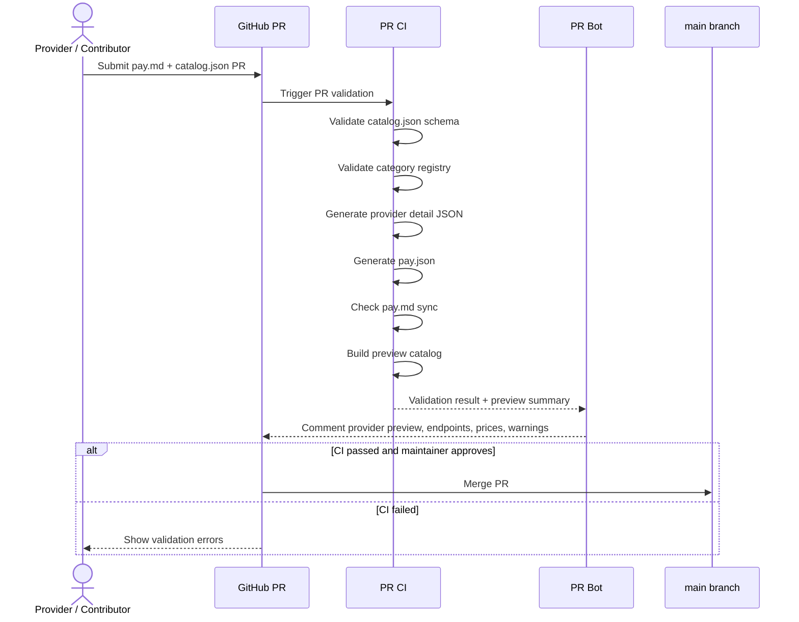
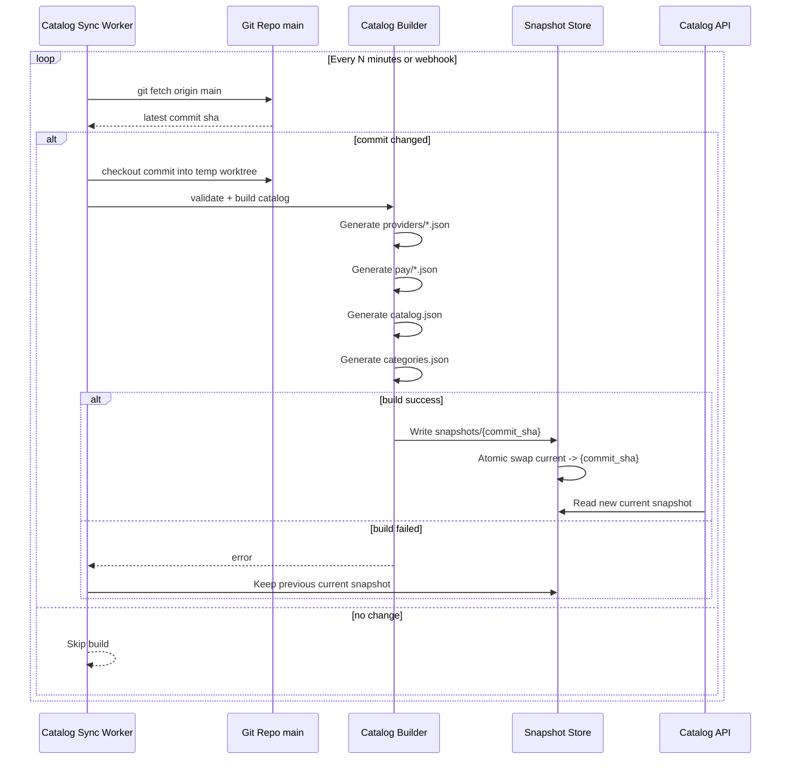
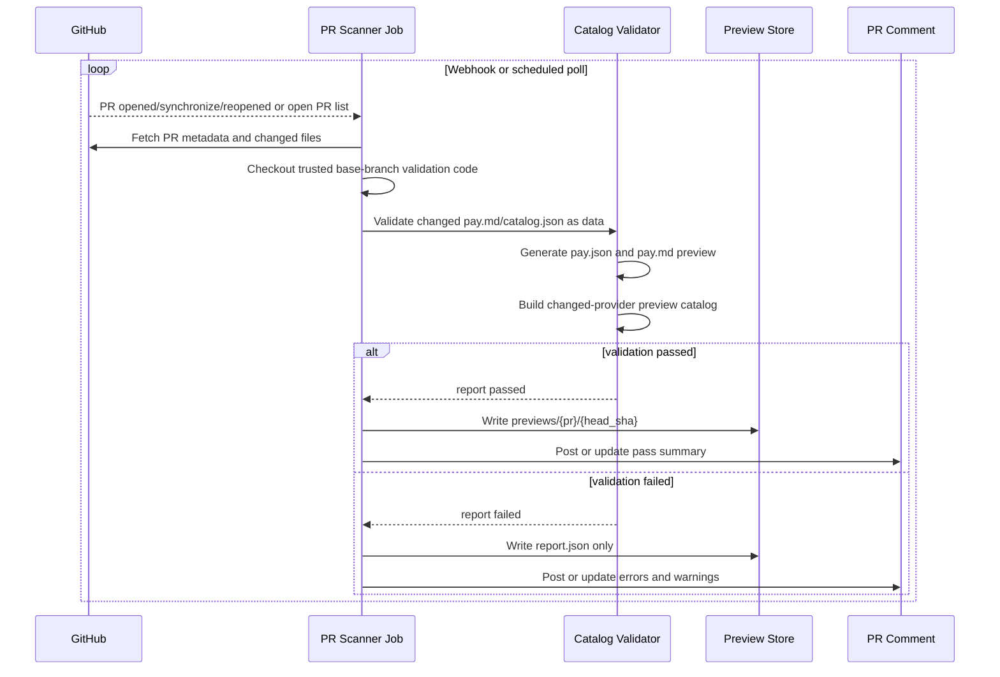
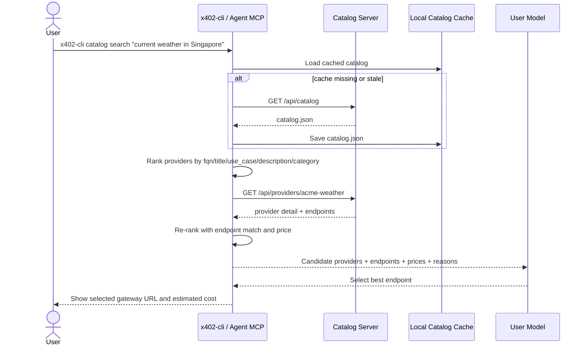
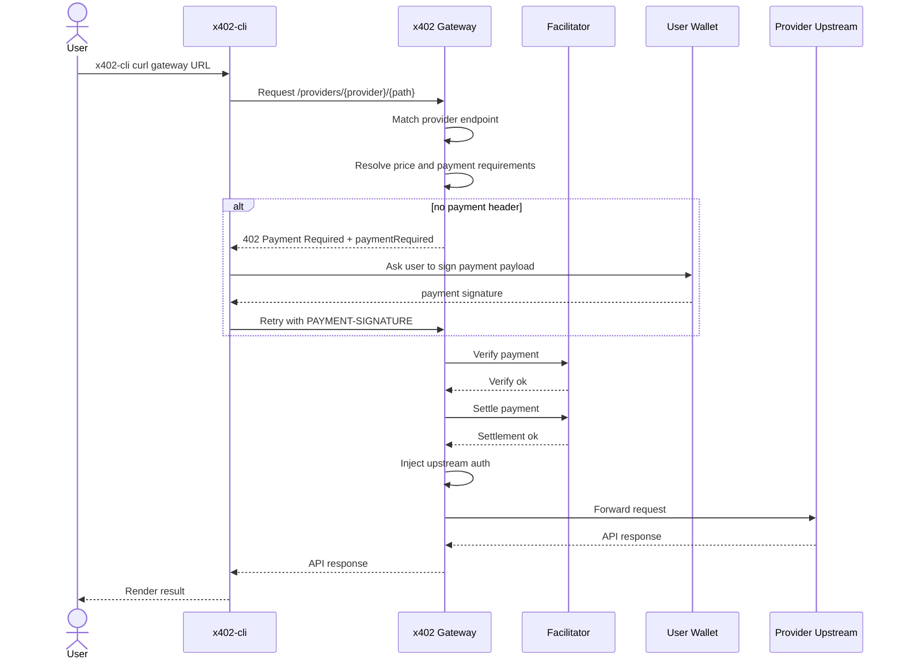
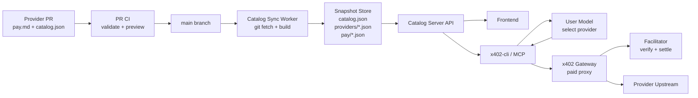

# Catalog Server 设计

本文档描述 `x402-gateway`、Catalog Builder、Catalog Server、GitHub PR 流程、CLI、前端和 Agent/MCP 工具如何联动。

## 一页总结

### 核心结论

我们要做的是一个 **Catalog 发现系统**，它负责“让用户、前端、CLI、Agent 找到合适的 API”。真正的付费调用仍然只走 Gateway。

```text
Catalog Server 负责发现和搜索
用户自托管 Gateway 负责收费、代理和 upstream auth
CLI / Agent 负责选择和调用
```

关键安全边界：**平台不持有用户 upstream API key**。用户自己启动 Gateway，自己保存 runtime YAML 和 auth 信息；平台 Git 只接收公开的 `pay.md` 和 `catalog.json`。

完整闭环：

```text
pay.md + catalog.json PR
  -> PR CI / PR Scanner 校验
  -> merge main
  -> Catalog Worker 定时同步 main
  -> 构建 snapshot
  -> Catalog API 发布最新目录
  -> 前端 / CLI / Agent 搜索合适 API
  -> x402-cli 调用 Gateway URL
  -> Gateway 完成 verify / settle / upstream proxy
  -> 返回 API 结果
```

### 最重要的边界

| 模块 | 负责什么 | 不负责什么 |
| --- | --- | --- |
| 用户自托管 Gateway | x402 支付、verify、settle、upstream proxy、保存 upstream auth | Git sync、PR preview、公开 catalog 托管 |
| Catalog Builder | 从 `pay.md` 和公开 JSON 构建 JSON artifacts | 对外提供 HTTP API、不读取用户 upstream secret |
| Catalog Server | 读取 snapshot，提供前端/CLI/Agent JSON | 处理支付、直接调用 upstream |
| PR Scanner | 校验 PR、生成 preview、评论 PR | 发布生产 catalog |
| CLI / Agent | 搜索、选择、调用 Gateway URL | 自己拼 endpoint、绕过 Gateway |

### 数据怎么持久化

第一版不需要数据库：

```text
Git = 源数据持久化
Snapshot files = 线上读模型持久化
State files = worker / PR scanner 状态持久化
Persistent Volume 或 S3/GCS/R2 = 跨重启持久化
```

线上请求不实时依赖 Git：

```text
Catalog API request
  -> in-memory index
  -> snapshots/current
  -> object storage / CDN fallback
```

Git 挂了时：

```text
继续服务 last successful snapshot
只影响 freshness
不影响 availability
```

### 第一版 MVP

优先落地这些：

1. 从用户提交的 `pay.md` 和公开 catalog JSON 生成 `dist/catalog.json` 和 `dist/pay/{fqn}.json`。
2. Catalog API 读取 `snapshots/current`。
3. 提供 `/api/catalog`、`/api/providers/{fqn}`、`/api/search`。
4. Worker 定时同步 main，构建 snapshot，成功后原子切换。
5. CLI 支持 `catalog update/search/show/endpoints/pay-json`。
6. Agent/MCP 支持 `search_catalog`、`get_catalog_entry`、`curl`。

暂时不做：

- 数据库。
- Elasticsearch / vector search。
- Gateway 自己做 Git sync。
- 对不可信 PR 做生产 live probe。

## 怎么读这份文档

如果只关心整体方案，读：

- [一页总结](#一页总结)
- [职责边界](#职责边界)
- [闭环结论](#闭环结论)

如果要做前端，读：

- [Public API](#public-api)
- [前端使用方式](#前端使用方式)
- [数据模型](#数据模型)

如果要做 CLI 或 Agent，读：

- [Search 设计](#search-设计)
- [CLI 使用流程](#cli-使用流程)
- [Agent / MCP 工具](#agent--mcp-工具)

如果要做后台和运维，读：

- [数据获取和持久化](#数据获取和持久化)
- [Git 同步](#git-同步)
- [后台任务](#后台任务)
- [PR 和 CI 流程](#pr-和-ci-流程)
- [一期无数据库策略](#一期无数据库策略)

如果要理解用户自托管 Gateway 和提交边界，读：

- [自托管 Gateway 和公开提交](#自托管-gateway-和公开提交)
- [Gateway 联动](#gateway-联动)

## 仓库关系

新方案下，仓库之间的关系要按职责拆清楚。

### `x402-gateway`

职责：提供用户可自托管的 Gateway runtime。

内容：

```text
x402-gateway/
  src/
  docs/
  examples/
  templates/
  Dockerfile
  docker-compose.yml
```

负责：

- 运行在用户自己的基础设施里。
- 读取用户本地 runtime config。
- 保存或引用用户自己的 upstream auth。
- 返回 x402 `402 Payment Required`。
- verify / settle。
- proxy upstream。
- 提供 `/__402/health`、`/__402/endpoints` 等本地诊断接口。
- 提供导出公开 catalog 数据的能力，供 `x402-cli catalog export-gateway` 使用。

不负责：

- 托管 marketplace catalog。
- 扫描 GitHub PR。
- 保存其他 provider 的 upstream API key。
- 发布全网 catalog。

### `x402-catelog`

职责：公开 marketplace 数据仓库。

Remote：

```text
git@github.com:BofAI/x402-catelog.git
```

内容只放公开数据：

```text
x402-catelog/
  providers/
    acme-weather/
      pay.md
      catalog.json
  categories.json
  schemas/
    catalog.schema.json
  scripts/
    validate
    build
  dist/
    catalog.json
    categories.json
    providers/{fqn}.json
    pay/{fqn}.json
```

负责：

- 接收用户 PR。
- 校验 `pay.md`。
- 校验 `catalog.json`。
- 探测用户 Gateway URL 是否返回 x402 402 challenge。
- 构建 `dist/`。
- 发布 catalog snapshot 到 Catalog Server / CDN。

禁止放入：

```text
provider.yml
runtime YAML
upstream token
Authorization header
secret_ref
.env
```

### `x402-catalog-server`

职责：服务公开 Catalog API。

可以先放在 `x402-catelog` 仓库里，后续独立出来。

负责：

- 定时扫描 `git@github.com:BofAI/x402-catelog.git` 的 main。
- 构建或加载 snapshot。
- 服务 `/api/catalog`。
- 服务 `/api/search`。
- 服务 `/api/providers/{fqn}`。
- 运行 PR scanner / preview comment。
- Git 不可用时继续服务 last successful snapshot。

不负责：

- 支付。
- upstream proxy。
- 保存用户 upstream API key。

### `x402-cli`

职责：用户侧统一入口。

负责：

- 初始化和检查用户自托管 Gateway。
- 导出公开 catalog entry。
- 校验和提交 `pay.md + catalog.json`。
- 搜索 catalog。
- 调用 Gateway URL。
- 处理 x402 challenge 和签名重试。

推荐命令族：

```text
x402-cli gateway ...
x402-cli catalog ...
x402-cli curl ...
x402-cli call ...
```

## 目标

- 给前端提供可渲染的供应商目录 JSON。
- 让用户和 Agent 能按自然语言任务搜索合适的付费 API。
- Gateway 只负责 x402 支付代理和上游转发。
- Catalog 构建、Git 同步、PR 校验不进入 Gateway 请求路径。
- 用户自己的 Gateway 配置和 upstream auth 留在用户侧，平台 Git 只接收公开 `pay.md` 和 catalog JSON。
- Git 不可用时仍能服务最后一次成功的 catalog snapshot。

## 职责边界

### 用户自托管 Gateway

Gateway 是用户自己运行的付费 API runtime。

职责：

- 加载用户自己的 runtime 配置。
- 匹配 `/providers/{provider}/{path}`。
- 解析 endpoint 价格。
- 返回 x402 `402 Payment Required` challenge。
- 通过 facilitator 做 verify 和 settle。
- 注入 upstream auth。
- 转发请求到 provider upstream。
- 通过 `/__402/*` 暴露 runtime 状态。

用户自托管 Gateway 保存 upstream API key、OAuth secret、HMAC secret 等私密信息。平台不托管这些 secret。

### Catalog Builder

Catalog Builder 把公开 catalog 提交转换成不可变 catalog artifacts。

输入：

```text
providers/{provider}/pay.md
providers/{provider}/catalog.json
categories.json 或平台维护的 category registry
```

输出：

```text
dist/
  catalog.json
  categories.json
  providers/{fqn}.json
  pay/{fqn}.json
  frontend/
    home.json
    providers.json
  search-index.json
  status.json
```

规则：

- `pay.md` 是人类和 Agent 可读的审核材料。
- `catalog.json` 是公开机器真相源，描述 provider、endpoint、价格、Gateway URL、payment manifest。
- `pay.json` 可以由用户提交，也可以由 builder 从 `catalog.json` 规范化生成。
- 用户 Gateway 的 runtime YAML 不进入平台 Git。

### Catalog Server

Catalog Server 是 built snapshot 的只读 API。

职责：

- 定时同步可信 Git branch。
- commit 变化时构建新 snapshot。
- 构建成功后原子切换 `current`。
- 构建失败时继续服务旧 snapshot。
- 给前端、CLI、Agent 提供 JSON。
- 可选合并 Gateway runtime 状态：`/__402/providers` 和 `/__402/endpoints`。

Catalog Server 和 Catalog Builder 不读取 provider upstream secret。它们只看到用户公开提交的 endpoint、价格和 Gateway URL。

### CLI / Agent

CLI 和 Agent 消费 catalog JSON，选择 endpoint，然后调用 Gateway URL。

职责：

- 本地缓存 `/api/catalog`。
- 搜索 provider metadata 和 endpoint detail。
- 按需懒加载 provider detail。
- 付费前展示价格估算。
- 使用 catalog 返回的 exact gateway URL。
- 处理 x402 challenge、钱包签名、重试和响应展示。

## 自托管 Gateway 和公开提交

Provider onboarding 必须把 runtime 配置和公开 catalog 数据彻底分开：

1. 用户自己运行 Gateway，自己保存 upstream auth。
2. 平台 Git 只接收 `pay.md` 和公开 catalog JSON。

这样平台不持有用户 upstream API key，风险最小。

### 哪些内容可以进 PR

PR 里可以放公开信息：

```text
provider identity
category / tags
public service URL
gateway service URL
endpoint method / path / description
pricing
payment recipient
network / currency / scheme
usage notes
logo / docs URL
payment manifest
```

PR 里不能放：

```text
upstream API key
bearer token
basic auth password
oauth client secret
HMAC secret
private upstream header value
signer private key
facilitator admin token
internal-only URL
literal Authorization header value
user gateway runtime YAML
```

### 用户提交文件

用户提交到平台 Git PR 的文件：

```text
providers/acme-weather/pay.md
providers/acme-weather/catalog.json
```

一期只接受这两个文件和公开静态资源。用户 Gateway runtime YAML、`.env`、token、secret、`provider.yml` 都不进入平台 Git。

### `pay.md` 模板

`pay.md` 是给人和 Agent 读的说明文件。它必须和 `catalog.json` 表达同一个 provider 和 endpoint，不允许出现 secret。

模板：

````markdown
# Acme Weather API

> 城市级实时天气 API

## 基本信息

- FQN: `acme-weather`
- Category: `data`
- Chains: `tron:mainnet`
- Gateway: `https://gateway.acme-weather.com/providers/acme-weather`
- Pricing: from `$0.002`
- First party: `false`

## 简介

Current weather API.

中文：提供实时天气数据的 API。

## 使用场景

Use for city-level weather lookup.

中文：适合查询城市当前天气。

## Endpoints

### GET /v1/current

- URL: `https://gateway.acme-weather.com/providers/acme-weather/v1/current`
- Metered: `true`
- Price: `$0.002`
- Description: Current weather for a city
- 中文：查询指定城市的当前天气。

Example:

```bash
x402-cli pay "https://gateway.acme-weather.com/providers/acme-weather/v1/current?city=Singapore"
```

## Payment

- Networks: `tron:mainnet`
- Schemes: `exact_permit`
- Currencies: `USDT`, `USDD`

## Notes

- This provider is self-hosted by Acme.
- The catalog only stores public endpoint and pricing metadata.
- Upstream credentials stay in the provider's own Gateway environment.
````

校验规则：

- `FQN` 必须和 `catalog.json.fqn` 一致。
- `Gateway` 必须和 `catalog.json.serviceUrl` 一致。
- endpoint URL 必须和 `catalog.json.endpoints[].url` 一致。
- price、network、currency 必须和 `catalog.json` 一致。
- 不允许出现 secret-like 字段。

### `catalog.json` 模板

`catalog.json` 是一期机器真相源。它由表单或 `x402-cli catalog export-gateway` 生成，用户可以编辑公开文案，但不能加入 runtime 配置。

模板：

```json
{
  "version": 1,
  "fqn": "acme-weather",
  "title": "Acme Weather API",
  "subtitle": "City-level current weather",
  "description": "Current weather API",
  "useCase": "Use for city-level weather lookup.",
  "i18n": {
    "zh-CN": {
      "title": "天气 API",
      "subtitle": "城市级实时天气",
      "description": "提供实时天气数据的 API。",
      "useCase": "适合查询城市当前天气。"
    }
  },
  "logo": "https://example.com/logos/acme-weather.png",
  "category": "data",
  "chains": ["tron:mainnet"],
  "isFirstParty": false,
  "isFeatured": false,
  "featuredTags": ["weather", "data"],
  "serviceUrl": "https://gateway.acme-weather.com/providers/acme-weather",
  "endpoints": [
    {
      "method": "GET",
      "path": "/v1/current",
      "url": "https://gateway.acme-weather.com/providers/acme-weather/v1/current",
      "title": "Current Weather",
      "subtitle": "Lookup by city",
      "description": "Current weather for a city",
      "useCase": "Use when an app needs real-time city weather.",
      "i18n": {
        "zh-CN": {
          "title": "实时天气",
          "subtitle": "按城市查询",
          "description": "查询指定城市的当前天气。",
          "useCase": "适合应用需要实时城市天气时使用。"
        }
      },
      "metered": true,
      "minPriceUsd": 0.002,
      "maxPriceUsd": 0.002
    }
  ],
  "status": {
    "catalog": "draft",
    "gateway": "unknown",
    "payment": "unknown",
    "upstream": "unknown"
  }
}
```

### 导出目录结构

`x402-cli catalog export-gateway` 生成一个可提交目录：

```text
providers/acme-weather/
  pay.md
  catalog.json
```

后续可以扩展 `report.json` 作为本地导出校验报告，但一期 PR 只提交 `pay.md` 和 `catalog.json`：

```json
{
  "status": "passed",
  "fqn": "acme-weather",
  "gatewayUrl": "https://gateway.acme-weather.com/providers/acme-weather",
  "checks": [
    {
      "name": "gateway_402_probe",
      "status": "passed",
      "message": "paid endpoint returned 402 Payment Required"
    },
    {
      "name": "secret_scan",
      "status": "passed",
      "message": "no secret-like fields detected"
    }
  ],
  "outputs": {
    "payMd": "pay.md",
    "catalogJson": "catalog.json"
  }
}
```

### 导出命令

推荐命令：

```bash
x402-cli catalog export-gateway https://gateway.acme-weather.com \
  --provider acme-weather \
  --output-dir providers/acme-weather
```

导出流程：

```text
读取用户自托管 Gateway 的 /__402/catalog/providers/{fqn}.json
只提取公开字段并规范化成 catalog.json
生成 catalog.json
生成 pay.md
运行 secret scan
```

导出命令不读取用户本地 runtime config；runtime config 留在 Gateway 侧，输出目录不能包含任何 secret。

`catalog.json` 示例：

```json
{
  "version": 1,
  "fqn": "acme-weather",
  "title": "Acme Weather API",
  "subtitle": "City-level current weather",
  "description": "Current weather API",
  "useCase": "Use for city-level weather lookup.",
  "i18n": {
    "zh-CN": {
      "title": "天气 API",
      "subtitle": "城市级实时天气",
      "description": "提供实时天气数据的 API。",
      "useCase": "适合查询城市当前天气。"
    }
  },
  "logo": "https://example.com/logos/acme-weather.png",
  "category": "data",
  "chains": ["tron:mainnet"],
  "isFirstParty": false,
  "isFeatured": true,
  "featuredTags": ["weather", "data"],
  "serviceUrl": "https://gateway.acme-weather.com/providers/acme-weather",
  "endpoints": [
    {
      "method": "GET",
      "path": "/v1/current",
      "url": "https://gateway.acme-weather.com/providers/acme-weather/v1/current",
      "description": "Current weather for a city",
      "i18n": {
        "zh-CN": {
          "description": "查询指定城市的当前天气。"
        }
      },
      "metered": true,
      "priceUsd": 0.002
    }
  ],
  "payment": {
    "networks": ["tron:mainnet"],
    "schemes": ["exact_permit"],
    "currencies": ["USDT", "USDD"]
  }
}
```

### `catalog.json` 字段契约

第一版 `catalog.json` 必填字段：

标题、副标题、介绍、使用场景必须双语：英文放在默认字段，中文放在 `provider.i18n.zh-CN`。

```text
schemaVersion
provider.name
provider.title
provider.subtitle
provider.description
provider.useCase
provider.i18n.zh-CN.title
provider.i18n.zh-CN.subtitle
provider.i18n.zh-CN.description
provider.i18n.zh-CN.useCase
provider.category
provider.version
provider.serviceUrl
provider.chains[]
endpoints[]
endpoints[].method
endpoints[].path
endpoints[].url
endpoints[].description
endpoints[].i18n.zh-CN.description
endpoints[].metered
payment.networks[]
payment.schemes[]
payment.currencies[]
```

可选字段：

```text
provider.logo
provider.tags[]
provider.docsUrl
provider.websiteUrl
provider.isFirstParty
provider.isFeatured
provider.featuredTags[]
endpoints[].resource
endpoints[].priceUsd
endpoints[].minPriceUsd
endpoints[].maxPriceUsd
endpoints[].inputHint
endpoints[].examples
payment.validForSeconds
payment.facilitatorUrl
```

校验规则：

- `provider.name` 只能包含小写字母、数字和 `-`。
- `provider.category` 必须在平台 category registry 中。
- `provider.serviceUrl` 必须是公网 `https://` URL。
- `endpoints[].url` 必须以 `provider.serviceUrl` 为前缀，或明确通过 allowlist。
- `endpoints[].path` 必须以 `/` 开头。
- `endpoints[].method` 只能是 `GET`、`POST`、`PUT`、`PATCH`、`DELETE`、`HEAD`、`OPTIONS`。
- `priceUsd`、`minPriceUsd`、`maxPriceUsd` 不能为负数。
- `metered=true` 的 endpoint 必须有价格或 payment requirement 摘要。
- 不允许出现 `token`、`api_key`、`password`、`Authorization` 等 secret-like 字段。
- 不允许出现 private IP、localhost、link-local、metadata IP。

构建时会把 `catalog.json` 规范化成：

```text
dist/catalog.json
dist/providers/{fqn}.json
dist/pay/{fqn}.json
```

命名映射：

```text
用户提交 catalog.json: provider.useCase, provider.serviceUrl, provider.isFirstParty
构建产物 JSON:      use_case, service_url, is_first_party
```

构建产物统一使用 snake_case。用户提交文件使用 camelCase，方便表单和 JSON Schema。

### 用户侧 Gateway 配置

用户自己的 Gateway 仍然需要 runtime YAML 或其他配置，但它留在用户自己的环境里：

```text
用户环境:
  gateway runtime config
  upstream API key
  OAuth secret
  signer config
  facilitator URL
```

平台只需要确认用户提交的 Gateway URL 能返回合法 x402 challenge：

```text
GET https://gateway.acme-weather.com/providers/acme-weather/v1/current
  -> 402 Payment Required
```

这个 probe 不需要 upstream API key，因为无 payment 的请求应该在 Gateway 层返回 402，不会转发 upstream。

### 表单提交

如果用户通过表单 onboarding：

```text
用户填写公开 provider 信息和 Gateway URL
  -> 生成 catalog.json preview
  -> 生成 pay.md preview
  -> 创建 GitHub PR
```

用户的 upstream credential 不通过我们的表单提交。用户在自己的 Gateway 环境里配置。

### PR 校验规则

PR CI / PR Scanner 必须拒绝这些字段、文件或模式：

```text
value: sk_...
token: ...
api_key: ...
secret: ...
password: ...
private_key: ...
Authorization: Bearer ...
auth.value
auth.headers.Authorization
provider.yml
provider.public.yml
gateway runtime config
```

只允许提交：

```text
pay.md
catalog.json
public logo/docs metadata
```

如果 PR 中出现疑似 secret，CI 必须 fail，并提示用户把 runtime 配置留在自己的 Gateway。

## 数据模型

### Catalog Index

`/api/catalog` 使用 pay.sh 风格的轻量 index：

```json
{
  "version": 1,
  "generated_at": "2026-06-02T00:00:00Z",
  "provider_count": 12,
  "first_party_count": 3,
  "chain_count": 2,
  "base_url": "https://catalog.bankofai.io/api",
  "frontend": {
    "featured_fqns": ["acme-weather"],
    "categories": [
      {
        "id": "data",
        "label": "Data",
        "label_zh": "数据",
        "provider_count": 4,
        "sort_order": 10
      }
    ],
    "chains": [
      {
        "id": "tron:mainnet",
        "label": "TRON",
        "label_zh": "波场",
        "provider_count": 8,
        "sort_order": 10
      }
    ]
  },
  "providers": [
    {
      "fqn": "acme-weather",
      "title": "Acme Weather API",
      "subtitle": "City-level current weather",
      "description": "Current weather API",
      "use_case": "Use for city-level weather lookup.",
      "i18n": {
        "zh-CN": {
          "title": "天气 API",
          "subtitle": "城市级实时天气",
          "description": "提供实时天气数据的 API。",
          "use_case": "适合查询城市当前天气。"
        }
      },
      "logo": "https://example.com/logos/acme-weather.png",
      "category": "data",
      "chains": ["tron:mainnet"],
      "is_first_party": false,
      "is_featured": true,
      "featured_tags": ["weather", "data"],
      "service_url": "https://gateway.bankofai.io/providers/acme-weather",
      "endpoint_count": 2,
      "has_metering": true,
      "has_free_tier": true,
      "min_price_usd": 0.002,
      "max_price_usd": 0.002,
      "sha": "content-hash"
    }
  ]
}
```

这个 index 要保持小。完整 endpoint、usage notes、payment requirements 放在 provider detail 和 pay manifest 里。

字段约定：

- `title`、`subtitle`、`description`、`use_case` 默认使用英文，兼容 CLI、Agent 和搜索。
- 中文展示放在 `i18n.zh-CN` 下。
- 前端展示优先读取 `i18n.zh-CN`，缺失时 fallback 到默认字段。
- `frontend.categories`、`frontend.chains`、`featured_fqns` 属于平台前端配置，由 Catalog Builder 合并平台配置生成。
- `is_first_party`、`is_featured`、`featured_tags` 可由用户建议，但最终以平台审核和前端配置为准。

### Provider Detail

`/api/providers/{fqn}` 返回详情页和 CLI/Agent 需要的 endpoint 信息：

```json
{
  "fqn": "acme-weather",
  "title": "Acme Weather API",
  "subtitle": "City-level current weather",
  "description": "Current weather API",
  "use_case": "Use for city-level weather lookup.",
  "i18n": {
    "zh-CN": {
      "title": "天气 API",
      "subtitle": "城市级实时天气",
      "description": "提供实时天气数据的 API。",
      "use_case": "适合查询城市当前天气。"
    }
  },
  "logo": "https://example.com/logos/acme-weather.png",
  "category": "data",
  "chains": ["tron:mainnet"],
  "is_first_party": false,
  "is_featured": true,
  "featured_tags": ["weather", "data"],
  "service_url": "https://gateway.bankofai.io/providers/acme-weather",
  "endpoints": [
    {
      "method": "GET",
      "path": "/v1/current",
      "url": "https://gateway.bankofai.io/providers/acme-weather/v1/current",
      "description": "Current weather for a city",
      "i18n": {
        "zh-CN": {
          "description": "查询指定城市的当前天气。"
        }
      },
      "metered": true,
      "min_price_usd": 0.002,
      "max_price_usd": 0.002
    }
  ],
  "status": {
    "catalog": "listed",
    "gateway": "loaded",
    "payment": "unknown",
    "upstream": "unknown"
  }
}
```

### Payment Manifest

`/api/providers/{fqn}/pay.json` 返回由用户公开 `catalog.json` 规范化生成，或由用户直接提交的 payment manifest：

```json
{
  "schemaVersion": 1,
  "provider": {
    "name": "acme-weather",
    "title": "Acme Weather API",
    "description": "Current weather API",
    "category": "data",
    "version": "v1",
    "serviceUrl": "https://gateway.bankofai.io/providers/acme-weather"
  },
  "operator": {
    "network": "tron:mainnet",
    "scheme": "exact_permit",
    "recipient": "TProviderWalletBase58",
    "validForSeconds": 300,
    "facilitatorUrl": "https://facilitator.example.com",
    "currencies": {
      "usd": ["USDT", "USDD"]
    }
  },
  "paidEndpoints": [
    {
      "method": "GET",
      "path": "/v1/current",
      "url": "https://gateway.bankofai.io/providers/acme-weather/v1/current",
      "description": "Current weather for a city",
      "metered": true,
      "priceUsd": 0.002,
      "paymentRequired": {},
      "accepts": []
    }
  ]
}
```

## 一期无数据库策略

一期不使用数据库，使用 snapshot files + in-memory index。

原因：

- catalog 更新低频。
- 数据可从 Git 全量重建。
- JSON artifacts 天然适合前端、CLI、Agent。
- 原子切换和回滚简单。
- 可以 CDN 缓存。

一期持久化只看这些文件：

```text
data/snapshots/current/
  catalog.json
  categories.json
  providers/{fqn}.json
  pay/{fqn}.json
  search-index.json
  status.json

data/state.json
data/pr-state/{pr_number}.json
```

API 启动时从 `snapshots/current` 加载到内存；Worker 构建新目录时写入新 snapshot，成功后原子切换 `current`。

## Public API

最小 API：

```http
GET /health
GET /api/catalog
GET /api/categories
GET /api/providers
GET /api/providers/{fqn}
GET /api/providers/{fqn}/pay.json
GET /api/search?q=weather&category=data
GET /api/status
```

可选 LLM API：

```http
GET /api/providers/{fqn}/llm-context
```

`llm-context` 返回紧凑文本，方便塞给用户自己的模型，用于判断 provider fit、endpoint、价格、输入要求和注意事项。

## 前端使用方式

前端直接消费 Catalog Server，不解析用户 Gateway runtime YAML，也不接触 upstream auth。

首页加载：

```text
GET /api/categories
GET /api/catalog
```

列表页流程：

```text
加载 categories
加载 catalog index
渲染 category tabs 和 counts
渲染 provider cards
本地按 category、query、price、network、metered 过滤
按 relevance、category order、price、title 排序
```

Provider card 建议字段：

```json
{
  "fqn": "acme-weather",
  "title": "Acme Weather API",
  "subtitle": "City-level current weather",
  "description": "Current weather API",
  "use_case": "Use for city-level weather lookup.",
  "i18n": {
    "zh-CN": {
      "title": "天气 API",
      "subtitle": "城市级实时天气",
      "description": "提供实时天气数据的 API。",
      "use_case": "适合查询城市当前天气。"
    }
  },
  "logo": "https://example.com/logos/acme-weather.png",
  "category": "data",
  "chains": ["tron:mainnet"],
  "is_first_party": false,
  "is_featured": true,
  "featured_tags": ["weather", "data"],
  "service_url": "https://gateway.bankofai.io/providers/acme-weather",
  "endpoint_count": 2,
  "has_metering": true,
  "has_free_tier": true,
  "min_price_usd": 0.002,
  "max_price_usd": 0.002
}
```

详情页流程：

```text
GET /api/providers/{fqn}
GET /api/providers/{fqn}/pay.json
```

详情页展示：

- provider title、subtitle、description、use case、category、tags、logo。
- 中文 UI 使用 `i18n.zh-CN.title`、`i18n.zh-CN.subtitle`、`i18n.zh-CN.description`、`i18n.zh-CN.use_case`。
- exact gateway service URL。
- endpoint table：method、path、description、price、free/metered。
- payment networks、schemes、currencies、valid duration。
- Gateway runtime status。
- 可复制 CLI 示例：`x402-cli curl <url>`。

前端搜索：

- 普通浏览：基于 `/api/catalog` 本地过滤。
- 任务搜索：调用 `/api/search?q=...` 展示 ranked candidates。
- 搜索结果进入详情页时，预选匹配的 endpoint。

前端调用：

- 默认展示 CLI snippet 或 docs 链接。
- 如果产品内嵌浏览器支付客户端，必须使用 catalog 返回的 exact gateway URL。
- 浏览器客户端需要处理 `402 Payment Required`、钱包授权、`PAYMENT-SIGNATURE` 重试和响应渲染。

## Search 设计

Search 参考 pay.sh/pay CLI：

```text
加载轻量 catalog index
本地或内存中 rank providers
对候选 provider 懒加载 detail
用 endpoint fit 重新 rank
返回 candidates、reasons、prices、exact gateway URLs
```

Ranking 字段：

- `fqn`
- provider short name
- `title`
- `subtitle`
- `use_case`
- `description`
- `i18n.zh-CN.title`
- `i18n.zh-CN.subtitle`
- `i18n.zh-CN.description`
- `i18n.zh-CN.use_case`
- `category`
- `chains`
- endpoint `method`
- endpoint `path`
- endpoint `resource`
- endpoint `description`
- endpoint `i18n.zh-CN.description`

评分建议：

- provider name、title、use case 完整命中 query：高分。
- description 命中：中分。
- category 命中：低分。
- endpoint path/resource/description 命中：加分。
- query term coverage 越高越高。
- 小而聚焦的 provider 轻微加分。
- endpoint 特别多的 provider 轻微扣分。
- demo/debug provider 默认扣分，除非 query 明确提 demo/test/debugger。

`/api/search` 返回：

```json
{
  "query": "current weather in Singapore",
  "candidates": [
    {
      "fqn": "acme-weather",
      "title": "Acme Weather API",
      "subtitle": "City-level current weather",
      "category": "data",
      "chains": ["tron:mainnet"],
      "logo": "https://example.com/logos/acme-weather.png",
      "i18n": {
        "zh-CN": {
          "title": "天气 API",
          "subtitle": "城市级实时天气"
        }
      },
      "score": 142,
      "reasons": [
        "provider use case matches the task",
        "a specific endpoint matches the task"
      ],
      "endpoints": [
        {
          "method": "GET",
          "path": "/v1/current",
          "url": "https://gateway.bankofai.io/providers/acme-weather/v1/current",
          "metered": true,
          "min_price_usd": 0.002,
          "max_price_usd": 0.002
        }
      ]
    }
  ],
  "selection_guidance": [
    "Use the top candidate only when its endpoint clearly matches the user's task.",
    "Prefer exact endpoint fit over broad provider metadata.",
    "Reject endpoints above the user's stated price limit.",
    "Use the returned gateway URL exactly."
  ],
  "next_step": "Call the selected endpoint with the smallest useful request."
}
```

前端小规模 catalog 可以本地 search。Agent/MCP 应使用 `/api/search`，因为它需要 reasons、endpoint candidates 和 selection guidance。

## 数据获取和持久化

Catalog API 请求时不能依赖 Git。Git 是源数据更新入口，不是线上 serving store。

### 数据读取路径

线上请求读取顺序：

```text
Catalog API request
  -> in-memory index
  -> snapshots/current on persistent storage
  -> object storage fallback if configured
```

后台更新读取顺序：

```text
Catalog Worker
  -> primary Git remote
  -> mirror Git remote if primary fails
  -> last successful snapshot if all Git remotes fail
```

Catalog Server 启动时加载最后一次成功 snapshot：

```text
read data/snapshots/current
load catalog.json into memory
load categories.json into memory
load provider summaries into memory
load search-index.json into memory
lazy-load providers/{fqn}.json and pay/{fqn}.json on demand
```

即使 GitHub 或 Git remote 不可用，服务重启后也可以从 `snapshots/current` 继续服务。

### 无数据库持久化

第一版不需要 DB。持久化分三层：

```text
Git repository:
  provider source of truth

Persistent snapshot storage:
  production read model

Worker state files:
  sync status and PR scan status
```

生产不能只写容器临时盘。可选：

- persistent volume
- S3 / GCS / R2 object storage
- shared filesystem
- CI-published artifact bucket with CDN

MVP 推荐：

```text
catalog-worker writes /data/snapshots/{commit_sha}
catalog-worker atomically updates /data/snapshots/current
catalog-api reads /data/snapshots/current
/data is a persistent volume
```

生产增强：

```text
catalog-worker builds snapshot
catalog-worker uploads snapshots/{commit_sha}/ to object storage
catalog-worker writes current.json manifest
catalog-api polls current.json
catalog-api downloads and caches the snapshot locally
frontend and CLI can read CDN-backed catalog.json directly
```

`current.json`：

```json
{
  "commit": "abc123",
  "generatedAt": "2026-06-02T00:00:00Z",
  "snapshotBaseUrl": "https://cdn.example.com/catalog/snapshots/abc123",
  "catalogSha256": "sha256...",
  "providerCount": 12
}
```

### Git 故障策略

Git 不可用时：

- API 继续服务最后一次成功 snapshot。
- Worker 记录 `lastError`。
- `/api/status` 返回 degraded。
- 不删除或替换生产数据。
- PR scanner 暂停或返回 `source_unavailable`。
- CLI 和前端继续使用 Catalog API 或 CDN cache。

降级状态示例：

```json
{
  "serving": "last_successful_snapshot",
  "currentCommit": "abc123",
  "lastSuccessfulSyncAt": "2026-06-02T00:00:00Z",
  "lastSyncAt": "2026-06-02T00:10:00Z",
  "lastError": "primary git remote unavailable",
  "git": {
    "primary": "unavailable",
    "mirror": "unavailable"
  }
}
```

结论：Git 故障只影响 freshness，不影响 availability。

### Git Mirror 策略

降低单一 Git host 依赖：

- 配置至少两个 remotes，例如 GitHub primary 和 internal mirror。
- 每次成功同步后更新 mirror，或用独立 mirror job。
- 先 fetch primary，失败后 fetch mirror。
- 只从 signed 或 allowlisted trusted branches 构建。
- 记录当前 snapshot 来自哪个 remote。

Worker fetch 顺序：

```text
try git@github.com:BofAI/x402-catelog.git main
if failed, try git@internal-mirror/x402-catelog.git main
if failed, keep current snapshot
```

Mirror 不是线上 serving path，只是未来构建的恢复来源。

## Git 同步

Catalog Server 或 sidecar worker 定期同步可信 branch。

```text
Every N minutes or webhook:
  git fetch origin main
  compare latest commit with current snapshot
  checkout commit into temporary worktree
  validate public catalog files
  generate listing.md preview
  generate pay.json
  build catalog.json, categories.json, providers/*.json, pay/*.json
  write snapshots/{commit_sha}
  atomically swap current -> {commit_sha}
```

失败时保留旧 snapshot。

本地存储建议：

```text
data/
  repo/
  worktrees/
    {commit_sha}/
  snapshots/
    current -> {commit_sha}
    {commit_sha}/
      catalog.json
      categories.json
      providers/
      pay/
      status.json
  state.json
```

`/api/status`：

```json
{
  "currentCommit": "abc123",
  "currentBranch": "main",
  "lastSyncAt": "2026-06-02T00:00:00Z",
  "lastSuccessfulSyncAt": "2026-06-02T00:00:00Z",
  "lastError": null,
  "providerCount": 12,
  "categoryCount": 8
}
```

## 后台任务

Catalog 系统需要两类后台任务：

1. 可信 branch sync。
2. Pull Request scanner。

可以跑在同一个 worker 进程，但必须有不同安全规则和状态。

### Trusted Branch Sync Job

目的：

- main 合并后更新生产 catalog。
- 从可信源构建不可变 snapshot。
- 只发布成功构建的 snapshot。

触发：

```text
every 5-10 minutes
or GitHub webhook: push to main
```

流程：

```text
read last successful main commit from state.json
git fetch origin main
if origin/main commit is unchanged, exit
checkout origin/main into a temp worktree
run catalog validation
generate pay.json files
build catalog snapshot
write snapshots/{commit_sha}
atomic swap snapshots/current -> snapshots/{commit_sha}
record lastSuccessfulSyncAt and currentCommit
```

失败行为：

- 不替换 `snapshots/current`。
- 记录 `lastError`。
- 通过 `/api/status` 暴露失败。
- 下个周期重试。

这个 job 可以使用可信部署凭据，因为它只处理已合并到 main 的可信代码。

### Pull Request Scanner Job

目的：

- 在 merge 前发现 provider 提交。
- 校验变更的 provider 文件。
- 为 reviewer 构建 preview catalog。
- 在 PR 上评论 provider、endpoint、价格和 warning 摘要。

触发：

```text
GitHub webhook: pull_request opened/synchronize/reopened
scheduled poll: every 5-10 minutes as fallback
manual rerun: maintainer command or label
```

只检查这些文件：

```text
providers/**/pay.md
providers/**/catalog.json
categories.json
```

流程：

```text
list open PRs or receive PR webhook
for each changed PR:
  checkout base branch trusted validation code
  read PR changed files
  validate catalog.json schema
  validate category IDs
  generate or normalize pay.json from catalog.json
  generate pay.md preview
  compare committed pay.md if present
  build preview catalog for changed providers
  write preview artifacts under previews/{pr_number}/{head_sha}
  post or update a PR comment
  record scanner status
```

PR preview artifacts：

```text
previews/{pr_number}/{head_sha}/
  catalog.json
  providers/{fqn}.json
  pay/{fqn}.json
  report.json
```

PR 评论内容：

```text
provider name and title
category
paid endpoint count
free endpoint count
price range
networks and currencies
pay.md sync status
schema validation status
warnings
preview links when available
```

PR scanner 不能把 preview 写入生产 `snapshots/current`。只有 merge 到可信 branch 后，生产 catalog 才能更新。

### PR Scanner 安全规则

PR 内容是不可信输入。

fork PR：

- 不使用 production secrets。
- 不使用钱包 key。
- 不使用 signer credentials。
- 不使用 production facilitator token。
- 不执行任意 live probe。
- 不执行 PR 分支里的脚本。

如果使用 `pull_request_target`，只能 checkout base branch 的可信代码，把 PR 文件当作数据读取，不能执行 PR branch 代码。

PR 扫描默认禁用网络访问。如 maintainer 通过 label 或手动 rerun 启用 live probe，必须限制：

- HTTPS only。
- 禁止 localhost、private IP、link-local、metadata IP。
- 禁止 redirect 到不允许 host。
- 短 timeout。
- 限制 response size。
- 不发送 secrets。
- 日志和评论必须脱敏。

### Worker State

状态文件建议：

```text
data/state.json
data/pr-state/{pr_number}.json
```

`state.json`：

```json
{
  "currentCommit": "abc123",
  "lastSyncAt": "2026-06-02T00:00:00Z",
  "lastSuccessfulSyncAt": "2026-06-02T00:00:00Z",
  "lastError": null
}
```

`pr-state/{pr_number}.json`：

```json
{
  "prNumber": 42,
  "headSha": "def456",
  "baseSha": "abc123",
  "lastScannedAt": "2026-06-02T00:00:00Z",
  "status": "passed",
  "commentId": "github-comment-id",
  "changedProviders": ["acme-weather"],
  "warnings": []
}
```

## PR 和 CI 流程

PR CI 在 provider 进入可信 branch 前校验提交。

PR CI 可做：

- 校验 `catalog.json` schema。
- 校验 category IDs。
- 生成 `listing.md` 和 `pay.json`。
- 如果提交了 `pay.md`，检查它是否和生成结果一致。
- 构建 preview catalog artifacts。
- 静态 lint 和 shape checks。

不可信 PR CI 避免：

- production secrets。
- 钱包私钥。
- signer credentials。
- production facilitator admin token。
- 任意网络 probe。
- 无 SSRF 限制地 fetch arbitrary OpenAPI URL。
- 打印 request headers、response bodies、environment values。

fork PR 只跑静态校验。更深的 smoke tests 在 merge 后通过 protected branch 或 protected environment 执行。

PR scanner 和 GitHub CI 应输出同一种 validation report，保证 reviewer 无论看 Actions 还是外部 worker 评论，得到的结果一致。

### Validation Report

PR CI 和 PR Scanner 都输出同一个 report shape：

```json
{
  "status": "passed",
  "prNumber": 42,
  "headSha": "def456",
  "changedProviders": ["acme-weather"],
  "checks": [
    {
      "name": "catalog_schema",
      "status": "passed",
      "message": "catalog.json schema is valid"
    },
    {
      "name": "secret_scan",
      "status": "passed",
      "message": "no secret-like fields detected"
    },
    {
      "name": "gateway_402_probe",
      "status": "warning",
      "message": "endpoint returned 404 instead of 402",
      "target": "https://gateway.acme-weather.com/providers/acme-weather/v1/current"
    }
  ],
  "summary": {
    "providerCount": 1,
    "endpointCount": 2,
    "paidEndpointCount": 1,
    "freeEndpointCount": 1,
    "minPriceUsd": 0.002,
    "maxPriceUsd": 0.002,
    "networks": ["tron:mainnet"],
    "currencies": ["USDT", "USDD"]
  },
  "preview": {
    "catalogJsonPath": "previews/42/def456/catalog.json",
    "providerJsonPath": "previews/42/def456/providers/acme-weather.json",
    "payJsonPath": "previews/42/def456/pay/acme-weather.json"
  }
}
```

状态含义：

```text
passed   可以 merge
warning  可以人工 review 后 merge
failed   不允许 merge
skipped  当前 PR 类型不需要运行该 check
```

PR 评论应只展示摘要和脱敏错误，不展示 request headers、response body 或任何疑似 secret。

## Gateway 联动

Catalog Server 可以合并 Gateway runtime 状态：

```http
GET /__402/providers
GET /__402/endpoints
```

这些状态只用于 catalog UI，不驱动支付行为。

用户自托管 Gateway 是唯一会接触 provider upstream secret 的组件。Catalog Server、Catalog Builder、PR Scanner、前端和 CLI 都不应该拥有用户 upstream secret read 权限。

平台只保存和展示用户公开提交的 Gateway URL、endpoint、价格和 payment manifest。

小规模部署可以让 Gateway 暴露轻量 catalog endpoint：

```http
GET /__402/catalog
GET /__402/catalog/search
GET /__402/catalog/providers/{fqn}
GET /__402/catalog/providers/{fqn}/pay.json
```

Gateway-local catalog endpoint 只能读取 mounted/generated artifacts，不能在 Gateway 进程里做 Git sync 或重型 build。

## CLI 使用流程

安装和更新：

```bash
x402-cli setup
x402-cli catalog update
```

`catalog update` 拉取并缓存：

```text
GET /api/catalog
```

本地缓存：

```text
~/.config/bankofai/catalog/catalog.json
~/.config/bankofai/catalog/providers/{fqn}.json
~/.config/bankofai/catalog/pay/{fqn}.json
```

搜索：

```bash
x402-cli catalog search "current weather in Singapore"
x402-cli catalog search "translate text" --category translation
x402-cli catalog search "token price" --category finance --json
```

CLI search 流程：

```text
load local catalog cache
if missing or stale, GET /api/catalog
rank provider summaries by fqn/title/use_case/description/category
select likely providers
fetch provider detail lazily through GET /api/providers/{fqn}
re-rank with endpoint path/resource/description and price
return endpoint candidates with exact gateway URLs
```

文本输出：

```text
1. acme-weather - Acme Weather API
   Category: data
   Price: $0.002
   Match: current city-level weather endpoint

   GET https://gateway.bankofai.io/providers/acme-weather/v1/current
   Use for: current weather lookup by city
```

查看详情：

```bash
x402-cli catalog show acme-weather
x402-cli catalog endpoints acme-weather
x402-cli catalog pay-json acme-weather
```

调用：

```bash
x402-cli curl "https://gateway.bankofai.io/providers/acme-weather/v1/current?city=Singapore"
```

`x402-cli curl` 处理：

```text
initial request
402 payment challenge
wallet signing
retry with PAYMENT-SIGNATURE
render upstream response
```

用户不需要理解 x402 内部细节。

推荐 CLI 命令：

```bash
x402-cli catalog update
x402-cli catalog list
x402-cli catalog search "<task>"
x402-cli catalog show <fqn>
x402-cli catalog endpoints <fqn>
x402-cli catalog pay-json <fqn>
x402-cli curl <gateway-url>
```

## Agent / MCP 工具

推荐 tools：

```text
list_catalog(category?)
search_catalog(query, category?, max_results?)
get_catalog_entry(fqn)
get_payment_manifest(fqn)
curl(url, method?, headers?, body?)
```

工具指导：

- `search_catalog` 用于明确任务。
- `list_catalog` 用于能力浏览。
- `get_catalog_entry` 在选中候选 provider 后调用。
- 优先最小可用付费调用。
- 多次调用、价格不清楚或 provider tie 时先问用户。
- 不得编造 provider URL 或 endpoint path。
- 必须使用返回的 exact gateway URL。

Agent 选 API 流程：

```text
user asks for a task
agent calls search_catalog(query)
agent compares provider candidates and compact endpoint candidates
if top endpoint is clear, agent builds a call plan
if not clear, agent calls get_catalog_entry(fqn) for the top provider
agent estimates total paid calls and cost
agent asks user before unclear spending or multi-call exploration
agent calls curl() with the exact returned gateway URL
agent summarizes the upstream response
```

Agent 付费前 call plan：

```json
{
  "provider": "acme-weather",
  "endpoint": "GET /v1/current",
  "url": "https://gateway.bankofai.io/providers/acme-weather/v1/current?city=Singapore",
  "why": "The endpoint is specifically for current city-level weather.",
  "expected_paid_calls": 1,
  "estimated_total_usd": 0.002
}
```

这些情况 Agent 应先问用户：

- 没有 endpoint 明确匹配任务。
- 多个 provider 难以区分。
- 用户有价格限制且 endpoint 可能超限。
- 任务需要多次付费调用。
- 需要 broad exploration 或 schema probing。

## 时序图

### PR 上架



### Catalog Sync



### PR Scanner



PR Scanner 不写生产 `snapshots/current`。merge 到可信 branch 是 preview data 和 production catalog data 的边界。

### 用户搜索



### 付费 API 调用



### 整体关系



## MVP 范围

第一版需要：

- 生成 `dist/pay/{fqn}.json`。
- 从公开 `catalog.json` 和 pay manifest 构建 `dist/catalog.json`。
- 实现读取本地 snapshot 的薄 FastAPI Catalog API。
- 实现 `/api/catalog`、`/api/providers/{fqn}`、`/api/providers/{fqn}/pay.json`、`/api/search`、`/api/status`。
- 实现后台 Git sync worker 或 sidecar。
- CLI 增加 `catalog update`、`catalog search`、`catalog show`、`catalog endpoints`、`catalog pay-json` 和 `curl` 联动。
- 将 provider PR 文件拆成 public manifest，不允许 upstream auth secret 进 Git。

MVP 不需要：

- 数据库。
- Elasticsearch 或 vector search。
- 实时 PR preview server。
- Gateway 自己执行 Git sync。
- 对不可信 PR 做生产 live probe。

## 实现里程碑

### Phase 1：公开数据格式

交付：

- `schemas/catalog.schema.json`
- `providers/<fqn>/catalog.json` 示例
- `providers/<fqn>/pay.md` 示例
- secret-like 字段扫描规则
- category registry

验收：

- 本地可以校验 `catalog.json`。
- CI 能拒绝 secret-like 字段。
- 示例 provider 可以生成 `dist/pay/{fqn}.json`。

### Phase 2：Catalog Builder

交付：

- 从 `pay.md + catalog.json` 构建 `dist/catalog.json`。
- 构建 `dist/providers/{fqn}.json`。
- 构建 `dist/pay/{fqn}.json`。
- 生成 `search-index.json`。

验收：

- `dist/catalog.json` 是 pay.sh 风格轻量 index。
- provider detail 可被 CLI/Agent 懒加载。
- 价格、endpoint count、metering summary 正确。

### Phase 3：Catalog API

交付：

- `GET /api/catalog`
- `GET /api/categories`
- `GET /api/providers/{fqn}`
- `GET /api/providers/{fqn}/pay.json`
- `GET /api/search`
- `GET /api/status`

验收：

- API 从 `snapshots/current` 启动。
- Git 不可用时仍能服务旧 snapshot。
- `/api/search` 能返回 candidates、reasons、endpoint URLs。

### Phase 4：PR Scanner

交付：

- GitHub webhook 或定时扫描 open PR。
- 只读取 `pay.md`、`catalog.json`、公开 assets。
- 输出统一 validation report。
- 写 preview artifacts。
- 更新 PR comment。

验收：

- fork PR 不使用 secrets。
- PR 中出现 token / Authorization literal 会失败。
- preview 不进入 production snapshot。

### Phase 5：x402-cli 集成

交付：

- `x402-cli gateway export-catalog`
- `x402-cli catalog validate`
- `x402-cli catalog submit`
- `x402-cli catalog update`
- `x402-cli catalog search`
- `x402-cli catalog show`
- `x402-cli catalog endpoints`
- `x402-cli catalog pay-json`
- `x402-cli curl`

验收：

- 用户可以从自托管 Gateway 导出公开 catalog entry。
- 用户可以提交 `pay.md + catalog.json` PR。
- 其他用户可以 search 到该 API 并调用 Gateway URL。

### Phase 6：前端

交付：

- 首页统计。
- category tabs。
- provider cards。
- provider detail。
- task search。
- endpoint table。
- CLI snippet。

验收：

- 前端只依赖 Catalog API。
- 不展示或请求任何 upstream secret。
- 用户能从 UI 找到合适 API 和 exact Gateway URL。

## 闭环结论

架构闭环：

```text
pay.md + catalog.json PR
  -> PR CI / PR Scanner
  -> merge main
  -> Catalog Worker 定时同步 main
  -> build snapshot
  -> publish current snapshot
  -> Catalog API 给前端、CLI、Agent 提供数据
  -> 用户/Agent search 到合适 API
  -> x402-cli 调用 Gateway URL
  -> Gateway 完成 x402 支付、verify、settle、upstream proxy
  -> 返回 API 结果
```

可用性闭环：

```text
Git 挂了
  -> 继续服务 last successful snapshot
  -> 只影响 freshness
  -> 不影响 availability
```
