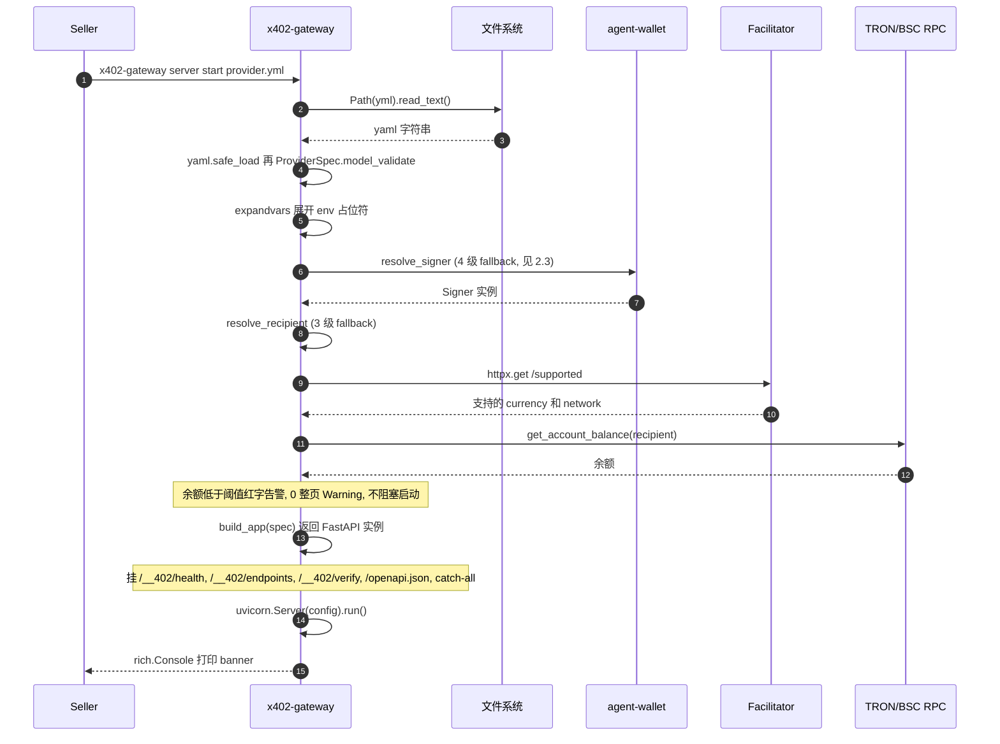
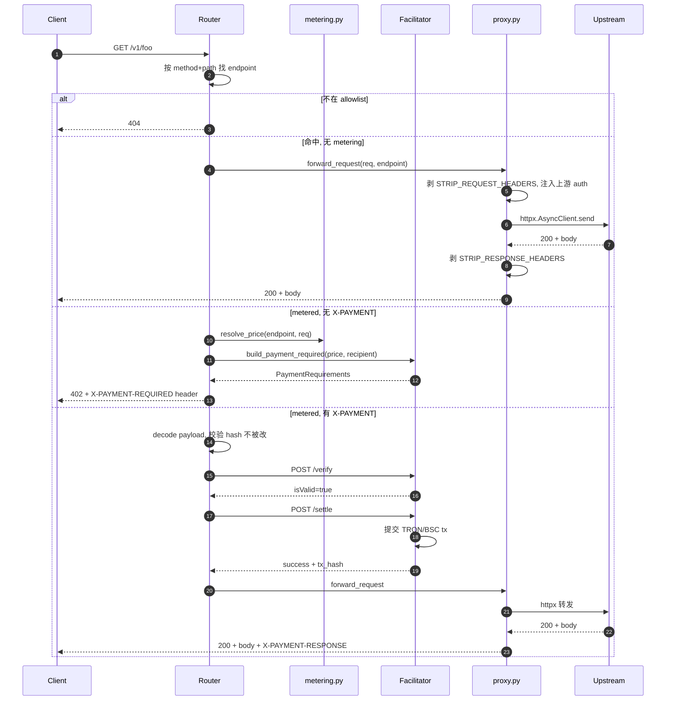
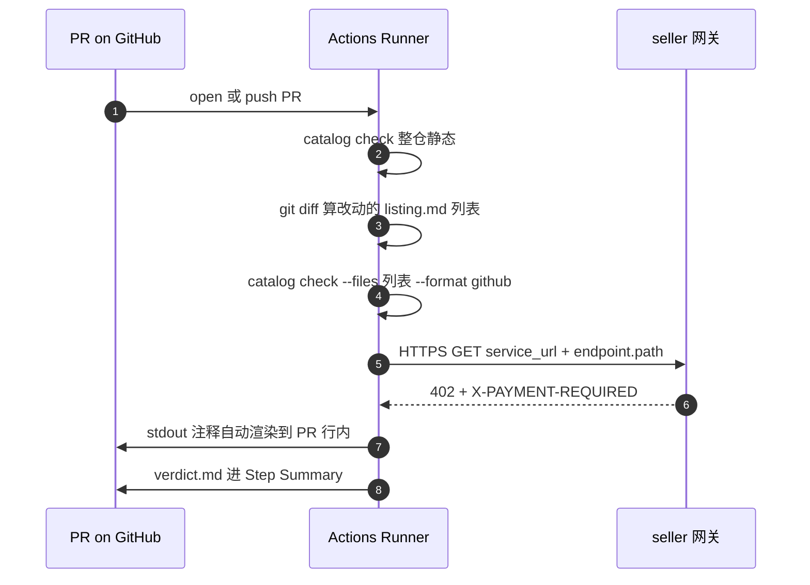
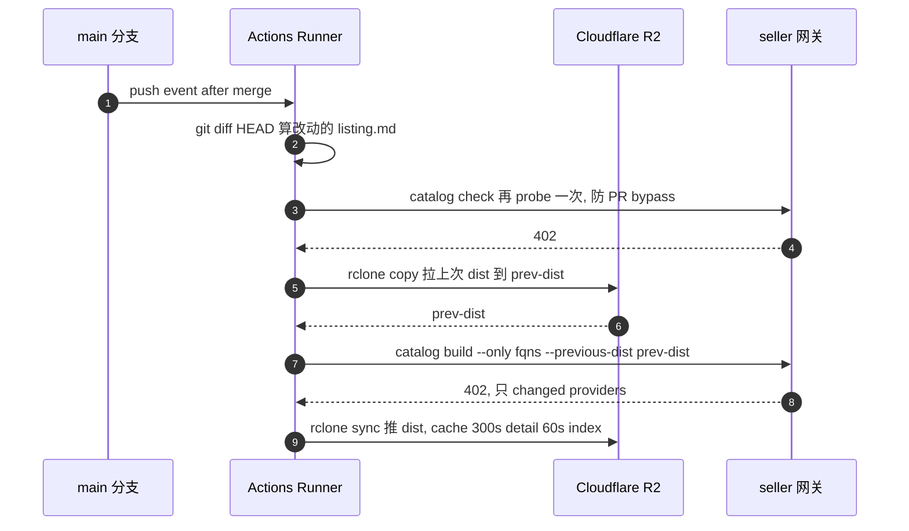

# x402-gateway 是怎么做的

照 [pay.sh.md](pay.sh.md) 的路子写,只讲我们 Python 这版怎么落。完整版在 [DESIGN.md](DESIGN.md),写代码的时候参考这份。

---

## 1. 项目定位

把任何 HTTP API 包成 x402 收费端点的反向代理。卖家写一份 `provider.yml`,网关替它处理 402 challenge、调 facilitator 验签 settle、然后转发上游。钱直接进卖家钱包,平台不持币。

栈是 Python 3.12 + FastAPI + httpx + uvicorn。协议走 `bankofai-x402`(我们自家 SDK,不要混到 pay.sh 的 Solana 实现里);钱包走 `bankofai-agent-wallet`,三个 backend:Privy 托管、`local_secure`(macOS Keychain / Linux libsecret 加密)、`raw_secret`(环境变量明文,只给 CI / 本地开发用)。链支持 TRON 和 BSC,稳定币默认 USDT,USDC 也认。

CLI 用 `typer`,顶级 `app = typer.Typer()`,子命令 `server` 和 `catalog` 各自挂一个 `Typer` 实例。

---

## 2. gateway start —— 把 API 包成 x402 网关

```bash
x402-gateway server start provider.yml
```

入口 `src/x402_gateway/cli/commands/server.py:start`,做完下面这些事才 `uvicorn.run`:



任一步报错直接 `typer.Exit(code=1)`,不要让网关"先跑起来再坏"。所有失败带 actionable 提示——比如 signer 解析失败就列出三种修法,余额为 0 就给充值地址。

### 2.2 provider.yml schema

用 pydantic v2,`ProviderSpec(BaseModel)` 放在 `src/x402_gateway/config/spec.py`。字段全集:

```yaml
# 标识
name: my-api
title: "My API"
description: "..."
category: ai_ml                      # 17 项白名单, 见 3.3
version: v1
forward_url: https://upstream.example   # 顶层简写; 写了就忽略 routing.url

# 上游路由
routing:
  type: respond | proxy              # respond=mock 给本地调试; proxy=转发上游
  url: https://upstream.example
  auth:                              # 5 种之一, 见 2.4
    method: header | query_param | hmac | oauth2 | access_token
    key: Authorization
    prefix: "Bearer "
    value_from_env: UPSTREAM_TOKEN

# 环境变量注入
env:
  ACME_API_TOKEN: "${ACME_API_TOKEN_PROD}"   # ${VAR} 透传当前 shell
  UPSTREAM_TIMEOUT_MS: "5000"                # 字面值

# 运营方
operator:
  network: tron-mainnet | tron-shasta | bsc-mainnet | bsc-testnet
  currencies:
    usd: ["USDT", "USDC"]
  recipient: "TRecipient..."
  signer:                            # 收款钱包签名后端
    backend: privy | local_secure | raw_secret
    profile: prod-tron

# 命名收款人 (splits 用)
recipients:
  vendor:    { account: "TVendor...",    label: "Vendor" }
  affiliate: { account: "${AFFILIATE_WALLET}", label: "Affiliate" }

# Endpoints (既是定价表也是 allowlist)
endpoints:
  - method: POST
    path: "v1/inference"
    description: "..."
    metering:
      dimensions:
        - direction: usage           # usage | input | output
          unit: requests             # requests | tokens | characters | seconds | bytes
          scale: 1
          tiers:
            - up_to: 1000
              price_usd: 0.10
              splits:
                - recipient: vendor
                  percent: 70
            - price_usd: 0.02        # 最后一档兜底, 没有 up_to
      variants:                      # 按参数走不同价
        - param: model
          value: gpt-4o
          dimensions: [...]
      splits:                        # endpoint 级分账, 被 per-tier 覆盖

  - method: GET
    path: "health"                   # 无 metering = 免费
```

实现要点:

- 字段名都用 snake_case;pydantic 默认就是这个,不要套 `Field(alias=)`。
- `endpoints[]` 是 allowlist,没声明的 method+path 一律 404,即便上游有。这条专门挡浏览器的 `favicon.ico` / `apple-touch-icon.png` 之类自动请求——不挡的话每次都会触发 OAuth2 token 刷新。
- `${VAR}` 用 `os.path.expandvars` 展开;变量不存在抛 `EnvNotSet` 异常,不要静默变空串。
- `recipients` 别名必须顶层声明,`splits` 引用别名,splits 总和 ≤ 主价。
- 单进程单 YAML。多租户先别做——pay.sh 的 subdomain 路由代码在生产 73 个 provider 里没人用,我们也不抢着开。

### 2.3 signer 4 级 fallback

`src/x402_gateway/server/signer.py`,函数 `resolve_signer(spec, sandbox: bool) -> Signer`,从上到下命中即停:

| 优先级 | 触发 | 来源 |
|---|---|---|
| 1 | `--sandbox` 或 `network` 命中 `*-testnet` / `*-shasta` | 内置 ephemeral keypair,首次自动建,写 `~/.x402-gateway/sandbox/accounts.yml` |
| 2 | `operator.signer` 块存在 | `privy` / `local_secure` / `raw_secret` 三选一,委托给 `bankofai-agent-wallet` |
| 3 | 命令行 `--profile` 或 `x402-gateway setup` 设的默认 | `agent_wallet.load_profile(name)`,触发系统钥匙串 prompt |
| 4 | 都没有 | 返回 `None`;只有纯 respond 模式 + 所有 endpoint 都免费才允许启动,否则 `raise typer.BadParameter` 给三条修复路径 |

比 pay.sh 少一级:pay.sh 的"sandbox"和"localnet/devnet"是两层,我们合到 1 级——sandbox 和测试网走同一份 ephemeral 账户逻辑,没必要拆。

### 2.4 请求处理流水线



`src/x402_gateway/server/proxy.py` 里 STRIP_HEADERS 用 `frozenset`,启动时 freeze 别在运行时 mutate:

```python
STRIP_REQUEST_HEADERS = frozenset({
    "host", "connection", "transfer-encoding",
    "authorization", "x-payment", "x-payment-required",
})

STRIP_RESPONSE_HEADERS = frozenset({
    "content-encoding", "content-length", "transfer-encoding",
})
```

`authorization` 必须剥——client 自己的 Authorization 头不能透传给上游,上游 auth 完全靠网关从 env 注入,两条链路要互不污染。响应方向的 `content-encoding` / `content-length` 也得剥,因为 httpx 默认 `auto_decompress=True`,gzip 已经解掉但 header 没改,直接透传 client 会按 gzip 反解第二次失败。

上游 auth 五种模式落在 `src/x402_gateway/server/auth/` 下,每种一个 `Strategy` 子类,共享 `async def apply(self, req: httpx.Request) -> None` 协议:

| 模式 | 行为 |
|---|---|
| `header` | env 值写到指定 header,可加 prefix |
| `query_param` | env 值写到 URL query string |
| `hmac` | 对 body + canonical-headers 算 HMAC,注入 header 或 query;canonical 顺序固定,要按 spec 测好 |
| `oauth2` | 启动期调 token endpoint 换 access_token,缓存到 `expires_in - 60s`,过期重取;每请求注入 `Authorization: Bearer ...` |
| `access_token` | 通用 DSL:声明 prepare body → fetch URL → 抽 token → 注入;给那种 OAuth2 不标准但又用 token 的奇葩上游 |

`oauth2` 和 `access_token` 的 token 缓存用 `asyncio.Lock` 防并发抢刷新——别用 `threading.Lock`,FastAPI 是单 event loop。

### 2.5 /__402/* 管理端点

前缀 `__402` 避开 seller 的业务 path,挂在 `src/x402_gateway/server/admin.py`:

| 路径 | 用途 |
|---|---|
| `/__402/health` | 直返 `Response("ok")`,k8s liveness / catalog probe 前置探测 |
| `/__402/endpoints` | 列 endpoints + price + currency + network,JSON,catalog build 直接打这个 |
| `/__402/verify` | 给 X-PAYMENT payload,只跑 facilitator verify,不调 settle。本地调试用 |
| `/openapi.json` | 启动带 `--openapi <url>` 才挂;filter 掉未在 endpoints 声明的 path,prune `servers[]`,改写成网关地址 |

去掉了 pay.sh 的 `/__402/rpc`——pay.sh 给浏览器 payment-debugger UI 用的 Solana RPC 代理,TRON / BSC 公共节点都开 CORS,前端直接打就行,不用网关代理。

---

## 3. listing.md —— catalog 怎么发现 API

每个上架 API 一个 `listing.md`,YAML frontmatter 给机器,Markdown body 给 agent。

### 3.1 listing.md 格式

```markdown
---
name: my-api
title: "My API"
description: "One-sentence pitch"
use_case: "Use for ..."
category: ai_ml
service_url: https://gw.example.com/my-api
openapi:
  url: https://api.example.com/openapi.json
tags: [foo, bar]
---

## Spend-aware usage
- Prefer narrow lookups over broad searches.

## When to use
...

## When NOT to use
...
```

frontmatter 解析用 `python-frontmatter` 包,schema 校验复用 ProviderSpec 同一套 pydantic 模型(`ListingSpec(BaseModel)` 在 `src/x402_gateway/catalog/spec.py`)。

容易踩的坑:

- `service_url` 是 catalog probe 真去打的 URL,**必须是网关地址,不是上游真实 API**。新人很容易写成上游真 URL,probe 全部 NotPaywalled 才发现。
- frontmatter 不写价格——catalog build 自己从 live 402 challenge 抽,seller 想造假写不进 dist。
- 不需要手列 `endpoints[]`——`openapi:` 块走 `httpx.get(url)` 拉下来自动派生,或者 probe 阶段对 `service_url` 直接实测。

### 3.2 FQN 派生(完全来自磁盘路径)

`src/x402_gateway/catalog/discover.py`:用 `pathlib.Path.relative_to(providers_root)`,去掉 `listing.md` 文件名,parts join 成 FQN。

| 路径 | FQN |
|---|---|
| `providers/sunio/listing.md` | `sunio` |
| `providers/sunio/perp-swap/listing.md` | `sunio/perp-swap` |
| `providers/bofai/payments/usdt/listing.md` | `bofai/payments/usdt` |

`frontmatter.name` 必须等于 FQN 的最后一段,否则 catalog check 报 `fqn_mismatch` 退出。

### 3.3 17 个 category 白名单

直接写成 `Literal` 类型让 pydantic 强校验:

```python
Category = Literal[
    "ai_ml", "cloud", "compute", "data", "devtools", "finance",
    "identity", "media", "messaging", "other", "productivity",
    "search", "security", "shopping", "storage", "translation",
]
```

去掉了 pay.sh 的 `maps`——我们暂时不上架地图类 API,后续要加再扩。

### 3.4 catalog 三个子命令

```bash
x402-gateway catalog scaffold <fqn> <openapi_url>   # 拉 OpenAPI 生 listing.md 骨架, TODO 占位
x402-gateway catalog check <path>                    # static + probe + verdict, 只读
x402-gateway catalog build <path>                    # check + 写 dist/skills.json + dist/providers/<fqn>.json
```

`check` 是一条 pipeline,三段:

```
1. static validate  - 解 frontmatter + schema + FQN 对齐 + body 必填 section
2. live probe       - 对 service_url + endpoint.path 发 HTTPS, 落 ProbeStatus
3. verdict          - 统计 TRON/BSC × USDT/USDC, 0 个兼容就 block=true
```

probe 用 `httpx.AsyncClient(timeout=httpx.Timeout(10.0, connect=3.0))`,并发 `asyncio.gather` + `Semaphore(8)` 控制并发(R2 / 上游 IP 别打爆),失败按 7 态分类:

| 状态 | 触发 | verdict |
|---|---|---|
| `Ok` | 402 + 合法 X-PAYMENT-REQUIRED + 链币在 allowlist | Ok |
| `Free` | 2xx 直接返 | 不计 |
| `WrongChain` | 402 但 network 不是 `tron-*` / `bsc-*` | NonCompat, warn |
| `WrongCurrency` | 402 但 asset 不在 allowlist | NonCompat, warn |
| `UnknownProtocol` | 402 但 X-PAYMENT-REQUIRED 解不出 | Error |
| `NotPaywalled` | 4xx 非 402, 或声明 metered 但返 2xx | Error |
| `Error` | timeout / DNS / TLS | Error |

`build` 支持增量(`--only` + `--previous-dist`)。50 个 provider 全量 ~10 分钟,增量 ~3 秒:

```bash
x402-gateway catalog build . \
  --only sunio/perp-swap,bofai/payments/usdt \
  --previous-dist /tmp/prev-dist
```

实现:`--only` 列出的 FQN 走全套 probe + render,其他直接 `shutil.copy(previous_dist / "providers" / f"{fqn}.json", new_dist / ...)`。索引 `skills.json` 总是重生成。

### 3.5 catalog CI 流水线

catalog 数据放在独立 repo `bankofai/x402-skills`,workflow 两个,各管一段。

`validate.yml`(PR 触发,只读):



`--format github` 输出 `::error file=...::message` 这种格式,GitHub Actions 自动把 stdout 渲染成 PR review comment。

`build-skills.yml`(merge 后触发,publish):



注意:

- main 分支重新 probe 一次,防 PR 被强制 merge 绕过校验。
- 本次 commit 没改任何 provider 时整个 build 跳过——避免改 docs / CI 时也触发 publish。判断条件:`git diff --name-only HEAD~1 HEAD | grep '^providers/.*/listing.md$'` 没东西就 `exit 0`。
- `workflow_dispatch.mode = rebuild` 是 maintainer 应急通道,忽略增量、全量 re-probe。
- R2 凭据走 GitHub OIDC + `aws-actions/configure-aws-credentials@v4`(R2 兼容 S3 协议),不要长期 secret。

### 3.6 dist 数据契约

`dist/providers/<fqn>.json` 是 agent / 客户端 / 第三方 frontend 的输入,**他们不读 listing.md 源文件**:

```json
{
  "fqn": "sunio/perp-swap",
  "title": "SUN.io Perp Swap",
  "category": "finance",
  "use_case": "Use for ...",
  "service_url": "https://gw.sun.io/perp-swap",
  "endpoints": [
    {
      "method": "POST",
      "path": "/v1/quote",
      "metered": true,
      "probe_status": "ok",
      "paid": {
        "network": "tron-mainnet",
        "currency": "USDT",
        "amount_raw": "2000",
        "amount_display": "$0.002"
      }
    }
  ],
  "verdict": { "block": false, "ok_count": 2, "non_compat_count": 0 }
}
```

`dist/skills.json` 是精简总索引,detail 走 `<fqn>.json`。R2 cache header 由 worker 加:索引 60s,详情 300s。renderer 用 `pydantic.BaseModel.model_dump(mode="json")` 出 JSON,别手写 `dict(...)`——字段顺序和 null 处理 pydantic 一致,跨版本 diff 才稳。

---

## 4. 几条原则

**没有数据库。** `pyproject.toml` 不引 SQLite / Postgres / Redis,有人想加先在 PR 说服 reviewer。Replay 防护完全在链上(TRON/BSC tx hash + nonce 一次性消费),计数器在进程内存的 `dict`,重启就丢。持久化只有三处:文件系统(provider.yml / listing.md / dist)、OS keystore(钱包私钥)、链上(支付事实)。

**热重载用 watchfiles。** `asyncio.create_task(awatch(yml_path))`,改动触发 `ProviderSpec.model_validate` 重新解析。解析成功就 atomic 替换 `app.state.spec` 引用;失败保留旧版,inflight 请求不掉。FastAPI 的 `APIRouter` 不支持运行时替换路由,要么用 catch-all + 内部 dispatch,要么 `app.router.routes.clear()` 再挂——前者更稳。

**不做 MPP Session。** pay.sh 的 Multi-Payment-Plan 靠 Solana 亚毫秒确认 + 极低 tx fee 才划算。TRON 3s 出块、BSC 3s 出块,小额 batch 的优势不明显;先靠常规 per-request 402,等 demand 起来再说。

**Catalog 冷启动靠自营。** SUN.io / bofai 的产品先垫底,再仿 pay.sh 的"代搬运"模式——把 CoinGecko、阿里云之类 API 包成 x402 endpoint 自己上。预期前 20 个 provider 全是我们自己,reviewer 看 git blame 一目了然,合理。

---

## 5. 文件位置索引

| 模块 | 路径 |
|---|---|
| CLI 入口 | `src/x402_gateway/cli/__init__.py` |
| server start | `src/x402_gateway/cli/commands/server.py` |
| catalog 子命令 | `src/x402_gateway/cli/commands/catalog/{scaffold,check,build}.py` |
| ProviderSpec / ListingSpec | `src/x402_gateway/config/spec.py`, `src/x402_gateway/catalog/spec.py` |
| metering 引擎 | `src/x402_gateway/server/metering.py` |
| proxy + STRIP_HEADERS | `src/x402_gateway/server/proxy.py` |
| 上游 auth 策略 | `src/x402_gateway/server/auth/{header,query,hmac,oauth2,access_token}.py` |
| /__402/* | `src/x402_gateway/server/admin.py` |
| signer fallback | `src/x402_gateway/server/signer.py` |
| listing.md probe | `src/x402_gateway/catalog/probe.py` |
| dist 渲染 | `src/x402_gateway/catalog/render.py` |
| CI workflows | `x402-skills/.github/workflows/{validate,build-skills}.yml` |
