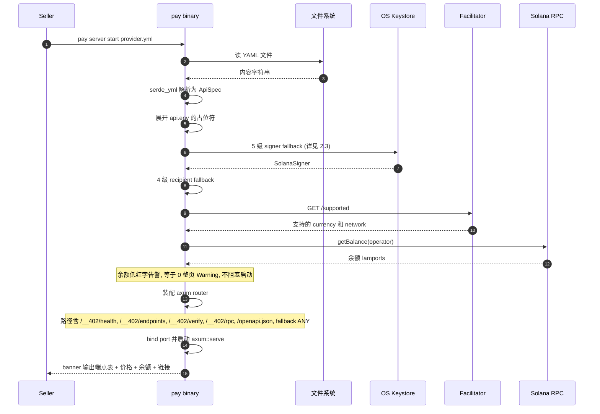
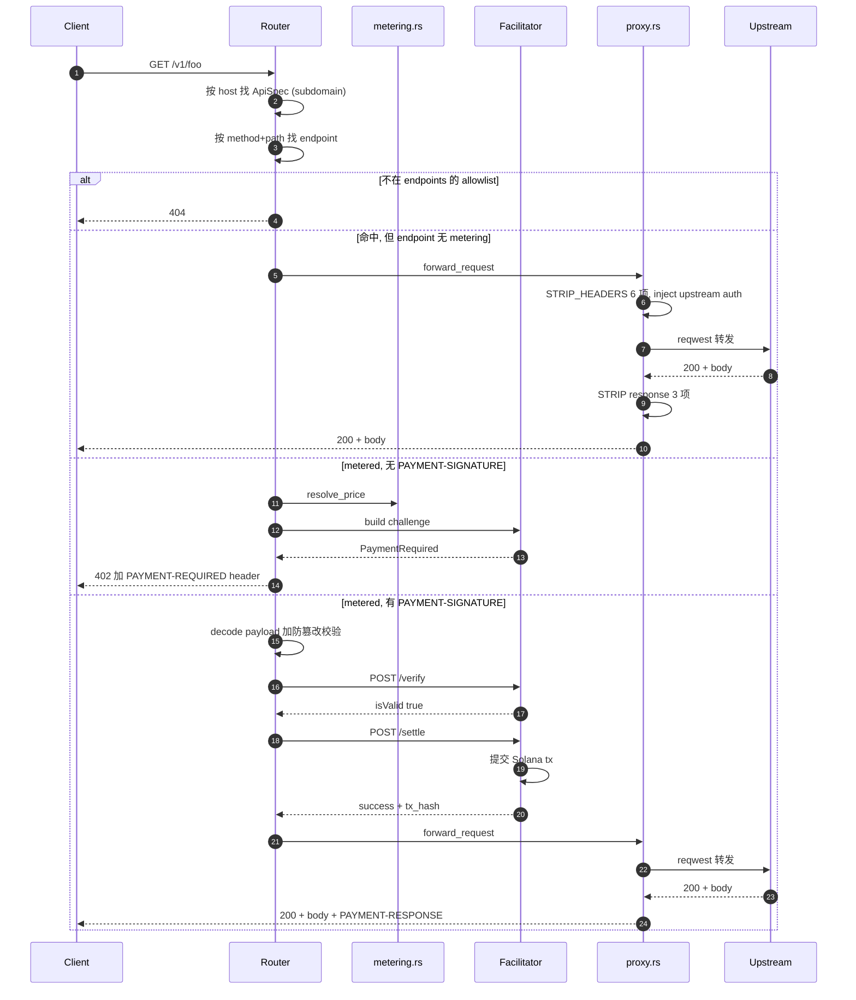
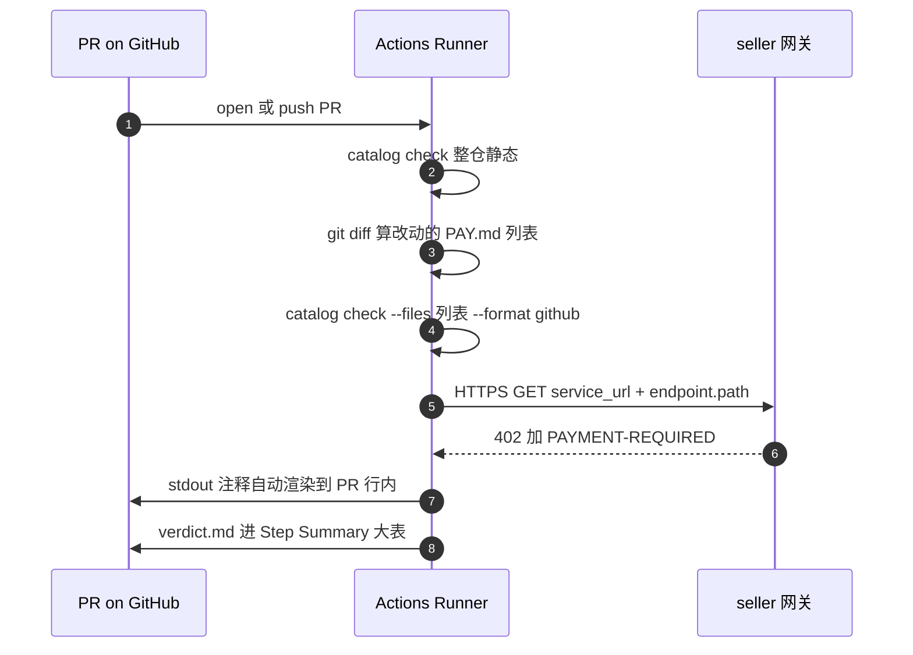
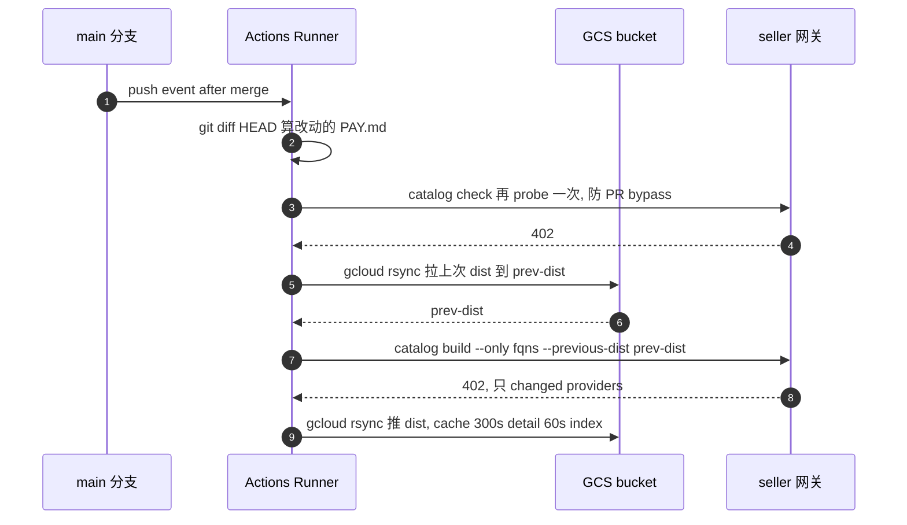

# pay.sh 是怎么做的

---

## 1. 项目背景

Solana Foundation 在 2026-05 联合 Google Cloud 发的开源 x402 实现。一份 Rust 二进制 `pay`,同时是 provider 侧反代(`pay server`)、catalog 编译器(`pay catalog`)、和客户端(`pay curl` / `pay claude`)。链上层只支持 Solana,默认稳定币是 USDC 加 USDT。下面只看前两条线。

---

## 2. pay server start —— 把 API 包成 x402 网关

入口在 `cli/src/commands/server/start.rs`,seller 跑一条命令:

```bash
pay server start provider.yml
```

### 2.1 启动顺序



任一阶段失败网关都直接退,不会"先跑起来再坏"。

### 2.2 provider.yml 字段全集

```yaml
# 标识
name: payment-debugger
subdomain: payment-debugger          # host routing
title: "Payment Debugger"
description: "..."
category: ai_ml                      # 18 项白名单, 见 3.3
version: v1
forward_url: https://upstream.example   # 顶层简写, 或用嵌套 routing.url

# 上游路由
routing:
  type: respond | proxy              # respond=mock; proxy=转发上游
  url: https://upstream.example
  auth:                              # 上游 auth 注入, 5 种模式之一
    method: header | query_param | hmac | oauth2 | access_token
    key: Authorization
    prefix: "Bearer "
    value_from_env: UPSTREAM_TOKEN

# 环境变量注入
env:
  ACME_API_TOKEN: "${ACME_API_TOKEN_PROD}"   # 占位符透传当前 shell
  UPSTREAM_TIMEOUT_MS: "5000"                # 字面值

# 运营方
operator:
  network: localnet | devnet | mainnet
  currencies:
    usd: ["USDC", "USDT"]
  fee_payer: true                    # gateway 替 client sponsor gas
  recipient: "PAYWALLETPUBKEY"
  signer:                            # fee-payer 签名后端
    backend: gcp-kms | account | file
    key_name: ...
    pubkey: ...

# 命名收款人 (splits 用)
recipients:
  vendor:    { account: "VENDORPUBKEY",    label: "Vendor" }
  affiliate: { account: "${AFFILIATE_WALLET}", label: "Affiliate" }

# Endpoints (既是定价表也是 allowlist)
endpoints:
  - method: POST
    path: "v1/inference"
    description: "..."
    metering:
      dimensions:
        - direction: usage           # usage | input | output
          unit: requests             # requests | tokens | characters | seconds | bytes
          scale: 1
          tiers:
            - up_to: 1000
              price_usd: 0.10
              splits:                # per-tier 分账
                - recipient: vendor
                  percent: 70
            - price_usd: 0.02        # 最后一档兜底
      variants:                      # 按参数走不同价
        - param: model
          value: gemini-2.5-pro
          dimensions: [...]
      splits:                        # endpoint 级分账, 被 per-tier 覆盖

  - method: GET
    path: "health"                   # 无 metering = 免费
```

几条约束:

- `endpoints[]` 是 allowlist。未声明的 method+path 即便上游存在也返 404,顺带阻止 favicon 之类的浏览器自动请求触发 OAuth2 token 拉取。
- `recipients` 别名必须顶层声明,`splits` 引用别名,总额要小于主价。
- `respond` 是 demo 用,生产场景统一用 `proxy`。

### 2.3 fee-payer signer 5 级 fallback

`start.rs:251-293`,从上到下命中即停:

| 优先级 | 触发 | 来源 |
|---|---|---|
| 1 | `--sandbox` 或 `operator.network` 是 `localnet`/`devnet` | `accounts.yml` 里 ephemeral 账户,首次自动建 |
| 2 | `operator.signer` 块存在 | `gcp_kms`(Cargo feature gated)/ `Account`(命名条目)/ `File`(磁盘 JSON keypair) |
| 3 | shell 有 `--account` 或 `pay setup` 默认账户 | 触发系统钥匙串 prompt |
| 4 | 都没有 | signer = None |
| 退出 | 第 4 级且 `fee_payer: true` | 启动失败,给三条修复路径建议 |

### 2.4 请求处理流水线

请求到达后(`forward_request` in `proxy.rs:83` + payment middleware):



STRIP_HEADERS(`proxy.rs:35-42`):

```rust
// 请求方向 6 项, 永不转发上游
const STRIP_HEADERS: &[&str] = &[
    "host", "connection", "transfer-encoding",
    "authorization", "payment-signature", "payment-required",
];

// 响应方向 3 项, reqwest 自动解压 gzip 后 content-encoding/length 已失真
let skip_response_headers = ["content-encoding", "content-length", "transfer-encoding"];
```

`authorization` 在 strip 列里这件事比看上去关键:client 自己的 Authorization 头不透传给上游,上游 auth 完全由网关从 env 注入,两条链路互不污染。

5 种上游 auth 注入模式(`proxy.rs:142-225` 的 `AuthConfig` enum):

| 模式 | 行为 |
|---|---|
| `Header` | env 值写到指定 header,可加 prefix |
| `QueryParam` | env 值写到 URL query string |
| `Hmac` | 对 body + canonical-headers 做 HMAC,注入 header 或 query |
| `Oauth2` | 启动期换 access_token,缓存到 expire 前,每次 inject `Authorization: Bearer ...` |
| `AccessToken` | 通用 prepare/fetch/inject DSL:预先调外部端点拿 token,缓存,再注入 |

### 2.5 /__402/* 管理端点

`start.rs:786-805`。前缀 `__402` 避免与 seller 业务 path 冲突:

| 路径 | 用途 |
|---|---|
| `/__402/health` | 返 `"ok"`,k8s liveness / catalog probe 前置 |
| `/__402/endpoints` | 网关自我介绍:列 endpoints + price |
| `/__402/verify` | 测试用:给 payment payload,跑 verify 但不调 settle |
| `/__402/rpc` | 浏览器 RPC 代理(allowlist `getLatestBlockhash` 等),给 payment-debugger UI |
| `/openapi.json` | 当 `--openapi <url>` 传了,filter + prune + 改写 `servers[].url` 后暴露 |

---

## 3. PAY.md —— catalog 怎么发现 API

每个上架 API 一个 `PAY.md`,YAML frontmatter 加 Markdown body。frontmatter 给机器读,body 给 agent 看。

### 3.1 PAY.md 格式

```markdown
---
name: my-api
title: "My API"
description: "One-sentence pitch"
use_case: "Use for ..."
category: ai_ml
service_url: https://gw.example.com/my-api
openapi:
  url: https://api.example.com/openapi.json
tags: [foo, bar]
---

## Spend-aware usage
- Prefer narrow lookups over broad searches.

## When to use
...

## When NOT to use
...
```

三个容易踩坑的点:

- `service_url` 是 catalog probe 真去打的 URL,必须是网关地址,不是上游真实 API 地址。
- frontmatter 不写价格——catalog build 自己从 live 402 challenge 抽取,seller 想造假也写不进 dist。
- 不需要手列 `endpoints[]`——`openapi:` 块自动派生,或者 probe 阶段对 `service_url` 直接实测。

### 3.2 FQN 派生(完全来自磁盘路径)

`cli/src/commands/catalog/mod.rs:36-90`:

| 路径 | FQN |
|---|---|
| `providers/quicknode/PAY.md` | `quicknode` |
| `providers/quicknode/rpc/PAY.md` | `quicknode/rpc` |
| `providers/solana-foundation/google/translate/PAY.md` | `solana-foundation/google/translate` |

`frontmatter.name` 必须等于 FQN leaf 段,否则 catalog check 报 `fqn_mismatch`。

### 3.3 18 个 category 白名单

`scaffold.rs:240`:

```
ai_ml, cloud, compute, data, devtools, finance,
identity, maps, media, messaging, other, productivity,
search, security, shopping, storage, translation
```

### 3.4 catalog 三个子命令

```bash
pay catalog scaffold <fqn> <openapi_url>   # 拉 OpenAPI 生 PAY.md 骨架, 带 TODO 占位
pay catalog check <path>                    # 静态 + probe + verdict, 只读不写盘
pay catalog build <path>                    # check + 写 dist/skills.json + dist/providers/<fqn>.json
```

`check` 一次跑三段流水线:

```
1. static validate  - parse frontmatter, schema, FQN 一致性, body 必填 section
2. live probe       - 真发 HTTPS 到 service_url + endpoint.path, 分类 ProbeStatus
3. verdict          - 统计 Solana × USDC/USDT, 0 个 chain-compat 时 block=true
```

Probe 7 态分类(`core/src/skills/probe.rs`):

| 状态 | 触发 | verdict |
|---|---|---|
| `Ok` | 402 + 合法 PAYMENT-REQUIRED + 链币在 allowlist | Ok |
| `Free` | 2xx 直接返 | 不计 |
| `WrongChain` | 402 但 network 不是 `solana:*` | NotSolana, warn |
| `WrongCurrency` | 402 但 asset 不在 allowlist | NotSolana, warn |
| `UnknownProtocol` | 402 但 PAYMENT-REQUIRED 解不出 | Error |
| `NotPaywalled` | 4xx 非 402, 或声明 metered 但返 2xx | Error |
| `Error` | timeout / DNS / TLS | Error |

`build` 支持增量(`--only` + `--previous-dist`):

```bash
pay catalog build . \
  --only quicknode/rpc,paysponge/coingecko \
  --previous-dist /tmp/prev-dist
```

`--only` 列出的 FQN 走全套 probe + render,其他从 `--previous-dist/providers/<fqn>.json` 直接拷贝。catalog 长到 100 个 provider 时,full rebuild 大概 25 分钟,增量典型 3-5 秒。

### 3.5 catalog CI 流水线

catalog 数据放在独立 repo `solana-foundation/pay-skills`,两份 workflow 各管一段:PR 触发的 `validate.yml` 只校验不写盘,merge 后的 `build-skills.yml` 才把 dist 推到 GCS。

`validate.yml`(PR 触发,只读):



`build-skills.yml`(merge 后触发,publish):




- main 分支重新 probe 一次,防 PR 被强制 merge 绕过校验
- 本次 commit 没改任何 provider 时整个 build 跳过——避免改 docs / CI 时也触发 publish
- `workflow_dispatch.mode = rebuild` 是 maintainer 的应急通道,会忽略增量、全量 re-probe

### 3.6 dist 数据契约

`dist/providers/<fqn>.json` 是 agent / 客户端 / 第三方 frontend 的输入,不读 PAY.md 源文件:

```json
{
  "fqn": "quicknode/rpc",
  "title": "QuickNode RPC",
  "category": "data",
  "use_case": "Use for ...",
  "service_url": "https://x402.quicknode.com",
  "endpoints": [
    {
      "method": "POST",
      "path": "/v1/getBalance",
      "metered": true,
      "probe_status": "ok",
      "paid": {
        "network": "solana:mainnet",
        "currency": "USDC",
        "amount_raw": "2000",
        "amount_display": "$0.002"
      }
    }
  ],
  "verdict": { "block": false, "ok_count": 2, "non_solana_count": 1 }
}
```

`dist/skills.json` 是精简总索引,detail 走 `<fqn>.json`。GCS 60s/300s 缓存。

---

## 4. 其他要点

没有数据库。读 `Cargo.toml` 一眼看完——不引 SQLite / Postgres / Redis / sled / RocksDB / LMDB。唯一带 "db" 的 crate 叫 `pdb` = Payment Debugger,是个调试 UI。Replay 防护完全在链上(Solana tx nonce 一次性消费),计数器在进程内存的 HashMap,重启就丢,源码注释里说丢了就丢了。持久化的东西只有三处:文件系统(provider.yml / PAY.md / dist)、OS keystore(钱包私钥)、链上(支付事实)。

MPP Session(`core/src/server/session.rs`)。Buyer 预存一笔——比如 10 USDC——当 cap,之后的多次小额调用只签 off-chain voucher,网关本地累计,定期 batch close。这个能力依赖 Solana 的亚毫秒确认和极低 tx fee 才划算。Pull 模式还要 Solana 上有 Fiber program + multi-delegator program。

catalog 的冷启动构成。73 个 live provider 里,约 50 个是 Solana Foundation 团队和 paysponge 一家代搬运的——把阿里云 API、Google API、CoinGecko 之类包成 x402 endpoint,reviewer 看 git blame 就知道是基金会成员上的。约 20 个是真正第三方自营的。换句话说,目录的"满"是两个核心 operator 撑起来的。

