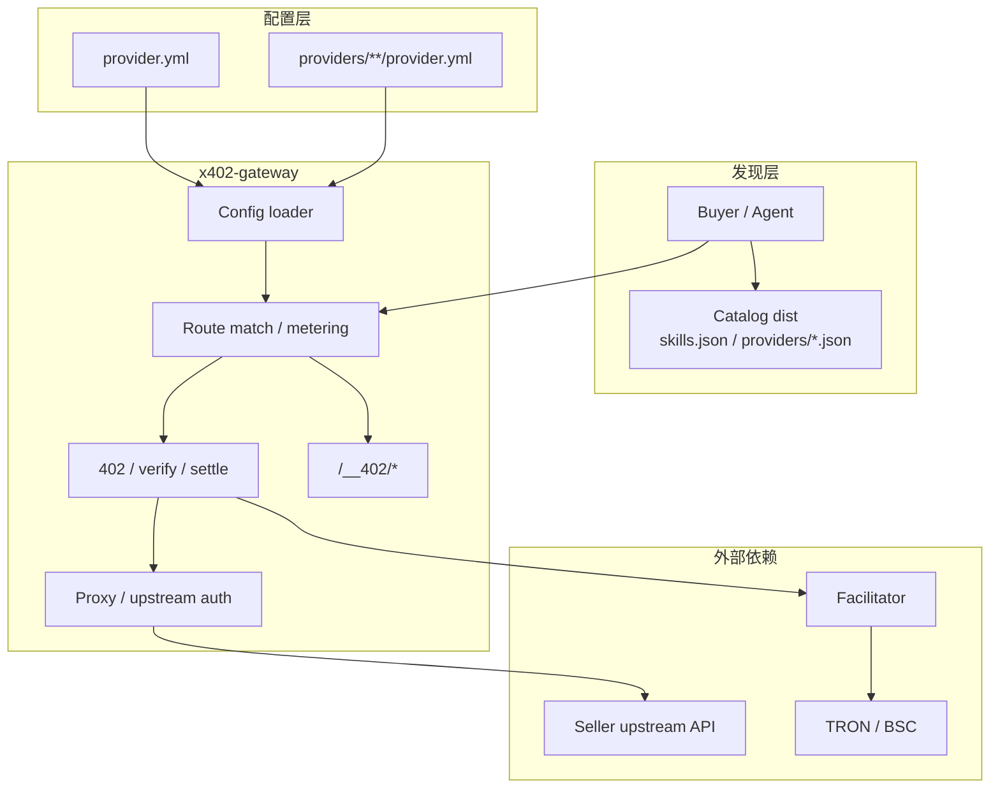
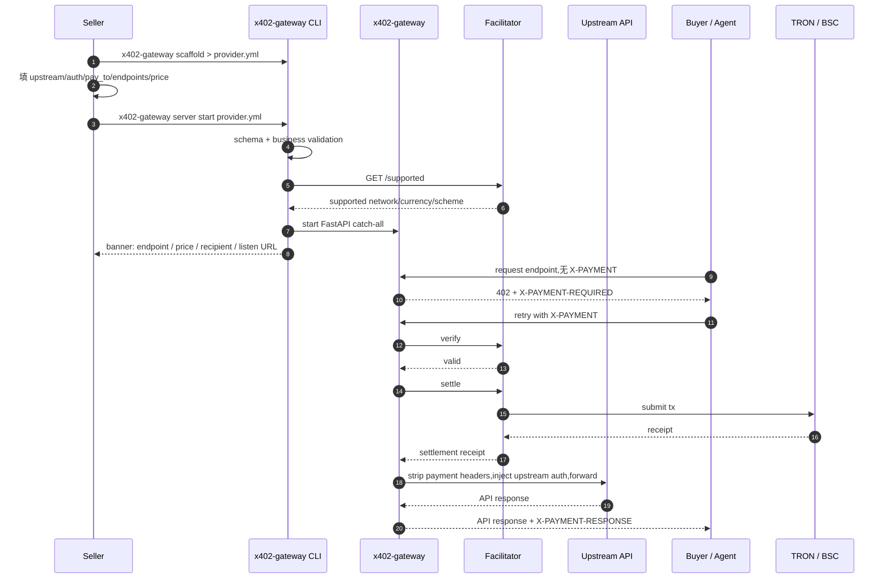
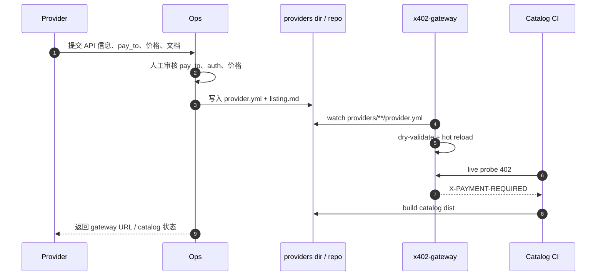
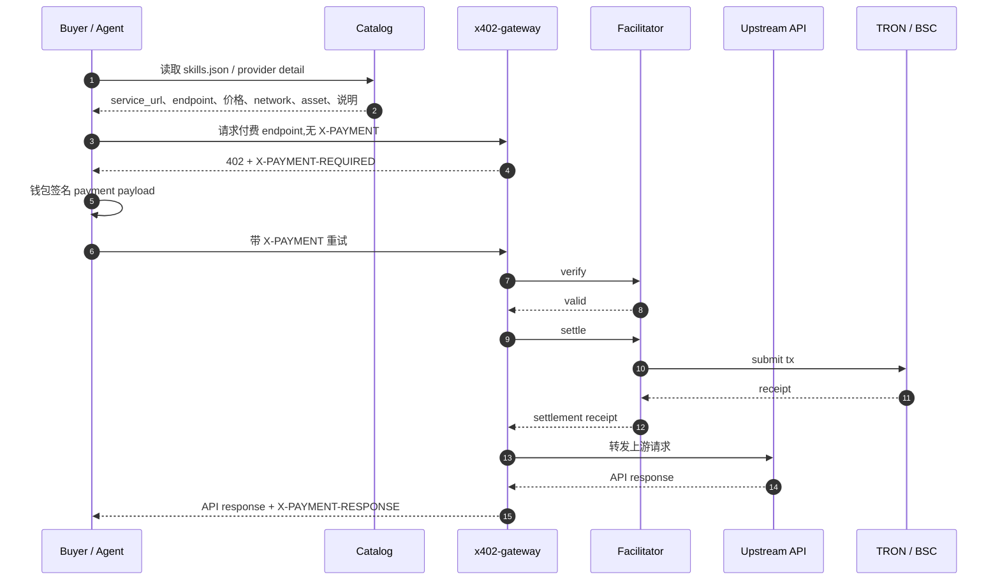

# x402 gateway

> 当前开发目标:Roadmap `v0.6.1 x402-gateway 反代网关（卖家快速接入）`。
>
> 背景调研、pay.sh 对照和更细的推导见 `DESIGN.md` / `gateway.md`。

---

## 1. 定位

`x402-gateway` 是一个 YAML 驱动的 x402 收费反向代理。卖家不改业务 API,只提供 `provider.yml`;gateway 负责 402 challenge、payment verify、settle、上游鉴权注入和请求转发。支付由 facilitator 结算到卖家钱包,平台不持币。

这期只做 gateway 这套。后台、用户系统、中心服务先不展开。provider 管理用文件完成:单 `provider.yml` 或 `providers/` 目录。内存只做运行时缓存,重启后必须能从文件恢复。

---

## 2. 总体架构



核心分层:

- 发现层让买家/agent 找到 API、入口和展示信息。
- 配置层用文件保存 provider spec,负责重启恢复。
- gateway 数据面负责路由、计费、支付校验和上游代理。

---

## 3. 运行形态

### 3.1 单 provider

```bash
x402-gateway server start provider.yml
```

适合单 API、本地调试、卖家自部署。业务路径保持 `provider.yml` 里的原始 path。

### 3.2 多 provider 目录

```bash
x402-gateway server start --providers-dir ./providers
```

目录结构:

```text
providers/
├── acme-weather/
│   └── provider.yml
└── sunio-swap/
    └── provider.yml
```

gateway 监听 `providers/**/provider.yml`。新增文件注册 provider,修改文件热更新 provider,删除文件下线 provider。

多 provider 模式下对外路径带 provider 前缀:

```text
/<provider-name>/<endpoint-path>
```

例如 `providers/acme-weather/provider.yml` 里的 `/v1/current`,对外路径是:

```text
/acme-weather/v1/current
```

---

## 4. 卖家接入流程



### 4.1 人工运营接入

早期可以不用后台。provider 通过邮件、表单或沟通群提交:

- API 名称和说明
- upstream URL
- 上游鉴权方式和 secret 交付方式
- `pay_to` 地址
- endpoint 列表和价格
- OpenAPI / 文档链接

我们人工生成/审核 `provider.yml` 和 `listing.md`,放入 `providers/` 目录或 `x402-skills` 仓库。gateway 通过文件热加载生效,catalog CI 通过 live probe 校验实际 402。流程闭环,系统实现仍然只做 gateway、文件持久化、probe 和 catalog build。



---

## 5. 买家流程



catalog 是发现入口,不参与签名和 settle。实际付款要求以 gateway 返回的 402 为准。

---

## 6. provider.yml

`provider.yml` 是 gateway 运行配置,包含上游、鉴权、收款地址、链、币种、endpoint 和计费。

```yaml
name: acme-weather
title: "Acme Weather API"
description: "Current weather API"
category: data
version: v1

routing:
  type: proxy
  url: https://internal.acme.example
  auth:
    method: header
    key: Authorization
    prefix: "Bearer "
    value_from_env: ACME_API_TOKEN

operator:
  network: tron-mainnet
  currencies:
    usd: ["USDT", "USDC"]
  recipient: "TProviderWalletBase58"
  signer:
    backend: local_secure
    profile: prod-tron

endpoints:
  - method: GET
    path: /v1/current
    description: "Current weather for a city"
    metering:
      dimensions:
        - direction: usage
          unit: requests
          scale: 1
          tiers:
            - price_usd: 0.002

  - method: GET
    path: /health
```

约束:

- `endpoints[]` 同时是 allowlist 和定价表。
- 无 `metering` 的 endpoint 免费转发。
- 未声明的 method+path 返回 404,不能穿透到上游。
- `${VAR}` 不存在时启动失败。
- `operator.recipient` 是默认收款地址。
- `splits` 先做 schema/静态校验;链上多收款人后续依赖 facilitator 支持。

---

## 7. Catalog 展示内容

`provider.yml` 不负责展示。Catalog 展示字段放在 `listing.md`;运行时收费信息通过 live probe 从 gateway 402 读取。

`listing.md` 示例:

```markdown
---
name: acme-weather
title: "Acme Weather API"
description: "Current and forecast weather data"
logo: https://example.com/logo.png
use_case: "Use for city-level weather lookup"
category: data
service_url: https://gw.example.com/acme-weather
openapi:
  url: https://api.example.com/openapi.json
tags: [weather, data]
---

## Spend-aware usage
- Prefer current weather before forecast when possible.

## When to use
- Use for paid weather lookup.

## When NOT to use
- Do not use for historical climate analysis.
```

字段分工:

| 内容 | 来源 |
|---|---|
| Logo / title / description / tags / use case | `listing.md` |
| upstream / auth / pay_to / network / endpoint / metering | `provider.yml` |
| price / network / asset / paid status | gateway live 402 probe |
| health / probe status | catalog probe |

这样展示内容和运行配置分开,也避免 secret 或上游鉴权信息进入 catalog。

---

## 8. 请求处理规则

| 场景 | 行为 |
|---|---|
| path 不在 allowlist | 404 |
| 免费 endpoint | strip/inject headers 后直接转发 |
| 收费 endpoint 无 `X-PAYMENT` | 402 + `X-PAYMENT-REQUIRED` |
| payment 格式错误 | 402 + reason |
| verify failed | 402 + reason |
| settle failed | 502,不转发上游 |
| upstream auth 获取失败 | 502,fail closed |
| upstream timeout | 504 |
| upstream 4xx/5xx | 原样透传;如已 settle,带 payment receipt |

Header 处理:

- 请求转发前移除:`Host`,`Connection`,`Transfer-Encoding`,`Authorization`,`Proxy-Authorization`,`X-PAYMENT`,`X-PAYMENT-REQUIRED`。
- 响应返回前移除:`Connection`,`Transfer-Encoding`,`Content-Encoding`,`Content-Length`,`Authorization`,`Proxy-Authorization`。
- 上游 auth 只能由 gateway 从配置/env 注入,不能透传 client 的 `Authorization`。
- `X-PAYMENT-RESPONSE` 只由 gateway 根据 settlement receipt 注入。

---

## 9. 启动与热加载

单 YAML 模式:

1. 读取 YAML。
2. schema validation。
3. 展开 env。
4. 业务校验:network/currency/address/endpoints/splits。
5. signer fallback。
6. facilitator `/supported` handshake。
7. 钱包/RPC 健康检查。
8. 构建 FastAPI app。
9. 挂 `/__402/*`。
10. 打印 banner。
11. `uvicorn.run`。

providers-dir 模式:

1. 启动时扫描 `providers/**/provider.yml`。
2. 每个 YAML 独立校验。
3. 校验成功的 provider 进入内存快照。
4. 通过 `watchfiles` 监听新增、修改、删除。
5. 新配置校验通过后原子替换。
6. 校验失败时保留旧配置,记录错误。

文件监听不是定时任务。主机制是操作系统文件事件;可加低频 rescan 兜底,防止 Docker volume/NFS 漏事件。

---

## 10. 管理端点

`__402` 是 gateway 进程级管理命名空间。多 provider 模式通过 provider name 区分作用域。

| Endpoint | 用途 |
|---|---|
| `/__402/health` | gateway liveness,返回 `ok` |
| `/__402/providers` | 多 provider 模式下列 provider、状态、错误 |
| `/__402/endpoints` | 单 provider 模式下列 endpoint、价格、network、currency |
| `/__402/providers/{provider}/endpoints` | 多 provider 模式下查询指定 provider |
| `/__402/verify` | 单 provider 模式下 verify 不 settle |
| `/__402/providers/{provider}/verify` | 多 provider 模式下 verify 指定 provider |

所有 `__402` 端点都不能暴露 env、上游 secret、signer secret。

---

## 11. 多 provider 健康状态

健康状态分两层:

- gateway 进程健康:`/__402/health`
- provider 健康:`/__402/providers`

provider 状态来自加载和探测结果:

```text
config_status: loaded | invalid | disabled
payment_status: unknown | ok | unsupported | error
upstream_status: unknown | ok | error
last_loaded_at
last_checked_at
last_error
```

加载 YAML 成功后 `config_status=loaded`;校验失败保留旧 spec,记录 `last_error`;facilitator 不支持链/币时 `payment_status=unsupported`;如果 provider 配了免费 health endpoint,可探测上游并更新 `upstream_status`。一个 provider 失败不影响其他 provider。

---

## 12. 文件持久化

当前不需要 DB。文件就是持久化来源。

单 YAML 模式重启后重新读取同一个 `provider.yml`。

providers-dir 模式重启后扫描目录:

```text
providers/
├── acme-weather/
│   └── provider.yml
└── sunio-swap/
    └── provider.yml
```

热加载只更新内存快照,不负责保存配置。保存配置由文件系统完成:

- 新增 provider = 新增文件
- 修改 provider = 修改文件
- 下线 provider = 删除或移走文件

---

## 13. 开发组件与部署形态

### 13.1 gateway server

部署形态:一个 Python/FastAPI 进程。

职责:

- 读取 `provider.yml` 或 `providers-dir`。
- 校验 provider spec。
- 提供 catch-all proxy。
- 处理 402、verify、settle。
- 注入上游 auth。
- 提供 `/__402/*` 管理端点。
- 热加载 YAML。

### 13.2 gateway CLI

部署形态:随 package / Docker image 分发的命令行。

职责:

- 生成 `provider.yml` 初稿。
- 启动单 provider 或 providers-dir 模式。
- 本地校验 YAML。
- 输出启动 banner。

### 13.3 catalog 工具

部署形态:同一个 package/image 里的子命令,主要在本地和 CI 跑。

职责:

- 根据 OpenAPI 生成 listing 骨架。
- 校验 listing frontmatter/body。
- live probe gateway 402。
- 生成 `dist/skills.json` 和 `dist/providers/*.json`。

### 13.4 demo / test services

部署形态:mock upstream + mock facilitator + 示例 provider。

职责:

- 验证免费 endpoint 直通。
- 验证收费 endpoint 无 payment 返回 402。
- 验证 payment happy path。
- 验证 settle failed 不转发。
- 验证 providers-dir 热加载和重启恢复。

---

## 14. 测试与验收

验收标准:

1. 卖家 5 分钟内从 `provider.yml` 启动一个收费 endpoint。
2. gateway 可先启动,再通过 `--providers-dir` 新增 YAML 注册 provider。
3. 无 payment 返回标准 402 challenge。
4. 有 payment 完成 verify + settle + 上游转发。
5. 不依赖外部管理服务也能完成本地全链路。
6. 上游不看到 x402 headers。
7. client `Authorization` 不泄露给上游。
8. YAML 改价热加载生效;坏配置保留旧版本。
9. catalog scaffold/check/build 跑通并生成 dist JSON。
10. providers-dir 模式下重启后 provider 仍可恢复。
11. 至少覆盖 TRON testnet 或 BSC testnet 一条真实支付 smoke。

---

## 15. 参考

- `x402/docs/ROADMAP.md`:版本目标。
- `x402-gateway/gateway.md`:实现要点简版。
- `x402-gateway/DESIGN.md`:完整长设计。
- `x402-gateway/pay.sh.md`:pay.sh 对照调研。
- `x402-gateway/examples/provider.yml`:provider 样例。
- `x402-gateway/examples/listing.md`:listing 样例。
